# 1.1 Conduttività: Il Flusso dell'Elettricità 🚀

Benvenuti nel mondo dell'elettricità! La **conduttività** è la capacità di un materiale di permettere il passaggio della corrente elettrica. Immaginate l'elettricità come un fiume: alcuni materiali sono autostrade veloci, altri strade strette, e alcuni muri impenetrabili. Scopriamo insieme come funziona!

## 🌟 Materiali Conduttori, Semiconduttori ed Isolanti

I materiali si dividono in base alla loro conduttività:

- **Conduttori** (es. rame, argento): Ottimi per far passare la corrente. Sono come autostrade!
- **Semiconduttori** (es. silicio): Né troppo né poco conduttivi. Usati nei chip dei computer.
- **Isolanti** (es. plastica, gomma): Bloccano la corrente. Sono come muri.

### Diagramma dei Materiali

```mermaid
graph TD;
    Conduttori["Conduttori<br>es. Rame"] --> Alta["Alta Conduttività<br>Autostrade elettriche"];
    Semiconduttori["Semiconduttori<br>es. Silicio"] --> Media["Media Conduttività<br>Usati nei chip"];
    Isolanti["Isolanti<br>es. Plastica"] --> Bassa["Bassa Conduttività<br>Bloccano la corrente"];
```

## ⚡ Corrente, Tensione e Resistenza

- **Corrente (I)**: Il flusso di elettroni, misurata in ampere (A). È come l'acqua che scorre in un tubo.
- **Tensione (V)**: La "pressione" che spinge la corrente, in volt (V).
- **Resistenza (R)**: L'opposizione al flusso, in ohm (Ω). Più resistenza, meno corrente.

### Unità di Misura
- **Ampere (A)**: Unità della corrente. 1 A = 1 coulomb/secondo.
- **Volt (V)**: Unità della tensione. 1 V = 1 joule/coulomb.
- **Ohm (Ω)**: Unità della resistenza. Simbolo: Ω.

## 🔍 La Legge di Ohm

La legge fondamentale! **V = I × R**

- Se aumenti la tensione, aumenta la corrente (se resistenza costante).
- Se aumenti la resistenza, diminuisce la corrente (se tensione costante).

### Grafico della Legge di Ohm

```mermaid
graph LR;
    Tensione["Tensione<br>(V)"] -->|Spinta| Corrente["Corrente<br>(I)"];
    Corrente -->|Flusso| Resistenza["Resistenza<br>(R)"];
    Resistenza -->|Oppone| Tensione;
    Formula["V = I × R<br>Relazione lineare"];
```

Esempio: In un circuito con R = 10 Ω e V = 5 V, I = 0.5 A.

## 🔄 Le Leggi di Kirchhoff

Due leggi essenziali per circuiti complessi:

1. **Prima Legge (Nodi)**: La somma delle correnti entranti in un nodo è uguale a quelle uscenti. (Conservazione della carica)
2. **Seconda Legge (Maglie)**: La somma delle tensioni in una maglia chiusa è zero.

### Diagramma di un Circuito Semplice

## 💪 La Potenza Elettrica

La potenza è il lavoro fatto per unità di tempo. **P = V × I** o **P = I² × R** o **P = V² / R**

Unità: **Watt (W)**. 1 W = 1 joule/secondo.

Esempio: Una lampadina da 60 W consuma 60 joule al secondo.

### Grafico della Potenza

```mermaid
graph TD;
    Corrente["Corrente<br>(I)"] --> Potenza["Potenza<br>(P)"];
    Tensione["Tensione<br>(V)"] --> Potenza;
    Resistenza["Resistenza<br>(R)"] --> Potenza;
    Potenza --> Energia["Energia<br>(E = P × t)"];
    Formule["Formule:<br>P = V × I<br>P = I² × R<br>P = V² / R"];
```

## 🔋 L'Energia Elettrica

Energia = Potenza × Tempo. **E = P × t**

Unità: Joule (J) o kWh (per usi domestici).

Esempio: Una lampadina 60 W accesa per 1 ora consuma 0.06 kWh.

## 🔋 La Capacità di una Batteria

La capacità misura quanta energia può fornire una batteria. Unità: Ampere-ora (Ah).

Esempio: Una batteria da 12 V, 100 Ah può fornire 1 A per 100 ore o 100 A per 1 ora.

## 🧠 Quiz di Ripasso

Testa le tue conoscenze sulla conduttività! Clicca sui dettagli per vedere le risposte.

### Domanda 1: Qual è l'unità di misura della corrente?
- A) Volt
- B) Ampere
- C) Ohm

  
Risposta

  
<strong>B) Ampere</strong>

  
La corrente elettrica si misura in ampere (A), che rappresenta il flusso di elettroni.

### Domanda 2: Secondo la Legge di Ohm, se la tensione aumenta e la resistenza rimane costante, cosa succede alla corrente?
- A) Aumenta
- B) Diminuisce
- C) Rimane invariata

  
Risposta

  
<strong>A) Aumenta</strong>

  
V = I × R, quindi I = V / R. Se V cresce, I cresce.

### Domanda 3: Quale materiale è un buon conduttore?
- A) Plastica
- B) Rame
- C) Carta

  
Risposta

  
<strong>B) Rame</strong>

  
Il rame è un eccellente conduttore, usato nei fili elettrici.

### Conclusione
La conduttività è la base dell'elettronica! Conoscere questi concetti vi permette di capire come funzionano dispositivi quotidiani. Praticate con circuiti semplici per padroneggiare tutto! ⚡

[Torna al README](https://github.com/giangio/esame-radioamatori/blob/main/README.md) | [Successivo: 1.2 I generatori elettrici](./1.2_I_generatori_elettrici.md)