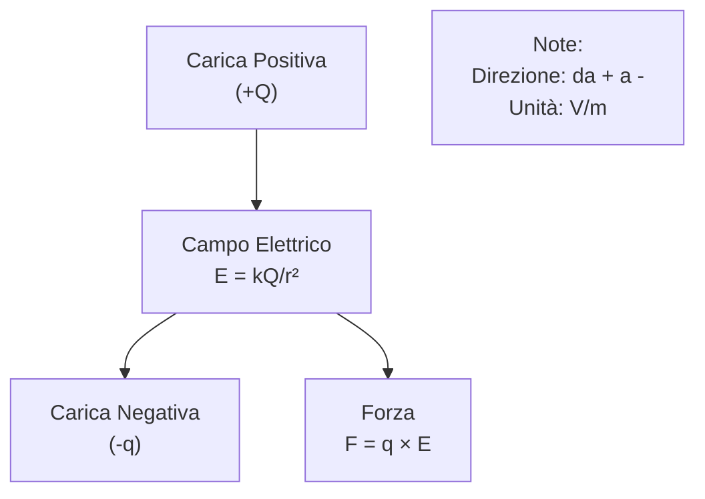
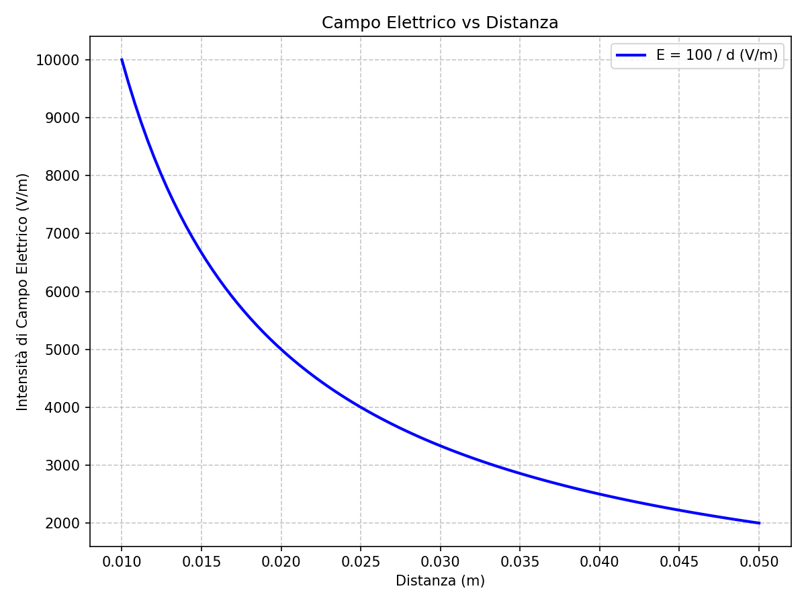
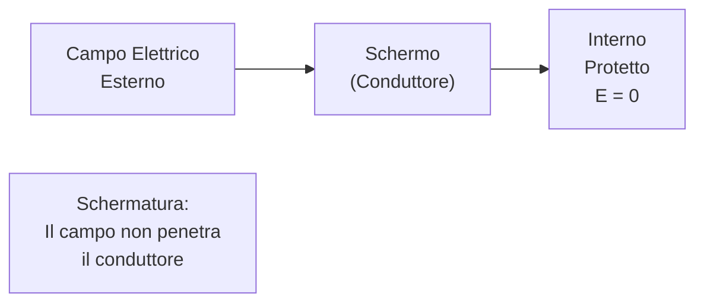

# 1.3 Campo Elettrico: L'Invisibile Forza 🚀

Immaginate il campo elettrico come un campo di forza invisibile che circonda le cariche elettriche, simile alla gravità ma per l'elettricità. Scopriamo come misurarlo, le sue unità e come proteggerci da esso!

## ⚡ Intensità di Campo Elettrico

L'**intensità di campo elettrico (E)** misura la forza che il campo esercita su una carica positiva unitaria. È definita come E = F / q, dove F è la forza e q la carica.

- Per cariche puntiformi: E = k × Q / r² (legge di Coulomb).
- In circuiti: E = V / d (tra due piastre cariche).

Il campo è un vettore: direzione dalla carica positiva a quella negativa.

### Diagramma del Campo Elettrico

Esempio: Una carica +1 μC a 1 m produce E = 9 × 10^9 × 10^-6 / 1² = 9000 V/m.

## 📏 L'Unità di Misura: Volt/Metro (V/m)

L'intensità di campo elettrico si misura in **volt per metro (V/m)**.

- 1 V/m = 1 N/C (newton per coulomb).
- Esempio: Campo tra due piastre a 100 V distanti 1 cm: E = 100 V / 0.01 m = 10,000 V/m.

### Grafico dell'Unità

Nota: Grafico di E = V/d per V=100V, mostrando come l'intensità diminuisce con la distanza.

## 🛡️ Schermatura contro i Campi Elettrici

La **schermatura** protegge da campi elettrici indesiderati, come in dispositivi elettronici o edifici.

- **Principio**: I campi elettrici non penetrano conduttori (effetto Faraday). Una gabbia di Faraday (conduttore chiuso) blocca il campo interno.
- **Materiali**: Metalli come rame o alluminio.
- **Applicazioni**: Schermi EMI in elettronica, protezione da fulmini.

### Diagramma di Schermatura

Esempio: Uno schermo metallico attorno a un circuito blocca interferenze elettriche.

## 🧠 Quiz di Ripasso

Testa le tue conoscenze sul campo elettrico!

### Domanda 1: Qual è l'unità di misura del campo elettrico?
- A) Ampere
- B) Volt/metro
- C) Joule

  
Risposta

  
<strong>B) Volt/metro</strong>

  
E = V / d, quindi V/m.

### Domanda 2: Come si schermano i campi elettrici?
- A) Con isolanti
- B) Con conduttori
- C) Con magneti

  
Risposta

  
<strong>B) Con conduttori</strong>

  
I conduttori bloccano i campi elettrici (gabbia di Faraday).

### Domanda 3: La direzione del campo elettrico va da...
- A) Negativo a positivo
- B) Positivo a negativo
- C) Dipende dalla carica

  
Risposta

  
<strong>B) Positivo a negativo</strong>

  
Il campo punta verso le cariche negative.

## Conclusione
Il campo elettrico è fondamentale in elettronica e fisica! Capirlo ti aiuta a progettare dispositivi sicuri e efficienti. Continua l'esplorazione! ⚡

[Torna al README](../../README.md) | [Precedente: 1.2 I generatori elettrici](./1.2_I_generatori_elettrici.md) | [Successivo: 1.4 Campo magnetico](./1.4_Campo_magnetico.md)