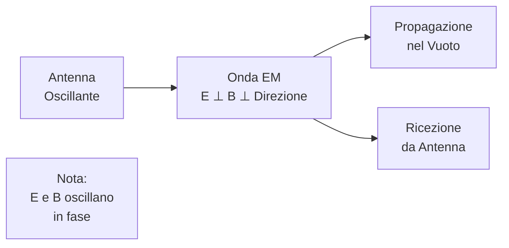
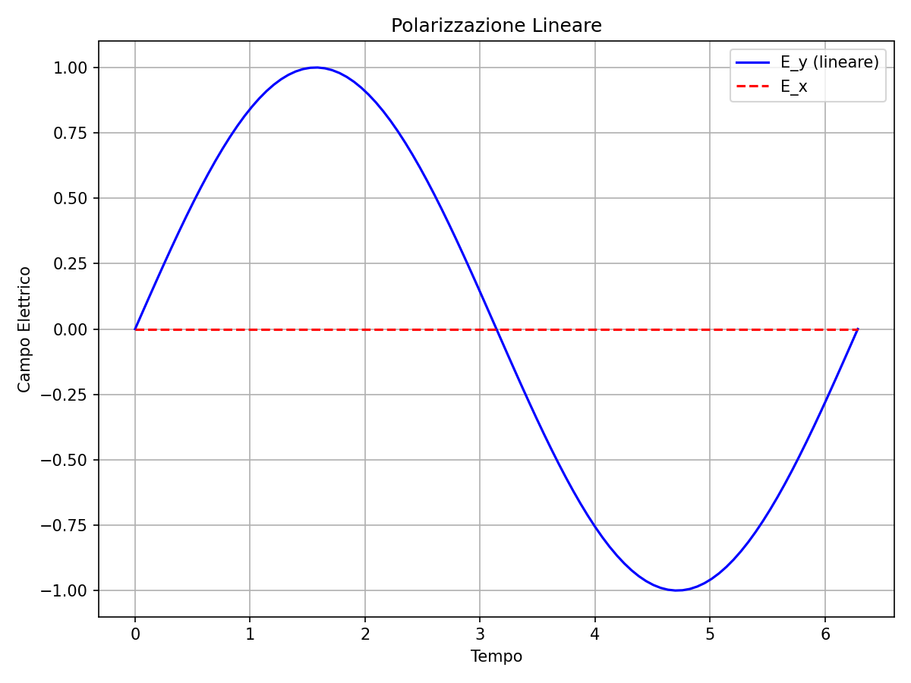
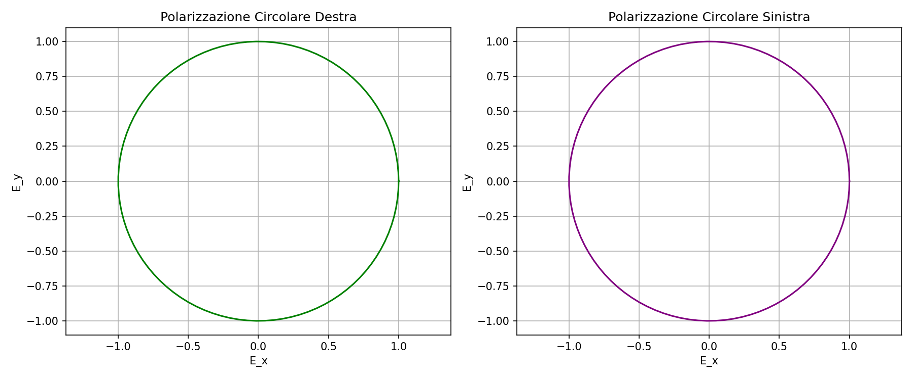
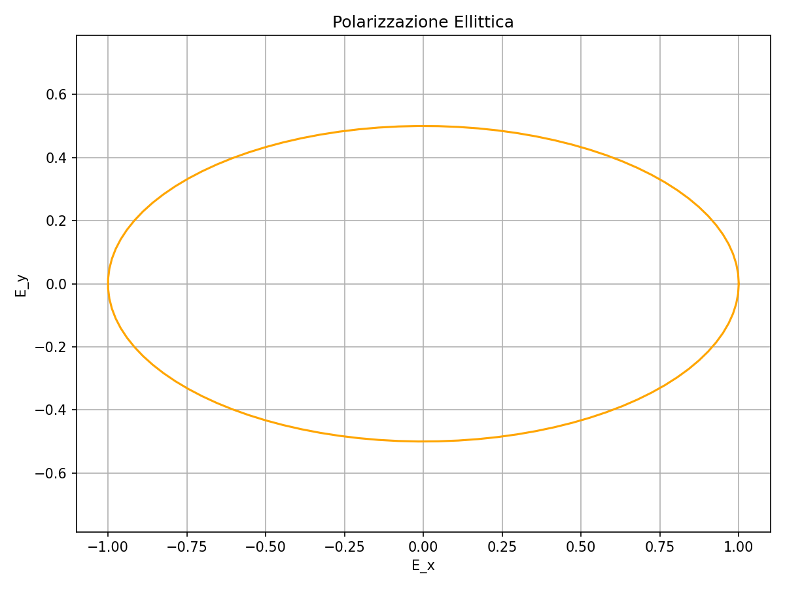
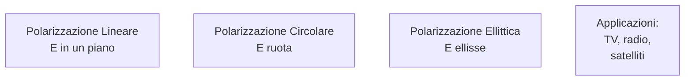

# 1.5 Campo Elettromagnetico: Onde che Viaggiano nello Spazio 📡

Immaginate le onde radio come messaggeri invisibili che trasportano informazioni attraverso l'etere! Il campo elettromagnetico combina campi elettrici e magnetici oscillanti, propagandosi alla velocità della luce. Scopriamo come funzionano le onde radio, la loro velocità e la polarizzazione!

## 🌊 Le Onde Radio come Onde Elettromagnetiche

Le onde radio sono un tipo di **onda elettromagnetica**, generate da cariche accelerate. Sono trasversali: campo elettrico (E) e magnetico (B) oscillano perpendicolarmente alla direzione di propagazione.

- **Spettro elettromagnetico**: Include radio, microonde, luce visibile, raggi X, ecc.
- **Generazione**: Da antenne oscillanti o circuiti risonanti.
- **Proprietà**: Non necessitano di mezzo materiale (propagano nel vuoto).

### Diagramma di un'Onda Elettromagnetica

## ⚡ Velocità di Propagazione e Relazione con Frequenza e Lunghezza d'Onda

La velocità di propagazione (c) delle onde EM nel vuoto è **c = 3 × 10⁸ m/s** (velocità della luce).

- **Relazione**: c = f × λ, dove f è la frequenza (Hz), λ è la lunghezza d'onda (m).
- **Formula**: λ = c / f, f = c / λ.

Esempio: Per f = 100 MHz (10⁸ Hz), λ = 3 × 10⁸ / 10⁸ = 3 m.

### Tabella delle Bande Radio
| Banda | Frequenza (MHz) | Lunghezza d'Onda (m) | Nomenclatura | Esempi |
|-------|-----------------|----------------------|--------------|--------|
| ELF  | 0.003 - 0.03   | 100,000 - 10,000   | Miriametriche | Comunicazioni sottomarine |
| VLF  | 0.003 - 0.3    | 100,000 - 1,000    | Miriametriche/Chilometriche | Navigazione |
| LF   | 0.03 - 0.3     | 10,000 - 1,000     | Chilometriche/Ettometriche | Radio AM bassa |
| MF   | 0.3 - 3        | 1,000 - 100        | Ettometriche | Radio AM |
| HF   | 3 - 30         | 100 - 10            | Decametriche | Radio onde corte |
| VHF  | 30 - 300       | 10 - 1              | Metriche | FM, TV |
| UHF  | 300 - 3,000    | 1 - 0.1             | Decimetriche | TV digitale, cellulari |
| SHF  | 3,000 - 30,000 | 0.1 - 0.01          | Centimetriche | Microonde, radar |
| EHF  | 30,000 - 300,000 | 0.01 - 0.001      | Millimetriche | Millimetriche |

Nota: λ = c / f, con c = 3 × 10⁸ m/s. La nomenclatura si basa sulla lunghezza d'onda.

## 📶 Polarizzazione

La **polarizzazione** descrive l'orientamento del campo elettrico nell'onda.

- **Lineare**: E oscilla in un piano fisso (verticale/orizzontale).
- **Circolare**: E ruota in un cerchio (destra/sinistra).
- **Ellittica**: Combinazione.
- **Importanza**: Antenne devono avere polarizzazione compatibile per ricevere segnale.

### Grafici delle Polarizzazioni

### Diagramma di Polarizzazione

Esempio: Antenne TV verticali ricevono segnali polarizzati verticalmente.

## 🧠 Quiz di Ripasso

Testa le tue conoscenze sul campo elettromagnetico!

### Domanda 1: Qual è la velocità delle onde elettromagnetiche nel vuoto?
- A) 3 × 10⁶ m/s
- B) 3 × 10⁸ m/s
- C) 3 × 10¹⁰ m/s

  
Risposta

  
<strong>B) 3 × 10⁸ m/s</strong>

  
È la velocità della luce.

### Domanda 2: La relazione tra frequenza e lunghezza d'onda è...
- A) f = λ / c
- B) c = f × λ
- C) λ = f × c

  
Risposta

  
<strong>B) c = f × λ</strong>

  
Velocità = frequenza × lunghezza d'onda.

### Domanda 3: Cosa significa polarizzazione circolare?
- A) E oscilla in linea retta
- B) E ruota in un cerchio
- C) E è ellittica

  
Risposta

  
<strong>B) E ruota in un cerchio</strong>

  
Usata in satelliti per segnale stabile.

## Conclusione
Le onde elettromagnetiche sono la base della comunicazione moderna! Dalla radio ai cellulari, capirle è essenziale per l'elettronica. Continua a esplorare questo mondo affascinante! 📡

[Torna al README](../../README.md) | [Precedente: 1.4 Campo magnetico](./1.4_Campo_magnetico.md) | [Successivo: 1.6 Segnali sinusoidali](./1.6_Segnali_sinusoidali.md)