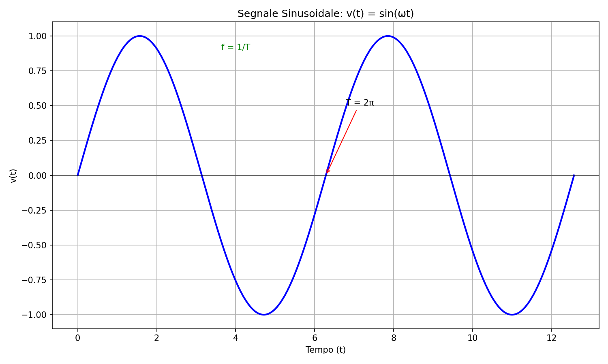
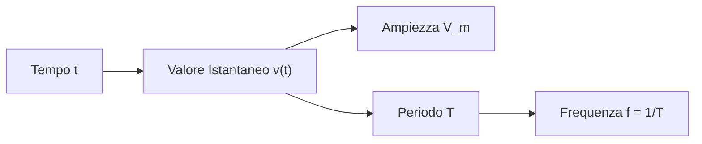

# 1.6 Segnali Sinusoidali

[Torna al README](../../README.md) | [Precedente: 1.5 Campo elettromagnetico](./1.5_Campo_elettromagnetico.md) | [Successivo: 1.7 Segnali non sinusoidali](./1.7_Segnali_non_sinusoidali.md)

## 📈 Introduzione

I **segnali sinusoidali** sono fondamentali in elettronica e radiotecnica. Sono segnali periodici che seguono la forma matematica del seno o coseno. In natura, molte grandezze oscillano sinusoidalmente (es. corrente alternata).

### Formula Generale
Un segnale sinusoidale è descritto da:
\[ v(t) = V_m \sin(\omega t + \phi) \]

Dove:
- \( V_m \): Ampiezza (valore di picco)
- \( \omega = 2\pi f \): Pulsazione angolare (rad/s)
- \( \phi \): Fase iniziale (radianti)

## 📊 Rappresentazione Grafica

Il segnale varia sinusoidalmente nel tempo. Ecco un esempio grafico:

### Diagramma del Segnale

## 🔢 Valori Caratteristici

### Valore Istantaneo
Il valore del segnale in un istante t: \( v(t) = V_m \sin(\omega t + \phi) \)

### Valore Efficace (RMS)
Misura la "potenza effettiva": \( V_{rms} = \frac{V_m}{\sqrt{2}} \approx 0.707 V_m \)

### Valore Medio
Per un periodo completo: 0 (media di una sinusoide è zero).

## ⏱️ Periodo e Frequenza

- **Periodo (T)**: Tempo per un ciclo completo (secondi).
- **Frequenza (f)**: Numero di cicli al secondo, unità: **Hertz (Hz)**.
- Relazione: \( f = \frac{1}{T} \), \( \omega = 2\pi f \)

Esempio: Rete elettrica 50 Hz → T = 0.02 s.

## 📏 Unità di Misura: Hertz

Il **Hertz (Hz)** onora Heinrich Hertz, scopritore delle onde radio. 1 Hz = 1 ciclo/secondo.

- kHz: 10³ Hz
- MHz: 10⁶ Hz (radio FM)
- GHz: 10⁹ Hz (microonde)

## 🔄 Differenza di Fase

La **fase** indica lo sfasamento tra due segnali. Differenza di fase: \( \Delta\phi = \phi_2 - \phi_1 \) (in radianti o gradi).

- 0°: In fase
- 180°: Sfasamento opposto
- 90°: Quadratura

Esempio: In circuiti AC, condensatori e induttori causano sfasamenti.

## 🧠 Quiz di Ripasso

Testa le tue conoscenze sui segnali sinusoidali!

### Domanda 1: Qual è la relazione tra frequenza e periodo?
- A) f = T
- B) f = 1/T
- C) T = f²

  
Risposta

  
<strong>B) f = 1/T</strong>

  
La frequenza è l'inverso del periodo.

### Domanda 2: Il valore efficace di una sinusoide di ampiezza 10V è...
- A) 5V
- B) 7.07V
- C) 10V

  
Risposta

  
<strong>B) 7.07V</strong>

  
V_rms = V_m / √2 ≈ 10 / 1.414 ≈ 7.07V.

### Domanda 3: L'unità di misura della frequenza è...
- A) Volt
- B) Ampere
- C) Hertz

  
Risposta

  
<strong>C) Hertz</strong>

  
Hz = cicli al secondo.

