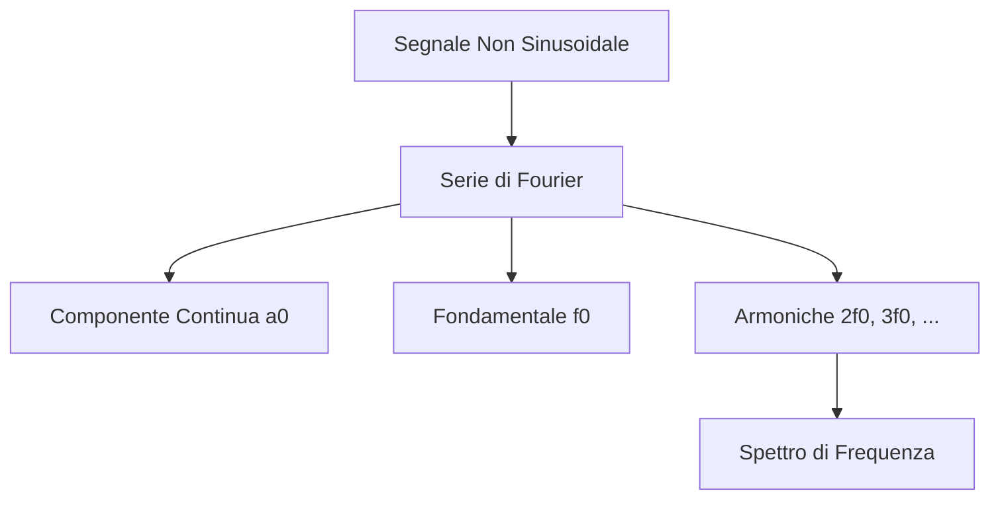

# 1.7 Segnali Non Sinusoidali

[Torna al README](../../README.md) | [Precedente: 1.6 Segnali sinusoidali](./1.6_Segnali_sinusoidali.md) | [Successivo: 1.8 Segnali modulati](./1.8_Segnali_modulati.md)

## 📈 Introduzione

I **segnali non sinusoidali** sono periodici ma non seguono la forma seno/coseno. Sono comuni in elettronica digitale, audio, telecomunicazioni. Possono essere scomposti in somme di sinusoidali usando la **Serie di Fourier**.

### Perché Importanti?
- **Audio**: Suoni complessi (musica, voce).
- **Digitale**: Segnali quadra per logica binaria.
- **Comunicazioni**: Portanti modulate.

## 📊 Tipi di Segnali Non Sinusoidali

### Segnali Rettangolari (Quadra)
Onda quadra: alterna tra due livelli (alto/basso).

- **Duty cycle**: Rapporto tempo alto/totale.
- **Uso**: Clock digitali, PWM.

### Segnali Triangolari
Forma a dente di sega o triangolare.

- **Uso**: Generatori di funzioni, oscillatori.

### Segnali Audio
Segnali di bassa frequenza (<20kHz), complessi.

- **Esempi**: Voce umana, musica.

## 🔄 Serie di Fourier

Qualsiasi segnale periodico può essere espresso come:
\[ x(t) = a_0 + \sum_{n=1}^{\infty} (a_n \cos(n\omega_0 t) + b_n \sin(n\omega_0 t)) \]

Dove:
- \( a_0 \): **Componente continua** (DC)
- \( a_1, b_1 \): **Fondamentale** (frequenza base)
- \( a_n, b_n \): **Armoniche** (multipli della fondamentale)

### Diagramma della Decomposizione

## 📏 Spettro di Frequenza

Lo **spettro** mostra l'ampiezza delle componenti in frequenza.

- **Segnale quadra**: Molte armoniche dispari.
- **Importanza**: Filtraggio, distorsione.

## 🧠 Quiz di Ripasso

Testa le tue conoscenze sui segnali non sinusoidali!

### Domanda 1: La serie di Fourier decomponde un segnale in...
- A) Solo sinusoidali
- B) Componente continua + sinusoidali
- C) Solo armoniche

  
Risposta

  
<strong>B) Componente continua + sinusoidali</strong>

  
Include DC, fondamentale e armoniche.

### Domanda 2: Un segnale quadra ha armoniche...
- A) Solo pari
- B) Solo dispari
- C) Tutte

  
Risposta

  
<strong>B) Solo dispari</strong>

  
Per simmetria, armoniche pari sono zero.

### Domanda 3: La frequenza fondamentale è...
- A) La più alta
- B) La più bassa
- C) La media

  
Risposta

  
<strong>B) La più bassa</strong>

  
È il periodo del segnale.

