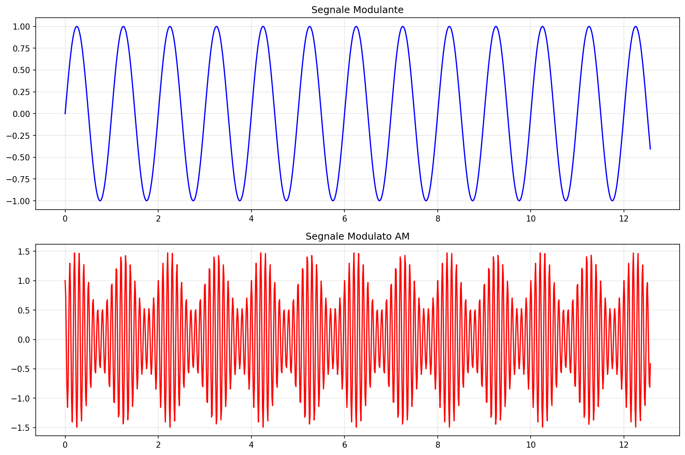
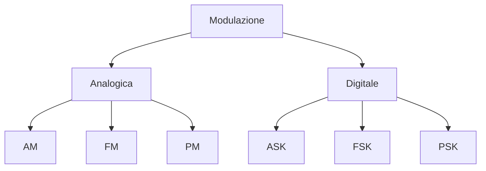

# 1.8 Segnali Modulati

[Torna al README](https://github.com/giangio/esame-radioamatori/blob/main/README.md) | [Precedente: 1.7 Segnali non sinusoidali](./1.7_Segnali_non_sinusoidali.md) | [Successivo: 1.9 Potenza ed energia](./1.9_Potenza_ed_energia.md)

## 📡 Introduzione

La **modulazione** è il processo di variare una proprietà di un'onda portante (carrier) per trasmettere informazioni. È essenziale per le comunicazioni radio, poiché permette di trasmettere segnali a frequenze più alte.

### Elementi della Modulazione
- **Portante**: Onda ad alta frequenza (es. 100MHz).
- **Modulante**: Segnale informativo (audio, dati).
- **Segnale modulato**: Risultato della modulazione.

## 📊 Tipi di Modulazione Analogica

### Modulazione di Ampiezza (AM)
L'ampiezza della portante varia con il segnale modulante.

$s(t) = [A_c + m(t)] \cos(2\pi f_c t)$

Dove:
- \( A_c \): Ampiezza portante
- \( m(t) \): Segnale modulante
- \( f_c \): Frequenza portante

- **Bande laterali**: Due simmetriche attorno a f_c.
- **Larghezza di banda**: 2 × larghezza del modulante.

### Modulazione di Ampiezza a Banda Laterale Unica (AM-SSB)
Solo una banda laterale, più efficiente.

- **Vantaggi**: Risparmio banda, meno rumore.
- **Uso**: Radioamatori, telefonia.

### Modulazione di Frequenza (FM)
La frequenza della portante varia con il modulante.

$s(t) = A_c \cos(2\pi f_c t + \beta \sin(2\pi f_m t))$

- **Deviazione di frequenza**: Massima variazione di f_c.
- **Indice di modulazione**: $\beta = \frac{\text{deviazione}}{f_m}$.

- **Larghezza di banda**: Maggiore di AM, migliore qualità audio.

### Modulazione di Fase (PM)
La fase della portante varia.

- **Relazione con FM**: PM può produrre FM.

## 🔄 Modulazione Digitale

- **ASK**: Ampiezza shift keying.
- **FSK**: Frequenza shift keying.
- **PSK**: Fase shift keying.

### Diagramma dei Tipi

## 🧠 Quiz di Ripasso

Testa le tue conoscenze sui segnali modulati!

### Domanda 1: In AM, cosa varia?
- A) Frequenza
- B) Ampiezza
- C) Fase

  
Risposta

  
<strong>B) Ampiezza</strong>

  
L'ampiezza della portante segue il segnale modulante.

### Domanda 2: FM ha larghezza di banda...
- A) Minore di AM
- B) Uguale ad AM
- C) Maggiore di AM

  
Risposta

  
<strong>C) Maggiore di AM</strong>

  
FM occupa più banda ma è più resistente al rumore.

### Domanda 3: SSB sta per...
- A) Single Side Band
- B) Super Side Band
- C) Simple Signal Band

  
Risposta

  
<strong>A) Single Side Band</strong>

  
Modulazione a banda laterale unica.

