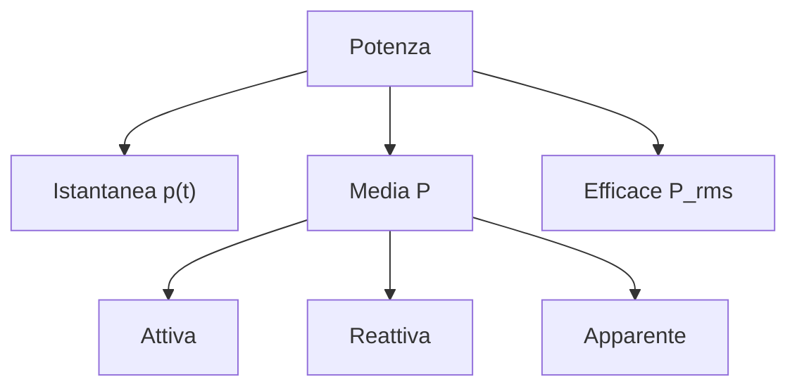

# 1.9 Potenza ed Energia

[Torna al README](../../README.md) | [Precedente: 1.8 Segnali modulati](./1.8_Segnali_modulati.md) | [Successivo: 2.1 Resistore](../02_Componenti/2.1_Resistore.md)

## ⚡ Introduzione

La **potenza** è il rate di trasferimento di energia. In elettronica, misuriamo potenza istantanea, media, efficace. L'**energia** è l'integrale della potenza nel tempo.

### Unità
- Potenza: Watt (W)
- Energia: Joule (J) = W·s

## 📊 Potenza nei Segnali Sinusoidali

Per v(t) = V_m sin(ωt), i(t) = I_m sin(ωt + φ):

- **Potenza istantanea**: p(t) = v(t)·i(t)
- **Potenza media**: P = (V_rms · I_rms) cosφ
- **Potenza efficace**: Basata su RMS (root mean square)

### Diagramma della Potenza

### Spiegazione dei Tipi di Potenza
- **Istantanea p(t)**: Potenza in un istante, p(t) = v(t) × i(t). Oscilla rapidamente.
- **Media P**: Valore medio su un periodo. In circuiti sinusoidali: P = V_rms × I_rms × cosφ.
- **Efficace P_rms**: Basata su valori RMS, misura la "potenza equivalente DC".
- **Attiva**: Parte della potenza media che produce lavoro utile (riscaldamento, movimento).
- **Reattiva**: Potenza scambiata tra fonte e carico (induttori/capacitori), non produce lavoro.
- **Apparente**: Prodotto V_rms × I_rms, include attiva e reattiva. Unità: VA (Volt-Ampere).

Esempio: In un motore, attiva muove il carico, reattiva magnetizza il campo.

## 📏 Rapporti in Decibel (dB)

Il **decibel (dB)** misura rapporti logaritmici tra potenze o tensioni. È utile perché l'orecchio umano percepisce suoni in modo logaritmico, e semplifica calcoli di amplificazione/attenuazione.

### Formule
**Per potenza:**  

$$ dB = 10 \log_{10} \left( \frac{P_2}{P_1} \right) $$

(Livello aumenta di 10 dB per 10x potenza)

**Per tensione (poiché P ∝ V²):**  

$$ dB = 20 \log_{10} \left( \frac{V_2}{V_1} \right) $$

(Livello aumenta di 20 dB per 10x tensione)

**Nota**: dB è relativo; positivo = amplificazione, negativo = attenuazione.

### Valori Comuni
- **0 dB**: Rapporto 1 (nessun cambio)
- **3 dB**: √2 ≈ 1.414 (doppio potenza)
- **6 dB**: 2 (doppio tensione)
- **10 dB**: 10 (10x potenza)
- **20 dB**: 10 (10x tensione)

Negativi: attenuazione.

## 🔗 Catene di Amplificatori/Attenuatori

Per dispositivi in serie:
- Guadagno totale: G_tot = G1 + G2 + ... (in dB)
- Es: 10dB + 5dB = 15dB

## 🎯 Adattamento (Massimo Trasferimento di Potenza)

Per massima potenza trasferita: R_load = R_source

- **Teorema**: Impedenza load = impedenza source coniugata (per complessi).
- **Importanza**: Efficienza massima 50% in DC, varia in RF.

## 📈 Rendimento e Potenza

- **Rendimento η**: P_out / P_in
- **Per amplificatori RF**: η = P_RF_out / P_DC_in

### Potenza di Cresta in Modulazione
In AM: P_cresta = (1 + m²/2) P_portante

## 🧠 Quiz di Ripasso

Testa le tue conoscenze su potenza ed energia!

### Domanda 1: 3 dB corrisponde a...
- A) 2x potenza
- B) √2 x tensione
- C) 10x potenza

  
Risposta

  
<strong>B) √2 x tensione</strong>

  
Poiché dB = 20 log(V2/V1), 3 = 20 log(x) → x = 10^(3/20) ≈ 1.412.

### Domanda 2: Per massimo trasferimento di potenza...
- A) R_load = R_source
- B) R_load = 0
- C) R_load = ∞

  
Risposta

  
<strong>A) R_load = R_source</strong>

  
Condizione di adattamento per massima potenza.

### Domanda 3: Il rendimento è...
- A) P_in / P_out
- B) P_out / P_in
- C) P_out + P_in

  
Risposta

  
<strong>B) P_out / P_in</strong>

  
Sempre ≤ 1.

