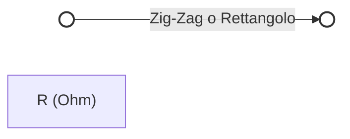
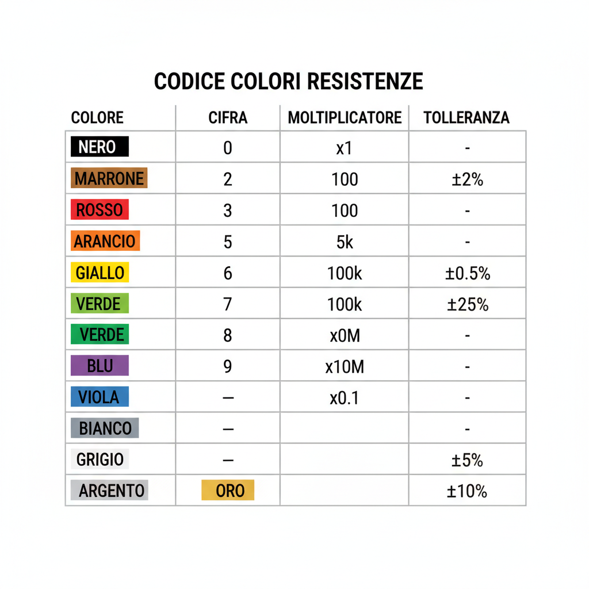
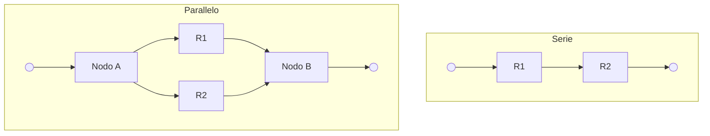

# 2.1 Resistore: Il Freno della Corrente 🛑

Benvenuti nel mondo dei componenti passivi! Il **resistore** (o resistenza) è il componente più comune. La sua funzione principale è limitare il flusso di corrente in un circuito, proprio come un rubinetto che regola il flusso d'acqua.

## 🧱 Che cos'è un Resistore?

Un resistore è un componente progettato per avere una specifica resistenza elettrica. Dissipa energia sotto forma di calore (effetto Joule).

- **Simbolo**:
  - Zig-zag (standard USA)
  - Rettangolo (standard Europeo/IEC)

### Diagramma del Simbolo

## 📏 L'Unità di Misura: Ohm (Ω)

La resistenza si misura in **Ohm**, simbolo **Ω** (Omega greca).
- 1 kΩ = 1.000 Ω
- 1 MΩ = 1.000.000 Ω

## ⚖️ Legge di Ohm e Potenza

Le relazioni fondamentali per il resistore sono:

1.  **Legge di Ohm**: $V = R \times I$
    - Se applichi 10V su 100Ω, scorrono $I = 10/100 = 0.1A$.
2.  **Potenza Dissipata**: $P = V \times I = I^2 \times R = \frac{V^2}{R}$
    - Un resistore deve essere in grado di dissipare il calore generato. Le potenze standard sono 1/4W, 1/2W, 1W, 5W, ecc.

## 🎨 Codice Colori

I resistori a foro passante usano bande colorate per indicare il valore.

| Colore | Cifra | Moltiplicatore | Tolleranza |
| :--- | :---: | :---: | :---: |
| Nero | 0 | x1 | - |
| Marrone | 1 | x10 | ±1% |
| Rosso | 2 | x100 | ±2% |
| Arancio | 3 | x1k | - |
| Giallo | 4 | x10k | - |
| Verde | 5 | x100k | ±0.5% |
| Blu | 6 | x1M | ±0.25% |
| Viola | 7 | x10M | ±0.1% |
| Grigio | 8 | - | - |
| Bianco | 9 | - | - |
| Oro | - | x0.1 | ±5% |
| Argento | - | x0.01 | ±10% |

**Esempio**: Giallo-Viola-Rosso-Oro = 4 7 x100 ±5% = 4700Ω = 4.7kΩ ±5%.

## 🔗 Collegamenti Serie e Parallelo

### Serie
La corrente è la stessa, la resistenza totale è la somma.
$$R_{tot} = R_1 + R_2 + ...$$

### Parallelo
La tensione è la stessa, la resistenza totale diminuisce.
$$\frac{1}{R_{tot}} = \frac{1}{R_1} + \frac{1}{R_2} + ...$$
Per due resistori: $R_{tot} = \frac{R_1 \times R_2}{R_1 + R_2}$

### Diagramma Serie vs Parallelo

## 🌡️ Coefficiente di Temperatura

La resistenza cambia con la temperatura:
- **PTC (Positive Temperature Coefficient)**: R aumenta se T aumenta (es. metalli, filamenti lampadine).
- **NTC (Negative Temperature Coefficient)**: R diminuisce se T aumenta (es. semiconduttori, termistori).

## 🧠 Quiz di Ripasso

### Domanda 1: Qual è il valore di un resistore Marrone-Nero-Rosso?
- A) 100 Ω
- B) 1 kΩ
- C) 10 kΩ

  
Risposta

  
<strong>B) 1 kΩ</strong>

  
Marrone (1), Nero (0), Rosso (x100) -> 10 x 100 = 1000 Ω = 1 kΩ.

### Domanda 2: Due resistori da 100Ω in parallelo danno...
- A) 200 Ω
- B) 100 Ω
- C) 50 Ω

  
Risposta

  
<strong>C) 50 Ω</strong>

  
In parallelo, due resistori uguali dimezzano il valore: 100 / 2 = 50 Ω.

### Domanda 3: Se raddoppio la tensione su un resistore, la potenza dissipata...
- A) Raddoppia
- B) Quadruplica
- C) Resta uguale

  
Risposta

  
<strong>B) Quadruplica</strong>

  
P = V²/R. Se V raddoppia (2V), P diventa (2V)²/R = 4V²/R, quindi quadruplica.

---
[Torna al README](../../README.md) | [Precedente: 1.9 Potenza ed energia](../01_Elettricita_Elettromagnetismo_Radiotecnica_Teoria/1.9_Potenza_ed_energia.md) | [Successivo: 2.2 Condensatore](./2.2_Condensatore.md)