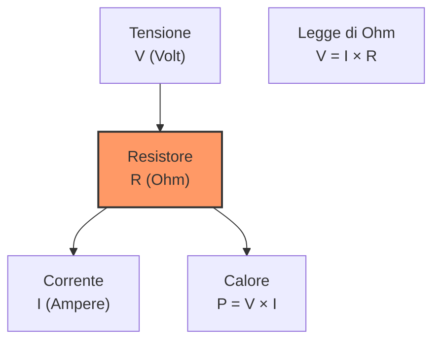
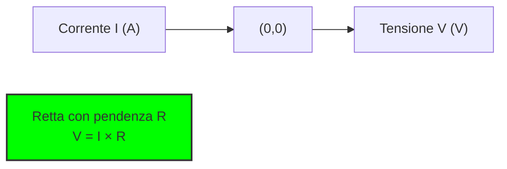
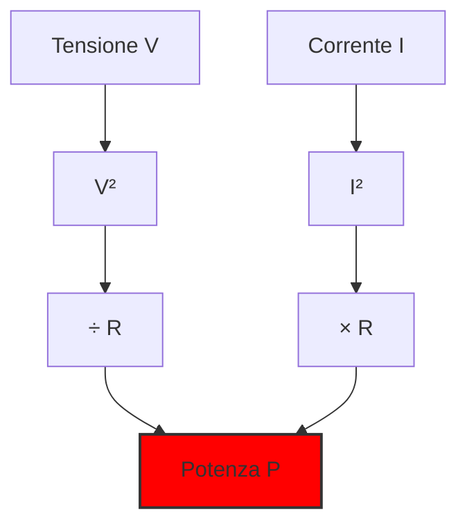
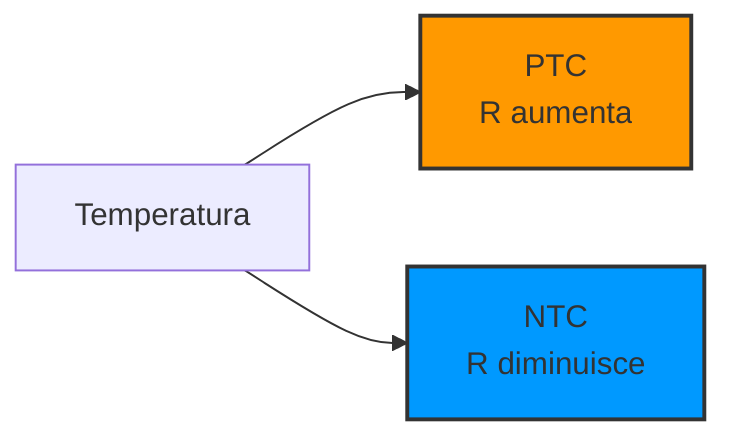

# 2.1 Resistore: Il Controllo del Flusso Elettrico ⚡

Benvenuti nel mondo dei resistori! Immaginate un resistore come un "regolatore di traffico" per l'elettricità - controlla quanto flusso di corrente può passare in un circuito. Scopriamo come funziona, da semplice limitatore di corrente a componente essenziale in ogni dispositivo elettronico!

## 🔧 Cos'è un Resistore?

Un **resistore** è un componente passivo che si oppone al passaggio della corrente elettrica, convertendo l'energia elettrica in calore secondo l'effetto Joule. È il componente più fondamentale e utilizzato in elettronica.

### Simboli del Resistore
 

- **Unità di misura**: **Ohm (Ω)**
- **Legge fondamentale**: **V = I × R** (Legge di Ohm)

### Diagramma del Resistore

## 📏 L'Unità di Misura: L'Ohm (Ω)

L'**ohm** è l'unità di misura della resistenza elettrica.

- **Definizione**: 1 Ω è la resistenza che, sottoposta a 1 V, fa passare 1 A di corrente
- **Multipli comuni**: kΩ (kilohm = 1.000 Ω), MΩ (megohm = 1.000.000 Ω)
- **Sottomultipli**: mΩ (milliohm = 0,001 Ω)

### Tabella dei Multipli
| Prefisso | Simbolo | Valore | Esempio |
|----------|---------|--------|---------|
| Kilo | kΩ | 10³ Ω | 4,7 kΩ = 4.700 Ω |
| Mega | MΩ | 10⁶ Ω | 1 MΩ = 1.000.000 Ω |
| Milli | mΩ | 10⁻³ Ω | 100 mΩ = 0,1 Ω |

## ⚡ Caratteristiche Corrente/Tensione

La relazione tra corrente e tensione in un resistore è **lineare** e segue la Legge di Ohm.

### Curva Caratteristica V-I

**Esempio pratico**: Un resistore da 1 kΩ:
- A 1 V → I = 1 mA
- A 5 V → I = 5 mA  
- A 10 V → I = 10 mA

La corrente aumenta proporzionalmente alla tensione!

## 🔥 Potenza Dissipata

Il resistore converte l'energia elettrica in calore. La **potenza dissipata** è:

**P = V × I = I² × R = V² / R**

### Potenze Standard
- **Resistori comuni**: 1/4 W (0,25 W), 1/2 W (0,5 W), 1 W
- **Resistori di potenza**: 2 W, 5 W, 10 W, 25 W
- **Resistori SMD**: 1/10 W (0,1 W), 1/8 W (0,125 W)

### Esempio di Calcolo
Un resistore da 470 Ω con 12 V ai capi:
- P = V² / R = 12² / 470 = 144 / 470 ≈ 0,31 W
- **Necessita un resistore da almeno 0,5 W** per sicurezza!

### Diagramma di Potenza

## 🌡️ Coefficiente di Temperatura

La resistenza varia con la temperatura. Il **coefficiente di temperatura (α)** indica questa variazione.

**Formula**: R_T = R_0 × [1 + α × (T - T_0)]

### Tipi di Coefficienti
- **Positivo (PTC)**: La resistenza aumenta con la temperatura
  - Materiali: nichel, rame, alluminio
  - Applicazioni: sensori di temperatura, protezione
  
- **Negativo (NTC)**: La resistenza diminuisce con la temperatura
  - Materiali: alcuni semiconduttori, ceramici speciali
  - Applicazioni: limitazione di corrente all'avvio, sensori

### Tabella Coefficienti
| Materiale | Coefficiente (α/°C) | Tipo |
|-----------|-------------------|------|
| Rame | +0,00393 | PTC |
| Alluminio | +0,00429 | PTC |
| Nichel | +0,006 | PTC |
| Carbonio | -0,0005 | NTC |

### Grafico Temperatura vs Resistenza

## 🎯 Codice Colori dei Resistori

I resistori hanno un codice a colori per indicare il loro valore:

### Partitore di Tensione
Un'applicazione comune è il partitore di tensione:

## 📦 Tipi di Resistori

### Tabella Colori
| Colore | Cifra | Moltiplicatore | Tolleranza |
|--------|-------|----------------|------------|
| Nero | 0 | 10⁰ | - |
| Marrone | 1 | 10¹ | ±1% |
| Rosso | 2 | 10² | ±2% |
| Arancione | 3 | 10³ | - |
| Giallo | 4 | 10⁴ | - |
| Verde | 5 | 10⁵ | ±0.5% |
| Blu | 6 | 10⁶ | ±0.25% |
| Viola | 7 | 10⁷ | ±0.1% |
| Grigio | 8 | 10⁸ | ±0.05% |
| Bianco | 9 | 10⁹ | - |
| Oro | - | 10⁻¹ | ±5% |
| Argento | - | 10⁻² | ±10% |

**Esempio**: Giallo-Viola-Rosso-Oro = 4-7-10² = 4,7 kΩ ±5%

## 🧠 Quiz di Ripasso

Testa le tue conoscenze sui resistori!

### Domanda 1: Qual è l'unità di misura della resistenza?
- A) Ampere
- B) Volt  
- C) Ohm

  
Risposta

  
<strong>C) Ohm</strong>

  
La resistenza si misura in ohm (Ω), definito come V/A.

### Domanda 2: Secondo la Legge di Ohm, se R = 1 kΩ e V = 5 V, quale è la corrente?
- A) 5 mA
- B) 0,5 mA
- C) 50 mA

  
Risposta

  
<strong>A) 5 mA</strong>

  
I = V / R = 5 V / 1.000 Ω = 0,005 A = 5 mA

### Domanda 3: Un resistore PTC con la temperatura...
- A) Aumenta la resistenza
- B) Diminuisce la resistenza
- C) Rimane costante

  
Risposta

  
<strong>A) Aumenta la resistenza</strong>

  
PTC = Positive Temperature Coefficient, la resistenza cresce con la temperatura.

### Domanda 4: Quale potenza dissipa un resistore da 220 Ω con 10 V?
- A) 0,45 W
- B) 0,22 W
- C) 2,2 W

  
Risposta

  
<strong>A) 0,45 W</strong>

  
P = V² / R = 10² / 220 = 100 / 220 ≈ 0,45 W

## Conclusione

I resistori sono i componenti più versatili in elettronica! Dal semplice limitatore di corrente al complesso partitore di tensione, capirli è essenziale per ogni progetto. Ricorda sempre di considerare la potenza dissipata e il coefficiente di temperatura! ⚡

---
[Torna al README](https://github.com/giangio/esame-radioamatori/blob/main/README.md) | [Precedente: 1.9 Potenza ed energia](../01_Elettricita_Elettromagnetismo_Radiotecnica_Teoria/1.9_Potenza_ed_energia.md) | [Successivo: 2.2 Condensatore](./2.2_Condensatore.md)