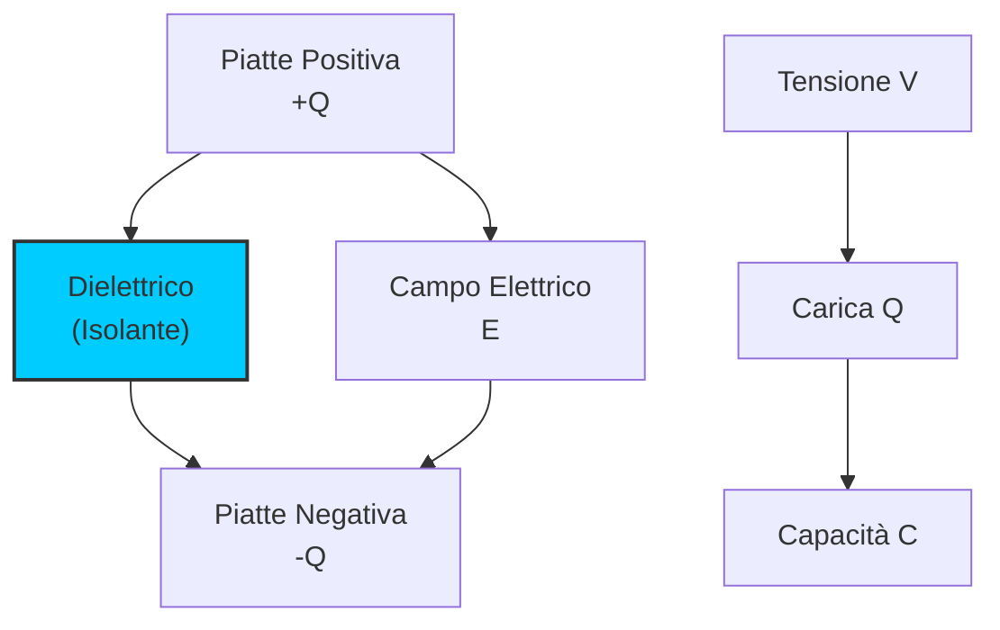
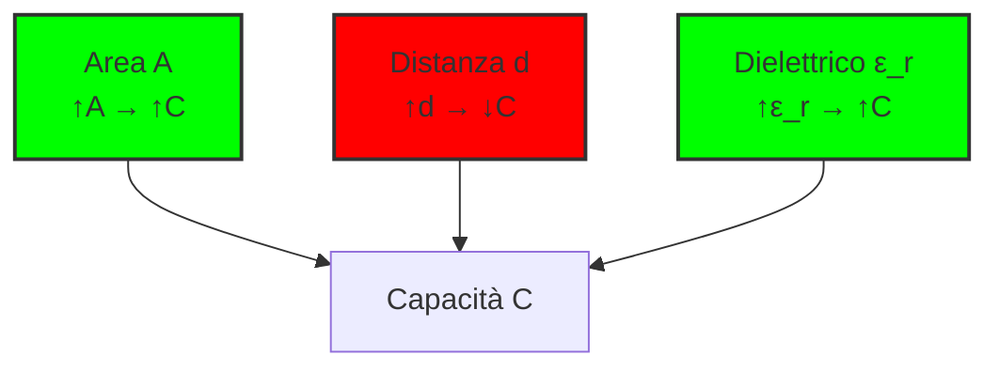
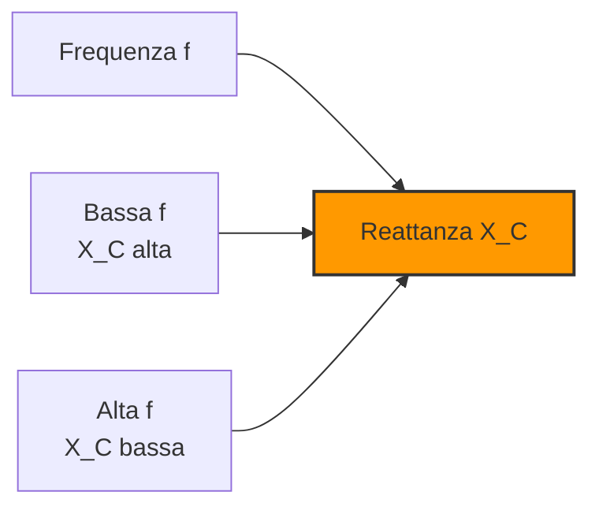
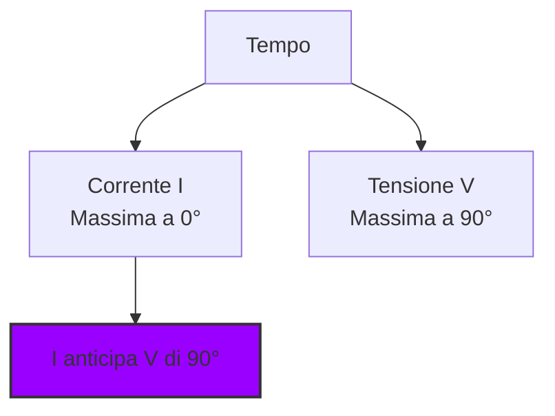

# 2.2 Condensatore: L'Accumulatore di Energia ⚡

Benvenuti nel mondo dei condensatori! Immaginate un condensatore come una "batteria temporanea" che può accumulare rapidamente carica elettrica e rilasciarla altrettanto velocemente. Scopriamo come funziona questo magazzino di energia essenziale in ogni circuito elettronico!

## 🔋 Cos'è un Condensatore?

Un **condensatore** è un componente passivo che immagazzina energia elettrica in un campo elettrostatico. È formato da due piastre conduttrici separate da un materiale isolante chiamato **dielettrico**.

### Simboli del Condensatore
 

- **Unità di misura**: **Farad (F)**
- **Funzione principale**: Accumulare e rilasciare carica elettrica

### Diagramma del Condensatore

## 📏 L'Unità di Misura: Il Farad (F)

Il **farad** è l'unità di misura della capacità elettrica.

- **Definizione**: 1 F è la capacità che, sottoposta a 1 V, immagazzina 1 C di carica
- **Relazione fondamentale**: **Q = C × V**
- **Sottomultipli comuni**: 
  - μF (microfarad = 10⁻⁶ F)
  - nF (nanofarad = 10⁻⁹ F) 
  - pF (picofarad = 10⁻¹² F)

### Tabella dei Sottomultipli
| Prefisso | Simbolo | Valore | Esempio |
|----------|---------|--------|---------|
| Micro | μF | 10⁻⁶ F | 100 μF = 0,0001 F |
| Nano | nF | 10⁻⁹ F | 47 nF = 0,000000047 F |
| Pico | pF | 10⁻¹² F | 22 pF = 0,000000000022 F |

## 🏗️ Relazione tra Capacità, Dimensioni e Dielettrico

La capacità di un condensatore dipende da tre fattori principali:

**Formula**: C = ε₀ × ε_r × (A / d)

Dove:
- **ε₀** = 8,854 × 10⁻¹² F/m (costante dielettrica del vuoto)
- **ε_r** = costante dielettrica relativa del materiale
- **A** = area delle piastre (m²)
- **d** = distanza tra le piastre (m)

### Fattori che Influenzano la Capacità
1. **Area delle piastre (A)**: Maggiore area → maggiore capacità
2. **Distanza (d)**: Minore distanza → maggiore capacità
3. **Dielettrico (ε_r)**: Maggiore costante dielettrica → maggiore capacità

### Tabella Costanti Dielettriche
| Materiale | ε_r | Applicazioni |
|-----------|-----|--------------|
| Aria | 1,0 | Condensatori variabili |
| Vuoto | 1,0 | Riferimento |
| Mica | 5-7 | Condensatori di precisione |
| Ceramica | 10-10.000 | Condensatori SMD |
| Plastica | 2-6 | Condensatori film |
| Elettrolitico | 10-100 | Alta capacità |

### Diagramma dei Fattori

## ⚡ La Reattanza Capacitiva

La **reattanza capacitiva (X_C)** è l'opposizione che un condensatore offre alla corrente alternata.

**Formula**: X_C = 1 / (2π × f × C)

Dove:
- **X_C** = reattanza capacitiva (Ω)
- **f** = frequenza (Hz)
- **C** = capacità (F)

### Comportamento in Frequenza
- **Bassa frequenza**: Alta reattanza (si comporta come circuito aperto)
- **Alta frequenza**: Bassa reattanza (si comporta come corto circuito)
- **Corrente continua (f = 0)**: Reattanza infinita (blocca completamente)

### Grafico X_C vs Frequenza

**Esempio**: Un condensatore da 10 μF a 50 Hz:
X_C = 1 / (2π × 50 × 10 × 10⁻⁶) ≈ 318 Ω

## 🔄 Sfasamento tra Tensione e Corrente

Nei condensatori, la **corrente è in anticipo di 90° rispetto alla tensione**.

### Circuito Serie RC

### Filtro Passa-Basso RC

- **Corrente (i)**: i = C × (dV/dt)
- **Relazione di fase**: I precede V di 90°
- **Significato**: La corrente raggiunge il massimo prima della tensione

### Diagramma di Fase

### Spiegazione Intuitiva
Quando la tensione inizia ad aumentare, il condensatore si "carica" rapidamente, producendo una corrente elevata. Una volta carico, la corrente diminuisce anche se la tensione continua ad aumentare.

## 📦 Tipi di Condensatori

### Tipologie di Condensatori

### Condensatori Fissi
#### Aria
- **Capacità**: Molto basse (pF)
- **Vantaggi**: Bassa perdita, stabilità
- **Svantaggi**: Ingombranti
- **Uso**: Circuiti RF, sintonizzazione

#### Mica
- **Capacità**: Medie (pF - nF)
- **Vantaggi**: Alta stabilità, bassa tolleranza
- **Svantaggi**: Costosi
- **Uso**: Circuiti di precisione, filtri

#### Plastica
- **Capacità**: Medie (nF - μF)
- **Vantaggi**: Buona stabilità, economici
- **Svantaggi**: Dimensioni maggiori
- **Uso**: General purpose, accoppiamento

#### Ceramici
- **Capacità**: Basse-medie (pF - μF)
- **Vantaggi**: Compatti, economici
- **Svantaggi**: Tolleranza elevata
- **Uso**: SMD, decoupling, bypass

#### Elettrolitici
- **Capacità**: Alte (μF - mF)
- **Vantaggi**: Alta capacità in piccolo volume
- **Svantaggi**: Polarizzati, vita limitata
- **Uso**: Alimentazione, filtraggio

### Condensatori Variabili
- **Aria**: Per sintonizzazione radio
- **Plastica**: Per applicazioni generali
- **Ceramici**: Per taratura fine

## 🌡️ Coefficiente di Temperatura

La capacità varia con la temperatura. Il **coefficiente di temperatura** indica questa variazione.

### Codici di Temperatura (EIA)
| Codice | Coefficiente (ppm/°C) | Tipo |
|--------|----------------------|------|
| C0G/NP0 | 0 | Stabile |
| X7R | ±15% | Semistabile |
| Y5V | +22/-82% | Instabile |
| Z5U | +22/-56% | Instabile |

### Scelta del Coefficiente
- **Circuiti di precisione**: C0G/NP0 (coefficiente nullo)
- **General purpose**: X7R (buon compromesso)
- **Decoupling**: Y5V/Z5U (costo ridotto)

## 🔒 Corrente di Fuga

La **corrente di fuga** è la piccola corrente che attraversa il dielettrico anche quando il condensatore è carico.

- **Condensatori elettrolitici**: Corrente di fuga più elevata
- **Condensatori a film/ceramici**: Corrente di fuga molto bassa
- **Importanza**: Critica in circuiti a basso consumo

### Valori Tipici
| Tipo | Corrente di Fuga |
|------|-------------------|
| Elettrolitico | 0,01-1 μA/μF |
| Tantalio | 0,001-0,1 μA/μF |
| Film | < 0,001 μA/μF |
| Ceramico | < 0,0001 μA/μF |

## 🧠 Quiz di Ripasso

Testa le tue conoscenze sui condensatori!

### Domanda 1: Qual è l'unità di misura della capacità?
- A) Ohm
- B) Farad
- C) Henry

  
Risposta

  
<strong>B) Farad</strong>

  
La capacità si misura in farad (F), definito come C/V.

### Domanda 2: Aumentando l'area delle piastre, la capacità...
- A) Aumenta
- B) Diminuisce
- C) Rimane costante

  
Risposta

  
<strong>A) Aumenta</strong>

  
C = ε × (A/d), quindi maggiore area → maggiore capacità.

### Domanda 3: In un condensatore, la corrente è...
- A) In ritardo di 90° rispetto alla tensione
- B) In anticipo di 90° rispetto alla tensione
- C) In fase con la tensione

  
Risposta

  
<strong>B) In anticipo di 90° rispetto alla tensione</strong>

  
Nei condensatori, I precede V di 90°.

### Domanda 4: Quale materiale ha la più alta costante dielettrica?
- A) Aria
- B) Mica
- C) Ceramica

  
Risposta

  
<strong>C) Ceramica</strong>

  
La ceramica può avere ε_r fino a 10.000, molto più alta di aria (1) e mica (5-7).

### Domanda 5: Un condensatore da 100 μF a 50 Hz ha quale reattanza?
- A) ~31,8 Ω
- B) ~318 Ω
- C) ~3.180 Ω

  
Risposta

  
<strong>A) ~31,8 Ω</strong>

  
X_C = 1 / (2π × 50 × 100 × 10⁻⁶) ≈ 31,8 Ω

## Conclusione

I condensatori sono magazzini di energia essenziali! Dal filtraggio dell'alimentazione all'accoppiamento dei segnali, capire la loro capacità, reattanza e comportamento in frequenza è fondamentale per ogni progetto elettronico. Scegli il tipo giusto per la tua applicazione! ⚡

---
[Torna al README](https://github.com/giangio/esame-radioamatori/blob/main/README.md) | [Precedente: 2.1 Resistore](./2.1_Resistore.md) | [Successivo: 2.3 Induttore](./2.3_Induttore.md)