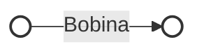
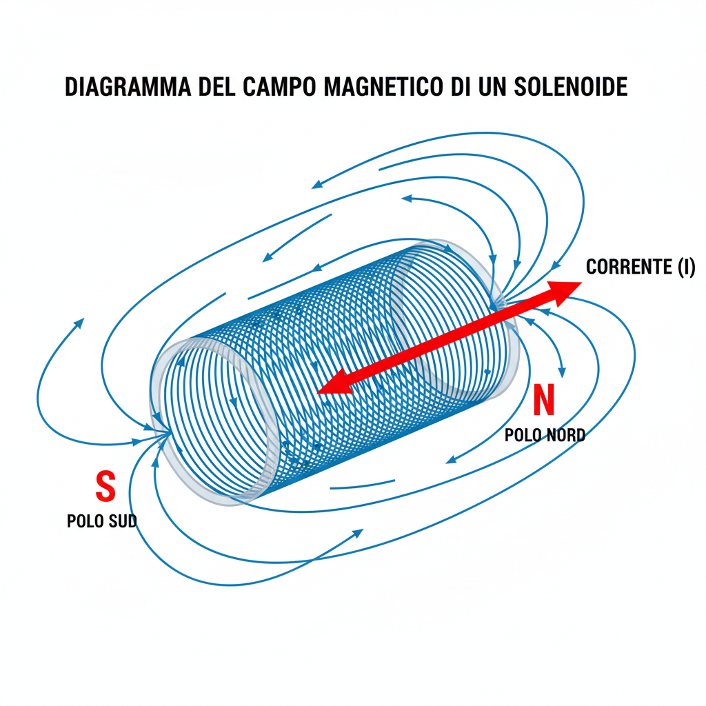

# 2.3 Induttore: L'Inerzia Elettrica 🌀

L'**induttore** (o bobina) è un componente che si oppone alle variazioni di corrente. Immaginatelo come un volano pesante: è difficile farlo partire, ma una volta in movimento, è difficile fermarlo.

## 🧱 Che cos'è un Induttore?

È costituito da un filo conduttore avvolto in spire (solenoide), spesso attorno a un nucleo ferromagnetico per aumentarne l'efficacia.

- **Simbolo**:
  - Una serie di semicerchi (bobina)

### Diagramma del Simbolo

## 📏 Induttanza e Henry

L'induttanza (L) misura la capacità di opporsi alle variazioni di corrente generando una forza contro-elettromotrice (f.c.e.m.).
$$V = -L \frac{\Delta I}{\Delta t}$$
- Unità: **Henry (H)**.
- Sottomultipli: millihenry (mH), microhenry ($\mu H$).

L'induttanza dipende da:
- **Numero di spire ($N$)**: Più spire = più induttanza ($L \propto N^2$).
- **Nucleo**: Il ferro o la ferrite aumentano L rispetto all'aria.
- **Dimensioni**: Diametro e lunghezza della bobina.

## ⚡ Reattanza Induttiva ($X_L$)

In corrente alternata, l'induttore presenta una **reattanza induttiva** che aumenta con la frequenza.
$$X_L = 2 \pi f L$$
- A frequenza zero (DC), $X_L = 0$ (corto circuito ideale).
- A frequenza alta, $X_L$ è alta (blocco per RF).

## 🔄 Sfasamento

In un circuito puramente induttivo, la **tensione è in anticipo di 90°** rispetto alla corrente.
(Ricorda: "ELI" -> EMF leads Current in Inductor).

## 📈 Fattore di Merito (Q)

Il fattore Q indica la qualità dell'induttore, ovvero quanto è "puro" (poca resistenza parassita).
$$Q = \frac{X_L}{R_{serie}}$$
Un Q alto significa poche perdite, importante nei circuiti risonanti per avere una banda stretta.

## 🚧 Effetti Parassiti

- **Effetto Pelle**: Ad alte frequenze, la corrente scorre solo sulla superficie del filo, aumentando la resistenza effettiva.
- **Capacità Parassita**: Tra le spire esiste una piccola capacità che può far risuonare l'induttore a frequenze molto alte.

## 🧠 Quiz di Ripasso

### Domanda 1: Se raddoppio la frequenza, la reattanza induttiva...
- A) Dimezza
- B) Raddoppia
- C) Resta uguale

  
Risposta

  
<strong>B) Raddoppia</strong>

  
$X_L = 2\pi f L$. È direttamente proporzionale alla frequenza.

### Domanda 2: L'unità di misura dell'induttanza è...
- A) Farad
- B) Henry
- C) Tesla

  
Risposta

  
<strong>B) Henry</strong>

  
Simbolo H.

### Domanda 3: In un induttore, la corrente...
- A) È in fase con la tensione
- B) Anticipa la tensione
- C) È in ritardo rispetto alla tensione

  
Risposta

  
<strong>C) È in ritardo rispetto alla tensione</strong>

  
La tensione guida la corrente (ELI).

---
[Torna al README](../../README.md) | [Precedente: 2.2 Condensatore](./2.2_Condensatore.md) | [Successivo: 2.4 Trasformatore](./2.4_Trasformatore.md)