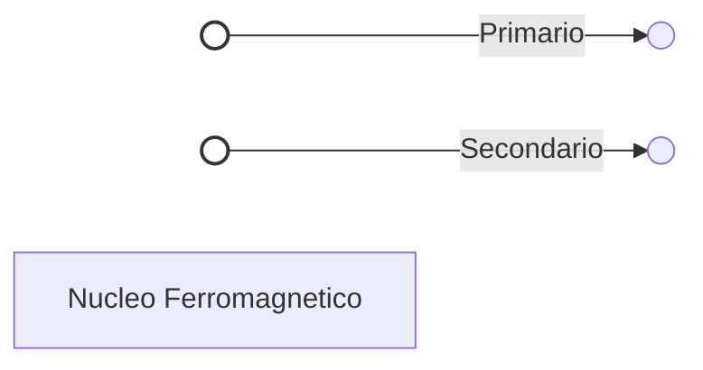

# 2.4 Trasformatore: Cambiare Tensione 🔄

Il **trasformatore** è un dispositivo che trasferisce energia elettrica tra due circuiti tramite induzione elettromagnetica, solitamente cambiando i valori di tensione e corrente. È il cuore della distribuzione elettrica e degli alimentatori.

## 🧱 Che cos'è un Trasformatore?

È composto da due avvolgimenti (bobine) isolati elettricamente ma accoppiati magneticamente tramite un nucleo ferromagnetico.
- **Primario**: L'avvolgimento collegato alla fonte di energia.
- **Secondario**: L'avvolgimento collegato al carico.

- **Simbolo**:
  - Due bobine con linee parallele al centro (nucleo).

### Diagramma del Simbolo

## ⚖️ Rapporto di Trasformazione

La relazione fondamentale è data dal rapporto tra il numero di spire ($N$):
$$\frac{V_p}{V_s} = \frac{N_p}{N_s} = \frac{I_s}{I_p}$$
Dove $p$ indica il primario e $s$ il secondario.

- **Elevatore (Step-up)**: $N_s > N_p \to V_s > V_p$ (aumenta la tensione, diminuisce la corrente).
- **Riduttore (Step-down)**: $N_s < N_p \to V_s < V_p$ (diminuisce la tensione, aumenta la corrente).
- **Isolamento**: $N_s = N_p \to V_s = V_p$ (separa i circuiti per sicurezza).

## ⚡ Potenza e Rendimento

In un trasformatore ideale, la potenza in ingresso è uguale a quella in uscita:
$$P_{in} = P_{out} \implies V_p \times I_p = V_s \times I_s$$

Nella realtà, ci sono perdite (calore nel rame, isteresi nel nucleo). Il rendimento ($\eta$) è:
$$\eta = \frac{P_{out}}{P_{in}} \times 100\%$$
I trasformatori sono molto efficienti (spesso > 95%).

## 🏭 Applicazioni

1.  **Alimentatori**: Ridurre la 230V di rete a tensioni basse (es. 12V) per elettronica.
2.  **Trasmissione**: Alzare la tensione a kV per trasportare energia con meno perdite sui cavi.
3.  **Adattamento di Impedenza**: In audio e RF, per massimizzare il trasferimento di potenza.

## 🧠 Quiz di Ripasso

### Domanda 1: Se il primario ha 100 spire e il secondario 200, la tensione in uscita...
- A) Dimezza
- B) Raddoppia
- C) Resta uguale

  
Risposta

  
<strong>B) Raddoppia</strong>

  
È un trasformatore elevatore. Ns/Np = 2, quindi Vs = 2 * Vp.

### Domanda 2: Un trasformatore funziona con...
- A) Solo corrente continua (DC)
- B) Solo corrente alternata (AC)
- C) Entrambe

  
Risposta

  
<strong>B) Solo corrente alternata (AC)</strong>

  
L'induzione richiede un campo magnetico variabile. In DC il campo è statico e non induce nulla (anzi, brucia il primario!).

### Domanda 3: Se la tensione aumenta nel secondario, la corrente...
- A) Aumenta
- B) Diminuisce
- C) Resta uguale

  
Risposta

  
<strong>B) Diminuisce</strong>

  
Per conservare la potenza (P=VI), se V sale, I deve scendere.

---
[Torna al README](../../README.md) | [Precedente: 2.3 Induttore](./2.3_Induttore.md) | [Successivo: 2.5 Diodo](./2.5_Diodo.md)