# 2.4 Trasformatore: Il Maghetto della Tensione 🔄

Benvenuti nel mondo dei trasformatori! Immaginate un trasformatore come un "maghetto della tensione" che può aumentare o diminuire la tensione elettrica senza contatto fisico, usando solo il potere del magnetismo. Scopriamo come questo dispositivo essenziale alimenti il mondo intero!

## 🔄 Cos'è un Trasformatore?

Un **trasformatore** è un dispositivo elettromagnetico che trasferisce energia elettrica tra due circuiti tramite induzione, solitamente cambiando i livelli di tensione e corrente.

### Simbolo del Trasformatore

- **Funzione principale**: Cambiare tensione e corrente
- **Principio**: Induzione elettromagnetica

### Diagramma del Trasformatore

## ⚖️ Rapporto di Trasformazione

Il **rapporto di trasformazione** è la relazione fondamentale che governa il funzionamento del trasformatore.

**Formula principale**: V_p / V_s = N_p / N_s = I_s / I_p

Dove:
- **V_p, V_s** = tensioni primario e secondario
- **N_p, N_s** = numero di spire primario e secondario
- **I_p, I_s** = correnti primario e secondario

### Tipi di Trasformatori
1. **Elevatore (Step-up)**: N_s > N_p → V_s > V_p
   - Aumenta la tensione, diminuisce la corrente
   - Usato nella trasmissione di energia

2. **Riduttore (Step-down)**: N_s < N_p → V_s < V_p
   - Diminuisce la tensione, aumenta la corrente
   - Usato in alimentatori e apparecchiature

3. **Isolamento**: N_s = N_p → V_s = V_p
   - Mantiene la stessa tensione ma isola elettricamente
   - Usato per sicurezza

### Diagramma dei Rapporti

```mermaid
graph TD;
    Spire["Rapporto Spire<br>N_s/N_p"] --> Tensione["Rapporto Tensioni<br>V_s/V_p"];
    Tensione --> Corrente["Rapporto Correnti<br>I_p/I_s"];
    Elevatore["Elevatore<br>N_s > N_p"] --> AumentaTensione["V_s ↑, I_s ↓"];
    Riduttore["Riduttore<br>N_s < N_p"] --> DiminuisceTensione["V_s ↓, I_s ↑"];
    classDef positivo fill:#0f0,stroke:#333,stroke-width:2px;
    classDef negativo fill:#f00,stroke:#333,stroke-width:2px;
    class AumentaTensione positivo;
    class DiminuisceTensione negativo;
```

## ⚡ Potenza e Rendimento

### Trasformatore Ideale
In un trasformatore ideale, la potenza si conserva:

**P_in = P_out** → **V_p × I_p = V_s × I_s**

### Trasformatore Reale
Nella realtà ci sono delle perdite:

**Rendimento (η)** = P_out / P_in × 100%

**Tipi di perdite**:
1. **Perdite nel rame**: Effetto Joule negli avvolgimenti (P = I²R)
2. **Perdite nel nucleo**: Isteresi e correnti parassite
3. **Perdite per flusso di dispersione**: Parte del flusso magnetico non si accoppia

### Tabella Rendimenti Tipici
| Tipo di Trasformatore | Rendimento | Applicazioni |
|----------------------|------------|--------------|
| Potenza (grande) | 95-99% | Reti elettriche |
| Distribuzione | 90-95% | Reti urbane |
| Alimentatori | 80-90% | Elettronica |
| Audio | 70-85% | Amplificatori |

## 🏭 Applicazioni Principali

### 1. Distribuzione Elettrica
- **Generazione → Trasmissione**: Eleva a centinaia di kV
- **Trasmissione → Distribuzione**: Riduce a 10-20 kV
- **Distribuzione → Utente**: Riduce a 230/400 V

### 2. Alimentatori Elettronici
- **Riduzione**: 230V → 12V, 5V, 3.3V
- **Isolamento**: Sicurezza galvanica
- **Adattamento**: Impedenze ottimali

### 3. Applicazioni Speciali
- **Audio**: Accoppiamento e adattamento impedenze
- **RF**: Circuiti risonanti e matching
- **Saldatrici**: Bassa tensione, alta corrente

### Diagramma Applicazioni

## 📐 Trasformatori Ideali

Un trasformatore ideale ha queste caratteristiche:
- **Nessuna perdita**: Rendimento = 100%
- **Accoppiamento perfetto**: Tutto il flusso si accoppia
- **Reattanza infinita**: Assorbe solo la potenza richiesta
- **Linearità**: Rapporto costante a qualsiasi carico

### Equazioni del Trasformatore Ideale
- **Tensioni**: V_s = (N_s/N_p) × V_p
- **Correnti**: I_s = (N_p/N_s) × I_p
- **Impedenze**: Z_s = (N_s/N_p)² × Z_p

## 🧪 Limitazioni Pratiche

### Frequenza di Lavoro
- **50/60 Hz**: Trasformatori a nucleo di ferro (pesanti)
- **kHz-MHz**: Trasformatori a ferrite (compatti)
- **RF**: Trasformatori a aria (bassa induttanza)

### Corrente di Magnetizzazione
Anche a vuoto, il trasformatore assorbe una piccola corrente per creare il campo magnetico nel nucleo.

### Saturazione del Nucleo
Se il flusso magnetico diventa troppo elevato, il nucleo satura e il trasformatore perde le sue caratteristiche.

## 🧠 Quiz di Ripasso

Testa le tue conoscenze sui trasformatori!

### Domanda 1: In un trasformatore con Np=100 e Ns=200, la tensione in uscita...
- A) Dimezza
- B) Raddoppia
- C) Resta uguale

  
Risposta

  
<strong>B) Raddoppia</strong>

  
V_s/V_p = N_s/N_p = 200/100 = 2, quindi V_s = 2 × V_p

### Domanda 2: Un trasformatore funziona con...
- A) Solo corrente continua (DC)
- B) Solo corrente alternata (AC)
- C) Entrambe

  
Risposta

  
<strong>B) Solo corrente alternata (AC)</strong>

  
L'induzione elettromagnetica richiede un campo magnetico variabile.

### Domanda 3: Se la tensione aumenta nel secondario, la corrente...
- A) Aumenta
- B) Diminuisce
- C) Resta uguale

  
Risposta

  
<strong>B) Diminuisce</strong>

  
Per conservare la potenza (P = VI), se V aumenta, I deve diminuire.

### Domanda 4: Qual è il rendimento tipico di un trasformatore di potenza grande?
- A) 50-70%
- B) 80-90%
- C) 95-99%

  
Risposta

  
<strong>C) 95-99%</strong>

  
I trasformatori di grandi dimensioni hanno rendimenti molto alti.

### Domanda 5: Cosa causa le perdite nel nucleo?
- A) Effetto Joule nel rame
- B) Isteresi e correnti parassite
- C) Resistenza di carico

  
Risposta

  
<strong>B) Isteresi e correnti parassite</strong>

  
Sono perdite magnetiche nel materiale del nucleo.

## Conclusione

I trasformatori sono i maghi silenziosi dell'elettricità! Dalle centrali elettriche ai caricabatterie del telefono, permettono di distribuire energia efficientemente su lunghe distanze e adattarla alle nostre esigenze. Capire i rapporti di trasformazione è essenziale per ogni elettricista! 🔄

[Torna al README](../../README.md) | [Precedente: 2.3 Induttore](./2.3_Induttore.md) | [Successivo: 2.5 Diodo](./2.5_Diodo.md)