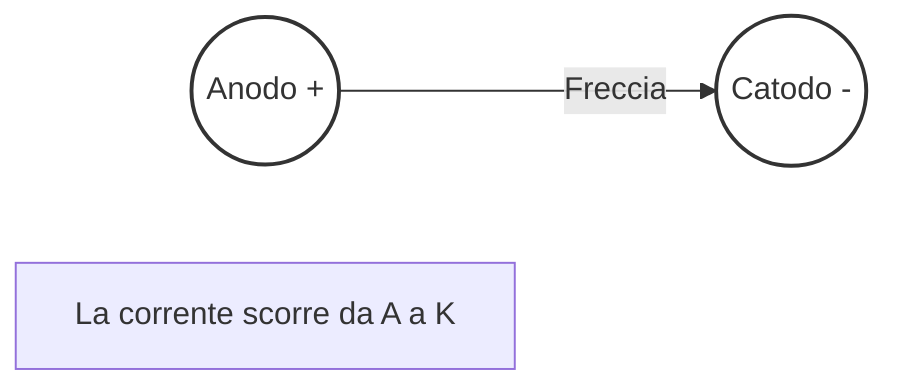

# 2.5 Diodo: La Valvola Unidirezionale ➡️

Il **diodo** è un componente semiconduttore che permette il passaggio della corrente in una sola direzione. Funziona come una valvola di ritegno idraulica.

## 🧱 Che cos'è un Diodo?

È formato da una giunzione **P-N**: un cristallo semiconduttore drogato positivamente (P) unito a uno drogato negativamente (N).

- **Anodo (A)**: Terminale positivo (P).
- **Catodo (K)**: Terminale negativo (N), spesso segnato con una fascia sul corpo del componente.

- **Simbolo**:
  - Una freccia che tocca una barra. La freccia indica il verso della corrente convenzionale.

### Diagramma del Simbolo

## ⚡ Polarizzazione

1.  **Diretta (Forward Bias)**: Tensione Anodo > Catodo. Il diodo conduce.
    - C'è una caduta di tensione tipica: **0.7V** per il silicio, **0.3V** per il germanio.
2.  **Inversa (Reverse Bias)**: Tensione Anodo < Catodo. Il diodo blocca la corrente (circuito aperto).

## 🏭 Tipi di Diodi

- **Raddrizzatore**: Per convertire AC in DC (es. 1N4007).
- **Zener**: Progettato per lavorare in inversa a una tensione precisa (Vz). Usato come stabilizzatore di tensione.
- **LED (Light Emitting Diode)**: Emette luce quando attraversato da corrente.
- **Varicap**: Funziona come un condensatore variabile controllato in tensione.

## 🔄 Raddrizzamento

Il diodo è fondamentale per trasformare la corrente alternata (AC) in continua (DC).

- **Raddrizzatore a semionda**: Usa un solo diodo, taglia metà dell'onda.
- **Ponte di Graetz (4 diodi)**: Raddrizza entrambe le semionde (onda intera).

## 🧠 Quiz di Ripasso

### Domanda 1: Qual è la caduta di tensione tipica di un diodo al silicio?
- A) 0.2 V
- B) 0.7 V
- C) 1.5 V

  
Risposta

  
<strong>B) 0.7 V</strong>

  
È la soglia standard per i diodi al silicio.

### Domanda 2: Se collego un diodo al contrario (polarizzazione inversa)...
- A) Conduce molta corrente
- B) Si illumina
- C) Non conduce corrente

  
Risposta

  
<strong>C) Non conduce corrente</strong>

  
Blocca il flusso, a meno che non si superi la tensione di breakdown.

### Domanda 3: A cosa serve un diodo Zener?
- A) A emettere luce
- B) A stabilizzare la tensione
- C) A amplificare il segnale

  
Risposta

  
<strong>B) A stabilizzare la tensione</strong>

  
Mantiene una tensione costante ai suoi capi quando polarizzato inversamente.

---
[Torna al README](../../README.md) | [Precedente: 2.4 Trasformatore](./2.4_Trasformatore.md) | [Successivo: 2.6 Transistor](./2.6_Transistor.md)