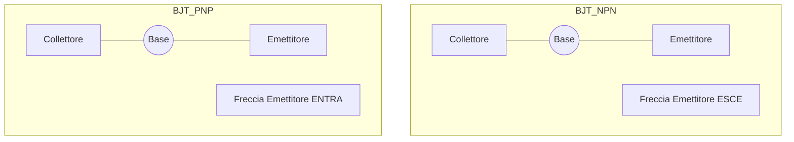

# 2.6 Transistor: L'Amplificatore e Interruttore 📶

Il **transistor** è il componente attivo fondamentale dell'elettronica moderna. Può amplificare segnali o funzionare come interruttore controllato.

## 🧱 Che cos'è un Transistor?

È un dispositivo a semiconduttore con tre terminali. Controllando la corrente (o tensione) su un terminale, si regola il flusso di corrente tra gli altri due.

### Tipi Principali

1.  **BJT (Bipolar Junction Transistor)**: Controllato in corrente.
    - Terminali: Base (B), Collettore (C), Emettitore (E).
    - Tipi: NPN, PNP.
2.  **FET (Field Effect Transistor)**: Controllato in tensione.
    - Terminali: Gate (G), Drain (D), Source (S).
    - Tipi: JFET, MOSFET.

### Diagramma dei Simboli

## ⚡ Funzionamento del BJT

Immagina il BJT come un rubinetto:
- **Base**: La manopola. Una piccola corrente qui apre il flusso.
- **Collettore**: L'ingresso dell'acqua.
- **Emettitore**: L'uscita dell'acqua.

Relazione fondamentale:
$$I_C = \beta \times I_B$$
Dove $\beta$ (o $h_{FE}$) è il guadagno di corrente (tipicamente 100-300). Una piccola $I_B$ controlla una grande $I_C$.

## 🔄 Configurazioni di Amplificazione

1.  **Emettitore Comune (CE)**:
    - Guadagno di tensione e corrente alti.
    - Sfasamento 180° (inverte il segnale).
    - Uso: Amplificatori audio, RF.
2.  **Base Comune (CB)**:
    - Guadagno tensione alto, corrente < 1.
    - Bassa impedenza ingresso, alta uscita.
    - Uso: Amplificatori RF VHF/UHF.
3.  **Collettore Comune (CC) o Emettitore Follower**:
    - Guadagno tensione ≈ 1, corrente alto.
    - Alta impedenza ingresso, bassa uscita.
    - Uso: Buffer, adattamento impedenza.

## 🧠 Quiz di Ripasso

### Domanda 1: In un transistor NPN, la freccia dell'emettitore...
- A) Entra nella base
- B) Esce dalla base
- C) Non c'è freccia

  
Risposta

  
<strong>B) Esce dalla base</strong>

  
NPN: Not Pointing iN (Non punta dentro).

### Domanda 2: Quale configurazione inverte il segnale di 180°?
- A) Base Comune
- B) Collettore Comune
- C) Emettitore Comune

  
Risposta

  
<strong>C) Emettitore Comune</strong>

  
È la configurazione standard per amplificare e inverte la fase.

### Domanda 3: Il parametro Beta ($\beta$) rappresenta...
- A) La resistenza di base
- B) Il guadagno di corrente
- C) La tensione di breakdown

  
Risposta

  
<strong>B) Il guadagno di corrente</strong>

  
Rapporto tra corrente di collettore e di base ($I_C / I_B$).

---
[Torna al README](../../README.md) | [Precedente: 2.5 Diodo](./2.5_Diodo.md) | [Successivo: 2.7 Valvole e Integrati](./2.7_Valvole_e_Integrati.md)