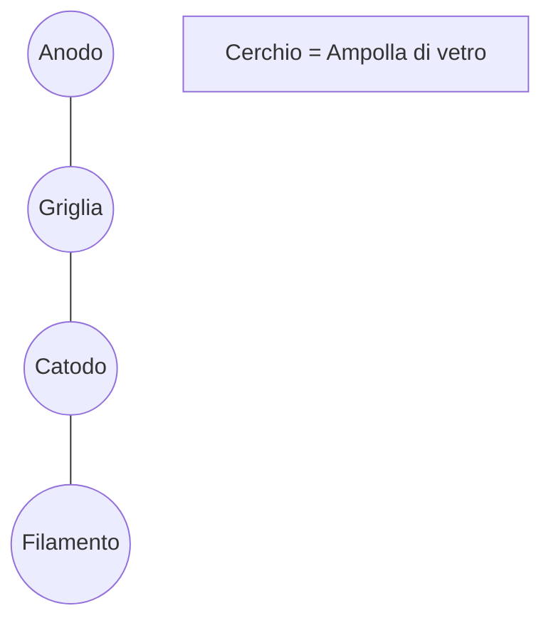
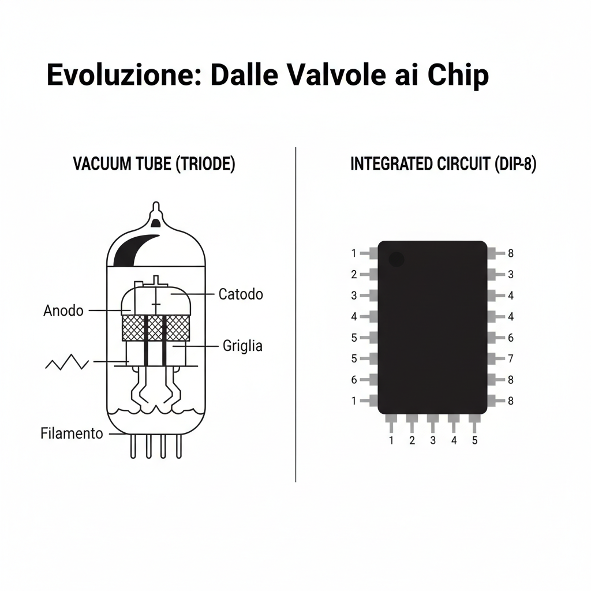

# 2.7 Valvole e Integrati: Il Passato e il Futuro 🕰️

In questo capitolo esploriamo due tecnologie agli antipodi: le **valvole termoioniche**, che hanno fatto la storia della radio, e i **circuiti integrati**, che sono il cuore dell'elettronica moderna.

## 💡 Valvole Termoioniche (Tubi a Vuoto)

Prima dei transistor, l'elettronica si basava sulle valvole. Sono ampolle di vetro sotto vuoto contenenti elettrodi.

### Funzionamento (Triodo)
Il **triodo** è la valvola amplificatrice fondamentale.
1.  **Catodo**: Riscaldato da un filamento, emette elettroni (effetto termoionico).
2.  **Griglia**: Una rete metallica che controlla il flusso di elettroni.
3.  **Anodo (Placca)**: Attira gli elettroni (tensione positiva alta).

- **Vantaggi**: Sopportano alte potenze e tensioni (usate ancora in amplificatori RF lineari ad alta potenza).
- **Svantaggi**: Ingombranti, scaldano molto, richiedono alte tensioni.

### Diagramma del Simbolo (Triodo)

## 💻 Circuiti Integrati (IC)

Un **Circuito Integrato** (o chip) contiene migliaia o milioni di transistor, resistori e condensatori in un unico pezzetto di silicio.

### Tipi Comuni
1.  **Analogici**: Es. Amplificatori Operazionali (Op-Amp).
2.  **Digitali**: Es. Porte logiche, Microprocessori.
3.  **Misti**: Convertitori Analogico-Digitale (ADC).

### L'Amplificatore Operazionale (Op-Amp)
È un blocco fondamentale. Ha due ingressi e un'uscita.
- **Ingresso Invertente (-)**
- **Ingresso Non Invertente (+)**
- **Uscita**

$$V_{out} = A \times (V_+ - V_-)$$
Dove A è il guadagno (enorme, teoricamente infinito).

## 🧠 Quiz di Ripasso

### Domanda 1: Qual è la funzione della griglia in un triodo?
- A) Emettere elettroni
- B) Controllare il flusso di elettroni
- C) Riscaldare la valvola

  
Risposta

  
<strong>B) Controllare il flusso di elettroni</strong>

  
Agisce come la base di un transistor o il rubinetto.

### Domanda 2: I circuiti integrati sono fatti principalmente di...
- A) Rame
- B) Silicio
- C) Vetro

  
Risposta

  
<strong>B) Silicio</strong>

  
È il materiale semiconduttore base.

### Domanda 3: Un amplificatore operazionale ha...
- A) Un ingresso e due uscite
- B) Due ingressi e un'uscita
- C) Tre ingressi

  
Risposta

  
<strong>B) Due ingressi e un'uscita</strong>

  
Invertente e non invertente.

---
[Torna al README](../../README.md) | [Precedente: 2.6 Transistor](./2.6_Transistor.md) | [Successivo: 3.1 Circuiti Risonanti](../03_Circuiti/3.1_Circuiti_risonanti.md)