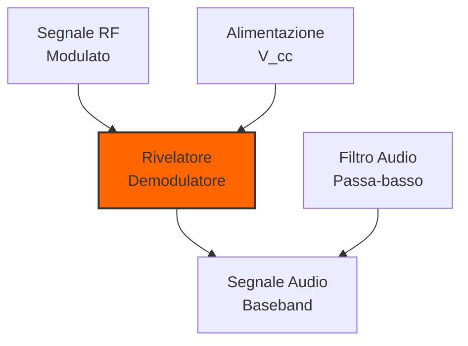
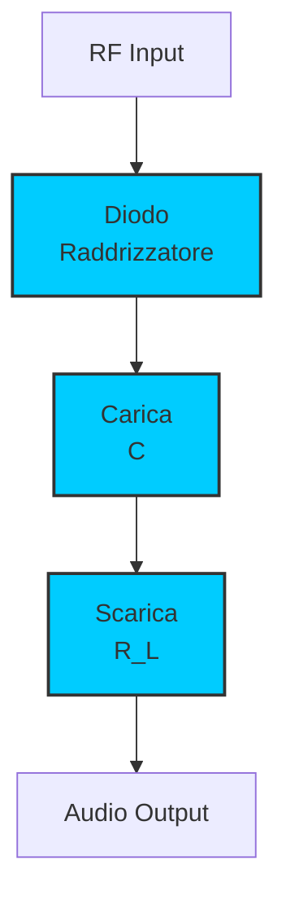
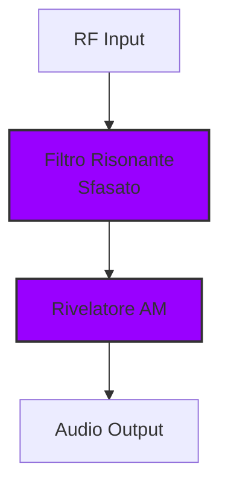
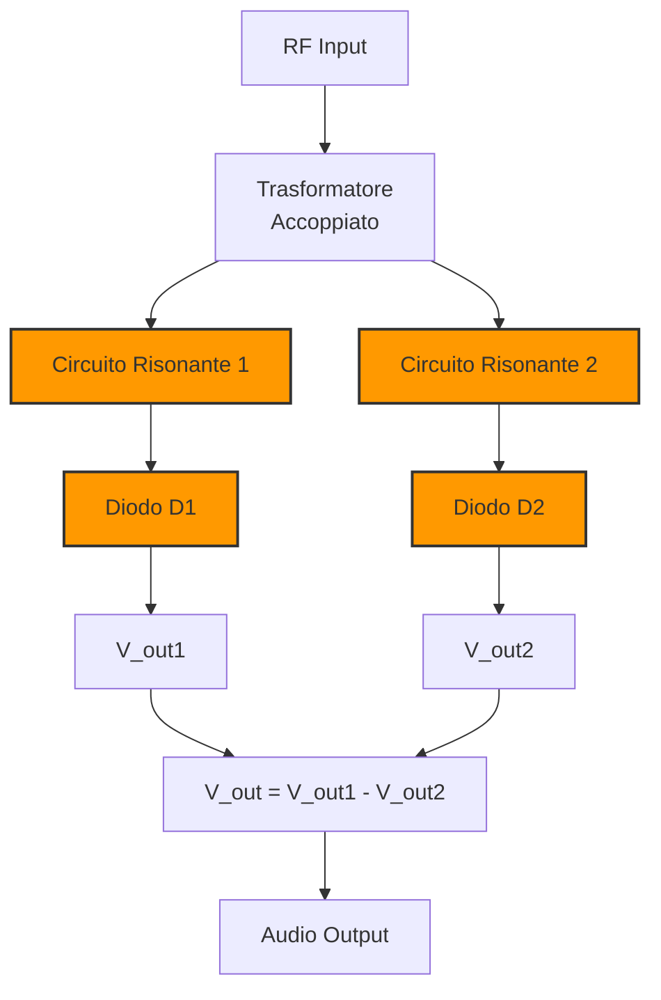
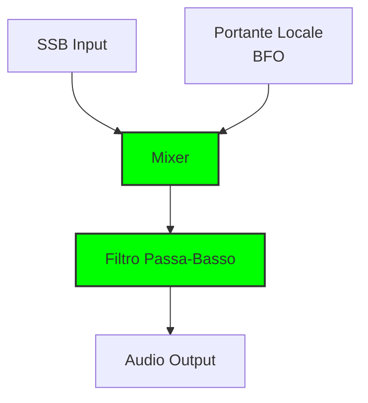

# 3.5 Rivelatori: Gli Estrattori di Informazione 📻

Benvenuti nel mondo affascinante dei rivelatori! Immaginate un rivelatore come un "decodificatore" che estrae l'informazione utile (audio, dati) da un'onda portante ad alta frequenza. Scoprimo come questi circuiti essenziali permettono ai ricevitori radio di trasformare segnali RF in suoni e dati comprensibili!

## 📻 Cos'è un Rivelatore?

Un **rivelatore** (o detector) è un circuito che estrae il segnale di modulazione da un'onda portante modulata, convertendolo nella sua forma originale.

- **Funzione principale**: Demodulazione (estrazione informazione)
- **Input**: Segnale RF modulato (AM, FM, PM)
- **Output**: Segnale baseband (audio, dati)
- **Componente chiave**: Diodi, transistor, circuiti risonanti

### Diagramma di un Rivelatore

## 📡 Rivelatori di Modulazione di Ampiezza (AM)

Gli AM rivelatori estraggono l'informazione dalle variazioni di ampiezza del segnale.

### Rivelatore a Diodo
Il più semplice e comune rivelatore AM.

**Principio**: Raddrizzamento semionda + filtraggio

### Circuito Rivelatore a Diodo

### Rivelatore AM a Diodo

**Componenti**:
- **Diodo**: Raddrizzatore (germanio o Schottky per efficienza)
- **Capacitore**: Memorizza il picco di tensione
- **Resistore**: Carico, determina costante di tempo

**Formule chiave**:
- **Tensione di uscita**: V_out ≈ V_p - 0.7V (per diodo Si)
- **Costante di tempo**: τ = R_L × C
- **Condizione**: τ >> 1/f_portante

### Rivelatore a Prodotto
Usa moltiplicazione con segnale di riferimento locale.

**V_out = V_RF × V_ref**

**Vantaggi**:
- Maggiore sensibilità
- Migliore rapporto segnale/rumore
- Linearità superiore

### Rivelatore AM a Prodotto

### Rivelatore Sincrono
Versione migliorata del rivelatore a prodotto con riferimento perfettamente sincronizzato.

**Vantaggi**:
- Massima sensibilità
- Ottima linearità
- Complessità maggiore

## 🎵 Rivelatori di Modulazione di Frequenza (FM)

Gli FM rivelatori estraggono l'informazione dalle variazioni di frequenza del segnale.

### Rivelatore a Pendenza (Slope Detector)
Converte variazioni di frequenza in variazioni di ampiezza.

**Principio**: Filtro risonante sfasato + rivelatore AM

### Circuito Rivelatore a Pendenza

### Rivelatore FM a Pendenza

**Caratteristiche**:
- **Linearità**: Limitata a piccole deviazioni
- **Sensibilità**: Moderata
- **Semplicità**: Molto semplice

### Discriminatore Foster-Seeley
Il rivelatore FM più classico e affidabile.

**Principio**: Due circuiti risonanti sfasati + rivelatori a diodo

### Circuito Foster-Seeley

### Rivelatore Foster-Seeley

**Componenti**:
- **Trasformatore**: Accoppiamento e sfasamento
- **Circuiti risonanti**: Due circuiti LC sfasati di 90°
- **Diodi**: Rivelatori a diodo
- **Carichi differenziali**: Estrazione del segnale

**Vantaggi**:
- Ottima linearità
- Alta sensibilità
- Affidabilità provata

### Rivelatore Ratio
Versione migliorata del Foster-Seeley con migliore linearità.

**Differenze principali**:
- Accoppiamento capacitivo invece di induttivo
- Migliore stabilità termica
- Linearità superiore

### Rivelatore Quadrature
Usa due segnali in quadratura (90° sfasati).

**Vantaggi**:
- Eccellente linearità
- Bassa distorsione
- Complessità maggiore

## 📊 Confronto Rivelatori AM vs FM

| Caratteristica | AM Rivelatori | FM Rivelatori |
|----------------|----------------|----------------|
| **Sensibilità** | Moderata | Alta |
| **Linearità** | Buona | Eccellente |
| **Rapporto S/N** | Medio | Buono |
| **Complessità** | Bassa | Alta |
| **Costo** | Basso | Medio-Alto |

## 📠 Rivelatori per Telegrafia (CW)

### Rivelatore a Banda Laterale (SSB)
Per segnali a banda laterale singola.

**Principio**: Reinserimento della portante mancante + rivelazione AM

### Circuito Rivelatore SSB

### Rivelatore SSB con BFO

**Componenti essenziali**:
- **BFO (Beat Frequency Oscillator)**: Genera portante locale
- **Mixer**: Mescola segnale SSB con portante
- **Filtro**: Rimuove componenti ad alta frequenza

### Rivelatore di Prodotti per CW
Usa moltiplicazione per rivelare segnali telegrafici.

**Vantaggi**:
- Eccellente sensibilità
- Basso rumore
- Ideale per segnali deboli

## 🔧 Parametri dei Rivelatori

### Sensibilità
Minimo segnale rilevabile con rapporto S/N accettabile.

- **AM**: Tipicamente -100 to -120 dBm
- **FM**: Tipicamente -110 to -130 dBm
- **SSB**: Tipicamente -120 to -140 dBm

### Selettività
Capacità di separare segnali vicini.

- **Fattore di forma**: Rapporto tra attenuazione a 10kHz e 2×BW
- **Valori tipici**: 2:1 a 10:1

### Linearità
Massima deviazione senza distorsione significativa.

- **AM**: THD < 1-5%
- **FM**: Deviazione massima ±75kHz (broadcast)
- **SSB**: THD < 1%

## 🎯 Applicazioni Pratiche

### 1. Ricevitori AM Broadcast
- **Banda**: 530-1700 kHz
- **Rivelatore**: A diodo (semplice, economico)
- **Requisiti**: Buona sensibilità, basso costo

### 2. Ricevitori FM Broadcast
- **Banda**: 88-108 MHz
- **Rivelatore**: Foster-Seeley o Ratio
- **Requisiti**: Alta linearità, bassa distorsione

### 3. Ricevitori SSB/HF
- **Banda**: 1.8-30 MHz
- **Rivelatore**: Prodotto con BFO
- **Requisiti**: Altissima sensibilità, basso rumore

### 4. Ricevitori VHF/UHF
- **Banda**: 30MHz-3GHz
- **Rivelatore**: Quadrature o PLL
- **Requisiti**: Stabilità, linearità

### Diagramma a Blocchi Ricevitore

## 🧪 Rumore e Distorsione

### Figure di Rumore
Rapporto segnale/rumore all'ingresso del rivelatore.

- **AM**: NF tipico 6-10dB
- **FM**: NF tipico 4-8dB
- **SSB**: NF tipico 2-6dB

### Tipi di Distorsione
1. **Armonica**: Non linearità crea armoniche
2. **Intermodulazione**: Interazione tra frequenze
3. **Crossover**: Distorsione al passaggio per zero
4. **AM-FM**: Conversione involontaria AM→FM

## 📱 Evoluzione dei Rivelatori

### Rivelatori Analogici
- **Diodi**: Semplici, affidabili
- **Transistor**: Maggiore guadagno
- **Valvole**: Alta potenza, basso rumore

### Rivelatori Digitali
- **DSP**: Elaborazione digitale del segnale
- **SDR**: Software Defined Radio
- **Vantaggi**: Flessibilità, prestazioni superiori

## 🧠 Quiz di Ripasso

Testa le tue conoscenze sui rivelatori!

### Domanda 1: Un rivelatore AM a diodo estrae...
- A) Variazioni di frequenza
- B) Variazioni di ampiezza
- C) Variazioni di fase

  
Risposta

  
<strong>B) Variazioni di ampiezza</strong>

  
Il rivelatore AM rileva le variazioni di ampiezza della portante.

### Domanda 2: Quale rivelatore FM usa due circuiti risonanti sfasati?
- A) Rivelatore a pendenza
- B) Foster-Seeley
- C) Rivelatore a prodotto

  
Risposta

  
<strong>B) Foster-Seeley</strong>

  
Usa due circuiti LC sfasati di 90° con rivelatori a diodo.

### Domanda 3: Per ricevere segnali SSB serve...
- A) Solo un rivelatore AM
- B) Un BFO e un mixer
- C) Un rivelatore FM

  
Risposta

  
<strong>B) Un BFO e un mixer</strong>

  
Il BFO reinserisce la portante mancante per la rivelazione.

### Domanda 4: Un rivelatore a pendenza ha quale caratteristica principale?
- A) Alta sensibilità
- B) Linearità limitata
- C) Basso costo

  
Risposta

  
<strong>B) Linearità limitata</strong>

  
Funziona bene solo per piccole deviazioni di frequenza.

### Domanda 5: Quale tipo di rivelatore ha la sensibilità più alta?
- A) AM a diodo
- B) FM Foster-Seeley
- C) SSB a prodotto

  
Risposta

  
<strong>C) SSB a prodotto</strong>

  
Tipicamente -120 to -140 dBm, la più alta sensibilità.

## Conclusione

I rivelatori sono gli estrattori di informazione essenziali in radio! Dal semplice rivelatore AM a diodo al complesso Foster-Seeley FM, capire come funzionano è fondamentale per ogni radioamatore. Scegli il tipo giusto basandoti sulla modulazione, sensibilità richiesta e linearità necessaria. Ricorda sempre: un buon rivelatore fa la differenza tra sentire e capire! 📻

---
[Torna al README](../../README.md) | [Precedente: 3.4 Amplificatori](./3.4_Amplificatori.md) | [Successivo: 3.6 Oscillatori](./3.6_Oscillatori.md)