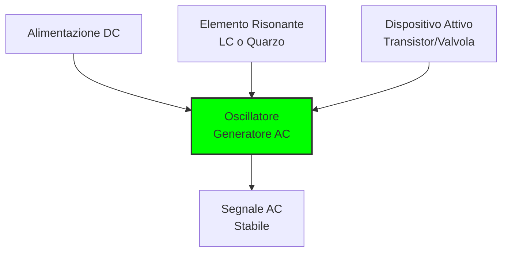
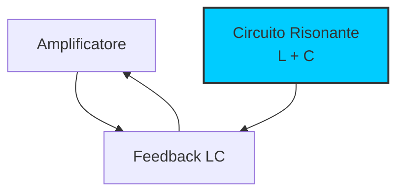
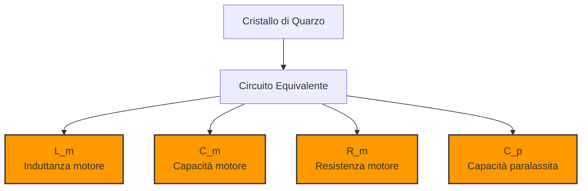

# 3.6 Oscillatori: I Generatori di Frequenza 🔄

Benvenuti nel mondo magico degli oscillatori! Immaginate un oscillatore come un "motore elettrico" che genera onde perfette e stabili, essenziali per ogni trasmissione radio e per molti circuiti di sincronizzazione. Scopriamo come questi circuiti incredibili creano le frequenze che permettono alla radio di connettere il mondo!

## 🔄 Cos'è un Oscillatore?

Un **oscillatore** è un circuito che genera un segnale periodico (sinusoidale) senza bisogno di un segnale di input esterno, convertendo energia DC in energia AC a una frequenza specifica.

- **Funzione principale**: Generare segnali AC stabili
- **Input**: Energia DC (alimentazione)
- **Output**: Segnale AC sinusoidale
- **Componente chiave**: Elementi risonanti + dispositivo attivo

### Diagramma di un Oscillatore

## ⚖️ Condizioni di Oscillazione

Perché un circuito oscilli, deve soddisfare il **criterio di Barkhausen**:

### Criterio di Barkhausen
1. **Guadagno in anello ≥ 1**: |Aβ| ≥ 1
2. **Fase totale = 0° (o 360°)**: ∠Aβ = 0° + 360°n

Dove:
- **A**: Guadagno dell'amplificatore
- **β**: Fattore di feedback (reazione)
- **n**: Intero (0, 1, 2, ...)

### Stabilità dell'Oscillazione
- **Avvio**: |Aβ| > 1 (per avviare l'oscillazione)
- **Regime**: |Aβ| = 1 (per mantenere l'ampiezza costante)
- **Non linearità**: Limita l'ampiezza automaticamente

## 🎛️ Oscillatore LC

Il più semplice e comune tipo di oscillatore RF.

### Circuito Base LC

### Oscillatore LC Base

### Frequenza di Oscillazione
**f₀ = 1/(2π√(LC))**

Dove:
- **L**: Induttanza (Henry)
- **C**: Capacità (Farad)

### Circuito Risonante LC

### Fattori di Stabilità
1. **Stabilità dei componenti**: Variazioni con temperatura
2. **Q del circuito risonante**: Q più alto = maggiore stabilità
3. **Alimentazione**: Rumore e variazioni di tensione
4. **Carico**: Variazioni di impedenza

### Tipi di Oscillatori LC

#### Oscillatore Colpitts
Configurazione molto comune e stabile.

**Caratteristiche**:
- **Feedback**: Capacitivo
- **Stabilità**: Eccellente
- **Frequenza**: Fino a centinaia di MHz

#### Oscillatore Hartley
Simile al Colpitts ma con induttore partizionato.

**Caratteristiche**:
- **Feedback**: Induttivo
- **Stabilità**: Buona
- **Frequenza**: Fino a decine di MHz

#### Oscillatore Clapp
Variante migliorata del Colpitts.

**Caratteristiche**:
- **Feedback**: Capacitivo con C in serie
- **Stabilità**: Eccellente
- **Frequenza**: Molto stabile

## 💎 Oscillatore a Quarzo

Usa le proprietà piezoelettriche del cristallo di quarzo per massima stabilità.

### Principio del Quarzo
Il quarzo vibra meccanicamente quando viene applicato un campo elettrico, e viceversa.

### Circuito Equivalente del Quarzo

### Oscillatore a Quarzo Base

### Parametri del Quarzo
- **L_m**: Induttanza motore (molto alta)
- **C_m**: Capacità motore (molto piccola)
- **C_p**: Capacità paralassita (piccola)
- **R_m**: Resistenza motore (bassa)
- **Q**: Fattore di merito (10⁴ - 10⁶)

### Circuito Equivalente del Cristallo

### Vantaggi del Quarzo
- **Stabilità termica**: Eccellente (±0.001%)
- **Precisione frequenza**: Altissima
- **Q elevato**: Selettività eccezionale
- **Dimensioni**: Compatti

### Svantaggi del Quarzo
- **Costo**: Elevato
- **Potenza**: Limitata
- **Frequenza fissa**: Non facilmente variabile

## 📊 Oscillatori su Frequenze Armoniche

Gli oscillatori possono operare su armoniche della frequenza fondamentale.

### Armoniche
- **Fondamentale**: f₀
- **2° armonica**: 2f₀
- **3° armonica**: 3f₀
- **n° armonica**: nf₀

### Oscillatori a Moltiplicatore
Usano circuiti non lineari per generare armoniche.

**Vantaggi**:
- Frequenze più alte con componenti più piccoli
- Maggiore stabilità ad alta frequenza
- Separazione tra oscillatore e carico

### Oscillatori PLL (Phase-Locked Loop)
Sistemi moderni che usano feedback di fase per sincronizzazione.

**Componenti**:
- **VCO (Voltage Controlled Oscillator)**: Oscillatore controllato in tensione
- **Phase Detector**: Confrontatore di fase
- **Loop Filter**: Filtro passa-basso
- **Frequency Divider**: Divisore di frequenza

## 🔧 Fattori che Influenzano la Frequenza

### 1. Temperatura
Variazioni di temperatura cambiano i valori dei componenti.

**Coefficiente di temperatura**:
- **Induttori**: ±50 a ±200 ppm/°C
- **Condensatori**: ±30 a ±100 ppm/°C
- **Quarzi**: ±10 a ±50 ppm/°C

### 2. Alimentazione
Rumore e variazioni di V_cc influenzano la frequenza.

**PSRR (Power Supply Rejection Ratio)**: Importante per stabilità

### 3. Carico
Variazioni di impedenza del carico possono "tirare" la frequenza.

**Isolamento**: Buffer o stadio di uscita necessario

### 4. Vibrazioni Meccaniche
Gli oscillatori sono sensibili alle vibrazioni.

**Soluzioni**: Montaggio meccanico stabile, isolamento

## 📈 Stabilità e Deriva

### Deriva a Lungo Termine
Variazione di frequenza nel tempo (ore, giorni).

**Tipici**:
- **Oscillatori LC**: ±100 a ±1000 ppm
- **Oscillatori TCXO**: ±1 a ±10 ppm
- **Oscillatori OCXO**: ±0.1 a ±1 ppm

### Deriva a Breve Termine
Variazione di frequenza in secondi/ minuti.

**Cause**: Riscaldamento, fluttuazioni ambientali

### Jitter
Variazioni temporali del periodo dell'onda.

**Importanza**: Critica in sistemi digitali e sincronizzazione

## 🎯 Tipi di Oscillatori per Applicazioni Specifiche

### 1. VFO (Variable Frequency Oscillator)
- **Uso**: Sintonia manuale ricevitori
- **Requisiti**: Buona stabilità, variazione facile
- **Tipi**: LC, varactor

### 2. LO (Local Oscillator)
- **Uso**: Mixer in ricevitori/trasmittori
- **Requisiti**: Altissima stabilità, basso rumore
- **Tipi**: Quarzo, PLL, sintetizzatori

### 3. BFO (Beat Frequency Oscillator)
- **Uso**: Rivelatori SSB/CW
- **Requisiti**: Stabilità moderata, variazione fine
- **Tipi**: LC, quarzo

### 4. Reference Oscillator
- **Uso**: Sincronizzazione sistemi, strumenti
- **Requisiti**: Massima stabilità, precisione assoluta
- **Tipi**: OCXO, rubidio, cesio

### VCO Base

## 📊 Tabella Comparativa Oscillatori

| Tipo | Frequenza | Stabilità | Costo | Applicazione |
|------|-----------|------------|-------|--------------|
| **LC** | 1kHz-100MHz | Bassa | Basso | Generale, VFO |
| **Colpitts** | 1MHz-500MHz | Media | Medio | RF, LO |
| **Quarzo (XO)** | 10kHz-100MHz | Alta | Medio | Reference, BFO |
| **TCXO** | 1MHz-100MHz | Molto alta | Alto | Mobile, GPS |
| **OCXO** | 1MHz-100MHz | Eccellente | Molto alto | Strumenti |
| **PLL** | 1kHz-10GHz | Variabile | Alto | Sintetizzatori |

## 🛡️ Tecniche di Stabilizzazione

### 1. Controllo della Temperatura
- **Oven Controlled**: Riscaldamento a temperatura costante
- **Temperature Compensated**: Correzione elettronica
- **Air Cooled**: Ventilazione forzata

### 2. Isolamento del Carico
- **Buffer stage**: Amplificatore separatore
- **Isolatore galvanico**: Trasformatore, optoaccoppiatore
- **Impedance matching**: Massimizza trasferimento di potenza

### 3. Alimentazione Stabile
- **Regolazione precisa**: Basso rumore, stabilità
- **Decoupling**: Condensatori di bypass
- **Filtraggio**: Rimozione rumore e ripple

## 🧪 Rumore negli Oscillatori

### Fonti di Rumore
1. **Termico**: Rumore di Johnson-Nyquist
2. **Shot**: Rumore dei dispositivi attivi
3. **Flicker**: Rumore 1/f (bassa frequenza)
4. **Phase noise**: Rumore di fase (critico in RF)

### Phase Noise
Rumore di fase misurato in dBc/Hz a offset dalla portante.

**Valori tipici**:
- **Oscillatori LC**: -80 a -100 dBc/Hz @ 10kHz
- **Oscillatori quarzo**: -120 a -140 dBc/Hz @ 10kHz
- **Oscillatori sintetizzati**: -90 a -110 dBc/Hz @ 10kHz

## 🧠 Quiz di Ripasso

Testa le tue conoscenze sugli oscillatori!

### Domanda 1: Per l'oscillazione, il guadagno in anello deve essere...
- A) < 1
- B) = 1
- C) ≥ 1

  
Risposta

  
<strong>C) ≥ 1</strong>

  
Per avviare l'oscillazione serve |Aβ| > 1, poi si stabilizza a = 1.

### Domanda 2: Un oscillatore LC con L=10μH e C=100pF oscilla a circa...
- A) 5kHz
- B) 50kHz
- C) 500kHz

  
Risposta

  
<strong>A) 5kHz</strong>

  
f₀ = 1/(2π√(10×10⁻⁶ × 100×10⁻¹²)) ≈ 5kHz

### Domanda 3: Quale tipo di oscillatore ha la stabilità più alta?
- A) LC
- B) Quarzo
- C) Hartley

  
Risposta

  
<strong>B) Quarzo</strong>

  
Il quarzo ha Q fino a 10⁶ e stabilità termica eccellente.

### Domanda 4: Il criterio di Barkhausen richiede fase totale di...
- A) 0°
- B) 90°
- C) 180°

  
Risposta

  
<strong>A) 0°</strong>

  
Serve fase totale di 0° (o 360°n) per feedback positivo.

### Domanda 5: Un TCXO ha tipicamente quale deriva di temperatura?
- A) ±100 ppm
- B) ±10 ppm
- C) ±1 ppm

  
Risposta

  
<strong>B) ±10 ppm</strong>

  
TCXO = Temperature Compensated Crystal Oscillator.

## Conclusione

Gli oscillatori sono i motori dell'elettronica RF! Dal semplice LC al quarzo ultra-stabile, questi circuiti generano le frequenze che rendono possibile la comunicazione radio. Capire i principi di oscillazione, stabilità e rumore è essenziale per ogni radioamatore. Scegli il tipo giusto basandoti su stabilità, frequenza e applicazione specifica! 🔄

---
[Torna al README](https://github.com/giangio/esame-radioamatori/blob/main/README.md) | [Precedente: 3.5 Rivelatori](./3.5_Rivelatori.md) | [Successivo: 3.7 Circuiti ad Aggancio di Fase](./3.7_Circuiti_ad_aggancio_di_fase.md)