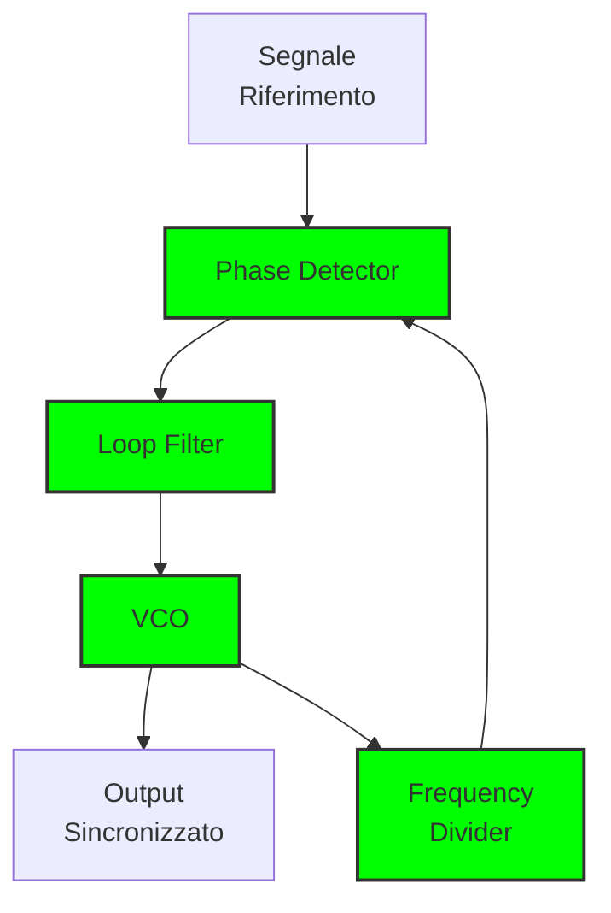

# 3.7 Circuiti ad Aggancio di Fase (PLL) 🎯

Benvenuti nel mondo affascinante dei PLL! Immaginate un PLL come un "pilota automatico" che mantiene un'onda perfettamente sincronizzata con un riferimento, anche se ci sono disturbi o variazioni. Scopriamo come questi circuiti intelligenti permettono ai ricevitori moderni di sintonizzare con precisione millimetrica e ai sintetizzatori di generare migliaia di frequenze stabili!

## 🎯 Cos'è un PLL (Phase-Locked Loop)?

Un **PLL** è un sistema di controllo a retroazione che sincronizza la fase e la frequenza di un oscillatore controllato (VCO) con un segnale di riferimento.

- **Funzione principale**: Sincronizzazione e moltiplicazione di frequenza
- **Input**: Segnale di riferimento stabile
- **Output**: Segnale sincronizzato e/o moltiplicato
- **Componente chiave**: Phase detector, loop filter, VCO, frequency divider

### Diagramma di un PLL

### PLL Base

## ⚙️ Componenti Principali del PLL

### 1. Phase Detector (Rivelatore di Fase)
Confronta la fase tra segnale di riferimento e segnale di feedback.

**Tipi comuni**:
- **Moltiplicatore analogico**: Mescola i due segnali
- **Digital (XOR)**: Confronta digitale delle fasi
- **Frequency/Phase detector**: Per segnali digitali

**Uscita**: Tensione proporzionale all'errore di fase

### Phase Detector PLL

### 2. Loop Filter (Filtro di Anello)
Filtra la tensione di errore di fase e stabilizza il sistema.

**Caratteristiche**:
- **Tipo**: Passa-basso (tipicamente 1° o 2° ordine)
- **Funzione**: Rimuove rumore, stabilizza il loop
- **Parametri**: Frequenza di taglio, smorzamento

### Loop Filter per PLL

### 3. VCO (Voltage Controlled Oscillator)
Oscillatore controllato in tensione che genera la frequenza di uscita.

**Relazione**: f_out = f_0 + K_v × V_control

Dove:
- **f_0**: Frequenza centrale (senza controllo)
- **K_v**: Sensibilità (Hz/V)
- **V_control**: Tensione di controllo

### VCO per PLL

### 4. Frequency Divider (Divisore di Frequenza)
Divide la frequenza di uscita per il confronto con il riferimento.

**Relazione**: f_feedback = f_out / N

Dove **N** è il rapporto di divisione (intero)

## 🔄 Funzionamento del PLL

### 1. Fase di Lock (Blocco)
Il PLL è sincronizzato e l'errore di fase è costante.

**Condizioni**:
- f_out = N × f_ref
- Δφ = costante
- Uscita del VCO stabile

### 2. Fase di Acquisizione (Acquisition)
Il PLL sta cercando di sincronizzarsi con il riferimento.

**Processo**:
- Il VCO varia la frequenza
- Quando si avvicina al riferimento, il loop si blocca
- Tempo di acquisizione dipende dal loop filter

### 3. Fase di Hold (Mantenimento)
Il PLL mantiene la sincronizzazione anche se il riferimento viene temporaneamente perso.

**Durata**: Dipende dal condensatore nel loop filter

## 📊 Parametri Caratteristici del PLL

### Range di Lock (Gamma di Blocco)
Range di frequenze in cui il PLL può sincronizzarsi.

**Formula**: Δf_lock = ±f_ref × (K_v × K_pd × K_osc / N)

### Bandwidth (Larghezza di Banda)
Velocità con cui il PLL risponde a variazioni.

**Tipici**:
- **Largo**: 10kHz - 1MHz (risposta rapida)
- **Stretto**: 1Hz - 10kHz (risposta lenta, stabilità alta)

### Phase Margin
Margine di stabilità del sistema.

**Valori tipici**: 30° - 60°

### Lock Time
Tempo necessario per acquisire il blocco.

**Formula**: t_lock ≈ 1/(2π × BW)

## 🎛️ Tipi di PLL

### 1. PLL Analogico
Usa componenti analogici per tutto il loop.

**Vantaggi**:
- Basso rumore di fase
- Buona linearità
- Risposta rapida

**Svantaggi**:
- Costo elevato
- Dimensioni maggiori
- Limiti di frequenza

### 2. PLL Digitale (DPLL)
Usa circuiti digitali per phase detection e divisione.

**Vantaggi**:
- Costo ridotto
- Dimensioni compatte
- Frequenze più alte
- Programmabilità

**Svantaggi**:
- Rumore di quantizzazione
- Limiti di risoluzione
- Jitter maggiore

### 3. Mixed-Mode PLL
Combina sezioni analogiche e digitali.

**Vantaggi**:
- Buon compromesso prestazioni/costo
- Flessibilità di progettazione
- Ottimo per molte applicazioni

### 4. Fractional-N PLL
Usa divisori di frequenza non interi.

**Vantaggi**:
- Risoluzione di frequenza elevata
- Canali stretti con riferimento basso
- Sintesi diretta

**Svantaggi**:
- Spurie frazionarie
- Complessità maggiore

## 📱 Applicazioni dei PLL

### 1. Sintetizzatori di Frequenza
Generano molteplici frequenze da un singolo riferimento.

**Architettura tipica**:
- Riferimento: quarzo ad alta stabilità
- PLL principale: genera frequenza base
- PLL secondari: generano canali RF

### Sintetizzatore con PLL

### 2. Ricevitori Radio
Sintonizzazione precisa e stabile delle frequenze.

**Vantaggi**:
- Sintonizzazione digitale (senza meccanici)
- Stabilità termica superiore
- Memoria delle frequenze

### Clock Generator con PLL

### 3. Clock Generation
Generano clock per sistemi digitali e computer.

**Requisiti**:
- Basso jitter
- Bassa deriva
- Multipli fasi

### 4. Recupero di Clock
Estraggono clock da segnali dati seriali.

**Uso**: Comunicazioni seriali, reti, storage

## 🔧 Architetture Avanzate

### Dual-Modulus Prescaler
Permette divisione frazionaria con spurie ridotte.

**Principio**: Divisione alternata tra N e N+1

### Delta-Sigma PLL
Usa modulazione delta-sigma per alta risoluzione.

**Vantaggi**:
- Risoluzione molto alta
- Rumore di fase basso
- Spurie minime

### All-Digital PLL (ADPLL)
Completamente digitale, adatto per integrazione VLSI.

**Componenti**:
- Time-to-digital converter (TDC)
- Digital loop filter
- Digitally controlled oscillator (DCO)

## 📊 Tabella Comparativa PLL

| Tipo | Frequenza Max | Jitter | Costo | Applicazione |
|------|----------------|--------|-------|-------------|
| **Analogico** | 1-5GHz | Basso | Alto | RF professionale |
| **Digitale** | 10-100GHz | Medio | Basso | Integrati, mobile |
| **Mixed-Mode** | 1-10GHz | Basso-Medio | Medio | Generale |
| **Fractional-N** | 1-10GHz | Medio | Medio | Sintetizzatori |
| **ADPLL** | 1-20GHz | Basso | Basso | VLSI, SoC |

## 🛡️ Problemi Comuni e Soluzioni

### 1. Spurie Frazionarie
Frequenze indesiderate generate da divisioni non intere.

**Soluzioni**:
- Dual-modulus prescaler
- Delta-sigma modulation
- Filtri digitali

### 2. Jitter
Variazioni temporali del periodo dell'onda.

**Cause**:
- Rumore termico
- Rumore di fase
- Rumore di alimentazione

**Soluzioni**:
- Loop filter ottimizzato
- Alimentazione pulita
- VCO a basso rumore

### 3. Reference Spurs
Rumore del segnale di riferimento che appare nell'uscita.

**Soluzioni**:
- Reference pulito
- Shielding adeguato
- Filtraggio del riferimento

### 4. Cycle Slip
Perdita di cicli di clock in sistemi digitali.

**Soluzioni**:
- Clock data recovery (CDR)
- PLL con cycle slip detection
- Sincronizzazione esterna

## 🧪 Progettazione di un PLL

### 1. Specifiche del Progetto
- **Frequenza di uscita**: Range e risoluzione
- **Stabilità richiesta**: Deriva e jitter massimi
- **Tempo di lock**: Velocità di risposta richiesta
- **Costo e dimensioni**: Vincoli del progetto

### 2. Scelta dei Componenti
- **Phase detector**: Tipo e linearità
- **VCO**: Frequenza, sensibilità, rumore
- **Loop filter**: Tipo, frequenza di taglio
- **Divisori**: Massima frequenza, jitter

### 3. Simulazione e Test
- **Simulazione SPICE**: Verifica stabilità
- **Analisi di fase**: Margini di stabilità
- **Test di jitter**: Misurazione delle prestazioni
- **Test di lock**: Verifica del range di blocco

## 🧠 Quiz di Ripasso

Testa le tue conoscenze sui PLL!

### Domanda 1: Un PLL con N=100 e f_ref=10MHz genera quale frequenza?
- A) 100MHz
- B) 1GHz
- C) 10GHz

  
Risposta

  
<strong>B) 1GHz</strong>

  
f_out = N × f_ref = 100 × 10MHz = 1GHz

### Domanda 2: Quale componente confronta la fase nel PLL?
- A) VCO
- B) Loop filter
- C) Phase detector

  
Risposta

  
<strong>C) Phase detector</strong>

  
Il phase detector genera un'uscita proporzionale all'errore di fase.

### Domanda 3: Un PLL con bandwidth più larga ha...
- A) Risposta più rapida
- B) Maggiore stabilità
- C) Meno jitter

  
Risposta

  
<strong>A) Risposta più rapida</strong>

  
Bandwidth più larga = risposta più veloce ma stabilità ridotta.

### Domanda 4: Quale tipo di PLL ha il costo più basso?
- A) Analogico
- B) Digitale
- C) Mixed-mode

  
Risposta

  
<strong>B) Digitale</strong>

  
I PLL digitali sono più economici e compatti.

### Domanda 5: Il lock time è inversamente proporzionale a...
- A) Frequenza di riferimento
- B) Bandwidth del loop
- C) Guadagno del VCO

  
Risposta

  
<strong>B) Bandwidth del loop</strong>

  
t_lock ≈ 1/(2π × BW), quindi BW più grande = lock time più piccolo.

## Conclusione

I PLL sono i piloti automatici dell'elettronica moderna! Dalla semplice sincronizzazione di frequenze alla complessa sintesi di migliaia di canali, questi circuiti intelligenti sono essenziali per ogni sistema RF digitale. Capire i principi di blocco, acquisizione e mantenimento è fondamentale per ogni radioamatore moderno. Scegli l'architettura giusta basandoti su frequenza, stabilità e costi! 🎯

---
[Torna al README](https://github.com/giangio/esame-radioamatori/blob/main/README.md) | [Precedente: 3.6 Oscillatori](./3.6_Oscillatori.md) | [Successivo: 4.1 Tipi di Ricevitore](../04_Ricevitori/4.1_Tipi_di_ricevitore.md)