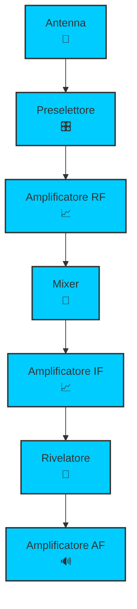
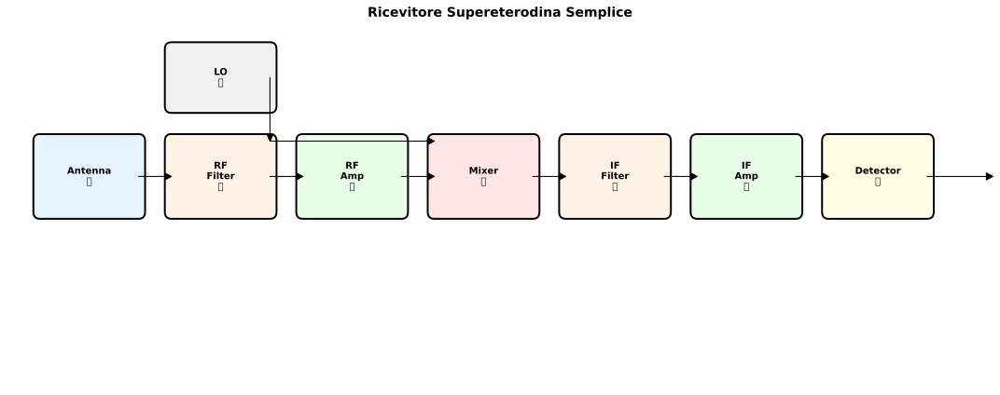
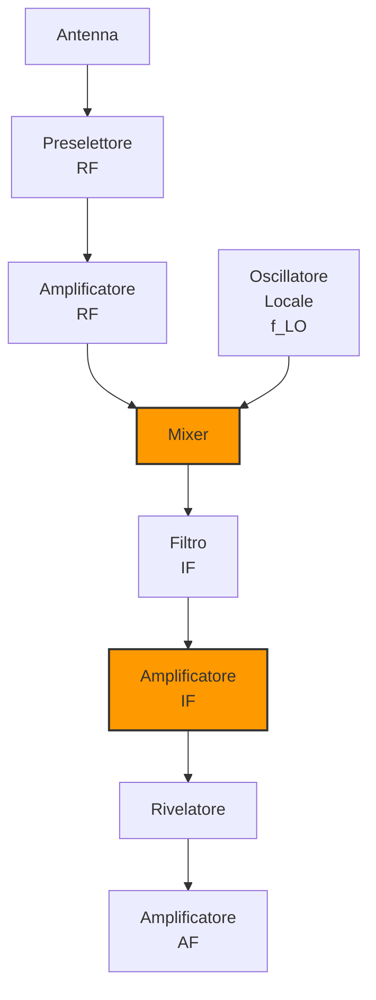
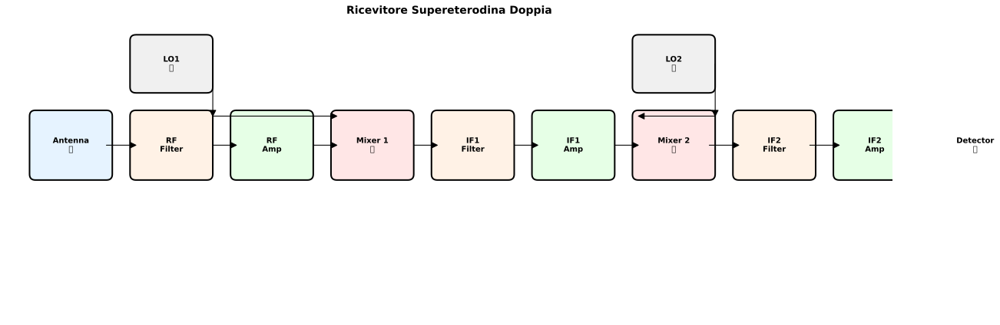
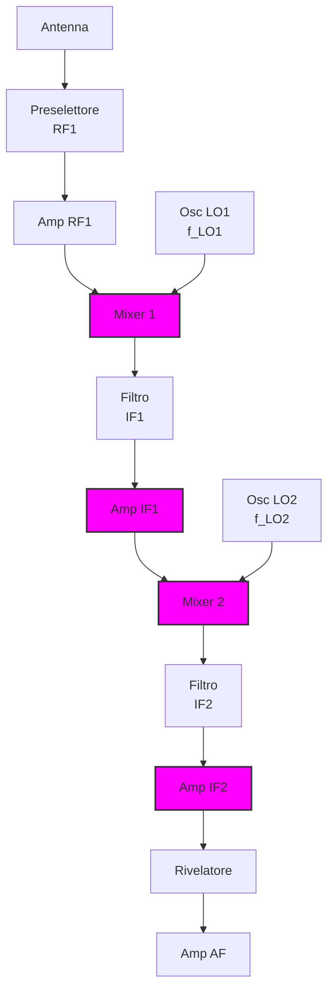

# 4.1 Tipi di Ricevitore: L'Arte di Ricevere Segnali 📻

Benvenuti nel mondo dei ricevitori radio! Immaginate un ricevitore come un "orecchio elettronico" che cattura, amplifica e demodula i segnali radio. Scopriamo i tipi principali di ricevitori, con particolare attenzione alla supereterodina che domina il mondo della radio moderna!

## 📻 Cos'è un Ricevitore Radio?

Un **ricevitore radio** è un dispositivo elettronico che:
- **Cattura** segnali radio dall'antenna
- **Seleziona** la frequenza desiderata
- **Amplifica** il segnale debole
- **Demodula** il segnale per estrarre l'informazione
- **Riproduce** audio o dati

### Diagramma Funzionale Base

## 🔄 Ricevitore a Supereterodina Semplice

Il **ricevitore supereterodina** è il tipo più comune e performante. Il principio si basa sulla **conversione di frequenza** per portare il segnale alla frequenza intermedia (IF).

### Principio di Funzionamento
1. **Segnale RF** in ingresso alla frequenza f_RF
2. **Oscillatore locale** genera f_LO
3. **Mixer** produce f_IF = |f_RF - f_LO|
4. **Amplificazione IF** a frequenza fissa
5. **Demodulazione** del segnale IF

### Vantaggi della Supereterodina
- **Selettività eccellente**: Filtro IF fisso e stabile
- **Sensibilità alta**: Amplificazione concentrata su una banda stretta
- **Facilità di sintonizzazione**: Cambio frequenza cambiando solo l'oscillatore locale
- **Stabilità**: Componenti IF stabili e precisi

### Svantaggi
- **Complessità**: Più componenti rispetto ai ricevitori diretti
- **Frequenza immagine**: Problema da risolvere
- **Costo**: Più elevato

### Diagramma a Blocchi Supereterodina Semplice

## 🔄🔄 Ricevitore a Supereterodina Doppia

La **supereterodina doppia** aggiunge un secondo stadio di conversione per migliorare le prestazioni, specialmente nelle gamme HF dove la frequenza immagine è problematica.

### Principio di Funzionamento
1. **Prima conversione**: f_RF → f_IF1 (alta frequenza IF)
2. **Seconda conversione**: f_IF1 → f_IF2 (bassa frequenza IF)
3. **Doppio filtraggio**: Migliore selettività e reiezione immagine

### Vantaggi della Supereterodina Doppia
- **Reiezione immagine eccellente**: Due stadi di filtraggio
- **Selettività superiore**: Banda IF più stretta possibile
- **Riduzione interferenze**: Miglior isolamento tra stadi
- **Stabilità migliorata**: Oscillatori separati

### Svantaggi
- **Complessità elevata**: Molti più componenti
- **Costo alto**: Circuiti aggiuntivi
- **Consumo energetico**: Più amplificatori
- **Debug complesso**: Più punti di guasto

### Diagramma a Blocchi Supereterodina Doppia

## 📊 Confronto tra i Due Tipi

| Caratteristica | Supereterodina Semplice | Supereterodina Doppia |
|----------------|------------------------|----------------------|
| **Complessità** | Media | Alta |
| **Costo** | Medio | Alto |
| **Selettività** | Buona | Eccellente |
| **Reiezione immagine** | Buona | Eccellente |
| **Sensibilità** | Buona | Ottima |
| **Applicazioni** | VHF/UHF, broadcast | HF professionale, militari |

## 🎯 Frequenze Intermedie Tipiche

### Supereterodina Semplice
- **AM broadcast**: 455 kHz
- **FM broadcast**: 10.7 MHz
- **TV VHF**: 38 MHz
- **Radioamatori VHF**: 10.7 MHz

### Supereterodina Doppia
- **Prima IF**: 10.7 MHz (come FM)
- **Seconda IF**: 455 kHz (come AM)
- **HF professionale**: 1.6 MHz → 455 kHz

## 🔍 Il Problema della Frequenza Immagine

La **frequenza immagine** è un segnale indesiderato che può interferire con quello desiderato.

### Come si Forma
Se f_RF è la frequenza desiderata e f_LO l'oscillatore locale:
- **Segnale desiderato**: f_IF = |f_RF - f_LO|
- **Segnale immagine**: f_IMG = f_RF + 2×f_IF (o f_RF - 2×f_IF)

### Esempio Numerico
- f_RF = 1000 kHz (desiderata)
- f_IF = 455 kHz
- f_LO = 1000 + 455 = 1455 kHz
- f_IMG = 1455 + 2×455 = 2365 kHz

### Soluzioni
1. **Preselettore**: Filtro RF che attenua l'immagine
2. **Supereterodina doppia**: Due conversioni eliminano il problema
3. **IF alta**: Distanza maggiore tra segnale e immagine

## 🏗️ Altri Tipi di Ricevitori

### Ricevitore Diretto (Tuned Radio Frequency - TRF)
- **Principio**: Amplificazione diretta senza conversione
- **Vantaggi**: Semplicità, costo basso
- **Svantaggi**: Scarsa selettività, stabilità, guadagno limitato
- **Uso**: Applicazioni semplici, didattiche

### Ricevitore Rigenerativo
- **Principio**: Oscillatore e amplificatore in feedback positivo
- **Vantaggi**: Alta sensibilità, semplicità
- **Svantaggi**: Instabilità, distorsione
- **Uso**: Radio portatili economiche, esperimenti

### Ricevitore Superregenerativo
- **Principio**: Oscillazione periodica controllata
- **Vantaggi**: Sensibilità estrema, semplicità
- **Svantaggi**: Rumore elevato, banda larga
- **Uso**: Applicazioni speciali, rilevatori di campo

## 🎯 Applicazioni nei Radioamatori

### Banda HF (3-30 MHz)
- **Supereterodina doppia**: Per eccellente selettività
- **IF tipiche**: 9 MHz → 455 kHz
- **Motivo**: Molteplici segnali, interferenze forti

### Banda VHF/UHF (30-3000 MHz)
- **Supereterodina semplice**: Sufficiente selettività
- **IF tipiche**: 10.7 MHz (FM), 455 kHz (AM)
- **Motivo**: Meno segnali, meno interferenze

### Ricevitori SDR (Software Defined Radio)
- **Principio**: Conversione digitale del segnale
- **Vantaggi**: Flessibilità estrema, aggiornamenti software
- **IF**: Nessuna (elaborazione digitale)
- **Futuro**: Tecnologia emergente per radioamatori

## 🧠 Quiz di Ripasso

Testa le tue conoscenze sui tipi di ricevitore!

### Domanda 1: Qual è il vantaggio principale della supereterodina?
- A) Semplicità costruttiva
- B) Eccellente selettività
- C) Basso costo
- D) Alta potenza di uscita

  
Risposta

  
<strong>B) Eccellente selettività</strong>

  
La supereterodina permette filtri IF fissi e stabili per una selettività superiore.

### Domanda 2: La supereterodina doppia ha...
- A) Un solo mixer
- B) Due mixer
- C) Tre mixer
- D) Nessun mixer

  
Risposta

  
<strong>B) Due mixer</strong>

  
La doppia conversione richiede due stadi di mixing per migliore selettività.

### Domanda 3: La frequenza immagine è...
- A) La frequenza del segnale desiderato
- B) Un segnale interferente alla f_RF ± 2×f_IF
- C) La frequenza dell'oscillatore locale
- D) La frequenza intermedia

  
Risposta

  
<strong>B) Un segnale interferente alla f_RF ± 2×f_IF</strong>

  
L'immagine è un segnale che produce la stessa f_IF del segnale desiderato.

### Domanda 4: Quale ricevitore ha la migliore reiezione immagine?
- A) TRF
- B) Supereterodina semplice
- C) Supereterodina doppia
- D) Rigenerativo

  
Risposta

  
<strong>C) Supereterodina doppia</strong>

  
Due stadi di conversione forniscono eccellente reiezione immagine.

### Domanda 5: L'IF tipica per AM broadcast è...
- A) 10.7 MHz
- B) 455 kHz
- C) 1.6 MHz
- D) 38 MHz

  
Risposta

  
<strong>B) 455 kHz</strong>

  
455 kHz è lo standard per ricevitori AM broadcast.

## Conclusione

I ricevitori supereterodina dominano il mondo della radio grazie alla loro eccellente selettività e sensibilità. La versione doppia offre prestazioni superiori per applicazioni professionali, mentre quella semplice è perfetta per la maggior parte delle applicazioni radioamatoriali. Capire questi principi è essenziale per progettare e utilizzare ricevitori efficienti! 📻

---
[Torna al README](../../README.md) | [Precedente: 3.7 Circuiti ad Aggancio di Fase](../03_Circuiti/3.7_Circuiti_ad_aggancio_di_fase.md) | [Successivo: 4.2 Schemi a Blocchi](./4.2_Schemi_a_blocchi.md)