# 5.1 Tipi di Trasmettitore: L'Arte di Trasmettere Segnali 📡

Benvenuti nel mondo dei trasmettitori radio! Immaginate un trasmettitore come una "voce elettronica" che genera, modula e amplifica segnali radio per comunicare. Scopriamo i tipi principali di trasmettitori, con particolare attenzione ai sintetizzatori di frequenza e ai moltiplicatori che rendono possibili trasmissioni stabili ed efficienti!

## 📡 Cos'è un Trasmettitore Radio?

Un **trasmettitore radio** è un dispositivo elettronico che:
- **Genera** un segnale portante alla frequenza desiderata
- **Modula** il segnale con l'informazione (audio, dati)
- **Amplifica** la potenza del segnale
- **Filtra** per eliminare armoniche indesiderate
- **Irradia** il segnale attraverso l'antenna

### Diagramma Funzionale Base

```mermaid
graph LR;
    Antenna["Antenna<br>📡"] --> Preselettore["Preselettore<br>🎛️"];
    Preselettore --> AmplificatoreRF["Amplificatore RF<br>📈"];
    AmplificatoreRF --> Mixer["Mixer<br>🔄"];
    Mixer --> AmplificatoreIF["Amplificatore IF<br>📈"];
    AmplificatoreIF --> Rivelatore["Rivelatore<br>🎯"];
    Rivelatore --> AmplificatoreAF["Amplificatore AF<br>🔊"];
    classDef ricevitore fill:#0cf,stroke:#333,stroke-width:2px;
    class Antenna,Preselettore,AmplificatoreRF,Mixer,AmplificatoreIF,Rivelatore,AmplificatoreAF ricevitore;
```

## 🔄 Trasmettitori con Sintetizzatore di Frequenza (Commutazione di Frequenza)

I **trasmettitori con sintetizzatore di frequenza** utilizzano circuiti digitali per generare frequenze precise e stabili, permettendo commutazione rapida tra canali diversi.

### Principio di Funzionamento
1. **Riferimento di frequenza** da cristallo di quarzo (alta stabilità)
2. **Sintetizzatore PLL** (Phase-Locked Loop) genera frequenze multiple
3. **Commutazione digitale** per cambiare frequenza istantaneamente
4. **Stabilità eccellente** (±1 ppm o meglio)

### Vantaggi dei Sintetizzatori
- **Stabilità di frequenza**: Precisione cristallina
- **Commutazione rapida**: Cambio canale in millisecondi
- **Frequenze multiple**: Facile generazione di armoniche
- **Bassa deriva**: Nessun riscaldamento necessario

### Svantaggi
- **Complessità**: Circuiti digitali aggiuntivi
- **Costo**: Più elevato
- **Consumo**: Logica digitale richiede corrente
- **Rumore di fase**: Possibile degradazione del segnale

### Diagramma a Blocchi Sintetizzatore

## 📻 Trasmettitori senza Sintetizzatore (Oscillatori Diretti)

I **trasmettitori senza sintetizzatore** utilizzano oscillatori tradizionali (LC, cristallo) per generare la frequenza portante, senza commutazione digitale.

### Principio di Funzionamento
1. **Oscillatore fisso** alla frequenza desiderata
2. **Sintonizzazione manuale** o meccanica
3. **Stabilità limitata** dal componente oscillante
4. **Semplicità costruttiva**

### Vantaggi degli Oscillatori Diretti
- **Semplicità**: Pochi componenti
- **Costo basso**: Tecnologia basilare
- **Basso consumo**: Nessuna logica digitale
- **Affidabilità**: Meno punti di guasto

### Svantaggi
- **Stabilità scarsa**: Deriva termica
- **Commutazione lenta**: Cambio frequenza manuale
- **Precisione limitata**: Difficile ottenere frequenze esatte
- **Manutenzione**: Richiede calibrazione periodica

### Tipi di Oscillatori
- **LC**: Economici, banda larga, stabilità media
- **Cristallo**: Alta stabilità, frequenza fissa
- **VFO (Variable Frequency Oscillator)**: Sintonizzabile manualmente

## ⚡ Moltiplicazione di Frequenza

La **moltiplicazione di frequenza** è una tecnica per ottenere frequenze alte partendo da una frequenza base, moltiplicando l'armonica desiderata.

### Principio di Funzionamento
1. **Oscillatore base** genera f_base (bassa frequenza)
2. **Amplificatore non lineare** genera armoniche (2f, 3f, 4f...)
3. **Filtro passa-banda** seleziona l'armonica desiderata
4. **Amplificazione finale** del segnale moltiplicato

### Come Funziona Matematicamente
Se l'oscillatore genera un segnale sinusoidale:
- **Segnale base**: V = A × sin(2πf_base × t)
- **Armoniche**: V = A × sin(2π × n × f_base × t) per n=2,3,4...

### Vantaggi della Moltiplicazione
- **Frequenze alte**: Facile raggiungere VHF/UHF da HF base
- **Stabilità**: Ereditata dall'oscillatore base
- **Semplicità**: Pochi componenti aggiuntivi
- **Efficienza**: Buon rendimento per armoniche basse

### Svantaggi
- **Potenza limitata**: Perdite nei filtri
- **Selettività**: Necessario filtro selettivo
- **Armoniche spurie**: Possibili interferenze
- **Efficienza decrescente**: Per moltiplicazioni alte

### Diagramma Moltiplicatore di Frequenza

```mermaid
graph LR;
    OscillatoreBase["Oscillatore<br>Base<br>f_base<br>🎵"] --> AmplificatoreNonLineare["Amplificatore<br>Non Lineare<br>📈"];
    AmplificatoreNonLineare --> GeneraArmoniche["Genera<br>Armoniche<br>2f, 3f...<br>🌊"];
    GeneraArmoniche --> FiltroArmonica["Filtro<br>2f<br>🎯"];
    FiltroArmonica --> Uscita["2f_out<br>📡"];
    classDef mult fill:#f0f,stroke:#333,stroke-width:2px;
    class AmplificatoreNonLineare,GeneraArmoniche,FiltroArmonica mult;
```

## 📊 Confronto tra i Tipi

| Caratteristica | Sintetizzatore | Oscillatore Diretto | Moltiplicazione |
|----------------|----------------|---------------------|-----------------|
| **Stabilità** | Eccellente | Media | Buona |
| **Complessità** | Alta | Bassa | Media |
| **Costo** | Alto | Basso | Medio |
| **Commutazione** | Istantanea | Lenta | N/A |
| **Applicazioni** | Moderni, digitali | Semplici, portatili | VHF/UHF |

## 🎯 Applicazioni nei Radioamatori

### Banda HF (3-30 MHz)
- **Sintetizzatore**: Per trasmettitori moderni con cambio banda rapido
- **Oscillatore diretto**: Per QRP (bassa potenza) semplici
- **Moltiplicazione**: Rara, frequenze già accessibili

### Banda VHF/UHF (30-3000 MHz)
- **Sintetizzatore**: Standard per trasmettitori digitali
- **Oscillatore diretto**: Per costruzioni amatoriali economiche
- **Moltiplicazione**: Comune per raggiungere UHF da VHF base

### Esempi Pratici
- **IC-705 Icom**: Sintetizzatore PLL per tutte le bande
- **FT-817 Yaesu**: Sintetizzatore compatto
- **Costruzioni homebrew**: Oscillatori LC con moltiplicazione

## 🧠 Quiz di Ripasso

Testa le tue conoscenze sui tipi di trasmettitore!

### Domanda 1: Qual è il vantaggio principale dei sintetizzatori?
- A) Basso costo
- B) Alta stabilità di frequenza
- C) Semplicità costruttiva
- D) Alta potenza di uscita

  
Risposta

  
<strong>B) Alta stabilità di frequenza</strong>

  
I sintetizzatori offrono precisione cristallina grazie al riferimento di quarzo.

### Domanda 2: La moltiplicazione di frequenza serve per...
- A) Ridurre la frequenza
- B) Aumentare la frequenza usando armoniche
- C) Cambiare modulazione
- D) Amplificare il segnale

  
Risposta

  
<strong>B) Aumentare la frequenza usando armoniche</strong>

  
Si seleziona un'armonica dell'oscillatore base per frequenze più alte.

### Domanda 3: Quale tipo ha la commutazione di frequenza più rapida?
- A) Oscillatore diretto
- B) Sintetizzatore
- C) Moltiplicatore
- D) Tutti uguali

  
Risposta

  
<strong>B) Sintetizzatore</strong>

  
I sintetizzatori permettono cambio frequenza digitale istantaneo.

### Domanda 4: La stabilità di un oscillatore diretto dipende principalmente da...
- A) L'alimentazione
- B) La temperatura
- C) Il rumore ambientale
- D) La modulazione

  
Risposta

  
<strong>B) La temperatura</strong>

  
Gli oscillatori LC e cristallo hanno deriva termica significativa.

### Domanda 5: In un moltiplicatore ×3, se f_base = 100 MHz, l'uscita è...
- A) 33.3 MHz
- B) 200 MHz
- C) 300 MHz
- D) 400 MHz

  
Risposta

  
<strong>C) 300 MHz</strong>

  
La terza armonica di 100 MHz è 3 × 100 = 300 MHz.

## Conclusione

I trasmettitori moderni utilizzano sintetizzatori per la loro stabilità e flessibilità, mentre gli oscillatori diretti rimangono popolari per applicazioni semplici. La moltiplicazione di frequenza è essenziale per raggiungere bande alte con componenti economici. Capire questi principi è fondamentale per progettare trasmettitori efficienti e stabili! 📡

---
[Torna al README](../../README.md) | [Precedente: 4.4 Caratteristiche dei ricevitori](../04_Ricevitori/4.4_Caratteristiche_dei_ricevitori.md) | [Successivo: 5.2 Schemi a blocchi](./5.2_Schemi_a_blocchi.md)