# 5.2 Schemi a Blocchi dei Trasmettitori: Architetture per Ogni Modulazione 📊

Esploriamo gli schemi a blocchi dei principali tipi di trasmettitori radioamatoriali! Ogni modulazione richiede un'architettura specifica per generare, modulare e amplificare il segnale in modo efficiente. Vedremo CW, SSB e FM con diagrammi dettagliati e spiegazioni pratiche!

## 📡 Struttura Generale di un Trasmettitore

Tutti i trasmettitori seguono uno schema base:
1. **Generazione segnale**: Oscillatore o sintetizzatore
2. **Modulazione**: Applicazione del segnale audio/dati
3. **Amplificazione**: Aumento della potenza
4. **Filtraggio**: Eliminazione armoniche spurie
5. **Irradiazione**: Invio all'antenna

### Schema Base Trasmettitore

```mermaid
graph LR;
    SorgenteAudio["Sorgente<br>Audio/Dati<br>🎵"] --> Modulatore["Modulatore<br>🔄"];
    Oscillatore["Oscillatore<br>Portante<br>📡"] --> Modulatore;
    Modulatore --> AmplificatoreBassa["Amplificatore<br>Bassa Potenza<br>📈"];
    AmplificatoreBassa --> Filtro["Filtro<br>Passa-Banda<br>🎯"];
    Filtro --> AmplificatoreAlta["Amplificatore<br>Alta Potenza<br>⚡"];
    AmplificatoreAlta --> Antenna["Antenna<br>📡"];
    classDef base fill:#0cf,stroke:#333,stroke-width:2px;
    class SorgenteAudio,Oscillatore,Modulatore,AmplificatoreBassa,Filtro,AmplificatoreAlta,Antenna base;
```

## 📻 Trasmettitore Telegrafico CW (A1A)

Il **CW (Continuous Wave)** è la modulazione più semplice: un segnale portante on/off per trasmettere codice Morse.

### Principio di Funzionamento CW
1. **Oscillatore**: Genera frequenza portante continua
2. **Chiave**: Interruttore elettronico (keyer) on/off
3. **Amplificatore**: Porta il segnale alla potenza desiderata
4. **Filtro**: Elimina armoniche generate dall'interruzione

### Schema a Blocchi CW

### Caratteristiche CW
- **Semplicità**: Minimi componenti
- **Efficienza**: Alta (segnale puro)
- **Banda stretta**: ~100-500 Hz
- **Portata**: Eccellente con bassa potenza

### Problemi CW
- **Clicks**: Transitori on/off generano armoniche
- **Chirp**: Variazione frequenza durante la chiave
- **Soluzione**: Filtri e circuiti anti-click

## 📡 Trasmettitore SSB (J3E) - Banda Laterale Unica

La **SSB (Single Side Band)** trasmette solo una banda laterale, sopprimendo portante e banda indesiderata per efficienza massima.

### Principio di Funzionamento SSB
1. **Oscillatore**: Genera portante
2. **Modulatore bilanciato**: Crea entrambe le bande laterali
3. **Filtro**: Seleziona una banda laterale
4. **Amplificatore lineare**: Mantiene la modulazione

### Schema a Blocchi SSB

```mermaid
graph LR;
    OscillatoreSSB["Oscillatore<br>Portante<br>f_RF<br>📡"] --> ModulatoreBilanciato["Modulatore<br>Bilanciato<br>⚖️"];
    SorgenteAudioSSB["Audio<br>300-3400 Hz<br>🎵"] --> ModulatoreBilanciato;
    ModulatoreBilanciato --> FiltroLaterale["Filtro<br>Banda Laterale<br>🎯"];
    FiltroLaterale --> AmplificatoreLineareSSB["Amplificatore<br>Lineare<br>SSB<br>📈"];
    AmplificatoreLineareSSB --> FiltroUscitaSSB["Filtro<br>Uscita<br>SSB<br>🎯"];
    FiltroUscitaSSB --> AmplificatorePotenzaSSB["Amplificatore<br>Potenza<br>SSB<br>⚡"];
    AmplificatorePotenzaSSB --> AntennaSSB["Antenna<br>SSB<br>📡"];
    classDef ssb fill:#f0f,stroke:#333,stroke-width:2px;
    class ModulatoreBilanciato,FiltroLaterale,AmplificatoreLineareSSB ssb;
```

### Tipi di SSB
- **LSB (Lower Side Band)**: Banda inferiore (usata in HF sotto 10 MHz)
- **USB (Upper Side Band)**: Banda superiore (usata in HF sopra 10 MHz)
- **Portante soppressa**: Nessuna portante trasmessa

### Vantaggi SSB
- **Efficienza**: 3x più efficiente dell'AM
- **Banda stretta**: 3 kHz vs 9 kHz AM
- **Portata**: Migliore con stessa potenza
- **Qualità**: Audio naturale

### Svantaggi SSB
- **Complessità**: Richiede filtri precisi
- **Amplificatore lineare**: Necessario per evitare distorsione
- **Sintonizzazione**: Ricevitore deve rigenerare portante

## 📻 Trasmettitore FM (F3E) - Modulazione di Frequenza

La **FM (Frequency Modulation)** varia la frequenza del segnale portante in proporzione al segnale audio.

### Principio di Funzionamento FM
1. **Oscillatore**: Genera portante stabile
2. **Modulatore FM**: Varactor o reattanza variabile
3. **Amplificatore**: Mantiene deviazione costante
4. **Limitatore**: Previene AM indesiderata

### Schema a Blocchi FM

```mermaid
graph LR;
    OscillatoreFM["Oscillatore<br>FM<br>f_RF<br>📡"] --> ModulatoreFrequenza["Modulatore<br>Frequenza<br>(Varactor)<br>🔄"];
    SorgenteAudioFM["Audio<br>50-15000 Hz<br>🎵"] --> PreEnfasi["Pre-Enfasi<br>🎛️"];
    PreEnfasi --> ModulatoreFrequenza;
    ModulatoreFrequenza --> AmplificatoreRF_FM["Amplificatore<br>RF FM<br>📈"];
    AmplificatoreRF_FM --> MoltiplicatoreFM["Moltiplicatore<br>Frequenza<br>⚡"];
    MoltiplicatoreFM --> FiltroFM["Filtro<br>Passa-Banda<br>FM<br>🎯"];
    FiltroFM --> AmplificatorePotenzaFM["Amplificatore<br>Potenza<br>FM<br>⚡"];
    AmplificatorePotenzaFM --> AntennaFM["Antenna<br>FM<br>📡"];
    classDef fm fill:#ff0,stroke:#333,stroke-width:2px;
    class ModulatoreFrequenza,PreEnfasi,MoltiplicatoreFM fm;
```

### Caratteristiche FM
- **Deviazione**: ±5 kHz tipica
- **Banda**: 16 kHz (portante + 2 sidebands)
- **Pre-enfasi**: Aumento alti per ridurre rumore
- **De-enfasi**: Nel ricevitore

### Vantaggi FM
- **Immunità rumore**: Migliore dell'AM
- **Fidelità**: Audio eccellente
- **Efficienza**: Alta per trasmettitori
- **Semplice demodulazione**: Discriminatore di frequenza

### Svantaggi FM
- **Banda larga**: Richiede più spettro
- **Capture effect**: Segnale più forte vince
- **Threshold effect**: Sotto soglia rumore aumenta rapidamente

## 📊 Confronto tra Modulazioni

| Caratteristica | CW | SSB | FM |
|----------------|----|-----|----|
| **Banda** | 0.1-0.5 kHz | 3 kHz | 16 kHz |
| **Efficienza** | Eccellente | Buona | Media |
| **Complessità** | Bassa | Alta | Media |
| **Qualità Audio** | N/A | Eccellente | Buona |
| **Uso Radioamatori** | Contesti, DX | Voce HF | Voce VHF/UHF |

## 🎯 Applicazioni Radioamatoriali

### CW (Telegrafia)
- **DX (distanza)**: Miglior rapporto segnale/rumore
- **Bassa potenza**: QRP eccellente
- **Condizioni difficili**: Penetra meglio le perturbazioni

### SSB (Voce HF)
- **Comunicazioni voce**: Standard per 80-10m
- **Portata mondiale**: Buon compromesso efficienza/qualità
- **Emergenze**: Banda stretta permette più stazioni

### FM (Voce VHF/UHF)
- **Comunicazioni locali**: Ripetitori, simplex
- **Mobilità**: Auto, portatili
- **Gruppi**: Chiacchiere locali

## 🧠 Quiz di Ripasso

Testa le tue conoscenze sugli schemi a blocchi!

### Domanda 1: Quale modulazione ha la banda più stretta?
- A) CW
- B) SSB
- C) FM
- D) AM

  
Risposta

  
<strong>A) CW</strong>

  
CW trasmette solo la portante on/off, banda ~100-500 Hz.

### Domanda 2: La SSB sopprime...
- A) Entrambe le bande laterali
- B) La portante e una banda laterale
- C) Solo la portante
- D) Tutto tranne una banda laterale

  
Risposta

  
<strong>B) La portante e una banda laterale</strong>

  
SSB trasmette solo una banda laterale e sopprime la portante.

### Domanda 3: Nel trasmettitore FM, la pre-enfasi serve per...
- A) Aumentare la potenza
- B) Ridurre il rumore negli alti
- C) Ampliare la banda
- D) Semplificare il ricevitore

  
Risposta

  
<strong>B) Ridurre il rumore negli alti</strong>

  
La pre-enfasi aumenta gli alti prima della trasmissione.

### Domanda 4: Quale modulazione richiede amplificatore lineare?
- A) CW
- B) SSB
- C) FM
- D) Tutte

  
Risposta

  
<strong>B) SSB</strong>

  
SSB richiede amplificazione lineare per evitare distorsione della modulazione.

### Domanda 5: La deviazione tipica in FM radioamatoriale VHF è...
- A) ±1 kHz
- B) ±5 kHz
- C) ±15 kHz
- D) ±25 kHz

  
Risposta

  
<strong>B) ±5 kHz</strong>

  
Deviazione standard per FM narrowband in radioamatori.

## Conclusione

Ogni modulazione richiede un'architettura specifica ottimizzata per le sue caratteristiche. CW per semplicità ed efficienza, SSB per comunicazioni voce HF, FM per qualità audio VHF/UHF. Conoscere questi schemi è essenziale per comprendere e costruire trasmettitori efficaci! 📊

---
[Torna al README](../../README.md) | [Precedente: 5.1 Tipi di trasmettitori](./5.1_Tipi_di_trasmettitori.md) | [Successivo: 5.3 Descrizione degli stadi seguenti](./5.3_Descrizione_degli_stadi_seguenti.md)