# 5.3 Descrizione degli Stadi dei Trasmettitori: Componenti Essenziali 🔧

Entriamo nel dettaglio dei componenti chiave che formano gli stadi di un trasmettitore radio! Ogni blocco ha una funzione specifica e caratteristiche tecniche importanti per garantire prestazioni ottimali. Vedremo oscillatori, modulatori, amplificatori e filtri con spiegazioni approfondite!

## 🎛️ Oscillatore: Il Cuore del Trasmettitore

L'**oscillatore** genera il segnale portante alla frequenza fondamentale del trasmettitore.

### Tipi di Oscillatori
- **LC**: Bobina e condensatore, sintonizzabile
- **Cristallo**: Alta stabilità, frequenza fissa
- **VCO (Voltage Controlled Oscillator)**: Controllato da tensione
- **Sintetizzatore**: Generazione digitale di frequenze multiple

### Caratteristiche Importanti
- **Stabilità**: ±1 ppm per trasmettitori moderni
- **Potenza uscita**: 1-10 mW tipica
- **Purezza**: Basso rumore di fase
- **Deriva**: Minima variazione con temperatura

### Diagramma Oscillatore LC

```mermaid
graph LR;
    Alimentazione["Alimentazione<br>DC<br>🔋"] --> Transistor["Transistor<br>Oscillatore<br>📻"];
    Transistor --> Bobina["Bobina<br>L<br>🌀"];
    Bobina --> Condensatore["Condensatore<br>C<br>⚡"];
    Condensatore --> Transistor;
    Transistor --> Uscita["Uscita<br>RF<br>📡"];
    classDef osc fill:#0cf,stroke:#333,stroke-width:2px;
    class Transistor,Bobina,Condensatore osc;
```

## 🔄 Miscelatore (Mixer): Combinatore di Frequenze

Il **miscelatore** combina due segnali per produrre somme e differenze di frequenza.

### Principio di Funzionamento
Quando due segnali f1 e f2 entrano in un mixer non lineare:
- **Prodotti**: f1+f2, f1-f2, 2f1, 2f2, etc.
- **Uso**: Conversione di frequenza, generazione sidebands

### Tipi di Mixer
- **Diodo**: Semplice, economico
- **Transistor**: Miglior isolamento
- **Doppio bilanciato**: Eccellente soppressione portante

### Diagramma Mixer a Diodo

```mermaid
graph LR;
    Ingresso["Segnale 1<br>f1<br>📡"] --> Diodo1["Diodo 1<br>🔌"];
    Ingresso2["Segnale 2<br>f2<br>📡"] --> Diodo2["Diodo 2<br>🔌"];
    Diodo1 --> Trasformatore["Trasformatore<br>RF<br>🔄"];
    Diodo2 --> Trasformatore;
    Trasformatore --> FiltroUscita["Filtro<br>Uscita<br>🎯"];
    FiltroUscita --> Uscita["Uscita<br>f1±f2<br>📡"];
    classDef mix fill:#f90,stroke:#333,stroke-width:2px;
    class Diodo1,Diodo2,Trasformatore mix;
```

## 📈 Eccitatore (Buffer/Driver): Amplificatore di Bassa Potenza

L'**eccitatore** amplifica il segnale a bassa potenza prima dell'amplificatore finale.

### Funzioni
- **Isolamento**: Protegge l'oscillatore dal carico
- **Amplificazione**: Guadagno 10-20 dB
- **Adattamento impedenza**: Matching con stadio successivo
- **Filtraggio**: Rimozione rumore

### Caratteristiche
- **Linearità**: Importante per modulazioni AM/SSB
- **Stabilità**: Nessuna oscillazione
- **Efficienza**: Buona (>50%)

## ⚡ Moltiplicatore di Frequenza: Generatore di Armoniche

Il **moltiplicatore** genera frequenze più alte moltiplicando armoniche.

### Come Funziona
1. **Amplificatore non lineare**: Genera armoniche
2. **Filtro selettivo**: Seleziona armonica desiderata (×2, ×3, ×4)
3. **Attenuazione**: Riduce armoniche indesiderate

### Diagramma Moltiplicatore ×2

```mermaid
graph LR;
    Ingresso["f_in<br>📡"] --> AmplificatoreClasseC["Amp Classe C<br>Non Lineare<br>📈"];
    AmplificatoreClasseC --> GeneraArmoniche["Genera<br>Armoniche<br>2f, 3f...<br>🌊"];
    GeneraArmoniche --> FiltroArmonica["Filtro<br>2f<br>🎯"];
    FiltroArmonica --> Uscita["2f_out<br>📡"];
    classDef mult fill:#f0f,stroke:#333,stroke-width:2px;
    class AmplificatoreClasseC,GeneraArmoniche,FiltroArmonica mult;
```

## ⚡ Amplificatore di Potenza: Il Muscolo del Trasmettitore

L'**amplificatore di potenza** fornisce la potenza finale al segnale.

### Classi di Amplificazione
- **Classe A**: Lineare, inefficiente (50% max)
- **Classe AB**: Buon compromesso linearità/efficienza
- **Classe B**: Efficienza alta, distorsione crossover
- **Classe C**: Massima efficienza, solo per CW/FM

### Caratteristiche Chiave
- **Potenza uscita**: 1W-1kW per radioamatori
- **Rendimento**: 50-80% tipico
- **Linearità**: Essenziale per SSB
- **Dissipazione calore**: Raffreddamento necessario

### Diagramma Amp Potenza Classe AB

```mermaid
graph LR;
    Ingresso["Segnale<br>RF<br>📡"] --> Transistor1["Transistor 1<br>Push<br>📈"];
    Ingresso --> Transistor2["Transistor 2<br>Pull<br>📈"];
    Transistor1 --> TrasformatoreUscita["Trasformatore<br>Uscita<br>🔄"];
    Transistor2 --> TrasformatoreUscita;
    TrasformatoreUscita --> FiltroUscitaAmp["Filtro<br>Uscita<br>🎯"];
    FiltroUscitaAmp --> Antenna["Antenna<br>📡"];
    classDef amp fill:#ff0,stroke:#333,stroke-width:2px;
    class Transistor1,Transistor2,TrasformatoreUscita amp;
```

## 🎯 Filtro di Uscita (Filtro a π): Pulitore di Spettro

Il **filtro di uscita** elimina armoniche e spurii prima dell'antenna.

### Configurazione π
- **Due shunt + serie**: Attenua armoniche
- **Banda passante**: Centrata su frequenza desiderata
- **Attenuazione**: >40 dB per armoniche

### Importanza
- **Legalità**: Riduce interferenze
- **Efficienza antenna**: Solo segnale utile irradiato
- **Pulizia spettro**: Migliora qualità trasmissione

### Diagramma Filtro π

```mermaid
graph LR;
    Ingresso["RF<br>Sporca<br>📡"] --> C1["C1<br>Shunt<br>⚡"];
    C1 --> L1["L1<br>Serie<br>🌀"];
    L1 --> C2["C2<br>Shunt<br>⚡"];
    C2 --> Uscita["RF<br>Pulita<br>📡"];
    classDef filtro fill:#0f0,stroke:#333,stroke-width:2px;
    class C1,L1,C2 filtro;
```

## 🔄 Modulatore di Frequenza: Variazione di Frequenza

Il **modulatore FM** varia la frequenza del segnale portante.

### Metodi
- **Varactor**: Diodo capacità variabile
- **Reattanza**: Transistor in configurazione reattiva
- **PLL**: Sintetizzatore con modulazione

### Caratteristiche
- **Deviazione**: ±5 kHz tipica
- **Linearità**: Curva tensione-frequenza lineare
- **Banda**: Sufficiente per audio 15 kHz

## 🔄 Modulatore SSB: Generatore Bande Laterali

Il **modulatore SSB** produce modulazione a banda laterale unica.

### Processo
1. **Modulazione AM**: Crea entrambe le sidebands
2. **Filtro**: Seleziona una sideband
3. **Soppressione portante**: Elimina carrier residua

### Tipi
- **Filtro**: Filtro meccanico/cristallo
- **Fase**: Metodo Weaver o phasing
- **Digitale**: DSP per modulazione numerica

### Diagramma Modulatore SSB a Filtro

```mermaid
graph LR;
    Portante["Portante<br>f_c<br>📡"] --> ModulatoreAM["Modulatore<br>AM<br>🔄"];
    Audio["Audio<br>🎵"] --> ModulatoreAM;
    ModulatoreAM --> FiltroSSB["Filtro<br>SSB<br>(USB o LSB)<br>🎯"];
    FiltroSSB --> UscitaSSB["SSB<br>Out<br>📡"];
    classDef ssbmod fill:#f90,stroke:#333,stroke-width:2px;
    class ModulatoreAM,FiltroSSB ssbmod;
```

## 🔄 Modulatore di Fase: Variazione di Fase

Il **modulatore di fase** varia la fase del segnale portante.

### Uso
- **PM (Phase Modulation)**: Base per alcuni sistemi
- **Conversione**: PM → FM tramite differenziatore
- **Applicazioni**: Sistemi digitali, radar

### Implementazione
- **Linea ritardo**: Variazione lunghezza linea
- **Varactor**: Cambia capacità di tuning

## 🎯 Filtro a Quarzo: Selettore di Frequenza

Il **filtro a quarzo** seleziona frequenze con alta Q.

### Caratteristiche
- **Q elevato**: >10,000
- **Stabilità**: Cristallina
- **Banda stretta**: Perfetto per SSB
- **Uso**: Filtri IF, oscillatori

### Diagramma Filtro Quarzo

```mermaid
graph LR;
    Ingresso["RF<br>In<br>📡"] --> Quarzo["Cristallo<br>Quarzo<br>💎"];
    Quarzo --> Amplificatore["Amplificatore<br>IF<br>📈"];
    Amplificatore --> Quarzo;
    Quarzo --> Uscita["RF<br>Out<br>📡"];
    classDef quarzo fill:#ff0,stroke:#333,stroke-width:2px;
    class Quarzo,Amplificatore quarzo;
```

## 🧠 Quiz di Ripasso

Testa le tue conoscenze sugli stadi dei trasmettitori!

### Domanda 1: L'eccitatore serve principalmente per...
- A) Generare la frequenza
- B) Proteggere l'oscillatore
- C) Amplificare alla potenza finale
- D) Filtrare le armoniche

  
Risposta

  
<strong>B) Proteggere l'oscillatore</strong>

  
L'eccitatore isola l'oscillatore dagli stadi successivi.

### Domanda 2: Quale classe ha massima efficienza?
- A) Classe A
- B) Classe AB
- C) Classe B
- D) Classe C

  
Risposta

  
<strong>D) Classe C</strong>

  
Classe C ha efficienza >80% ma richiede modulazione costante.

### Domanda 3: Il filtro π attenua principalmente...
- A) Il segnale desiderato
- B) Le armoniche
- C) La portante
- D) Il rumore

  
Risposta

  
<strong>B) Le armoniche</strong>

  
Il filtro di uscita elimina armoniche spurie.

### Domanda 4: Il modulatore SSB usa tipicamente...
- A) Varactor
- B) Filtro meccanico
- C) Linea ritardo
- D) Trasformatore

  
Risposta

  
<strong>B) Filtro meccanico</strong>

  
I filtri meccanici selezionano la banda laterale desiderata.

### Domanda 5: Il filtro a quarzo ha Q molto alta per...
- A) Larghezza di banda
- B) Stabilità
- C) Selettività
- D) Potenza

  
Risposta

  
<strong>C) Selettività</strong>

  
Q >10,000 permette filtri molto selettivi.

## Conclusione

Ogni stadio del trasmettitore ha un ruolo critico nell'ottimizzazione delle prestazioni. Dalla generazione stabile del segnale alla modulazione precisa, fino all'amplificazione efficiente e al filtraggio pulito, questi componenti lavorano insieme per produrre trasmissioni di qualità. Capire le loro caratteristiche è essenziale per progettare e riparare trasmettitori radio! 🔧

---
[Torna al README](../../README.md) | [Precedente: 5.2 Schemi a blocchi](./5.2_Schemi_a_blocchi.md) | [Successivo: 5.4 Caratteristiche dei trasmettitori](./5.4_Caratteristiche_dei_trasmettitori.md)