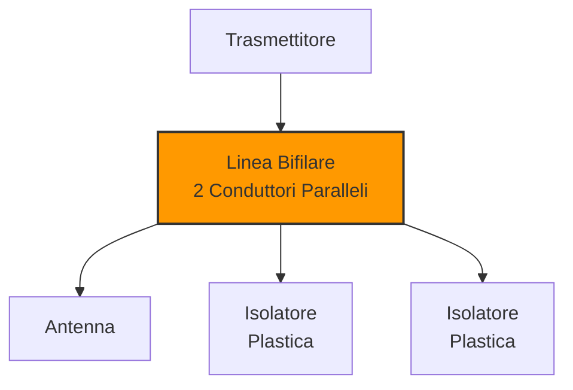
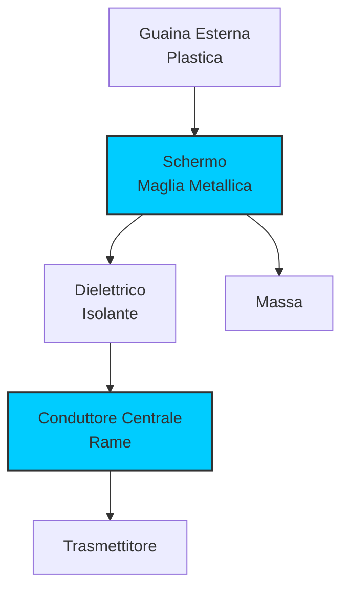
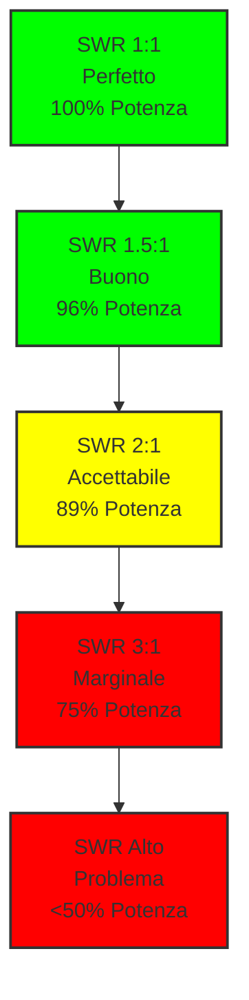
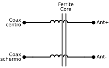

# 6.3 Linee di Trasmissione: Il Ponte tra Apparato e Antenna 📡🔌

Benvenuti nel mondo delle linee di trasmissione! Queste "autostrade elettriche" trasportano l'energia RF dalla radio all'antenna e viceversa. Una linea ben progettata e accordata è essenziale per massimizzare l'efficienza e minimizzare le perdite. Scopriamo insieme i tipi di linee, i loro parametri elettrici e come ottimizzarle per le nostre stazioni radioamatoriali!

## 🔗 Tipi di Linee di Trasmissione

Esistono diversi tipi di linee per trasportare segnali RF.

### Linea Bifilare

La **linea bifilare** è la più semplice, formata da due conduttori paralleli.

#### Caratteristiche

- **Impedenza**: 300-600 ohm tipicamente
- **Costruzione**: Due fili paralleli isolati
- **Applicazioni**: Antenne TV, dipoli ripiegati
- **Vantaggi**: Economica, facile da costruire
- **Svantaggi**: Perdite più alte, suscettibile a interferenze

#### Diagramma Linea Bifilare

### Cavo Coassiale

Il **cavo coassiale** è il tipo più comune in radioamatoriale.

#### Struttura

- **Centro**: Conduttore interno
- **Dielettrico**: Isolante tra conduttori
- **Schermo**: Maglia metallica
- **Guaina**: Rivestimento esterno

#### Tipi Comuni

| Tipo | Impedenza | Perdite | Uso |
|------|-----------|---------|-----|
| RG-58 | 50 ohm | Medie | VHF/UHF |
| RG-213 | 50 ohm | Basse | HF |
| RG-174 | 50 ohm | Alte | Portatile |
| RG-59 | 75 ohm | Basse | TV |

#### Diagramma Cavo Coassiale

### Guida d'Onda

Le **guide d'onda** sono usate per frequenze molto alte (GHz).

#### Principio

- **Tubo metallico**: Rettangolare o circolare
- **Modi di propagazione**: TE, TM
- **Frequenza minima**: Frequenza di cut-off
- **Applicazioni**: Microonde, radar

#### Vantaggi

- **Perdite molto basse**: Nessun dielettrico
- **Alta potenza**: Gestisce kW
- **Schermatura perfetta**: Isolamento completo

## 🔌 Impedenza Caratteristica

L'**impedenza caratteristica (Z₀)** è il parametro fondamentale di una linea.

### Definizione

**Z₀ = √(L/C)** ohm, dove L è induttanza per unità di lunghezza, C capacità per unità di lunghezza

### Valori Standard

- **50 ohm**: Coassiale per radioamatoriale
- **75 ohm**: TV e satellitare
- **300 ohm**: Bifilare per antenne TV
- **600 ohm**: Linee telefoniche

### Fattori che Influenzano Z₀

- **Rapporto dimensioni**: Diametro conduttori
- **Dielettrico**: Costante dielettrica
- **Geometria**: Forma della linea

### Esempio Calcolo

Per cavo coassiale: **Z₀ = (138 / √ε) × log₁₀(D/d)**

Dove ε è costante dielettrica, D diametro esterno, d diametro interno.

## 🏃 Velocità di Propagazione

La **velocità di propagazione (v)** è la velocità del segnale lungo la linea.

### Formula

**v = c / √ε**, dove c = 3×10⁸ m/s, ε = costante dielettrica

### Valori Tipici

| Dielettrico | ε | Velocità (% c) |
|-------------|---|----------------|
| Vuoto | 1.0 | 100% |
| Aria | 1.0 | 100% |
| Polietilene | 2.3 | 66% |
| Teflon | 2.1 | 69% |

### Lunghezza d'Onda nella Linea

**λ_linea = λ_vuoto / √ε**

**Esempio**: λ = 20m in aria, λ_linea = 20m / √2.3 ≈ 13.2m in PE

## 📊 Rapporto di Onda Stazionaria (SWR)

Lo **SWR (Standing Wave Ratio)** misura l'accordatura tra linea e antenna.

### Definizione

**SWR = V_max / V_min** (tensioni) o **I_max / I_min** (correnti)

### Valori Ideali

- **SWR = 1:1**: Perfetta accordatura (100% potenza trasferita)
- **SWR = 1.5:1**: Buona (96% potenza trasferita)
- **SWR = 2:1**: Accettabile (89% potenza trasferita)
- **SWR = 3:1**: Marginale (75% potenza trasferita)

### Diagramma SWR

### Perdita di Potenza

**% Perdita = [1 - (SWR-1)²/(SWR+1)²] × 100**

## 🔥 Perdite nelle Linee

Le **perdite** riducono l'efficienza del sistema.

### Tipi di Perdite

1. **Perdite dielettriche**: Riscaldamento del dielettrico
2. **Perdite resistive**: Resistenza dei conduttori
3. **Perdite di radiazione**: Irradiazione indesiderata
4. **Perdite di riflessione**: SWR elevato

### Unità di Misura

- **dB/100m**: Perdita per 100 metri
- **dB/m**: Perdita per metro

### Esempio Pratici

- **RG-213 (HF)**: 0.5 dB/100m a 14 MHz
- **RG-58 (VHF)**: 2.5 dB/100m a 144 MHz

## ⚖️ Bilanciatore (Balun)

Il **balun** bilancia la linea e previene correnti parassite.

### Funzioni

- **Trasformazione impedenza**: Da sbilanciato a bilanciato
- **Prevenzione RFI**: Elimina correnti sul schermo
- **Miglioramento SWR**: Riduce disadattamenti

### Tipi di Balun

- **1:1**: Solo bilanciamento, stessa impedenza
- **4:1**: Trasformazione 200→50 ohm (dipolo ripiegato)
- **9:1**: Trasformazione 450→50 ohm

### Schemi Circuitali Balun

#### Balun 1:1 - Solo Bilanciamento

*Balun 1:1: trasforma da sbilanciato (coassiale) a bilanciato mantenendo 50Ω.*

#### Balun 4:1 - Trasformazione Impedenza

*Balun 4:1: trasforma 50Ω → 200Ω, ideale per dipolo ripiegato.*

#### Balun a Corrente (Choke Balun)

*Balun a corrente con nucleo in ferrite: blocca le correnti di modo comune.*

## 📏 Linea in Quarto d'Onda (Stub)

La **linea quarter-wave** è usata come trasformatore di impedenza.

### Principio

Una linea λ/4 trasforma impedenza secondo: **Z_out = Z₀² / Z_in**

### Applicazioni

- **Trasformatore**: 50→200 ohm per dipolo ripiegato
- **Filtro**: Stub accordato per eliminare armoniche
- **Accordatore**: Parte di sistemi di accordo

### Esempio Calcolo

Linea 50 ohm, λ/4 a 14.250 MHz:
Lunghezza = (300 / f) / 4 / √ε ≈ 5.25m in aria

## 🔄 Trasformatore di Linea

Il **trasformatore di linea** cambia l'impedenza usando sezioni di linea.

### Tipi

- **Quarter-wave**: Trasformazione singola
- **Multi-sezione**: Trasformazioni graduali
- **Tapered**: Variazione continua

### Formula Quarter-Wave

**Z₂ = Z₀² / Z₁**

Dove Z₀ è impedenza linea, Z₁ impedenza ingresso, Z₂ impedenza uscita.

## 🎛️ Sistemi di Accordo d'Antenna

I **sistemi di accordo** adattano l'impedenza tra radio e antenna.

### Tipi Principali

1. **Accordatore Pi**: L, C, L configurazione
2. **Accordatore T**: Due L e C centrale
3. **Accordatore L**: Semplice L in serie/parallelo
4. **Automatico**: Accordatore motorizzato

### Schemi Circuitali Reti di Adattamento

#### Rete L-Match

La rete L-match è la più semplice, usa solo due componenti reattivi.

| Configurazione | Schema | Uso |
|----------------|--------|-----|
| Passa-basso (L serie + C parallelo) |  | Z alta → Z bassa |
| Passa-alto (C serie + L parallelo) |  | Z bassa → Z alta |

#### Rete Pi-Match (π)

Configurazione C-L-C, molto usata negli accordatori manuali.

*Accordatore Pi: due condensatori variabili e un induttore.*

#### Rete T-Match

Configurazione L-C-L, alternativa al Pi-match.

*Accordatore T: due induttori e un condensatore centrale.*

#### Accordatore Completo

*Schema accordatore T con componenti variabili per adattamento flessibile.*

### Funzionamento

L'accordatore presenta impedenza variabile alla radio, mantenendo SWR basso.

## 🧠 Quiz di Ripasso

Testa le tue conoscenze sulle linee di trasmissione!

### Domanda 1: Qual è l'impedenza caratteristica tipica del cavo coassiale radioamatoriale?
- A) 25 ohm
- B) 50 ohm
- C) 75 ohm
- D) 300 ohm

  
Risposta

  
<strong>B) 50 ohm</strong>

  
I cavi coassiali radioamatoriali (RG-58, RG-213) hanno tipicamente 50 ohm di impedenza caratteristica.

### Domanda 2: Cosa misura il rapporto di onda stazionaria (SWR)?
- A) La velocità del segnale
- B) L'accordatura tra linea e antenna
- C) Le perdite nella linea
- D) L'impedenza caratteristica

  
Risposta

  
<strong>B) L'accordatura tra linea e antenna</strong>

  
Lo SWR misura quanto bene l'impedenza della linea corrisponde a quella dell'antenna.

### Domanda 3: Qual è la funzione principale di un balun?
- A) Trasformare la tensione
- B) Bilanciare la linea e prevenire correnti parassite
- C) Misurare lo SWR
- D) Amplificare il segnale

  
Risposta

  
<strong>B) Bilanciare la linea e prevenire correnti parassite</strong>

  
Il balun converte da linea sbilanciata (coassiale) a bilanciata (bifilare) e previene RFI.

### Domanda 4: Una linea quarter-wave trasforma l'impedenza secondo quale formula?
- A) Z₂ = Z₁ × 2
- B) Z₂ = Z₀² / Z₁
- C) Z₂ = Z₁ + Z₀
- D) Z₂ = √(Z₁ × Z₀)

  
Risposta

  
<strong>B) Z₂ = Z₀² / Z₁</strong>

  
Una linea λ/4 trasforma l'impedenza di uscita come quadrato dell'impedenza caratteristica diviso impedenza di ingresso.

### Domanda 5: Quale tipo di linea ha le perdite più basse?
- A) Cavo coassiale sottile
- B) Linea bifilare
- C) Guida d'onda
- D) Cavo telefonico

  
Risposta

  
<strong>C) Guida d'onda</strong>

  
Le guide d'onda hanno perdite molto basse perché non usano dielettrico e sono completamente schermate.

## Conclusione

Le linee di trasmissione sono il collegamento vitale tra la nostra apparecchiatura e l'antenna. Dalla scelta del cavo giusto all'ottimizzazione dello SWR, ogni dettaglio contribuisce all'efficienza complessiva della stazione. Una buona linea significa più potenza all'antenna e meno problemi di interferenza! 📡🔌

---
[Torna al README](../README.md) | [Precedente: 6.2 Caratteristiche delle antenne](./6.2_Caratteristiche_delle_antenne.md) | [Successivo: 7 Propagazione](../07_Propagazione/7_Propagazione.md)</content>
<parameter name="filePath">06_Antenne_Linee_Trasmissioni/6.3_Linee_di_trasmissione.md