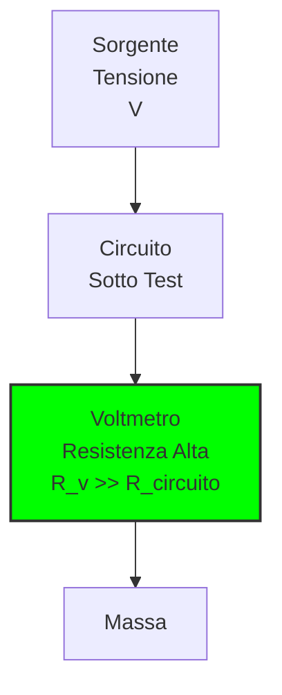
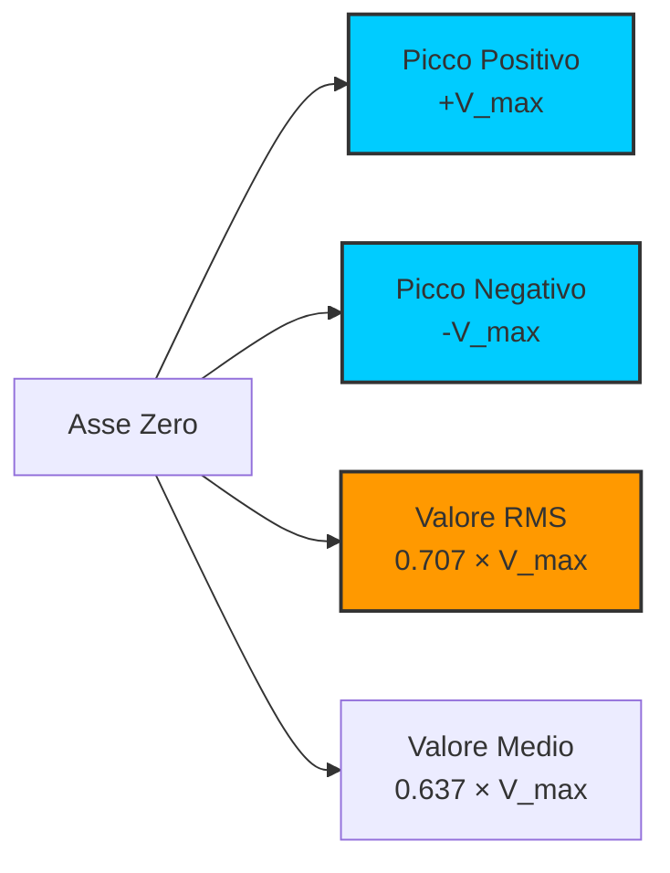
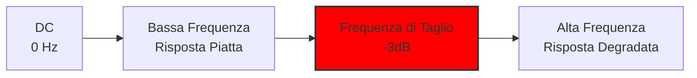
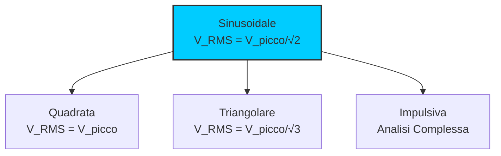
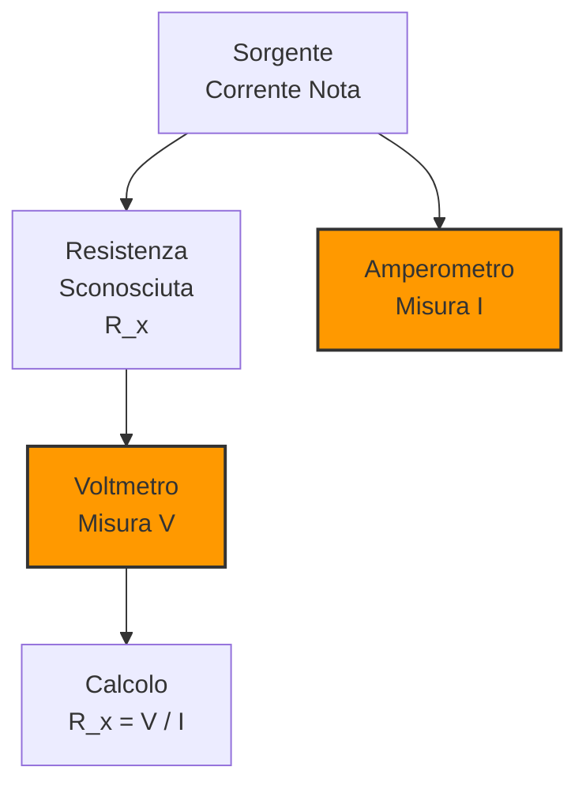

# 8.1 Principi sulle Misure: La Scienza della Misurazione Accurata 📏🔍

Benvenuti nel mondo delle misure elettriche! In radioamatoriale, misurare correttamente tensioni, correnti, potenze e frequenze è essenziale per diagnosticare problemi, ottimizzare prestazioni e garantire sicurezza. Scopriamo insieme i principi fondamentali delle misure elettriche, dagli errori di misura alla valutazione delle forme d'onda, con particolare attenzione alle sfide delle alte frequenze!

## ⚡ Misure di Tensioni e Correnti Continue

Le misure DC sono le più semplici ma richiedono attenzione alla precisione.

### Strumenti Base

- **Voltmetro**: Misura tensione tra due punti
- **Amperometro**: Misura corrente in un circuito
- **Multimetro**: Combina entrambe le funzioni

### Principio di Funzionamento

Il **voltmetro** ha resistenza interna molto alta (MΩ) per non influenzare il circuito.
L'**amperometro** ha resistenza molto bassa (mΩ) per non causare cadute di tensione.

### Diagramma Misura Tensione

### Esempio Pratico

Misura tensione batteria 12V:
- Voltmetro ideale: 12.000V
- Voltmetro reale (R_i = 10MΩ): 11.999V (errore trascurabile)

## 🔄 Misure di Tensioni e Correnti Alternate

Le misure AC sono più complesse a causa della variabilità nel tempo.

### Valori Caratteristici

- **Valore efficace (RMS)**: Equivalente DC per stessa potenza
- **Valore di picco**: Massima escursione
- **Valore medio**: Media aritmetica

### Relazioni Matematiche

**V_RMS = V_picco / √2** per onda sinusoidale

**V_medio = (2/π) × V_picco** per onda sinusoidale piena

### Diagramma Onda Sinusoidale

### Esempio Numerico

Onda sinusoidale 10V picco:
- V_RMS = 10 / 1.414 ≈ 7.07V
- V_medio = 0.637 × 10 ≈ 6.37V

## 📊 Errori di Misura

Gli errori possono compromettere l'affidabilità delle misure.

### Tipi di Errori

1. **Errore sistematico**: Costante e prevedibile
2. **Errore casuale**: Variabile e imprevedibile
3. **Errore di risoluzione**: Limite dello strumento

### Calcolo dell'Errore Totale

**Errore totale = √(Errore sistematico² + Errore casuale²)**

### Precisione vs Accuratezza

- **Precisione**: Riproducibilità delle misure
- **Accuratezza**: Vicinanza al valore vero

### Esempio di Calcolo Errore

Voltmetro con accuratezza ±1%:
- Misura: 10.00V
- Errore massimo: ±0.10V
- Intervallo vero: 9.90V - 10.10V

## 📻 Influenza della Frequenza

La frequenza influenza significativamente le misure elettroniche.

### Effetto sulla Resistenza Interna

A frequenze elevate, la **resistenza interna** degli strumenti diventa complessa:
- **Resistenza**: Parte reale
- **Reattanza**: Parte immaginaria (capacitiva/induttiva)

### Frequenza di Taglio

**f_c = 1/(2πRC)** dove R è resistenza, C capacità parassita

### Diagramma Risposta in Frequenza

### Esempio Pratico

Multimetro digitale 10MHz:
- Buono fino a 1MHz
- Errore significativo oltre 10MHz
- Per RF: usare strumenti specializzati

## 📈 Influenza della Forma d'Onda

La forma d'onda determina quale valore misurare.

### Onde Sinusoidali

- **True RMS**: Misura corretta per qualsiasi forma
- **RMS approssimato**: Solo per sinusoidali

### Onde Non Sinusoidali

- **Quadra**: V_RMS = V_picco
- **Triangolare**: V_RMS = V_picco / √3
- **Impulsiva**: Richiede analisi spettrale

### Diagramma Forme d'Onda

## 🔌 Influenza della Resistenza Interna

La resistenza dello strumento può alterare la misura.

### Effetto sul Voltmetro

**V_misurata = V_vera × (R_v / (R_v + R_circuito))**

### Effetto sull'Amperometro

**I_misurata = I_vera × (R_circuito / (R_circuito + R_a))**

### Esempio Numerico

Voltmetro R_i = 1MΩ, circuito R = 1kΩ, V_vera = 10V:
V_misurata = 10 × (1M / (1M + 1k)) ≈ 10 × 0.999 = 9.99V

## 📏 Misura della Resistenza

La misura di resistenza richiede attenzione alle correnti di test.

### Metodo Voltmetro-Amperometro

1. Misurare tensione ai capi del resistore
2. Misurare corrente attraverso il resistore
3. Calcolare R = V/I

### Ohmetro

- **Funzione dedicata**: Corrente nota attraverso resistore
- **Scala non lineare**: Per migliore risoluzione ai valori bassi

### Diagramma Misura Resistenza

## ⚡ Misura della Potenza

La potenza è energia per unità di tempo.

### Potenza in Continua

**P = V × I** (watt)

### Potenza in Alta Frequenza

- **Potenza media**: Valore efficace
- **Potenza di cresta**: Picco istantanea
- **Fattore di cresta**: P_cresta / P_media

### Esempio Pratico

Trasmettitore 100W PEP:
- Portante CW: P_media = 100W, P_cresta = 100W
- SSB: P_media ≈ 25W, P_cresta = 100W, cresta = 4:1

## 📊 Rapporto di Onda Stazionaria (SWR)

Lo SWR misura l'accordatura tra linea e carico.

### Definizione

**SWR = (1 + ρ)/(1 - ρ)** dove ρ è coefficiente di riflessione

### Valori Tipici

- **SWR = 1**: Perfetta accordatura
- **SWR = 1.5**: Buona (4% potenza riflessa)
- **SWR = 2**: Accettabile (11% potenza riflessa)

### Perdita di Potenza

**% Riflessa = [(SWR-1)/(SWR+1)]² × 100**

## 📊 Forma d'Onda dell'Inviluppo

L'inviluppo mostra la modulazione del segnale RF.

### Tipi di Modulazione

- **AM**: Inviluppo segue audio
- **SSB**: Inviluppo complesso
- **FM**: Inviluppo costante

### Strumento: Analizzatore di Spettro

Mostra potenza vs frequenza, rivelando armoniche e spurie.

## 📻 Misura della Frequenza

La frequenza è il numero di cicli al secondo.

### Metodo Diretto

Contare cicli in un tempo noto.

### Metodo Indiretto

Misurare periodo e calcolare f = 1/T.

### Precisione

Dipende dalla stabilità del riferimento e risoluzione temporale.

## 🎯 Frequenza di Risonanza

La frequenza di risonanza di circuiti LC.

### Formula

**f_r = 1/(2π√(LC))**

### Misura Pratica

- **Metodo ponte**: Bilanciare per minima risposta
- **Metodo sweep**: Variare frequenza e trovare picco

### Esempio Calcolo

L = 1μH, C = 100pF:
f_r = 1/(2π√(10^-6 × 10^-10)) = 1/(2π√10^-16) ≈ 1.59 MHz

## 🧠 Quiz di Ripasso

Testa le tue conoscenze sui principi delle misure!

### Domanda 1: Qual è il valore efficace (RMS) di un'onda sinusoidale di 10V picco?
- A) 5V
- B) 7.07V
- C) 10V
- D) 14.14V

  
Risposta

  
<strong>B) 7.07V</strong>

  
Per un'onda sinusoidale, V_RMS = V_picco / √2 ≈ 10 / 1.414 ≈ 7.07V.

### Domanda 2: Cosa misura principalmente un errore sistematico?
- A) Riproducibilità
- B) Deviazione costante dal valore vero
- C) Limite di risoluzione
- D) Variazione casuale

  
Risposta

  
<strong>B) Deviazione costante dal valore vero</strong>

  
L'errore sistematico è prevedibile e può essere corretto con calibrazione.

### Domanda 3: Come influenza la frequenza la misura con un multimetro digitale?
- A) Migliora la precisione
- B) Non ha effetto
- C) Può causare errori significativi alle alte frequenze
- D) Riduce la risoluzione

  
Risposta

  
<strong>C) Può causare errori significativi alle alte frequenze</strong>

  
A frequenze elevate, la capacità parassita dello strumento altera le misure.

### Domanda 4: Qual è la potenza media tipica di un segnale SSB con PEP 100W?
- A) 25W
- B) 50W
- C) 71W
- D) 100W

  
Risposta

  
<strong>A) 25W</strong>

  
In SSB, la potenza media è circa 1/4 della potenza di picco per modulazione al 100%.

### Domanda 5: Cosa indica un SWR di 2:1?
- A) Perfetta accordatura
- B) Circa 11% di potenza riflessa
- C) 50% di perdita
- D) Circuito aperto

  
Risposta

  
<strong>B) Circa 11% di potenza riflessa</strong>

  
Formula: % riflessa = [(SWR-1)/(SWR+1)]² × 100 ≈ 11% per SWR=2.

## Conclusione

I principi delle misure sono il fondamento della diagnostica e ottimizzazione in radioamatoriale. Dalla comprensione degli errori alla scelta dello strumento giusto, ogni misura accurata ci avvicina alla perfezione tecnica. Ricorda: una buona misura è alla base di ogni buona diagnosi! 📏🔍

---
[Torna al README](../README.md) | [Precedente: 7 Propagazione](../07_Propagazione/7_Propagazione.md) | [Successivo: 8.2 Strumenti di misura](./8.2_Strumenti_di_misura.md)</content>
<parameter name="filePath">08_Misure/8.1_Principi_sulle_misure.md