# 8.2 Strumenti di Misura: Gli Strumenti del Radioamatore 🔧🛠️

Benvenuti nel laboratorio del radioamatore! Gli strumenti di misura sono i nostri occhi e orecchie elettroniche, permettendoci di diagnosticare circuiti, misurare prestazioni e risolvere problemi. Scopriamo insieme gli strumenti essenziali, dal semplice multimetro al sofisticato analizzatore di spettro, con particolare attenzione alla loro pratica applicazione nelle misure radioamatoriali!

## 🔄 Apparecchi di Misura a Bobina Mobile

Gli strumenti a bobina mobile sono i classici "ago" analogici.

### Principio di Funzionamento

Una **bobina mobile** in campo magnetico ruota proporzionalmente alla corrente, muovendo un ago su scala graduata.

### Tipi Principali

- **Amperometro**: Misura corrente
- **Voltmetro**: Misura tensione
- **Ohmetro**: Misura resistenza
- **Multimetro analogico**: Combina tutte le funzioni

### Vantaggi

- **Economici**: Basso costo
- **Robust**: Resistenti agli urti
- **Visuale immediata**: Trend visibili

### Svantaggi

- **Precisione limitata**: ±2-5%
- **Lettura soggettiva**: Parallasse
- **Sensibili**: Vibrazioni, campi magnetici

### Diagramma Bobina Mobile
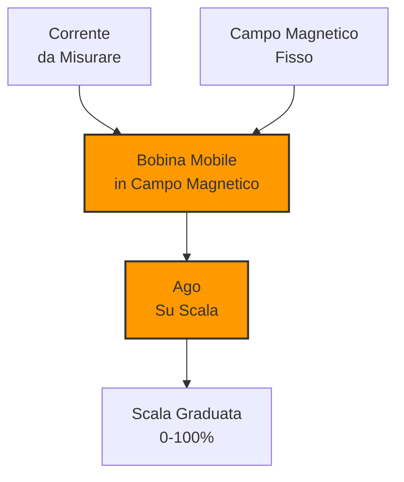

## 🎛️ Apparecchi di Misura Multigamma

I multimetri moderni offrono molteplici gamme di misura.

### Caratteristiche

- **Auto-ranging**: Selezione automatica gamma
- **Digitale**: Display LCD preciso
- **Multifunzione**: V, A, Ω, Hz, capacità, temperatura
- **Precisione**: ±0.1-1%

### Funzioni Speciali

- **True RMS**: Misura corretta AC non sinusoidali
- **Min/Max**: Cattura valori estremi
- **Hold**: Blocco lettura
- **Backlight**: Illuminazione display

### Schema a Blocchi Multimetro Digitale

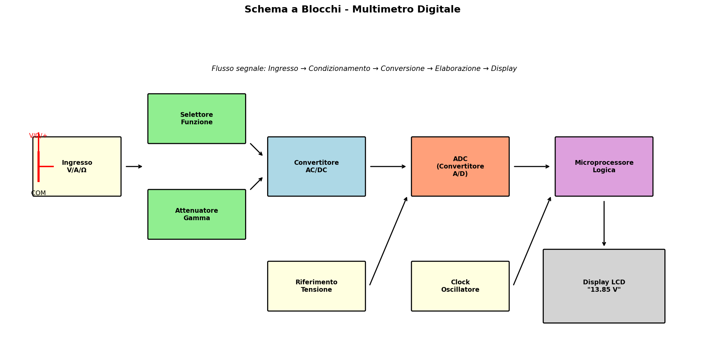

*Architettura interna: il segnale passa attraverso attenuatori, convertitori e ADC prima di essere visualizzato.*

### Esempio Utilizzo

Misura tensione batteria: Seleziona DCV, collega puntali, leggi 13.8V.

### Tabella Precisione Tipica
| Funzione | Gamma | Precisione |
|----------|-------|------------|
| DCV | 0-1000V | ±0.5% |
| ACV | 0-750V | ±1.0% |
| DCI | 0-10A | ±1.5% |
| Ω | 0-40MΩ | ±1.0% |

## 🌉 Riflettometri a Ponte

I riflettometri misurano l'impedenza e lo SWR.

### Principio del Ponte

Confronta impedenza sconosciuta con impedenza nota, bilanciando per zero differenza.

### Tipi

- **Ponte RF**: Misura impedenza complessa
- **SWR Meter**: Misura rapporto onda stazionaria
- **Analizzatore Antenna**: Combinazione digitale

### Schema ROSmetro (Ponte Riflettometrico)

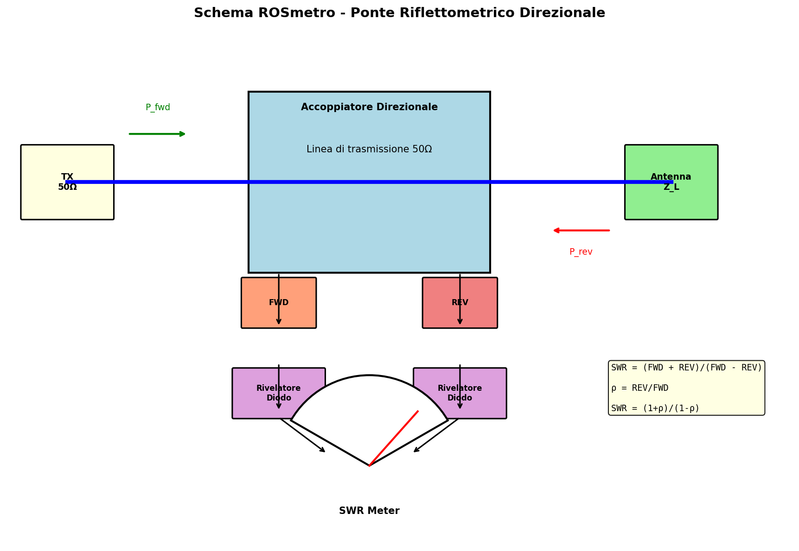

*L'accoppiatore direzionale separa potenza diretta e riflessa per calcolare SWR.*

### Utilizzo Pratico

1. Connettere tra radio e antenna
2. Trasmettere segnale noto
3. Leggere SWR sul display
4. Aggiustare accordatore per minimizzare

## ⏱️ Contatori di Frequenza

I contatori misurano la frequenza dei segnali.

### Principio

Contano cicli in un tempo di gate preciso.

### Caratteristiche

- **Gamma**: DC a GHz
- **Risoluzione**: 1 Hz - 1 kHz
- **Precisione**: ±1 ppm con riferimento TCXO
- **Gate time**: 0.1s - 10s

### Tipi

- **Universali**: Ampia gamma
- **RF**: Ottimizzati per radiofrequenze
- **Frazionali**: Per frequenze molto basse

### Diagramma Contatore Frequenza
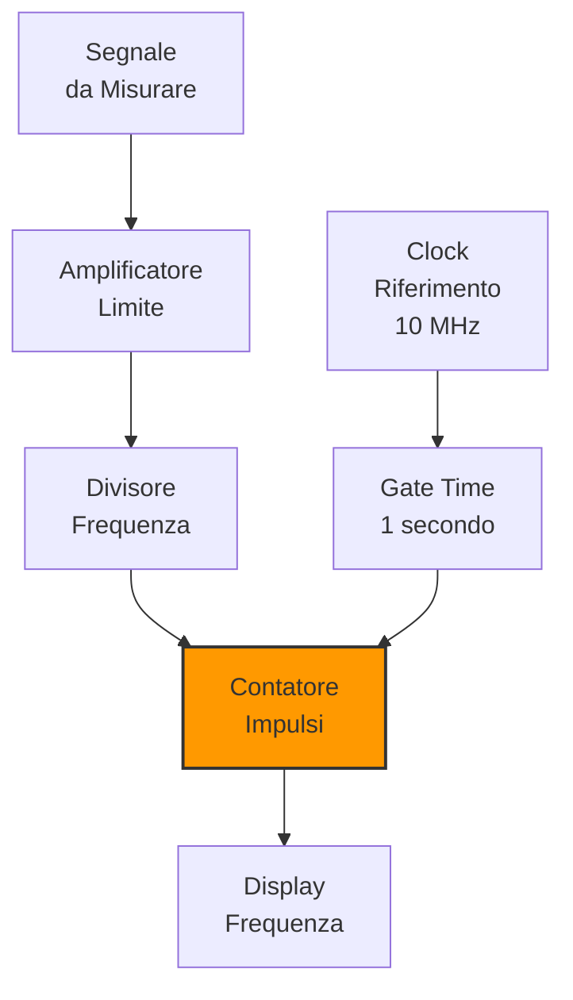

### Esempio Lettura

Segnale 14.250.000 Hz, gate 1s, risoluzione 1Hz:
Display: 14,250,000 Hz ±1 Hz

## 📡 Frequenzimetro ad Assorbimento

Il frequenzimetro ad assorbimento usa cavità risonanti.

### Principio

Cavità accordabile assorbe energia a frequenza di risonanza, rilevando il minimo segnale trasmesso.

### Caratteristiche

- **Gamma**: 100 MHz - 10 GHz tipicamente
- **Precisione**: ±0.01-0.1%
- **Sensibilità**: Alta
- **Portabilità**: Limitata

### Utilizzo

1. Connettere antenna
2. Accordare cavità
3. Leggere frequenza di assorbimento massimo

## 📊 Ondametro ad Assorbimento

L'ondametro misura potenza RF usando assorbimento termico.

### Principio

Elemento termico (termistore o diodo) assorbe energia RF, misurando riscaldamento.

### Tipi

- **Termistor**: Alta precisione, bassa gamma dinamica
- **Diodo**: Ampia gamma, buona linearità
- **Bolometro**: Molto preciso ma lento

### Caratteristiche

- **Gamma potenza**: μW - kW
- **Precisione**: ±5-10%
- **Risposta**: DC - GHz
- **Calibrazione**: Richiesta periodica

### Schema Wattmetro a Termocoppia

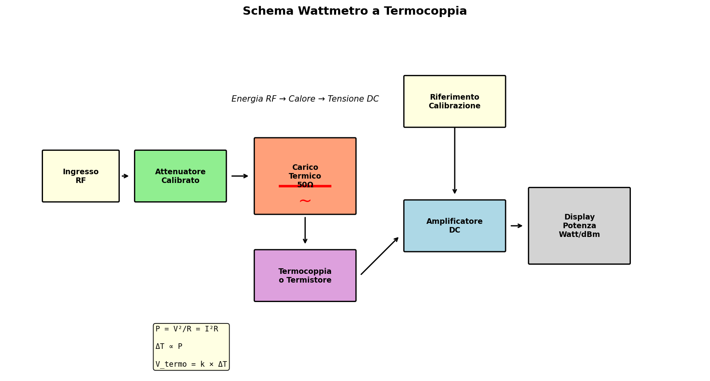

*Il carico termico converte l'energia RF in calore, misurato dalla termocoppia.*

### Esempio Misura

Potenza trasmessa 100W:
- Lettura: 98W (errore -2%)
- Dopo calibrazione: 100W esatti

## 📺 Oscilloscopio

L'oscilloscopio visualizza segnali nel dominio del tempo.

### Funzioni Base

- **Traccia**: Visualizza tensione vs tempo
- **Scala**: Volts/div, Time/div
- **Trigger**: Sincronizzazione segnale
- **Misura**: Cursori per valori precisi

### Tipi

- **Analogico**: Tubo a raggi catodici
- **Digitale**: Campionamento e memoria
- **Storage**: Mantiene traccia
- **DSO**: Digital Storage Oscilloscope

### Caratteristiche Importanti

- **Banda**: 20 MHz - 100 GHz
- **Campionamento**: 1 GS/s - 100 GS/s
- **Canali**: 2-4 tipicamente
- **Memoria**: 1k - 100M punti

### Schema a Blocchi Oscilloscopio Digitale

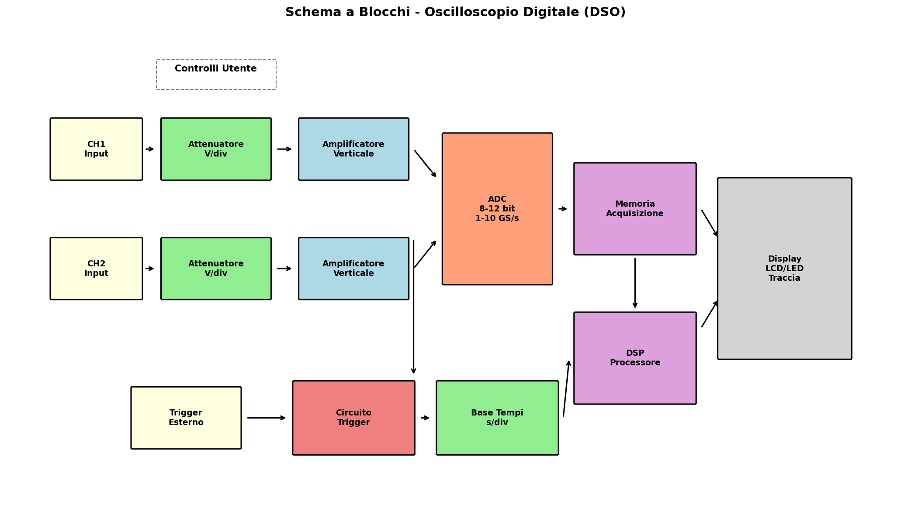

*Architettura DSO: i segnali vengono digitalizzati, memorizzati e visualizzati con elaborazione digitale.*

### Applicazioni Radioamatoriali

- **Forma d'onda**: Verifica modulazione
- **Distorsione**: Identificare problemi
- **Timing**: Sincronizzazione circuiti
- **Debug**: Segnalazione problemi

## 📊 Analizzatore di Spettro

L'analizzatore di spettro visualizza segnali nel **dominio della frequenza**.

### Principio di Funzionamento

Utilizza un oscillatore locale (LO) sweepato per convertire il segnale RF in IF, dove viene misurata l'ampiezza.

### Caratteristiche

- **Gamma frequenza**: DC - 50 GHz
- **RBW (Resolution Bandwidth)**: 1 Hz - 1 MHz
- **Dinamica**: 80-120 dB
- **Sweep time**: ms - secondi

### Schema a Blocchi Analizzatore di Spettro

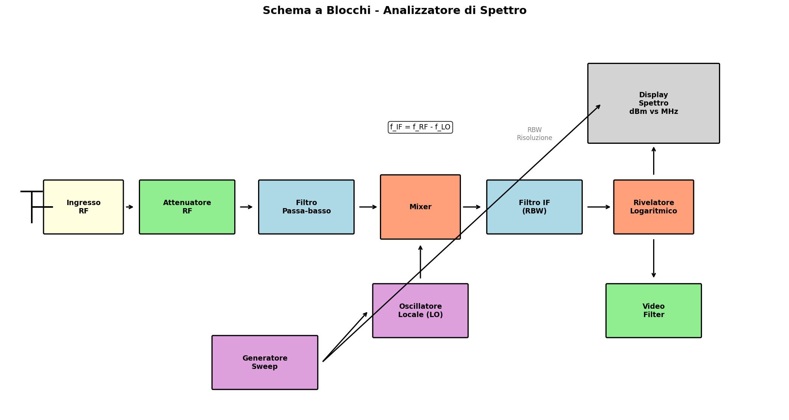

*Il mixer converte ogni frequenza RF in IF, dove il filtro RBW determina la risoluzione.*

### Applicazioni

- **Misura armoniche**: Distorsione TX
- **Spurie**: Emissioni indesiderate
- **Occupazione spettrale**: Larghezza banda segnale
- **Interferenze**: Identificazione sorgenti

## 🔌 Configurazioni di Misura

### Setup Misura Potenza in Uscita TX

Per misurare la potenza di un trasmettitore si usa un wattmetro passante e un carico fittizio.

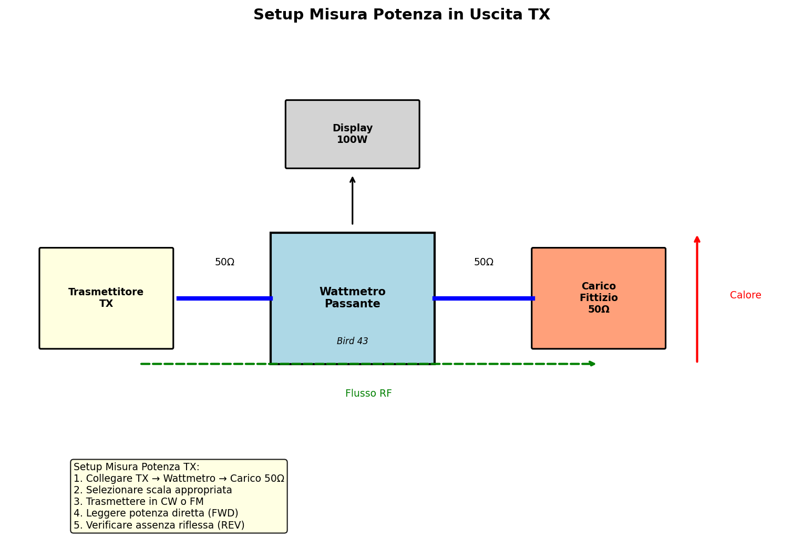

*Configurazione TX → Wattmetro → Carico 50Ω per misura accurata della potenza emessa.*

### Setup Misura ROS (SWR) Antenna

Per verificare l'accordatura dell'antenna si usa un ROSmetro tra TX e antenna.

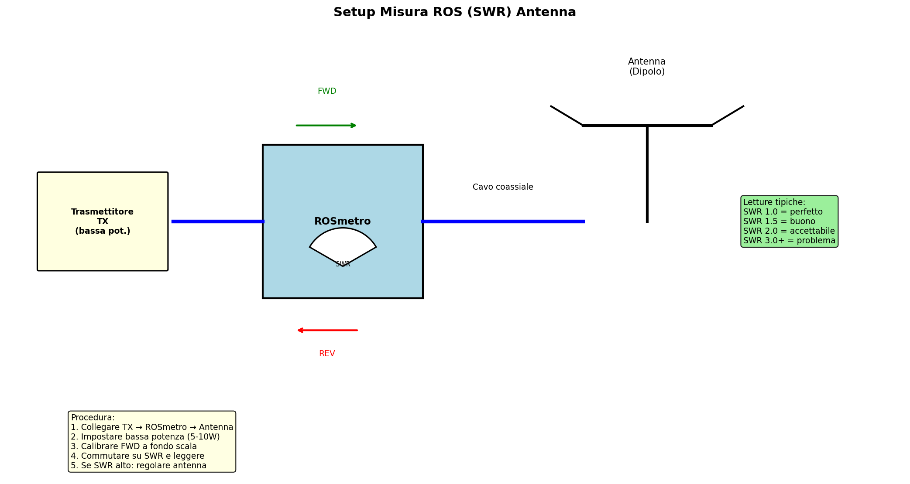

*Il ROSmetro indica il rapporto tra potenza diretta e riflessa, essenziale per ottimizzare l'antenna.*

### Test Due Toni per Linearità Amplificatore

Il test a due toni verifica la linearità di un amplificatore SSB misurando i prodotti di intermodulazione.

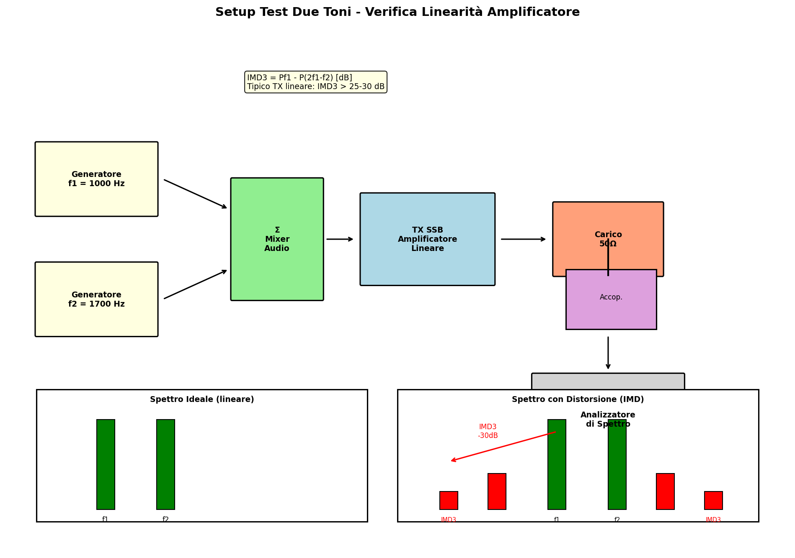

*Due segnali audio sommati vengono trasmessi in SSB; l'analizzatore di spettro rivela i prodotti IMD3.*

### Posizionamento Sonde Oscilloscopio

Il corretto posizionamento delle sonde è essenziale per misure accurate, specialmente in RF.

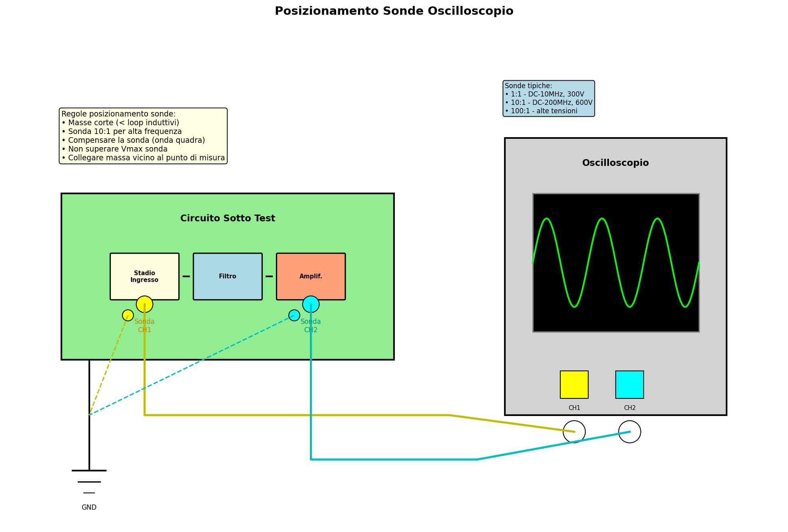

*Regole fondamentali: masse corte, sonde compensate, punti di misura vicini al circuito.*

## 🛠️ Pratica delle Operazioni di Misura

### Sequenza Standard

1. **Preparazione**: Selezionare strumento adatto
2. **Sicurezza**: Verificare tensioni, correnti
3. **Connessione**: Puntali puliti, connessioni sicure
4. **Configurazione**: Gamma, funzione corretta
5. **Misura**: Leggere valore stabile
6. **Verifica**: Controllare ragionevolezza

### Errori Comuni da Evitare

- **Gamma sbagliata**: Sovraccarico strumento
- **Connessioni lasche**: Rumore, letture errate
- **Carica statica**: Scaricare prima di toccare
- **Interferenze**: Schermare da campi esterni

### Calibrazione

- **Riferimenti noti**: Usare segnali calibrati
- **Confronto**: Confrontare con strumenti noti
- **Correzione**: Applicare fattori di correzione

## 🧠 Quiz di Ripasso

Testa le tue conoscenze sugli strumenti di misura!

### Domanda 1: Qual è il vantaggio principale di un multimetro digitale rispetto a uno analogico?
- A) Costo inferiore
- B) Maggiore precisione e risoluzione
- C) Robustezza meccanica
- D) Lettura più veloce

  
Risposta

  
<strong>B) Maggiore precisione e risoluzione</strong>

  
I multimetri digitali offrono precisione tipica ±0.1-1% contro ±2-5% degli analogici.

### Domanda 2: Cosa misura un riflettometro a ponte?
- A) Potenza assoluta
- B) Impedenza e SWR
- C) Frequenza esatta
- D) Forma d'onda

  
Risposta

  
<strong>B) Impedenza e SWR</strong>

  
I riflettometri misurano l'impedenza del carico e calcolano il rapporto di onda stazionaria.

### Domanda 3: Qual è la risoluzione tipica di un contatore di frequenza?
- A) 1 Hz
- B) 1 kHz
- C) 1 MHz
- D) 1 GHz

  
Risposta

  
<strong>A) 1 Hz</strong>

  
I contatori di frequenza moderni offrono risoluzione di 1 Hz o meglio.

### Domanda 4: Come funziona un frequenzimetro ad assorbimento?
- A) Conta impulsi
- B) Misura assorbimento in cavità risonante
- C) Usa termistori
- D) Campiona il segnale

  
Risposta

  
<strong>B) Misura assorbimento in cavità risonante</strong>

  
La cavità assorbe energia massima alla frequenza di risonanza.

### Domanda 5: Quale strumento visualizza tensione nel dominio del tempo?
- A) Multimetro
- B) Analizzatore di spettro
- C) Oscilloscopio
- D) Contatore di frequenza

  
Risposta

  
<strong>C) Oscilloscopio</strong>

  
L'oscilloscopio mostra tensione (Y) vs tempo (X).

## Conclusione

Gli strumenti di misura sono gli alleati indispensabili del radioamatore. Dalla semplice misura di tensione al sofisticato oscilloscopio, ogni strumento ha il suo ruolo nella diagnosi e ottimizzazione. Ricorda: uno strumento ben usato è preciso quanto uno strumento costoso! 🔧🛠️

---
[Torna al README](../README.md) | [Precedente: 8.1 Principi sulle misure](./8.1_Principi_sulle_misure.md) | [Successivo: 9.1 Disturbi degli apparecchi elettronici](../09_Disturbi_Protezione/9.1_Disturbi_degli_apparecchi_elettronici.md)</content>
<parameter name="filePath">08_Misure/8.2_Strumenti_di_misura.md