# 9.3 Protezione contro i Disturbi: Scudi Elettronici 🛡️🔧

Benvenuti nel mondo della protezione dai disturbi! Una volta identificati i disturbi e le loro cause, possiamo implementare soluzioni efficaci. Dal filtraggio alle schermature, esistono molteplici tecniche per proteggere i nostri apparati elettronici. Scopriamo insieme le strategie pratiche per creare "scudi" contro le interferenze elettromagnetiche!

## 🔧 Filtraggio

Il filtraggio è la prima linea di difesa contro i disturbi.

### Tipi di Filtri

#### Filtri Passa-Basso

Attenuano frequenze alte, proteggono da armoniche.

**Componenti**: L, C in configurazione π o T

#### Filtri Passa-Alto

Attenuano frequenze basse, proteggono da rumore 50/60 Hz.

#### Filtri Passa-Banda

Lasciano passare solo la banda desiderata.

#### Filtri Reiettivo (Notch)

Eliminano frequenze specifiche.

### Diagramma Filtro Passa-Basso

```mermaid
graph TD;
    Ingresso["Segnale Ingresso<br>Misto"] --> Condensatore["Condensatore<br>Corta alte frequenze"];
    Condensatore --> Induttore["Induttore<br>Blocca alte frequenze"];
    Induttore --> Uscita["Uscita Filtrata<br>Basse frequenze"];
    DisturboAlto["Disturbo Alto<br>Frequenza"] --> Condensatore;
    DisturboAlto --> Attenuato["Attenuato<br>🔇"];
    classDef filtro fill:#0f0,stroke:#333,stroke-width:2px;
    class Condensatore,Induttore filtro;
    classDef disturbo fill:#f00,stroke:#333,stroke-width:2px;
    class DisturboAlto disturbo;
```


### Applicazioni Pratiche

- **Alimentazione**: Filtri EMI alla rete
- **Antenna**: Filtri d'ingresso ricevitore
- **Audio**: Filtri anti-rumble

### Esempio: Filtro per Alimentazione

Filtro π: Ingresso → C → L → C → Uscita
Attenua armoniche di rete e RF indesiderata.

## 🔌 Disaccoppiamento

Il disaccoppiamento isola circuiti da disturbi comuni.

### Condensatori di Disaccoppiamento

- **Elettrolitici**: Basse frequenze, alta capacità
- **Ceramici**: Alte frequenze, bassa capacità
- **Film**: Ampia banda, precisione

### Posizionamento

- **Vicino al circuito**: Minore induttanza
- **Ogni IC**: Disaccoppiamento locale
- **Bus di alimentazione**: Disaccoppiamento globale

### Diagramma Disaccoppiamento

```mermaid
graph TD;
    Alimentazione["Alimentazione<br>+5V"] --> Condensatore["Condensatore<br>Disaccoppiamento<br>10μF"];
    Condensatore --> Circuito["Circuito<br>Integrato"];
    Circuito --> Massa["Massa"];
    Disturbo["Disturbo<br>Comune"] --> Alimentazione;
    Disturbo --> Massa;
    Condensatore --> Assorbito["Disturbo<br>Assorbito<br>⚡"];
    classDef decoupling fill:#0cf,stroke:#333,stroke-width:2px;
    class Condensatore decoupling;
```


### Ferrite Bead

Perlite magnetiche che attenuano alte frequenze.

**Impedenza Z = jωL**, aumenta con frequenza.

## 🛡️ Schermatura

La schermatura crea gabbie di Faraday contro i campi EM.

### Principi Fisici

- **Schermo elettrico**: Blocca campi elettrici
- **Schermo magnetico**: Blocca campi magnetici
- **Schermo elettromagnetico**: Entrambi

### Materiali

- **Rame/Alluminio**: Schermo elettrico
- **Mu-metall**: Schermo magnetico
- **Schermi multi-strato**: Combinati

### Tecniche di Schermatura

#### Schermatura del Cabinet

- **Pannelli metallici**: Connessi elettricamente
- **Ventole schermate**: Aperture con maglia fine
- **Connettori schermati**: BNC, SMA con guscio

#### Schermatura Interna

- **Schermi parziali**: Intorno a circuiti critici
- **Cavi schermati**: Per segnali sensibili
- **PCB schermati**: Strati di massa

### Diagramma Schermatura

```mermaid
graph TD;
    CampoEM["Campo EM<br>Esterno<br>📡"] --> Schermo["Schermo<br>Metallico<br>🛡️"];
    Schermo --> Riflesso["Campo Riflesso<br>🔄"];
    Schermo --> Assorbito["Campo Assorbito<br>⚡"];
    Schermo --> Interno["Interno<br>Protetto<br>✅"];
    classDef protezione fill:#0f0,stroke:#333,stroke-width:2px;
    class Schermo protezione;
    classDef minaccia fill:#f00,stroke:#333,stroke-width:2px;
    class CampoEM minaccia;
```


### Efficacia della Schermatura

**Attenuazione A = 20 log(σ × t × f) dB**

Dove σ = conduttività, t = spessore, f = frequenza.

## 🏠 Misure Architetturali

### Separazione Fisica

- **Distanza**: Maggiore = meno accoppiamento
- **Orientamento**: 90° riduce accoppiamento magnetico
- **Barriere**: Schermi fisici tra apparati

### Layout del Circuito

- **Loop di massa**: Piccoli e controllati
- **Separazione segnali**: Analogici/digitali separati
- **Layer PCB**: Strati di massa dedicati

### Alimentazione

- **Linee separate**: Per circuiti critici
- **Stabilizzatori**: Filtrati e schermati
- **UPS**: Protezione da transienti di rete

## 📡 Tecniche Specifiche per Radioamatori

### Protezione del Ricevitore

- **Preamplificatore**: Guadagno controllato
- **Attenuatore**: Per segnali forti
- **Filtro passa-banda**: Solo banda desiderata

### Protezione del Trasmettitore

- **Filtro di uscita**: Elimina armoniche
- **Circuito di protezione**: Da SWR alto
- **Schermatura**: Riduce irradiazioni parassite

### Stazione Completa

- **Separazione fisica**: TX/RX distanti
- **Schermatura cabine**: Gabbia di Faraday
- **Filtri di linea**: Su tutte le connessioni

### Esempio di Configurazione Protetta
```
Antenna → Filtro passa-banda → Cavo schermato → Preamp → Ricevitore
                    ↓
              Filtro notch (se necessario)
```

## 🔧 Strumenti e Metodi di Test

### Verifica dell'Efficacia

- **Misura SWR**: Accordatura corretta
- **Analisi spettro**: Spurii assenti
- **Test di immunità**: Campo controllato
- **Monitoraggio**: Disturbi residui

### Strumenti Utili

- **Generatore di segnali**: Test filtri
- **Analizzatore di rete**: Misura impedenza
- **Camera schermata**: Test controllati
- **Misuratore di campo**: Verifica schermatura

## 📋 Procedure di Troubleshooting

### Identificazione del Problema

1. **Sintomi**: Cosa succede esattamente
2. **Isolamento**: Quale circuito è interessato
3. **Misura**: Quantificare il disturbo
4. **Localizzazione**: Dove entra il disturbo

### Soluzioni Step-by-Step

1. **Filtri**: Aggiungere filtraggio
2. **Schermatura**: Migliorare schermature esistenti
3. **Layout**: Riprogettare se necessario
4. **Separazione**: Aumentare distanze

### Prevenzione

- **Design iniziale**: Considerare EMC fin dall'inizio
- **Test continui**: Verificare durante sviluppo
- **Documentazione**: Registrare soluzioni efficaci

## 🧠 Quiz di Ripasso

Testa le tue conoscenze sulla protezione contro i disturbi!

### Domanda 1: Qual è la funzione principale di un filtro passa-basso?
- A) Lasciare passare alte frequenze
- B) Attenuare alte frequenze
- C) Amplificare basse frequenze
- D) Bloccare basse frequenze

<details>
  <summary>Risposta</summary>
  <p><strong>B) Attenuare alte frequenze</strong></p>
  <p>I filtri passa-basso attenuano le frequenze al di sopra della frequenza di taglio.</p>
</details>

### Domanda 2: Cosa fa un condensatore di disaccoppiamento?
- A) Filtra il segnale
- B) Assorbe disturbi ad alta frequenza
- C) Amplifica il segnale
- D) Riduce la tensione

<details>
  <summary>Risposta</summary>
  <p><strong>B) Assorbe disturbi ad alta frequenza</strong></p>
  <p>I condensatori di disaccoppiamento forniscono un percorso a bassa impedenza per le alte frequenze verso massa.</p>
</details>

### Domanda 3: Quale materiale è migliore per schermare campi magnetici?
- A) Rame
- B) Alluminio
- C) Mu-metall
- D) Plastica

<details>
  <summary>Risposta</summary>
  <p><strong>C) Mu-metall</strong></p>
  <p>Il mu-metall è una lega con alta permeabilità magnetica, ideale per schermare campi magnetici.</p>
</details>

### Domanda 4: Cosa significa EMC nel contesto dei disturbi?
- A) Electromagnetic Compatibility
- B) Electronic Magnetic Control
- C) Energy Management Circuit
- D) Error Monitoring Code

<details>
  <summary>Risposta</summary>
  <p><strong>A) Electromagnetic Compatibility</strong></p>
  <p>EMC significa compatibilità elettromagnetica, cioè la capacità di dispositivi di funzionare senza disturbarsi reciprocamente.</p>
</details>

### Domanda 5: Quale è una buona pratica per ridurre l'accoppiamento tra circuiti?
- A) Avvicinarli il più possibile
- B) Orientarli a 90 gradi
- C) Usare la stessa massa
- D) Condividerli l'alimentazione

<details>
  <summary>Risposta</summary>
  <p><strong>B) Orientarli a 90 gradi</strong></p>
  <p>L'orientamento a 90 gradi riduce l'accoppiamento sia elettrico che magnetico tra circuiti.</p>
</details>

## Conclusione

La protezione contro i disturbi è un'arte che combina conoscenza tecnica e pratica applicazione. Dal semplice filtro alla schermatura completa, ogni misura contribuisce a creare un ambiente elettronico pulito e affidabile. Una buona protezione significa meno problemi e più piacere nel nostro hobby radioamatoriale! 🛡️🔧

---
[Torna al README](../README.md) | [Precedente: 9.2 Cause dei disturbi degli apparecchi elettronici](./9.2_Cause_dei_disturbi_degli_apparecchi_elettronici.md) | [Successivo: 10 Protezione Elettrica](../10_Protezione_Elettrica/10_Protezione_Elettrica.md)</content>
<parameter name="filePath">09_Disturbi_Protezione/9.3_Protezione_contro_i_disturbi.md