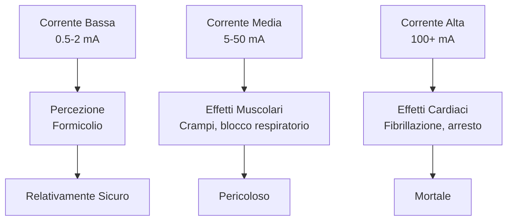
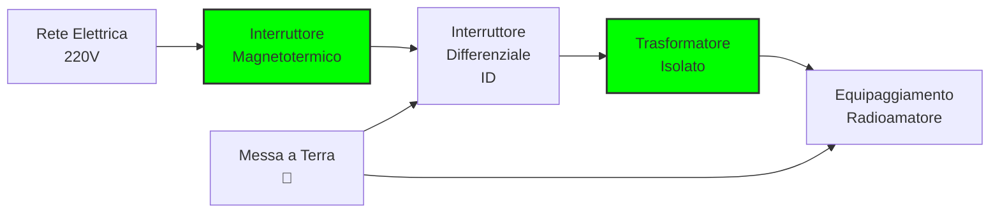
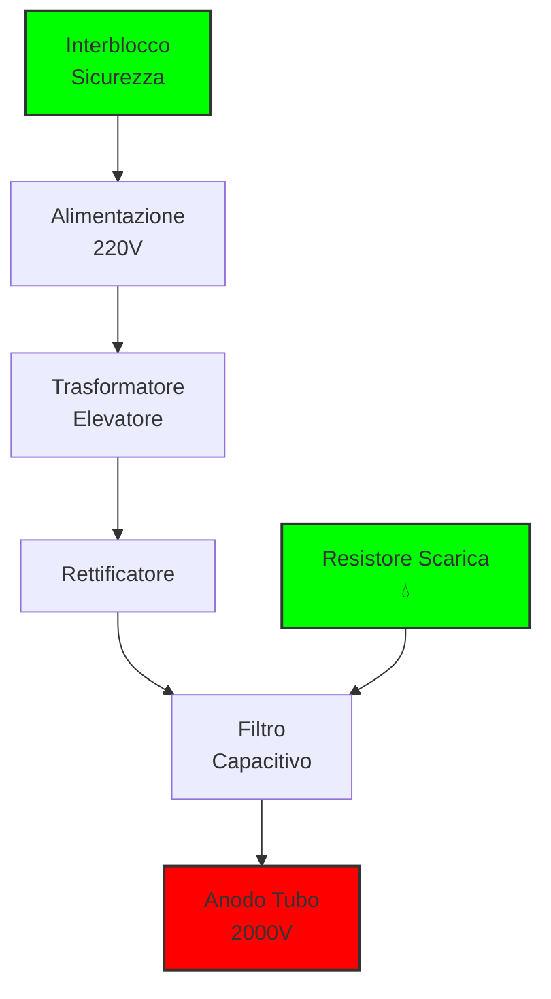
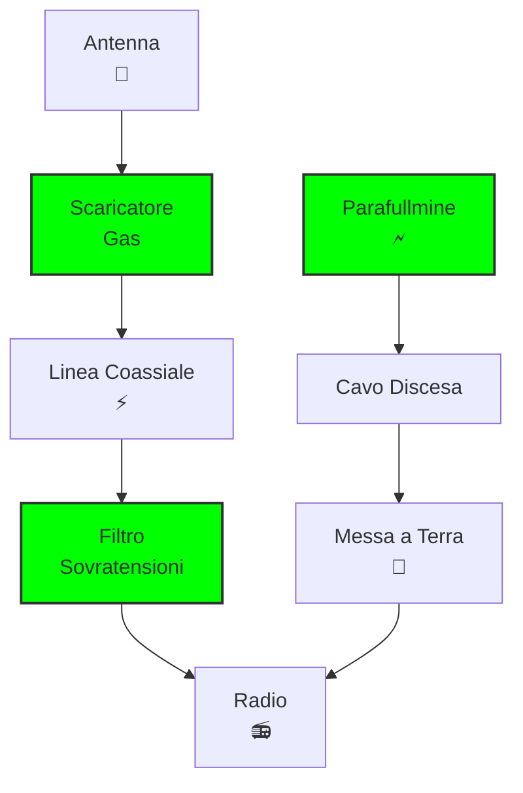

# 10. Protezione Elettrica: Sicurezza Prima di Tutto ⚡🛡️

Benvenuti nel cruciale mondo della protezione elettrica! Come radioamatori, lavoriamo con apparecchiature che possono essere pericolose se non maneggiate correttamente. La **protezione elettrica** non è solo una questione di sopravvivenza, ma anche di responsabilità verso gli altri. Scopriamo insieme come proteggere noi stessi, le nostre attrezzature e l'ambiente dalle insidie elettriche!

## 👤 Il Corpo Umano e l'Elettricità

Il nostro corpo è un conduttore elettrico eccellente! L'acqua nei tessuti (circa 70% del peso corporeo) rende possibile il passaggio della corrente.

### Effetti della Corrente sul Corpo Umano

| Corrente (mA) | Effetto sul Corpo |
|---------------|-------------------|
| 0.5-2 | Soglia di percezione (formicolio) |
| 5-10 | Dolore muscolare, impossibilità di rilasciare |
| 20-50 | Difficoltà respiratorie, irregolarità cardiache |
| 100-200 | Fibrillazione ventricolare (morte) |
| 2000+ | Arresto cardiaco immediato |

### Percorsi della Corrente nel Corpo

La corrente segue il percorso di minor resistenza:
- **Mano-mano**: Attraverso il torace (pericoloso!)
- **Mano-piedi**: Attraverso il cuore (molto pericoloso!)
- **Piede-piede**: Meno critico

### Diagramma Effetti della Corrente

### Fattori di Rischio
- **Frequenza**: La corrente alternata 50/60 Hz è più pericolosa della continua
- **Durata**: Più lunga è l'esposizione, più grave il danno
- **Resistenza cutanea**: Pelle umida = minor resistenza = maggior corrente
- **Stato di salute**: Problemi cardiaci aumentano il rischio

## 🔌 Sistemi di Alimentazione Sicuri

I radioamatori utilizzano diversi sistemi di alimentazione, ognuno con rischi specifici.

### Alimentazione da Rete Elettrica

**Pericoli principali:**
- **Contatto diretto**: Tocco di parti sotto tensione
- **Contatto indiretto**: Guasto che mette sotto tensione parti normalmente a terra
- **Arco elettrico**: Scarica tra conduttori

### Protezioni Fondamentali

1. **Interruttore Differenziale (ID)**: Rileva squilibri di corrente
2. **Interruttore Magnetotermico**: Protegge da sovraccarichi e cortocircuiti
3. **Messa a Terra**: Scarica le tensioni di guasto
4. **Isolamento Doppio**: Strato isolante supplementare

### Diagramma Sistema di Alimentazione Sicuro

### Alimentatori Switching vs Lineari

| Tipo | Vantaggi Sicurezza | Svantaggi Sicurezza |
|------|-------------------|-------------------|
| **Lineare** | Isolamento galvanico, sovraccarico limitato | Peso elevato, calore |
| **Switching** | Efficienza, isolamento | Filtri EMC complessi, componenti critici |

## ⚡ Alte Tensioni: Gestione del Pericolo

Le alte tensioni sono presenti in molti circuiti radioamatoriali, specialmente negli stadi finali di potenza.

### Classi di Tensione

- **Bassa Tensione (BT)**: Fino a 1000V AC / 1500V DC
- **Alta Tensione (AT)**: Oltre 1000V AC / 1500V DC
- **Molto Alta Tensione (MAT)**: Oltre 50kV

### Rischi nelle Trasmissioni

**Amplificatori di Potenza:**
- **Anodo/Drain**: Tensioni fino a 3000V in tubi, 500V+ in transistor
- **Linee di alimentazione**: Correnti elevate (10-50A)

**Antenne:**
- **Cariche statiche**: Accumulo di elettricità atmosferica
- **Induzione**: Campi elettrici indotti

### Misure di Sicurezza

1. **Scariche Capacitive**: Condensatori di scarica
2. **Resistori di Sanguinamento**: Scaricano tensioni residue
3. **Bloccaggio Interblocchi**: Previene acceso con parti esposte
4. **Guanti Dielettrici**: Isolamento per manutenzione

### Esempio Pratico: Sicurezza in un Amplificatore Lineare

## 🌩️ Fulmini: Il Nemico Invisibile

I fulmini sono scariche elettriche naturali con energia devastante.

### Caratteristiche dei Fulmini

- **Tensione**: Fino a 100 milioni di volt
- **Corrente**: 10-100 kA (migliaia di ampere!)
- **Durata**: 10-100 microsecondi
- **Energia**: Equivalente a 1 kg di TNT

### Effetti sui Sistemi Radioamatoriali

1. **Induzione Diretta**: Colpisce antenna o struttura
2. **Induzione Indiretta**: Campi elettromagnetici inducono tensioni
3. **Sovratensioni**: Propagazione lungo linee

### Protezione da Fulmini

#### 1. **Parafullmine (Lightning Rod)**
- Punta metallica sulla sommità dell'edificio
- Cavo di discesa verso terra
- Dispersione nel terreno

#### 2. **Protezione delle Antenne**
- **Disconnessione automatica**: Scaricatori a gas/spark gap
- **Linee bilanciate**: Riduzione induttanza comune
- **Messa a terra separata**: Per antenna e struttura

#### 3. **Protezione degli Apparati**
- **Filtri di linea**: Soppressori di sovratensioni
- **Diodi di protezione**: TVS, varistor
- **Isolatori ottici**: Separazione galvanica

### Diagramma Sistema di Protezione Fulmini

### Esempio di Installazione Sicura

**Configurazione raccomandata per stazione radioamatore:**
- Parafullmine a 2m sopra l'antenna più alta
- Cavo di rame 16mm² per discesa
- Terra con 4-6 picchetti da 1.5m
- Resistenza terra < 10 ohm

## 🛠️ Procedure di Sicurezza Operative

### Prima di Lavorare

1. **Spegnere e scollegare**: Sempre!
2. **Scaricare condensatori**: Usare resistori di scarica
3. **Verificare tensione**: Multimetro digitale
4. **Isolare l'area**: Segnaletica di pericolo

### Durante il Lavoro

- **Una mano in tasca**: Previene circuiti attraverso il cuore
- **Utensili isolati**: Manici in gomma
- **Occhiali protettivi**: Contro archi elettrici
- **Assistenza**: Mai lavorare da soli su circuiti pericolosi

### In Caso di Incidente

1. **Scollegare l'alimentazione**: Interruttore principale
2. **Allontanare la vittima**: Se sicuro
3. **Chiamare soccorso**: 118 in Italia
4. **Rianimazione**: RCP se addestrati
5. **Non toccare**: Se vittima ancora in contatto

## 📊 Normative di Sicurezza

### In Italia

- **CEI 64-8**: Impianti elettrici utilizzatori
- **Decreto Legislativo 81/2008**: Sicurezza sul lavoro
- **Norme ARI**: Specifiche per radioamatori

### Certificazioni

- **IPXX**: Protezione contro corpi solidi e liquidi
- **Classe I/II/III**: Livelli di isolamento
- **CAT I/II/III/IV**: Categorie di sovratensioni per strumenti

## 🧠 Quiz di Ripasso

Testa le tue conoscenze sulla protezione elettrica!

### Domanda 1: Qual è la corrente più pericolosa per il cuore umano?
- A) 1 mA
- B) 10 mA
- C) 100 mA
- D) 1000 mA

  
Risposta

  
<strong>C) 100 mA</strong>

  
Correnti di 100 mA possono causare fibrillazione ventricolare fatale.

### Domanda 2: Cosa fa un interruttore differenziale?
- A) Protegge da sovraccarichi
- B) Rileva correnti di guasto verso terra
- C) Limita la tensione massima
- D) Filtra le interferenze

  
Risposta

  
<strong>B) Rileva correnti di guasto verso terra</strong>

  
L'ID interrompe l'alimentazione quando rileva uno squilibrio tra corrente di andata e ritorno, tipico di contatti indiretti.

### Domanda 3: In un amplificatore lineare, cosa scarica i condensatori di filtro dopo lo spegnimento?
- A) L'interruttore principale
- B) Il resistore di sanguinamento
- C) Il trasformatore
- D) L'alimentatore switching

  
Risposta

  
<strong>B) Il resistore di sanguinamento</strong>

  
Questo resistore permette una scarica lenta e sicura delle tensioni residue nei condensatori.

### Domanda 4: Qual è la funzione principale di un parafulmine?
- A) Attirare i fulmini
- B) Fornire energia gratuita
- C) Scaricare a terra le cariche elettriche
- D) Amplificare i segnali radio

  
Risposta

  
<strong>C) Scaricare a terra le cariche elettriche</strong>

  
Il parafulmine intercetta le scariche atmosferiche e le convoglia verso terra in sicurezza.

### Domanda 5: In caso di folgorazione, la prima azione da compiere è...
- A) Iniziare la rianimazione
- B) Chiamare il medico
- C) Scollegare l'alimentazione
- D) Muovere la vittima

  
Risposta

  
<strong>C) Scollegare l'alimentazione</strong>

  
Prima di tutto bisogna interrompere il contatto con la sorgente di corrente per evitare ulteriori danni.

## Conclusione

La protezione elettrica è fondamentale per ogni radioamatore. Conoscere i rischi, applicare le protezioni appropriate e seguire procedure sicure permette di godere dell'hobby senza pericoli. Ricordate: la sicurezza non è negoziabile! ⚡🛡️

---
[Torna al README](../README.md) | [Precedente: 9.3 Protezione contro i disturbi](../09_Disturbi_Protezione/9.3_Protezione_contro_i_disturbi.md) | [Successivo: 1 Codice Q](../B_Operativa/1_Codice_Q.md)</content>
<parameter name="filePath">10_Protezione_Elettrica/10_Protezione_Elettrica.md