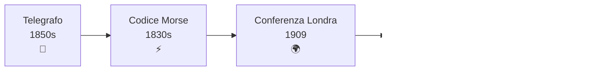
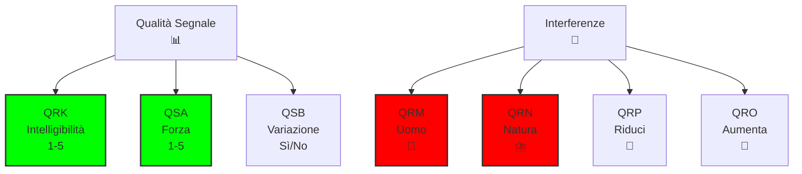
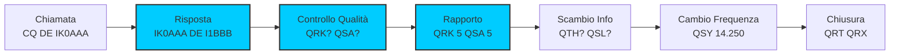

# B.1 Codice Q: Il Linguaggio Universale dei Radioamatori 📻💬

Benvenuti nel affascinante mondo del codice Q! Questo sistema di codici abbreviati è il linguaggio universale dei radioamatori, permettendo comunicazioni rapide ed efficienti in tutto il mondo. Nato nel telegrafo del XIX secolo, il codice Q continua a essere uno strumento essenziale per gli operatori radio. Scopriamo insieme questo sistema che rende le nostre conversazioni più veloci e precise!

## 📜 Storia del Codice Q

Il codice Q nacque nel 1909 durante la Conferenza Radiotelegrafica Internazionale di Londra.

### Origini

- **Inventore**: Non attribuito specificamente
- **Scopo**: Standardizzare le comunicazioni telegrafiche
- **Prima apparizione**: Codice internazionale del 1912
- **Evoluzione**: Adattato alle radiocomunicazioni

### Perché "Q"?

- **Convenzione**: La lettera Q era poco usata nei messaggi normali
- **Significato**: "Question" (domanda) o semplicemente distintiva
- **Efficacia**: Tre lettere per esprimere concetti complessi

### Diagramma Evoluzione Codice Q

## 🔤 Struttura del Codice Q

Ogni codice Q è composto da tre lettere: Q + due lettere significative.

### Formato Standard

- **Q**: Identificatore del codice
- **Prima lettera**: Categoria generale
- **Seconda lettera**: Specifica il significato

### Tipi di Codici Q

1. **Codici domanda**: Finiscono con ? (es. QRK?)
2. **Codici affermazione**: Senza ? (es. QRK)
3. **Codici risposta**: Risposta alla domanda corrispondente

### Esempio di Coppia Q
- **Domanda**: QRK? (Qual è l'intelligibilità del mio segnale?)
- **Risposta**: QRK 5 (L'intelligibilità dei vostri segnali è 5 - eccellente)

## 📊 Codici Q Principali

### Qualità del Segnale

| Codice | Domanda | Risposta | Scala |
|--------|---------|----------|-------|
| **QRK** | Qual è l'intelligibilità del mio segnale? | L'intelligibilità dei vostri segnali è... | 1-5 (5=eccellente) |
| **QSA** | Qual è la forza dei miei segnali? | La forza dei vostri segnali è... | 1-5 (5=fortissimo) |
| **QSB** | La forza dei miei segnali varia? | La forza dei vostri segnali varia | - |

### Interferenze e Disturbi

| Codice | Domanda | Risposta | Note |
|--------|---------|----------|------|
| **QRM** | Siete disturbati? | Sono disturbato | Interferenza artificiale |
| **QRN** | Siete disturbati da rumori atmosferici? | Sono disturbato da rumori atmosferici | Rumori naturali |
| **QRP** | Debbo diminuire la potenza? | Diminuite la potenza | Interferenza |
| **QRO** | Debbo aumentare la potenza? | Aumentate la potenza | Segnale debole |

### Diagramma Codici Qualità

## 🎯 Codici Operativi

### Controllo del Traffico

| Codice | Domanda | Risposta | Uso |
|--------|---------|----------|-----|
| **QRT** | Debbo cessare la trasmissione? | Cessate la trasmissione | Fine QSO |
| **QRX** | Quando mi richiamerete? | Vi richiamerò alle ore... | Pausa |
| **QRV** | Siete pronto? | Sono pronto | Conferma disponibilità |
| **QRZ** | Da chi sono chiamato? | Siete chiamato da... | Identificazione |

### Cambio Frequenza

| Codice | Domanda | Risposta | Esempio |
|--------|---------|----------|---------|
| **QSY** | Debbo cambiare frequenza? | Trasmettete su... kHz/MHz | QSY 14.250 |
| **QSY?** | Su quale frequenza trasmetto? | Trasmettete su... | Richiesta info |

### Comunicazione e Conferma

| Codice | Domanda | Risposta | Note |
|--------|---------|----------|------|
| **QSL** | Potete darmi conferma di ricezione? | Do conferma di ricezione | QSL card |
| **QSO** | Potete comunicare direttamente con...? | Posso comunicare direttamente con... | Contatto |
| **QTH** | Qual è la vostra posizione? | La mia posizione è... | QTH Roma |

## 📈 Codici Q Avanzati

### Codici Meteo e Condizioni

| Codice | Significato | Uso |
|--------|-------------|-----|
| **QFE** | Pressione atmosferica all'altitudine del campo | Aviazione |
| **QFF** | Pressione atmosferica ridotta al livello del mare | Meteo |
| **QFU** | Direzione della pista in uso | Aviazione |
| **QNH** | Pressione atmosferica al livello del mare | Altimetri |

### Codici di Servizio

| Codice | Significato | Uso |
|--------|-------------|-----|
| **QRA** | Il nome della mia stazione è... | Identificazione |
| **QRG** | La mia frequenza esatta è... | Precisione |
| **QRH** | La mia frequenza varia? | Instabilità |
| **QRI** | Il tono della mia trasmissione è... | Qualità audio |

### Codici di Localizzazione

| Codice | Significato | Esempio |
|--------|-------------|---------|
| **QRA** | Nome stazione | QRA Milano |
| **QRB** | Distanza da... | QRB 500 km |
| **QRF** | La mia frequenza è... | QRF 14.200 MHz |
| **QRJ** | Siete diretti a...? | QRJ New York |

## 💬 Uso Pratico del Codice Q

### Esempio di QSO con Codice Q

**Stazione A:** CQ CQ DE IK0AAA K  
**Stazione B:** IK0AAA DE I1BBB K  
**Stazione A:** I1BBB DE IK0AAA QRK? K  
**Stazione B:** IK0AAA DE I1BBB QRK 5 QSA 5 QSB NIL K  
**Stazione A:** I1BBB DE IK0AAA QSL QSY 14.250 QRT? K  
**Stazione B:** IK0AAA DE I1BBB QSL QSY 14.250 QRX 30 MIN K  

### Traduzione
- QRK? → Qual è l'intelligibilità?
- QRK 5 → Intelligibilità eccellente
- QSA 5 → Forza segnale eccellente
- QSB NIL → Nessuna variazione
- QSL → Conferma ricezione
- QSY 14.250 → Cambio frequenza
- QRT? → Devo cessare?
- QRX 30 MIN → Ti richiamo tra 30 minuti

### Diagramma Flusso QSO

## 🎯 Codici Q nei Contest

Durante le gare radioamatoriali, il codice Q è essenziale per velocità.

### Sequenza Contest Tipica

1. **Chiamata**: CQ TEST DE IK0AAA
2. **Risposta**: IK0AAA DE I1BBB
3. **Rapporto**: 599 001 (numero seriale)
4. **Conferma**: QSL TU QRZ?
5. **Nuovo contatto**: Continua...

### Codici Contest Comuni

- **599**: Rapporto perfetto (5-9-9)
- **TU**: Thank you
- **QRZ?**: Chi mi chiama?
- **AGN**: Again (ripeti)
- **PSE**: Please

## 🌍 Codice Q Internazionale

Il codice Q è riconosciuto universalmente in tutti i servizi di radiocomunicazione.

### Standardizzazione

- **ITU**: Approvato dall'Unione Internazionale delle Telecomunicazioni
- **ICAO**: Usato in aviazione
- **IMO**: Usato in marina
- **Amatoriale**: Parte integrante del servizio

### Vantaggi

- **Universalità**: Compreso in ogni lingua
- **Brevità**: Tre lettere per concetti complessi
- **Precisione**: Elimina ambiguità
- **Velocità**: Comunicazioni più rapide

## 🧠 Quiz di Ripasso

Testa le tue conoscenze sul codice Q!

### Domanda 1: Cosa significa QRK?
- A) Forza del segnale
- B) Intelligibilità del segnale
- C) Variazione del segnale
- D) Disturbo artificiale

  
Risposta

  
<strong>B) Intelligibilità del segnale</strong>

  
QRK misura quanto chiaramente si sente il segnale, su scala 1-5.

### Domanda 2: Qual è la differenza tra QRM e QRN?
- A) QRM è rumore, QRN è interferenza
- B) QRM è artificiale, QRN è naturale
- C) QRM è forte, QRN è debole
- D) QRM è HF, QRN è VHF

  
Risposta

  
<strong>B) QRM è artificiale, QRN è naturale</strong>

  
QRM indica interferenze da altre trasmissioni, QRN da rumori atmosferici.

### Domanda 3: Cosa significa QSY?
- A) Cessare trasmissione
- B) Cambiare frequenza
- C) Aumentare potenza
- D) Diminuire velocità

  
Risposta

  
<strong>B) Cambiare frequenza</strong>

  
QSY indica il cambio di frequenza di trasmissione.

### Domanda 4: Quale codice si usa per chiedere conferma di ricezione?
- A) QRV
- B) QSL
- C) QRZ
- D) QSO

  
Risposta

  
<strong>B) QSL</strong>

  
QSL significa "Do conferma di ricezione" e dà origine alle QSL card.

### Domanda 5: Cosa indica QSB?
- A) Segnale forte
- B) Segnale variabile
- C) Segnale debole
- D) Segnale stabile

  
Risposta

  
<strong>B) Segnale variabile</strong>

  
QSB indica che la forza del segnale varia nel tempo.

## Conclusione

Il codice Q è molto più di un semplice sistema di abbreviazioni: è il linguaggio che unisce radioamatori di tutto il mondo. Dalla sua nascita nel telegrafo alla sua evoluzione digitale, continua a facilitare comunicazioni efficienti e precise. Imparare il codice Q significa diventare parte di una tradizione centenaria che rende l'etere più comprensibile per tutti! 📻💬

---
[Torna al README](../README.md) | [Precedente: 10 Protezione Elettrica](../10_Protezione_Elettrica/10_Protezione_Elettrica.md) | [Successivo: 2 Abbreviazioni Operative](./2_Abbreviazioni_Operative.md)</content>
<parameter name="filePath">B_Operativa/1_Codice_Q.md