# B.3 Segnali Internazionali di Soccorso: Quando l'Etere Salva Vite 🚨📻

Benvenuti nel mondo cruciale dei segnali di soccorso! Come radioamatori, abbiamo il privilegio e la responsabilità di essere parte del sistema globale di soccorso. I segnali di emergenza sono codici universali che possono salvare vite umane in situazioni di pericolo. Scopriamo insieme questi segnali vitali, le procedure di emergenza e il ruolo speciale dei radioamatori nelle catastrofi naturali!

## 🚨 I Segnali di Soccorso

I segnali di soccorso sono codici internazionali standardizzati, riconosciuti in tutto il mondo.

### Il Segnale Universale: SOS

**SOS** è il segnale di soccorso più famoso e universale.

#### In Radiotelegrafia (CW/Morse)
- **Codice**: ...---... (tre punti, tre linee, tre punti)
- **Ripetizione**: Continuamente fino a risposta
- **Origine**: 1905, convenzione di Berlino
- **Significato**: Nessun significato letterale, solo segnale di emergenza

#### Diagramma SOS in Morse

```mermaid
graph LR;
    S["S<br>..."] --> O1["O<br>---"];
    O1 --> S2["S<br>..."];
    S2 --> Ripeti["Ripeti<br>🔄"];
    Ripeti --> S;
    classDef emergenza fill:#f00,stroke:#333,stroke-width:4px;
    class S,O1,S2 emergenza;
```


### MAYDAY: Il Grido di Soccorso Vocale

**MAYDAY** è la parola di soccorso internazionale per radiotelefonia.

#### Caratteristiche
- **Pronuncia**: /ˈmeɪdeɪ/ (come "may day")
- **Origine**: Francese "m'aider" (aiutatemi)
- **Uso**: Situazioni di pericolo imminente
- **Ripetizione**: Tre volte all'inizio

#### Esempio Trasmissione MAYDAY
"MAYDAY MAYDAY MAYDAY - Questo è IK0AAA - Posizione: 41° 54' N, 012° 29' E - Barca in difficoltà, acqua in entrata - Richiedo assistenza immediata"

## 📞 Segnali di Urgenza e Sicurezza

Oltre al soccorso, esistono segnali per situazioni meno critiche ma importanti.

### PAN PAN: Segnale di Urgenza

- **Significato**: Situazione urgente ma non immediato pericolo di vita
- **Uso**: Problemi medici, guasti tecnici, richieste assistenza
- **Ripetizione**: Tre volte
- **Esempio**: "PAN PAN PAN - Questo è IK0AAA - Problema medico a bordo"

### SÉCURITÉ: Segnale di Sicurezza

- **Significato**: Informazioni importanti per sicurezza navigazione
- **Uso**: Avvisi meteo, ostacoli, informazioni sicurezza
- **Ripetizione**: Una volta
- **Esempio**: "SÉCURITÉ SÉCURITÉ SÉCURITÉ - Avviso tempesta in avvicinamento"

### Tabella Segnali di Emergenza


## 📻 Procedure di Emergenza per Radioamatori

### Quando Trasmettere un Segnale di Soccorso

1. **Valutare la situazione**: È davvero un'emergenza?
2. **Provare altri mezzi**: Telefono, VHF marino, cellulare
3. **Usare frequenza appropriata**: 2182 kHz (MF), 156.8 MHz (VHF marino)
4. **Essere precisi**: Informazioni chiare e concise

### Struttura del Messaggio MAYDAY

1. **Identificazione segnale**: MAYDAY MAYDAY MAYDAY
2. **Identificazione stazione**: Questo è [indicativo]
3. **Posizione**: Coordinate GPS o descrizione
4. **Natura emergenza**: Cosa è successo
5. **Tipo assistenza**: Cosa serve
6. **Altre informazioni**: Numero persone, condizioni, etc.

### Esempio Completo
```
MAYDAY MAYDAY MAYDAY
Questo è IK0AAA IK0AAA IK0AAA
Posizione: 41 gradi 54 minuti Nord, 012 gradi 29 minuti Est
Imbarcazione in difficoltà, motore spento, deriva verso scogli
Richiedo assistenza immediata, 4 persone a bordo
Fine messaggio
```

## 🌍 Risoluzione UIT 640

La **Risoluzione 640** dell'UIT regola l'uso delle stazioni radioamatoriali in caso di catastrofi.

### Contenuto Principale

- **Autorizzazione**: Radioamatori possono assistere in emergenze
- **Limitazioni**: Solo quando sistemi normali falliscono
- **Coordinamento**: Con autorità nazionali competenti
- **Frequenze**: Uso di bande radioamatoriali designate

### Condizioni di Utilizzo

1. **Emergenza reale**: Catastrofe naturale o situazione critica
2. **Autorizzazione**: Da autorità competenti (Protezione Civile, etc.)
3. **Coordinamento**: Con centri di emergenza ufficiali
4. **Limitato nel tempo**: Solo per durata emergenza

## 🌊 Utilizzo Internazionale in Catastrofi

### Scenario di Catastrofe

Immaginiamo un terremoto che distrugge le infrastrutture di comunicazione:

1. **Valutazione**: Sistemi normali fuori uso
2. **Attivazione**: Autorità dichiara emergenza radioamatoriale
3. **Coordinamento**: Centro di emergenza coordina radioamatori
4. **Operazioni**: Radioamatori forniscono comunicazioni di backup

### Esempio Storico: Terremoto in Italia

Durante il terremoto dell'Aquila 2009:
- Radioamatori italiani attivati dalla Protezione Civile
- Comunicazioni di emergenza su bande HF/VHF
- Coordinamento con centri di soccorso
- Supporto per oltre 72 ore

## 📊 Bande di Frequenze per Emergenze

### Frequenze Designate per Catastrofi

| Banda | Frequenza | Uso | Note |
|-------|-----------|-----|------|
| **80m** | 3.600 MHz | Emergenze HF | Buona copertura |
| **40m** | 7.110 MHz | Emergenze HF | Ottima DX |
| **20m** | 14.300 MHz | Emergenze HF | Mondiale |
| **2m** | 145.500 MHz | Emergenze VHF | Locale |
| **70cm** | 433.500 MHz | Emergenze UHF | Locale |

### Frequenze Internazionali di Soccorso

- **2182 kHz**: Frequenza internazionale soccorso MF
- **156.8 MHz**: Canale 16 VHF marino
- **243 MHz**: Emergenza aeronautica
- **121.5 MHz**: ELT aeronautico

### Diagramma Frequenze Emergenza

```mermaid
graph TD;
    Emergenza["Emergenza<br>🚨"] --> HF["HF<br>3-30 MHz"];
    Emergenza --> VHF["VHF<br>30-300 MHz"];
    Emergenza --> UHF["UHF<br>300-3000 MHz"];
    HF --> Banda80["80m<br>3.6 MHz"];
    HF --> Banda40["40m<br>7.11 MHz"];
    HF --> Banda20["20m<br>14.3 MHz"];
    VHF --> Banda2m["2m<br>145.5 MHz"];
    UHF --> Banda70cm["70cm<br>433.5 MHz"];
    classDef frequenza fill:#f90,stroke:#333,stroke-width:2px;
    class Banda80,Banda40,Banda20,Banda2m,Banda70cm frequenza;
```


## 🏃 Procedure Operative in Emergenza

### Preparazione

1. **Addestramento**: Partecipare a esercitazioni A.R.I.
2. **Equipaggiamento**: Generatore, antenne di backup
3. **Contatti**: Lista autorità locali
4. **Procedure**: Conoscere protocolli locali

### Durante l'Emergenza

1. **Ascolto**: Monitorare frequenze di emergenza
2. **Attendere chiamata**: Non trasmettere se non richiesto
3. **Rispondere**: Solo se autorizzati
4. **Coordinare**: Seguire istruzioni del coordinatore

### Dopo l'Emergenza

1. **Resoconto**: Compilare rapporto attività
2. **Restauro**: Tornare a operazioni normali
3. **Lezioni**: Analizzare cosa migliorare
4. **Ringraziamenti**: Riconoscere contributi

## 🌐 Il Ruolo dei Radioamatori nelle Emergenze

### Vantaggi Unici

- **Copertura globale**: HF per comunicazioni mondiali
- **Indipendenza**: Funzionano senza infrastrutture
- **Volontariato**: Disponibili 24/7 gratuitamente
- **Tecnica**: Competenze specialistiche

### Esempi di Successo

- **Uragano Katrina 2005**: Radioamatori USA fornirono comunicazioni per settimane
- **Terremoto Haiti 2010**: Coordinamento internazionale soccorso
- **Alluvione Pakistan 2010**: Comunicazioni di emergenza in aree isolate

### Diagramma Ruolo Radioamatori

```mermaid
graph TD;
    Catastrofe["Catastrofe<br>🌪️"] --> SistemiNormali["Sistemi Normali<br>💥"];
    SistemiNormali --> Emergenza["Emergenza<br>🚨"];
    Emergenza --> Autorita["Autorità<br>🏛️"];
    Autorita --> Radioamatori["Radioamatori<br>📻"];
    Radioamatori --> Comunicazioni["Comunicazioni<br>Backup<br>🔄"];
    Comunicazioni --> Soccorso["Soccorso<br>🛟"];
    classDef eroe fill:#0f0,stroke:#333,stroke-width:2px;
    class Radioamatori eroe;
```


## 📋 Codici e Procedure Speciali

### Codici di Emergenza Radioamatoriali

- **EMERGENCY**: Situazione di emergenza generale
- **PRIORITY**: Traffico prioritario (non immediato pericolo)
- **WELFARE**: Messaggi di benessere/famiglia
- **ROUTINE**: Traffico normale

### Procedure NTS (National Traffic System)

1. **Ricezione**: Accettare messaggio
2. **Conferma**: Verificare contenuto
3. **Trasmissione**: Inoltrare correttamente
4. **Conferma consegna**: Notificare completamento

## ⚖️ Aspetti Legali e Responsabilità

### Autorizzazioni

- **Licenza valida**: Sempre richiesta
- **Autorizzazione emergenza**: Da autorità competenti
- **Limitazioni**: Solo per scopi di soccorso
- **Responsabilità**: Uso corretto delle frequenze

### Assicurazioni

- **Copertura**: Verificare polizza radioamatoriale
- **Emergenze**: Attività volontaria spesso coperta
- **Responsabilità civile**: Protezione da reclami

## 🧠 Quiz di Ripasso

Testa le tue conoscenze sui segnali internazionali di soccorso!

### Domanda 1: Qual è il segnale di soccorso universale in radiotelegrafia?
- A) HELP
- B) SOS
- C) MAYDAY
- D) PAN PAN

<details>
  <summary>Risposta</summary>
  <p><strong>B) SOS</strong></p>
  <p>SOS (...---...) è il segnale di soccorso internazionale in codice Morse.</p>
</details>

### Domanda 2: Cosa significa "MAYDAY" in radiotelefonia?
- A) Situazione urgente
- B) Informazione di sicurezza
- C) Segnale di soccorso
- D) Chiusura comunicazione

<details>
  <summary>Risposta</summary>
  <p><strong>C) Segnale di soccorso</strong></p>
  <p>MAYDAY indica una situazione di pericolo imminente che richiede assistenza immediata.</p>
</details>

### Domanda 3: Quale risoluzione UIT regola l'uso dei radioamatori in catastrofi?
- A) Risoluzione 640
- B) Risoluzione 500
- C) Risoluzione 200
- D) Risoluzione 100

<details>
  <summary>Risposta</summary>
  <p><strong>A) Risoluzione 640</strong></p>
  <p>La Risoluzione 640 dell'UIT autorizza i radioamatori ad assistere in emergenze quando i sistemi normali falliscono.</p>
</details>

### Domanda 4: Quale segnale si usa per situazioni urgenti ma non di pericolo imminente?
- A) SOS
- B) MAYDAY
- C) PAN PAN
- D) SÉCURITÉ

<details>
  <summary>Risposta</summary>
  <p><strong>C) PAN PAN</strong></p>
  <p>PAN PAN indica una situazione urgente che richiede attenzione immediata ma non è un pericolo di vita.</p>
</details>

### Domanda 5: Su quale frequenza HF è designata per emergenze radioamatoriali?
- A) 3.600 MHz
- B) 7.110 MHz
- C) 14.300 MHz
- D) Tutte le precedenti

<details>
  <summary>Risposta</summary>
  <p><strong>D) Tutte le precedenti</strong></p>
  <p>Le bande 80m (3.6 MHz), 40m (7.11 MHz) e 20m (14.3 MHz) sono designate per emergenze radioamatoriali.</p>
</details>

## Conclusione

I segnali internazionali di soccorso rappresentano il ponte tra la tecnologia radioamatoriale e il salvataggio di vite umane. Come radioamatori, siamo parte di una rete globale di solidarietà che può fare la differenza in momenti critici. Conoscere questi segnali, rispettare le procedure e prepararsi adeguatamente significa essere pronti a servire la comunità quando più ne ha bisogno. L'etere non è solo comunicazione, ma anche protezione e soccorso! 🚨📻

---
[Torna al README](../README.md) | [Precedente: 2 Abbreviazioni Operative](./2_Abbreviazioni_Operative.md) | [Successivo: 4 Indicativi di Chiamata](./4_Indicativi_Chiamata.md)</content>
<parameter name="filePath">B_Operativa/3_Segnali_Internazionali_Soccorso.md