# B.5 Piani di Frequenze della IARU: L'Organizzazione dell'Etere 📻📊

Benvenuti nel mondo organizzato dei piani di frequenze IARU! L'**International Amateur Radio Union** coordina l'uso armonioso delle bande radioamatoriali in tutto il mondo, prevenendo interferenze e massimizzando le opportunità di comunicazione. Scopriamo insieme questi piani dettagliati che rendono possibile l'ordine nell'etere caotico delle radiofrequenze!

## 🏛️ Che cos'è la IARU?

L'**International Amateur Radio Union** è l'organizzazione mondiale che rappresenta i radioamatori presso l'ITU e le autorità nazionali.

### Struttura della IARU

- **Fondazione**: 1925
- **Sede**: Newington, Connecticut (USA)
- **Membri**: 160 associazioni nazionali
- **Obiettivo**: Promuovere il radioamatoriale mondiale

### Organizzazione Regionale

La IARU è divisa in **3 regioni** corrispondenti all'ITU:

- **Regione 1**: Europa, Africa, Medio Oriente
- **Regione 2**: Americhe
- **Regione 3**: Asia, Oceania

### Diagramma Organizzazione IARU


## 🎯 Obiettivi dei Piani di Frequenze

I piani IARU hanno obiettivi chiari per l'uso efficiente dello spettro.

### Obiettivi Principali

1. **Prevenire interferenze**: Separare modi e usi incompatibili
2. **Massimizzare opportunità**: Consentire diversi tipi di comunicazione
3. **Standardizzazione**: Procedure uniformi mondiali
4. **Evoluzione**: Adattarsi a nuove tecnologie

### Benefici per i Radioamatori

- **Ordine**: Frequenze prevedibili per ogni attività
- **Sicurezza**: Riduzione conflitti tra stazioni
- **Efficienza**: Uso ottimale delle bande limitate
- **Internazionalità**: Stessi piani in tutto il mondo

## 📊 Struttura dei Piani per Banda

Ogni banda ha un piano dettagliato con segmenti dedicati a diversi modi e usi.

### Panoramica Allocazione Bande HF


*Figura: Allocazione delle bande HF radioamatoriali secondo il piano IARU Regione 1. I colori identificano i diversi modi di emissione.*

### Banda 160m (1.8 MHz)

| Segmento | Frequenza | Uso Principale | Note |
|----------|-----------|----------------|------|
| **CW/Digital** | 1.800-1.810 | CW, Digi | DX |
| **CW** | 1.810-1.830 | CW | Mondiale |
| **SSB** | 1.830-1.850 | SSB | Contatti |
| **CW/Digital** | 1.850-1.880 | CW, Digi | DX |
| **SSB** | 1.880-2.000 | SSB | Contatti |

### Diagramma Banda 160m


## 🌍 Differenze Regionali

I piani variano leggermente tra le regioni per adattarsi alle esigenze locali.

### Regione 1 (Europa/Africa)

- **Enfasi CW/Digital**: Molte stazioni esperte
- **SSB contenuto**: Meno spazio per voce
- **Beacon**: Segmenti dedicati ai beacon

### Regione 2 (Americhe)

- **SSB prominente**: Cultura vocale americana
- **CW ridotto**: Meno operatori CW
- **AM**: Presenza di AM in alcune bande

### Regione 3 (Asia/Oceania)

- **CW forte**: Tradizione asiatica
- **SSB crescente**: Crescita comunità
- **Digital**: Aumento dei modi digitali

### Esempio: Banda 40m
```
Regione 1:     7.000-7.030 CW, 7.030-7.050 Digi, 7.050-7.100 SSB
Regione 2:     7.000-7.025 CW, 7.025-7.125 SSB, 7.125-7.150 Digi
Regione 3:     7.000-7.040 CW, 7.040-7.080 Digi, 7.080-7.100 SSB
```

## 📈 Piani Dettagliati per Banda

### Banda 80m (3.5 MHz)

| Segmento | Frequenza | Uso | Regione 1 | Regione 2 | Regione 3 |
|----------|-----------|-----|-----------|-----------|-----------|
| CW | 3.500-3.520 | CW | ✓ | ✓ | ✓ |
| Digi | 3.520-3.530 | Digi | ✓ | ✓ | ✓ |
| SSB | 3.530-3.570 | SSB | ✓ | ✓ | ✓ |
| CW | 3.570-3.580 | CW | ✓ | ✓ | ✓ |
| Digi | 3.580-3.590 | Digi | ✓ | ✓ | ✓ |
| SSB | 3.590-3.600 | SSB | ✓ | ✓ | ✓ |
| CW | 3.600-3.620 | CW | ✓ | ✓ | ✓ |
| Digi | 3.620-3.630 | Digi | ✓ | ✓ | ✓ |
| SSB | 3.630-3.700 | SSB | ✓ | ✓ | ✓ |
| CW | 3.700-3.720 | CW | ✓ | ✓ | ✓ |
| Digi | 3.720-3.730 | Digi | ✓ | ✓ | ✓ |
| SSB | 3.730-3.750 | SSB | ✓ | ✓ | ✓ |
| CW | 3.750-3.760 | CW | ✓ | ✓ | ✓ |
| Digi | 3.760-3.770 | Digi | ✓ | ✓ | ✓ |
| SSB | 3.770-3.800 | SSB | ✓ | ✓ | ✓ |

### Banda 40m (7 MHz)

| Segmento | Frequenza | Uso | Note |
|----------|-----------|-----|------|
| CW | 7.000-7.030 | CW | DX eccellente |
| Digi | 7.030-7.050 | Digi | FT8, JT65 |
| SSB | 7.050-7.100 | SSB | Contatti mondiali |
| CW | 7.100-7.125 | CW | Secondario |
| Digi | 7.125-7.150 | Digi | Secondario |
| SSB | 7.150-7.200 | SSB | Secondario |

### Banda 20m (14 MHz)

| Segmento | Frequenza | Uso | Popolarità |
|----------|-----------|-----|------------|
| CW | 14.000-14.025 | CW | Alta |
| Digi | 14.025-14.050 | Digi | FT8 dominante |
| SSB | 14.050-14.150 | SSB | Molto usata |
| CW | 14.150-14.175 | CW | Secondario |
| Digi | 14.175-14.200 | Digi | Secondario |
| SSB | 14.200-14.250 | SSB | Secondario |
| CW | 14.250-14.275 | CW | Secondario |
| Digi | 14.275-14.300 | Digi | Secondario |
| SSB | 14.300-14.350 | SSB | Secondario |

## 📡 Bande VHF/UHF

### Panoramica Allocazione VHF/UHF


*Figura: Allocazione delle bande VHF e UHF (2m, 70cm, 23cm) secondo il piano IARU Regione 1.*

### Banda 2m (144 MHz)

| Segmento | Frequenza | Uso | Note |
|----------|-----------|-----|------|
| CW/SSB | 144.000-144.100 | CW/SSB | Aurora, EME |
| FM | 144.100-144.200 | FM | Ripetitori |
| FM | 144.200-144.300 | FM | Simplex |
| CW/SSB | 144.300-144.400 | CW/SSB | Contatti |
| FM | 144.400-144.500 | FM | DX |
| CW/SSB | 144.500-144.600 | CW/SSB | Contatti |
| FM | 144.600-144.800 | FM | Ripetitori |
| CW/SSB | 144.800-144.990 | CW/SSB | Contatti |
| Beacon | 144.990-145.000 | Beacon | Test |

### Banda 70cm (430 MHz)

| Segmento | Frequenza | Uso | Note |
|----------|-----------|-----|------|
| FM | 430.000-430.100 | FM | Ripetitori |
| FM | 430.100-430.200 | FM | Simplex |
| CW/SSB | 430.200-430.300 | CW/SSB | Contatti |
| FM | 430.300-430.400 | FM | DX |
| CW/SSB | 430.400-430.500 | CW/SSB | Contatti |
| FM | 430.500-430.600 | FM | Ripetitori |
| CW/SSB | 430.600-430.700 | CW/SSB | Contatti |
| FM | 430.700-430.800 | FM | DX |
| CW/SSB | 430.800-430.900 | CW/SSB | Contatti |
| FM | 430.900-431.000 | FM | Ripetitori |
| CW/SSB | 431.000-432.000 | CW/SSB | Satellite |

## 🔄 Modi Speciali e Segmenti

### Legenda Modi di Emissione


*Figura: Riepilogo dei modi di emissione con designatori, larghezze di banda e usi tipici.*

### Panoramica Modi Digitali

I modi digitali sono diventati fondamentali nel radioamatorismo moderno. Ecco una panoramica completa:


*Figura: Panoramica completa dei modi digitali radioamatoriali: FT8, RTTY, PSK31, SSTV, FAX, APRS, Winlink e altri.*

### Frequenze Standard Modi Digitali HF


*Figura: Tabella frequenze standard per i principali modi digitali sulle bande HF.*

### Beacon

- **Scopo**: Test propagazione e calibrazione
- **Frequenze**: Segmenti dedicati (es. 14.100 MHz)
- **Modi**: CW, FM continui

### Satellite

- **Uplink**: 145.900-146.000 MHz (2m)
- **Downlink**: 435.000-438.000 MHz (70cm)
- **Modi**: FM, SSB

### EME (Luna)

- **2m**: 144.000-144.100 MHz
- **70cm**: 432.000-432.100 MHz
- **Modo**: CW, SSB

### Aurora

- **Frequenze**: Bande HF basse durante aurore
- **Modo**: CW principalmente
- **Condizioni**: Attività geomagnetica

## 📋 Uso Pratico dei Piani

### Come Leggere un Piano

1. **Identificare banda**: Es. 40m = 7 MHz
2. **Controllare regione**: IARU Region 1 per Italia
3. **Trovare segmento**: Per il modo desiderato
4. **Rispettare limiti**: Non trasmettere fuori segmento

### Esempio Pratico: Contatto SSB su 20m

- **Banda**: 20m (14 MHz)
- **Modo**: SSB
- **Segmento**: 14.050-14.150 MHz (Regione 1)
- **Frequenza tipica**: 14.250 MHz
- **Note**: Evitare 14.100 (beacon)

### Diagramma Uso Piano

```mermaid
graph TD;
    SceltaBanda["Scegli Banda<br>es. 20m"] --> ControllaRegione["Controlla Regione<br>IARU 1"];
    ControllaRegione --> ScegliModo["Scegli Modo<br>es. SSB"];
    ScegliModo --> TrovaSegmento["Trova Segmento<br>14.050-14.150"];
    TrovaSegmento --> SelezionaFreq["Seleziona Frequenza<br>14.250 MHz"];
    SelezionaFreq --> Trasmissione["Trasmissione<br>Consentita ✅"];
    classDef passo fill:#0f0,stroke:#333,stroke-width:2px;
    class SceltaBanda,ControllaRegione,ScegliModo,TrovaSegmento,SelezionaFreq passo;
```


## 📊 Visualizzazioni per Modulazione e Applicazione

Per facilitare la comprensione dei piani di frequenza, ecco alcune visualizzazioni organizzate per tipo di modulazione e per applicazione tipica.

### Frequenze Raggruppate per Modulazione


*Figura: Allocazione delle frequenze raggruppate per tipo di modulazione (CW, SSB, FM, Digitali).*

### Frequenze Raggruppate per Applicazione


*Figura: Allocazione delle frequenze raggruppate per applicazione tipica: DX, comunicazioni locali, contest, modi digitali, sperimentazione ed emergenza.*

## 🇮🇹 Normativa Italiana

### Panoramica Normativa Bande


*Figura: Stato normativo delle bande radioamatoriali in Italia (Primario/Secondario) con note specifiche.*

### Potenze Massime per Banda (Classe A)


*Figura: Limiti di potenza massima per banda secondo la normativa italiana per la patente di classe A.*

## 🎯 Importanza dei Piani IARU

### Per i Radioamatori

- **Ordine**: Evita caos frequenze
- **Efficienza**: Uso ottimale risorse limitate
- **Qualità**: Migliora rapporti segnale
- **Internazionalità**: Standard mondiali

### Per la Comunità

- **Protezione**: Preserva bande da interferenze
- **Innovazione**: Spazio per nuove tecnologie
- **Educazione**: Insegna disciplina tecnica
- **Collaborazione**: Unisce radioamatori mondiali

## 🔄 Aggiornamenti dei Piani

### Processo di Revisione

1. **Proposte**: Da membri IARU
2. **Studi**: Commissioni tecniche
3. **Conferenze**: Approvazione regionale
4. **Pubblicazione**: Nuovi piani

### Adattamenti Moderni

- **Digital**: Nuovi segmenti per FT8, FT4
- **Satellite**: Frequenze dedicate
- **Emergenze**: Bande riservate
- **Nuove bande**: 60m, 4m aggiunte

## 🧠 Quiz di Ripasso

Testa le tue conoscenze sui piani frequenze IARU!

### Domanda 1: Qual è l'obiettivo principale dei piani IARU?
- A) Limitare l'uso delle frequenze
- B) Prevenire interferenze e organizzare l'uso delle bande
- C) Tassare l'uso delle frequenze
- D) Vietare alcuni modi di trasmissione

<details>
  <summary>Risposta</summary>
  <p><strong>B) Prevenire interferenze e organizzare l'uso delle bande</strong></p>
  <p>I piani IARU organizzano l'uso delle frequenze per evitare conflitti e massimizzare l'efficienza.</p>
</details>

### Domanda 2: In quale segmento della banda 20m si trova tipicamente l'SSB?
- A) 14.000-14.025 MHz
- B) 14.025-14.050 MHz
- C) 14.050-14.150 MHz
- D) 14.150-14.175 MHz

<details>
  <summary>Risposta</summary>
  <p><strong>C) 14.050-14.150 MHz</strong></p>
  <p>Il segmento 14.050-14.150 MHz è dedicato all'SSB nella banda 20m.</p>
</details>

### Domanda 3: Quante regioni ha la IARU?
- A) 1
- B) 2
- C) 3
- D) 4

<details>
  <summary>Risposta</summary>
  <p><strong>C) 3</strong></p>
  <p>La IARU ha 3 regioni corrispondenti all'UIT: 1 (Europa/Africa), 2 (Americhe), 3 (Asia/Oceania).</p>
</details>

### Domanda 4: Quale frequenza è tipicamente usata per FT8 su 40m?
- A) 7.000 MHz
- B) 7.030 MHz
- C) 7.050 MHz
- D) 7.100 MHz

<details>
  <summary>Risposta</summary>
  <p><strong>B) 7.030 MHz</strong></p>
  <p>Il segmento 7.030-7.050 MHz è dedicato ai modi digitali come FT8 nella banda 40m.</p>
</details>

### Domanda 5: Cosa sono i "beacon" nei piani IARU?
- A) Stazioni di soccorso
- B) Segnali di test per propagazione
- C) Stazioni ripetitore
- D) Stazioni speciali per contest

<details>
  <summary>Risposta</summary>
  <p><strong>B) Segnali di test per propagazione</strong></p>
  <p>I beacon sono trasmissioni continue usate per testare le condizioni di propagazione.</p>
</details>

## Conclusione

I piani di frequenze IARU sono la colonna portante dell'ordine radioamatoriale mondiale. Senza questi piani dettagliati, l'etere sarebbe un caos di interferenze e conflitti. Rispettandoli, contribuiamo tutti a mantenere un ambiente radio pulito ed efficiente, dove ogni radioamatore può trovare il suo spazio per esplorare l'eccitante mondo delle comunicazioni! 📻📊

---
[Torna al README](../README.md) | [Precedente: 4 Indicativi di Chiamata](./4_Indicativi_Chiamata.md) | [Successivo: 1 Regolamento delle Radiocomunicazioni dell'UIT](../C_Regolamentazione/1_Regolamento_Radiocomunicazioni_UIT.md)</content>
<parameter name="filePath">B_Operativa/5_Piani_Frequenze_IARU.md