# C.3 Legislazione Nazionale: Le Regole Italiane per Radioamatori 📻🇮🇹

Benvenuti nel mondo della legislazione italiana per le radiocomunicazioni! In Italia, l'attività radioamatoriale è regolata da leggi specifiche che garantiscono un uso sicuro e ordinato dello spettro radioelettrico. Come radioamatori italiani, dobbiamo conoscere queste normative per operare legalmente e contribuire al progresso della tecnica. Scopriamo insieme il quadro legislativo che governa le nostre trasmissioni!

## 🏛️ Quadro Legislativo Italiano

La legislazione italiana per le radiocomunicazioni si basa su diversi livelli normativi.

### Leggi Fondamentali

1. **Codice delle Comunicazioni Elettroniche** (Decreto Legislativo 259/2003)
2. **Decreto del Presidente della Repubblica 159/2001**: Regolamento di attuazione
3. **Decreto Ministeriale**: Procedure per esami e licenze
4. **Norme tecniche**: Specifiche tecniche per apparecchiature

### Autorità Competente

- **Ministero dello Sviluppo Economico (MISE)**: Autorità principale
- **Garante per la Protezione dei Dati Personali**: Privacy
- **Ispettorato Territoriale**: Controlli locali
- **ARI (Associazione Radioamatori Italiani)**: Supporto tecnico

### Diagramma Quadro Legislativo

## 📋 Requisiti per la Licenza Radioamatore

Per ottenere la licenza radioamatore in Italia sono necessari specifici requisiti.

### Requisiti Generali

- **Età minima**: 16 anni (con autorizzazione genitori se minorenne)
- **Cittadinanza**: Italiana o comunitaria (possibili eccezioni)
- **Capacità giuridica**: Piena capacità di agire
- **Assenza condanne**: Non aver riportato condanne penali gravi

### Esami Richiesti

#### Classe A (Licenza Completa)

**Esame Teorico:**
- Legislazione e regolamentazione
- Propagazione e antenne
- Elettronica e misure
- Pratica operativa

**Esame Pratico:**
- Dimostrazione di trasmissione e ricezione
- Conoscenza del codice Morse (opzionale per classi superiori)

#### Classi Inferiori

- **Classe B**: Esame semplificato, potenza limitata
- **Classe C**: Corso base, potenza molto limitata

### Diagramma Procedure Licenza

```mermaid
graph TD;
    Candidato["Candidato<br>👤"] --> Requisiti["Verifica<br>Requisiti"];
    Requisiti --> Corso["Corso<br>Preparatorio<br>📚"];
    Corso --> EsameTeorico["Esame<br>Teorico<br>📝"];
    EsameTeorico --> EsamePratico["Esame<br>Pratico<br>🎙️"];
    EsamePratico --> Licenza["Licenza<br>Radioamatore<br>📻"];
    Requisiti --> No["Requisiti non<br>soddisfatti<br>❌"];
    EsameTeorico --> Ripetizione["Ripetizione<br>esame<br>🔄"];
    EsamePratico --> Ripetizione;
    classDef esame fill:#f90,stroke:#333,stroke-width:2px;
    class EsameTeorico,EsamePratico esame;
    classDef successo fill:#0f0,stroke:#333,stroke-width:2px;
    class Licenza successo;
```

## 📊 Classi di Licenza Italiana

Il sistema italiano prevede diverse classi di licenza con diritti progressivi.

### Classe A (Licenza Completa)

| Aspetto | Dettagli |
|---------|----------|
| **Potenza** | Fino a 1000 W (HF), 500 W (VHF/UHF) |
| **Bande** | Tutte le bande radioamatore |
| **Codice Morse** | Non richiesto |
| **Validità** | 10 anni |
| **Costo** | Circa 100-150€ |

### Classe B

| Aspetto | Dettagli |
|---------|----------|
| **Potenza** | Fino a 100 W |
| **Bande** | HF limitate + VHF/UHF |
| **Codice Morse** | Richiesto (12 WPM) |
| **Validità** | 10 anni |
| **Costo** | Circa 80-120€ |

### Classe C (Entrata)

| Aspetto | Dettagli |
|---------|----------|
| **Potenza** | Fino a 10 W |
| **Bande** | Solo VHF/UHF |
| **Codice Morse** | Richiesto (8 WPM) |
| **Validità** | 5 anni |
| **Costo** | Circa 50-80€ |

### Tabella Comparativa Classi

## 📝 Registro di Stazione

Ogni radioamatore deve tenere un registro delle proprie attività.

### Obblighi di Registro

- **Trattenere per 3 anni**: Tutti i registri delle trasmissioni
- **Contenuto minimo**: Data, ora, frequenza, corrispondente, modo
- **Emergenze**: Registrazione separata dei segnali di soccorso
- **Controlli**: Soggetto a verifica da parte delle autorità

### Come Tenere il Registro

#### Metodo Cartaceo
- Quaderno dedicato con colonne predefinite
- Scrittura leggibile e permanente
- Correzione con barratura singola

#### Metodo Digitale
- Software specifici (es. Ham Radio Deluxe)
- Backup regolare
- Firma digitale equivalente

### Dati da Registrare

| Campo | Descrizione | Esempio |
|-------|-------------|---------|
| **Data/Ora** | UTC o locale | 2024-01-15 14:30 UTC |
| **Frequenza** | MHz precisi | 14.250 MHz |
| **Modo** | SSB, CW, FM, etc. | SSB |
| **Corrispondente** | Indicativo | IK0AAA |
| **RST** | Rapporto segnale | 59/57 |
| **Note** | Osservazioni | QSO DX |

### Diagramma Registro di Stazione

## ⚖️ Doveri e Responsabilità

### Doveri del Radioamatore

1. **Identificazione**: Uso corretto dell'indicativo
2. **Non interferenza**: Rispetto di altri servizi
3. **Emergenze**: Priorità ai segnali di soccorso
4. **Aggiornamenti**: Mantenimento licenza valida
5. **Collaborazione**: Con autorità e associazioni

### Responsabilità Penali

- **Interferenze dolose**: Sanzioni amministrative e penali
- **Uso non autorizzato**: Confisca apparecchiature
- **False dichiarazioni**: Revoca licenza
- **Attività commerciale**: Violazione legge

### Sanzioni Amministrative

| Violazione | Sanzione |
|------------|----------|
| Mancata identificazione | € 200-500 |
| Interferenza | € 500-2000 |
| Uso non autorizzato | € 1000-5000 |
| Ripetute violazioni | Revoca licenza |

## 🔄 Rinnovo e Aggiornamenti

### Validità della Licenza

- **Classe A/B**: 10 anni
- **Classe C**: 5 anni
- **Rinnovo**: Automatico con pagamento
- **Aggiornamenti**: Obbligatori per cambiamenti normativi

### Procedure di Rinnovo

1. **Controllo validità**: Verifica scadenza
2. **Pagamento**: Diritti amministrativi
3. **Aggiornamento**: Nuovo certificato
4. **Registrazione**: Nel database nazionale

## 🏆 Benefici della Licenza Italiana

### Diritti e Privilegi

- **Uso spettro**: Bande dedicate radioamatore
- **Sviluppo tecnico**: Costruzione e modifica apparecchiature
- **Partecipazione**: Gare e attività internazionali
- **Riconoscimento CEPT**: Utilizzo temporaneo in Europa

### Esempio Pratico: Attività Giornaliera

Un radioamatore con licenza Classe A può:
- Trasmettere su 40m SSB fino a 400W
- Partecipare a contest internazionali
- Costruire antenne personalizzate
- Operare in mobilità con identificativo /M

## 🧠 Quiz di Ripasso

Testa le tue conoscenze sulla legislazione italiana!

### Domanda 1: Qual è l'età minima per ottenere una licenza radioamatore in Italia?
- A) 14 anni
- B) 16 anni
- C) 18 anni
- D) 21 anni

  
Risposta

  
<strong>B) 16 anni</strong>

  
In Italia è possibile ottenere la licenza radioamatore a 16 anni, con autorizzazione dei genitori se minorenni.

### Domanda 2: Per quanto tempo deve essere conservato il registro di stazione?
- A) 1 anno
- B) 3 anni
- C) 5 anni
- D) 10 anni

  
Risposta

  
<strong>B) 3 anni</strong>

  
Il registro di stazione deve essere conservato per almeno 3 anni ed è soggetto a controlli delle autorità.

### Domanda 3: Qual è la potenza massima per una licenza Classe A?
- A) 100 W
- B) 500 W
- C) 1000 W
- D) Nessun limite

  
Risposta

  
<strong>C) 1000 W</strong>

  
La Classe A permette fino a 1000 W in HF e 500 W in VHF/UHF.

### Domanda 4: Cosa succede se non si identifica correttamente la stazione?
- A) Niente
- B) Sanzione amministrativa
- C) Revoca immediata
- D) Confisca apparecchiature

  
Risposta

  
<strong>B) Sanzione amministrativa</strong>

  
La mancata identificazione comporta sanzioni da 200 a 500 euro.

### Domanda 5: Quale autorità rilascia le licenze radioamatore in Italia?
- A) ARI
- B) Ministero della Difesa
- C) Ministero dello Sviluppo Economico
- D) Polizia Postale

  
Risposta

  
<strong>C) Ministero dello Sviluppo Economico</strong>

  
Il MISE è l'autorità competente per il rilascio e la gestione delle licenze radioamatore.

## Conclusione

La legislazione italiana garantisce un quadro sicuro e moderno per l'attività radioamatoriale. Conoscere e rispettare queste norme non è solo un obbligo legale, ma anche una garanzia di qualità e sicurezza per tutta la comunità radioamatoriale italiana. Operiamo sempre nel rispetto delle regole per un'etere pulito e ordinato! 📻🇮🇹

---
[Torna al README](../README.md) | [Precedente: 2 Regolamentazione della CEPT](./2_Regolamentazione_CEPT.md)</content>
<parameter name="filePath">C_Regolamentazione/3_Legislazione_Nazionale.md