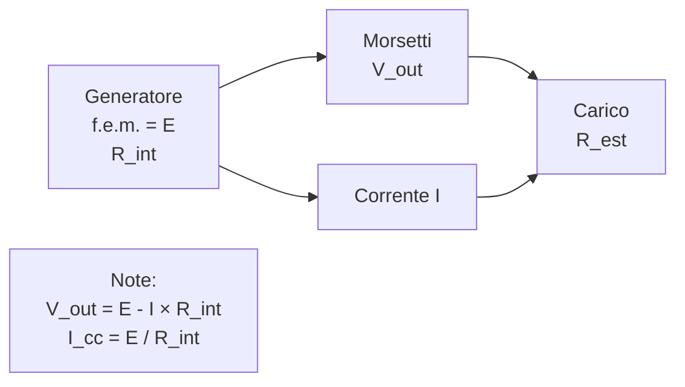
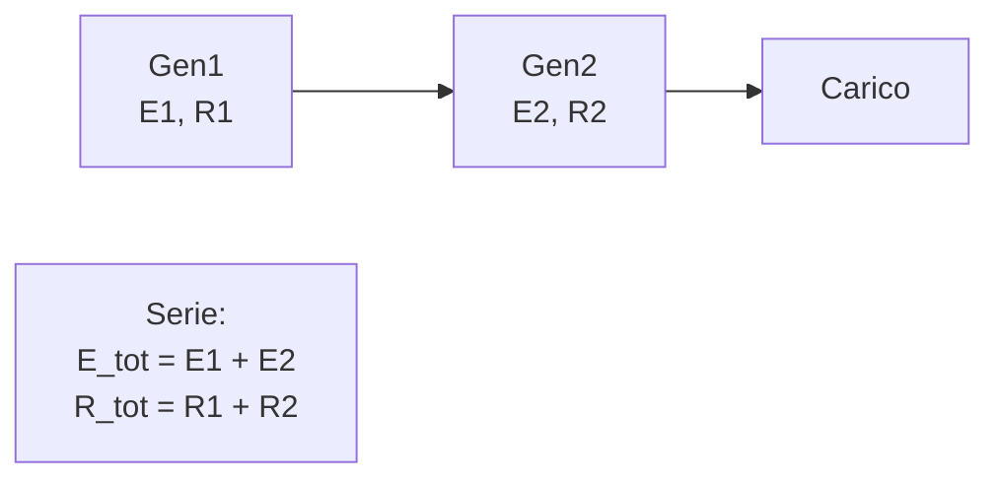
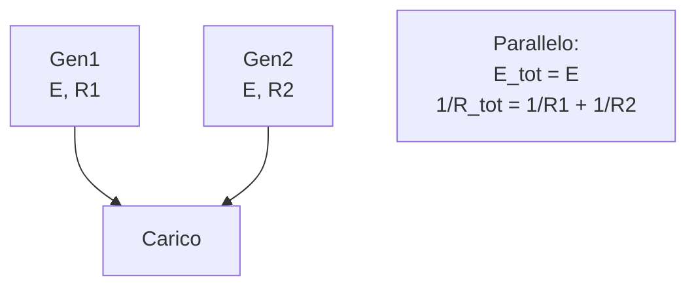

> [!WARNING]
> Questi sono **appunti personali** e possono contenere errori o imprecisioni.
> Non sostituiscono libri di testo o fonti ufficiali.
> Il materiale è soggetto a revisione continua grazie al contributo volontario della comunità.
> [Contribuisci su GitHub](https://github.com/IU6VYG/esame-radioamatori)

# 1.2 Generatori Elettrici: Le Fabbriche di Energia ⚡

Benvenuti nel mondo dei generatori elettrici! Immaginate un generatore come una pompa che spinge l'acqua (l'elettricità) attraverso un tubo. Scopriamo come funzionano, dalle batterie ai generatori industriali, e come collegarli per ottenere più potenza!

## 🔋 Generatore di Tensione e Forza Elettromotrice (f.e.m.)

Un **generatore di tensione** è un dispositivo che produce energia elettrica. La **forza elettromotrice (f.e.m.)** è la "pressione" che il generatore esercita per far circolare la corrente, misurata in volt (V).

- **Corrente di corto circuito**: La massima corrente che il generatore può fornire quando collegato direttamente (senza resistenza esterna). È data da I_cc = f.e.m. / R_int, dove R_int è la resistenza interna.
- **Resistenza interna (R_int)**: L'opposizione interna del generatore al flusso di corrente. Più è bassa, meglio è.
- **Tensione di uscita**: La tensione effettiva ai morsetti del generatore, data da V_out = f.e.m. - I × R_int.

### Diagramma di un Generatore di Tensione

Esempio: Un generatore con E = 12 V e R_int = 0.5 Ω, collegato a R_est = 10 Ω. I = E / (R_int + R_est) = 12 / 10.5 ≈ 1.14 A, V_out = 12 - 1.14 × 0.5 ≈ 11.43 V.

## 🔗 Connessione di Generatori in Serie e Parallelo

Per aumentare potenza o tensione, si collegano più generatori.

### In Serie
- La f.e.m. totale è la somma: E_tot = E1 + E2 + ...
- La resistenza interna totale è la somma: R_tot = R1 + R2 + ...
- Utile per aumentare la tensione.

### Diagramma Serie

### In Parallelo
- La f.e.m. rimane la stessa (se uguali).
- La resistenza interna totale diminuisce: 1/R_tot = 1/R1 + 1/R2 + ...
- Utile per aumentare la corrente.

### Diagramma Parallelo

Esempio Serie: Due generatori 6V, 0.5Ω in serie → E_tot = 12V, R_tot = 1Ω.
Esempio Parallelo: Due generatori 6V, 0.5Ω in parallelo → E_tot = 6V, R_tot = 0.25Ω.

## 🧠 Quiz di Ripasso

Testa le tue conoscenze sui generatori elettrici!

### Domanda 1: Cosa rappresenta la forza elettromotrice (f.e.m.)?
- A) La resistenza interna
- B) La pressione elettrica
- C) La corrente massima

  
Risposta

  
<strong>B) La pressione elettrica</strong>

  
La f.e.m. è la tensione ideale del generatore, senza perdite interne.

### Domanda 2: In una connessione in serie, cosa aumenta principalmente?
- A) La corrente
- B) La tensione
- C) La resistenza

  
Risposta

  
<strong>B) La tensione</strong>

  
In serie, le f.e.m. si sommano, aumentando la tensione totale.

### Domanda 3: Qual è la formula per la tensione di uscita?
- A) V_out = E + I × R_int
- B) V_out = E - I × R_int
- C) V_out = E × R_int

  
Risposta

  
<strong>B) V_out = E - I × R_int</strong>

  
La caduta di tensione interna riduce la tensione ai morsetti.

## Conclusione
I generatori elettrici sono il cuore dell'energia! Capire f.e.m., resistenza interna e connessioni ti aiuta a progettare circuiti efficienti. Continua a esplorare per diventare un esperto! 🔋
