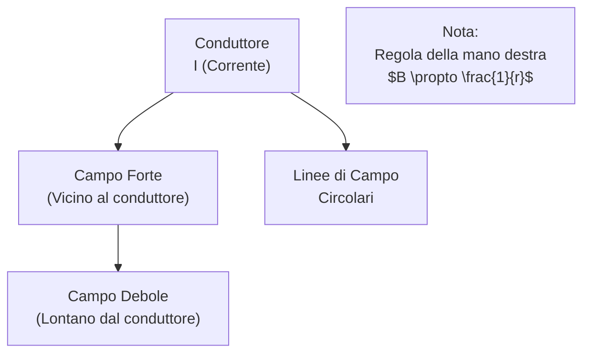
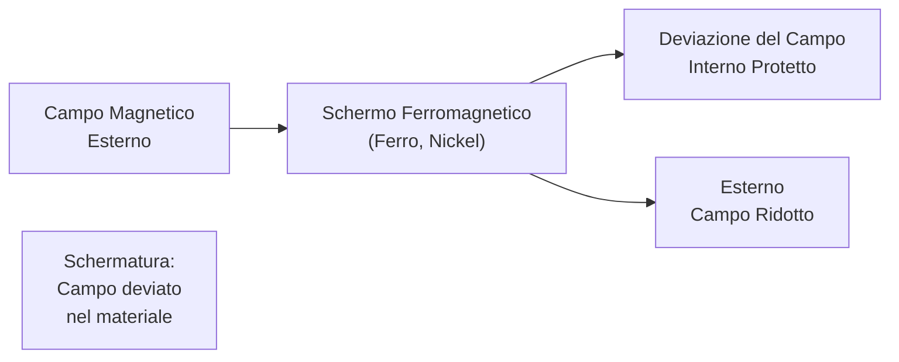

# 1.4 Campo Magnetico: La Forza Invisibile dei Magneti 🧲

Benvenuti nel mondo dei campi magnetici! Immaginate il campo magnetico come linee di forza che circondano magneti o conduttori percorsi da corrente, simili a un campo di energia invisibile. Scopriamo come si genera attorno a un conduttore e come proteggerci da esso!

## 🌀 Campo Magnetico Attorno a un Conduttore

Quando una corrente elettrica (I) scorre in un conduttore rettilineo, genera un campo magnetico circolare attorno ad esso. La direzione del campo segue la **regola della mano destra**: pollice nella direzione della corrente, dita avvolgono nel senso del campo.

- **Formula**: $B = \frac{\mu_0 I}{2\pi r}$, dove B è l'induzione magnetica (in Tesla), $\mu_0 = 4\pi \times 10^{-7} \, \text{T·m/A}$ (permeabilità del vuoto), r è la distanza dal conduttore.
- **Linee di campo**: Circolari, più dense vicino al conduttore.

### Diagramma del Campo Magnetico

Esempio: Per I = 10 A, r = 0.01 m, $B = \frac{4\pi \times 10^{-7} \times 10}{2\pi \times 0.01} \approx 2 \times 10^{-4} \, \text{T}$.

### Grafico del Campo Magnetico

Nota: Grafico di B vs r per I=10A, mostrando la diminuzione con la distanza.

## 🛡️ Schermatura Contro i Campi Magnetici

I campi magnetici sono difficili da schermare perché penetrano facilmente i materiali. La schermatura usa materiali ferromagnetici (ferro, nickel) che "deviano" le linee di campo.

- **Principio**: I materiali ferromagnetici concentrano il campo al loro interno, proteggendo l'area esterna.
- **Applicazioni**: Schermi EMI in dispositivi elettronici, protezione da interferenze magnetiche.
- **Limitazioni**: Non efficace per campi magnetici statici o a bassa frequenza.

### Diagramma di Schermatura Magnetica

Esempio: Uno schermo di ferro attorno a un cavo riduce le interferenze magnetiche esterne.

## 🧠 Quiz di Ripasso

Testa le tue conoscenze sul campo magnetico!

### Domanda 1: Come si determina la direzione del campo magnetico attorno a un conduttore?
- A) Regola della mano sinistra
- B) Regola della mano destra
- C) Dipende dalla corrente

  
Risposta

  
<strong>B) Regola della mano destra</strong>

  
Pollice nella direzione della corrente, dita indicano il campo.

### Domanda 2: Quale materiale è efficace per schermare campi magnetici?
- A) Plastica
- B) Ferro
- C) Carta

  
Risposta

  
<strong>B) Ferro</strong>

  
I materiali ferromagnetici deviano il campo magnetico.

### Domanda 3: La formula per B attorno a un conduttore è...
- A) B = μ₀ I / (2π r)
- B) B = μ₀ I / r
- C) B = μ₀ / (2π r)

  
Risposta

  
<strong>A) B = μ₀ I / (2π r)</strong>

  
$B = \frac{\mu_0 I}{2\pi r}$, induzione magnetica diminuisce con la distanza.

## Conclusione
Il campo magnetico è essenziale in motori, trasformatori e comunicazione! Capirlo ti aiuta a progettare sistemi sicuri ed efficienti. Continua l'esplorazione per diventare un esperto! ⚡
