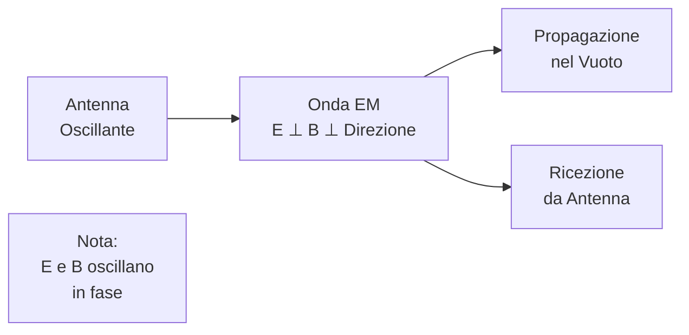

# 1.5 Campo Elettromagnetico: Onde che Viaggiano nello Spazio 📡

Immaginate le onde radio come messaggeri invisibili che trasportano informazioni attraverso l'etere! Il campo elettromagnetico combina campi elettrici e magnetici oscillanti, propagandosi alla velocità della luce. Scopriamo come funzionano le onde radio, la loro velocità e la polarizzazione!

## 🌊 Le Onde Radio come Onde Elettromagnetiche

Le onde radio sono un tipo di **onda elettromagnetica**, generate da cariche accelerate. Sono trasversali: campo elettrico (E) e magnetico (B) oscillano perpendicolarmente alla direzione di propagazione.

- **Spettro elettromagnetico**: Include radio, microonde, luce visibile, raggi X, ecc.
- **Generazione**: Da antenne oscillanti o circuiti risonanti.
- **Proprietà**: Non necessitano di mezzo materiale (propagano nel vuoto).

### Diagramma di un'Onda Elettromagnetica

## ⚡ Velocità di Propagazione e Relazione con Frequenza e Lunghezza d'Onda

La velocità di propagazione (c) delle onde EM nel vuoto è **c = 3 × 10⁸ m/s** (velocità della luce).

- **Relazione**: $c = f \lambda$, dove f è la frequenza (Hz), λ è la lunghezza d'onda (m).
- **Formula**: $\lambda = \frac{c}{f}, \, f = \frac{c}{\lambda}$.

Esempio: Per f = 100 MHz (10⁸ Hz), $\lambda = \frac{3 \times 10^{8}}{10^{8}} = 3 \, \text{m}$.

### Tabella delle Bande Radio
| Banda | Frequenza (MHz) | Lunghezza d'Onda (m) | Nomenclatura | Esempi |
|-------|-----------------|----------------------|--------------|--------|
| ELF  | 0.003 - 0.03   | 100,000 - 10,000   | Miriametriche | Comunicazioni sottomarine |
| VLF  | 0.003 - 0.3    | 100,000 - 1,000    | Miriametriche/Chilometriche | Navigazione |
| LF   | 0.03 - 0.3     | 10,000 - 1,000     | Chilometriche/Ettometriche | Radio AM bassa |
| MF   | 0.3 - 3        | 1,000 - 100        | Ettometriche | Radio AM |
| HF   | 3 - 30         | 100 - 10            | Decametriche | Radio onde corte |
| VHF  | 30 - 300       | 10 - 1              | Metriche | FM, TV |
| UHF  | 300 - 3,000    | 1 - 0.1             | Decimetriche | TV digitale, cellulari |
| SHF  | 3,000 - 30,000 | 0.1 - 0.01          | Centimetriche | Microonde, radar |
| EHF  | 30,000 - 300,000 | 0.01 - 0.001      | Millimetriche | Millimetriche |

Nota: $\lambda = \frac{c}{f}$, con c = 3 × 10⁸ m/s. La nomenclatura si basa sulla lunghezza d'onda.

## 📶 Polarizzazione

La **polarizzazione** di un'onda elettromagnetica descrive l'orientamento e il comportamento del campo elettrico (E) mentre l'onda si propaga. È un concetto fondamentale per le comunicazioni radio, poiché determina come l'antenna trasmette e riceve il segnale.

### Analogia Semplice
Immagina un'onda come una corda che vibra: se vibra su/giù (verticale), è polarizzazione lineare verticale. Se ruota descrivendo un cerchio, è circolare. La polarizzazione ellittica è come una vibrazione obliqua.

### Perché È Importante per Radioamatori
- **Compatibilità Antenna-Segnale**: Un'antenna verticale riceve meglio segnali verticali. Se il segnale è orizzontale, la perdita può essere di 20-30 dB!
- **Riduzione Interferenze**: Scegliendo la polarizzazione giusta, si evitano segnali indesiderati (es. riflessioni da edifici).
- **Applicazioni Pratiche**: VHF/UHF terrestri spesso lineari; satelliti usano circolare per flessibilità.

### Effetti delle Riflessioni
Quando un'onda si riflette (es. su terreno o edifici), la polarizzazione può invertirsi o cambiare. Questo spiega perché segnali satellitari usano circolare: meno sensibile all'orientamento.

Ora vediamo i tipi principali:

### Tipi di Polarizzazione

#### 1. Polarizzazione Lineare
<table>
<tr>
<td width="50%">Il campo elettrico oscilla in un piano fisso. <strong>Sottotipi</strong>: - Verticale: E ↑↓ - Orizzontale: E ←→ <strong>Applicazioni</strong>: - TV analogica terrestre (verticale) - Radio FM/AM (orizzontale) - VHF/UHF terrestri</td>
<td width="50%"></td>
</tr>
</table>

#### 2. Polarizzazione Circolare
<table>
<tr>
<td width="50%">Il campo elettrico ruota descrivendo un cerchio. <strong>Sottotipi</strong>: - Destra: Rotazione oraria - Sinistra: Rotazione antioraria <strong>Applicazioni</strong>: - Satelliti GPS e comunicazione - Wi-Fi e 5G</td>
<td width="50%"></td>
</tr>
</table>

#### 3. Polarizzazione Ellittica
<table>
<tr>
<td width="50%">Combinazione di lineare e circolare, forma un'ellisse. <strong>Applicazioni</strong>: - Radar meteorologico - Sistemi dove la polarizzazione varia</td>
<td width="50%"></td>
</tr>
</table>

#### Importanza della Compatibilità
Le antenne devono avere la stessa polarizzazione del segnale per ricevere al massimo. Se non allineate, il segnale si attenua (perdita di 20-30 dB).

Esempio: Antenne TV verticali ricevono segnali polarizzati verticalmente.

## 🧠 Quiz di Ripasso

Testa le tue conoscenze sul campo elettromagnetico!

### Domanda 1: Qual è la velocità delle onde elettromagnetiche nel vuoto?
- A) 3 × 10⁶ m/s
- B) 3 × 10⁸ m/s
- C) 3 × 10¹⁰ m/s

  
Risposta

  
<strong>B) 3 × 10⁸ m/s</strong>

  
È la velocità della luce.

### Domanda 3: Quale tipo di polarizzazione usano tipicamente i satelliti di comunicazione?
- A) Lineare verticale
- B) Circolare destra
- C) Ellittica

  
Risposta

  
<strong>B) Circolare destra</strong>

  
I satelliti usano polarizzazione circolare per ridurre le interferenze dovute all'orientamento dell'antenna.

### Domanda 3: Cosa significa polarizzazione circolare?
- A) E oscilla in linea retta
- B) E ruota in un cerchio
- C) E è ellittica

  
Risposta

  
<strong>B) E ruota in un cerchio</strong>

  
Usata in satelliti per segnale stabile.

## Conclusione
Le onde elettromagnetiche sono la base della comunicazione moderna! Dalla radio ai cellulari, capirle è essenziale per l'elettronica. Continua a esplorare questo mondo affascinante! 📡
