# 2.3 Induttore: L'Inerzia Elettrica 🌀

Benvenuti nel mondo degli induttori! Immaginate un induttore come un "volano pesante" per l'elettricità - si oppone ai cambiamenti di corrente proprio come un volano si oppone ai cambiamenti di velocità. Scopriamo come questa "inerzia elettrica" sia essenziale in filtri, trasformatori e circuiti RF!

## 🌀 Cos'è un Induttore?

Un **induttore** (o bobina) è un componente passivo che immagazzina energia in un campo magnetico quando la corrente scorre attraverso di esso. Si oppone alle variazioni di corrente generando una forza contro-elettromotrice.

### Simbolo dell'Induttore

- **Unità di misura**: **Henry (H)**
- **Funzione principale**: Opporsi alle variazioni di corrente

### Diagramma dell'Induttore

```mermaid
graph TD;
    Corrente["Corrente I"] --> Bobina["Bobina<br>L (Henry)"];
    Bobina --> Campo["Campo Magnetico<br>B"];
    Campo --> Energia["Energia Immagazzinata<br>E = ½LI²"];
    Variazione["Variazione di I"] --> FCEM["Forza Contro Elettromotrice<br>V = -L(dI/dt)"];
    classDef induttore fill:#9f0,stroke:#333,stroke-width:2px;
    class Bobina induttore;
```

## 📏 L'Unità di Misura: L'Henry (H)

L'**henry** è l'unità di misura dell'induttanza.

- **Definizione**: 1 H è l'induttanza che, con variazione di corrente di 1 A/s, produce 1 V di f.c.e.m.
- **Relazione fondamentale**: **V = -L × (dI/dt)**
- **Sottomultipli comuni**: mH (millihenry = 10⁻³ H), μH (microhenry = 10⁻⁶ H)

### Tabella dei Sottomultipli
| Prefisso | Simbolo | Valore | Esempio |
|----------|---------|--------|---------|
| Milli | mH | 10⁻³ H | 10 mH = 0,01 H |
| Micro | μH | 10⁻⁶ H | 100 μH = 0,0001 H |

## 🏗️ Fattori che Influenzano l'Induttanza

L'induttanza dipende da tre fattori principali:

**Formula**: L = μ₀ × μ_r × (N² × A / l)

Dove:
- **μ₀** = 4π × 10⁻⁷ H/m (permeabilità del vuoto)
- **μ_r** = permeabilità relativa del nucleo
- **N** = numero di spire
- **A** = area della sezione trasversale (m²)
- **l** = lunghezza della bobina (m)

### Fattori Principali
1. **Numero di spire (N)**: L ∝ N² (raddoppiando le spire, L quadruplica!)
2. **Nucleo**: Materiale ferromagnetico (ferro, ferrite) aumenta L drasticamente
3. **Dimensioni**: Maggiore area e minore lunghezza → maggiore L

### Diagramma dei Fattori

```mermaid
graph TD;
    Spire["Numero Spire N<br>L ∝ N²"] --> Induttanza["Induttanza L"];
    Nucleo["Nucleo μ_r<br>Ferro/Aria"] --> Induttanza;
    Dimensioni["Dimensioni A/l<br>Area/Lunghezza"] --> Induttanza;
    classDef positivo fill:#0f0,stroke:#333,stroke-width:2px;
    class Spire,Nucleo,Dimensioni positivo;
```

## ⚡ La Reattanza Induttiva

La **reattanza induttiva (X_L)** è l'opposizione che un induttore offre alla corrente alternata.

**Formula**: X_L = 2π × f × L

Dove:
- **X_L** = reattanza induttiva (Ω)
- **f** = frequenza (Hz)
- **L** = induttanza (H)

### Comportamento in Frequenza
- **Bassa frequenza**: Bassa reattanza (si comporta come corto circuito)
- **Alta frequenza**: Alta reattanza (si comporta come circuito aperto)
- **Corrente continua (f = 0)**: Reattanza zero (corto circuito ideale)

### Grafico X_L vs Frequenza

**Esempio**: Un induttore da 10 mH a 50 Hz:
X_L = 2π × 50 × 0,01 = 3,14 Ω

## 🔄 Sfasamento tra Tensione e Corrente

Negli induttori, la **tensione è in anticipo di 90° rispetto alla corrente**.

- **Tensione (V)**: V = L × (dI/dt)
- **Relazione di fase**: V precede I di 90°
- **Regola mnemonica**: **ELI** - **E**mF (tensione) precede **L** (induttore) precede **I** (corrente)

### Diagramma di Fase

### Spiegazione Intuitiva
Quando la corrente inizia ad aumentare, l'induttore genera una tensione che si oppone a questo aumento. Una volta che la corrente è stabile, la tensione diventa zero.

## 📈 Fattore di Merito (Q)

Il **fattore di merito (Q)** misura la qualità dell'induttore, ovvero quanto è "puro" rispetto alle sue perdite.

**Formula**: Q = X_L / R_serie

Dove:
- **Q** = fattore di merito (adimensionale)
- **X_L** = reattanza induttiva
- **R_serie** = resistenza parassita dell'avvolgimento

### Significato del Q
- **Q alto**: Pochissime perdite, ideale per circuiti risonanti
- **Q basso**: Molte perdite, adatto solo per applicazioni non critiche
- **Valori tipici**: Q = 10-100 per induttori comuni, Q > 100 per induttori di qualità

### Tabella Q per Applicazioni
| Applicazione | Q Richiesto | Tipo di Induttore |
|--------------|-------------|-------------------|
| Filtri audio | 10-50 | Nucleo di ferro |
| RF VHF/UHF | 50-200 | Nucleo di ferrite |
| Oscillatori | >100 | Nucleo di aria |

## 🚧 Effetti Parassiti

### Circuito Serie RL

### Circuito Serie RLC

### Effetto Pelle
Ad alte frequenze, la corrente tende a scorrere solo sulla superficie del conduttore, aumentando la resistenza effettiva.

- **Causa**: Campi magnetici interni che spingono la corrente verso l'esterno
- **Effetto**: R aumenta con √f
- **Soluzione**: Usare filo di Litz o conduttori platinati

### Capacità Parassita
Tra le spire adiacenti esiste una piccola capacità che può diventare significativa ad alte frequenze.

- **Causa**: Accoppiamento capacitivo tra spire
- **Effetto**: L'induttore può diventare risonante ad alta frequenza
- **Soluzione**: Spaziare le spire o usare geometrie speciali

### Perdite nel Nucleo
I materiali ferromagnetici del nucleo introducono perdite:

- **Perdite per isteresi**: Energia necessaria per invertire la magnetizzazione
- **Perdite per correnti parassite**: Correnti indotte nel nucleo
- **Soluzione**: Usare nucleo laminato o ferrite

## 🧠 Quiz di Ripasso

Testa le tue conoscenze sugli induttori!

### Domanda 1: Qual è l'unità di misura dell'induttanza?
- A) Farad
- B) Henry
- C) Tesla

  
Risposta

  
<strong>B) Henry</strong>

  
L'induttanza si misura in henry (H), definito come V·s/A.

### Domanda 2: Se raddoppio il numero di spire, l'induttanza...
- A) Raddoppia
- B) Si quadruplica
- C) Rimane costante

  
Risposta

  
<strong>B) Si quadruplica</strong>

  
L ∠N², quindi raddoppiando N, L aumenta di 4 volte.

### Domanda 3: In un induttore, la tensione è...
- A) In fase con la corrente
- B) In anticipo di 90° rispetto alla corrente
- C) In ritardo di 90° rispetto alla corrente

  
Risposta

  
<strong>B) In anticipo di 90° rispetto alla corrente</strong>

  
Regola ELI: EMF (tensione) precede Current (corrente) nell'induttore.

### Domanda 4: Un induttore da 10 mH a 1 kHz ha quale reattanza?
- A) 6,28 Ω
- B) 62,8 Ω
- C) 628 Ω

  
Risposta

  
<strong>B) 62,8 Ω</strong>

  
X_L = 2π × 1000 × 0,01 = 62,8 Ω

### Domanda 5: Cosa rappresenta un alto fattore di merito Q?
- A) Alte perdite
- B) Basse perdite
- C) Induttanza elevata

  
Risposta

  
<strong>B) Basse perdite</strong>

  
Q = X_L/R, quindi Q alto significa resistenza parassita bassa.

## Conclusione

Gli induttori sono volani elettrici essenziali! Dal filtraggio dei segnali all'immagazzinamento di energia, capire la loro inerzia alla corrente è fondamentale per circuiti RF e alimentatori. Scegli il nucleo giusto e considera gli effetti parassiti per prestazioni ottimali! 🌀
