> [!WARNING]
> Questi sono **appunti personali** e possono contenere errori o imprecisioni.
> Non sostituiscono libri di testo o fonti ufficiali.
> Il materiale è soggetto a revisione continua grazie al contributo volontario della comunità.
> [Contribuisci su GitHub](https://github.com/IU6VYG/esame-radioamatori)

# 2.5 Diodo: La Valvola Unidirezionale ➡️

Benvenuti nel mondo dei diodi! Immaginate un diodo come una "valvola di ritegno elettrica" che permette alla corrente di scorrere in una sola direzione, proprio come una valvola idraulica che impedisce all'acqua di tornare indietro. Scoprimo come questo componente semiconduttore sia essenziale per raddrizzare la corrente e proteggere i circuiti!

## ➡️ Cos'è un Diodo?

Un **diodo** è un componente semiconduttore che permette il passaggio della corrente in una sola direzione. È formato da una giunzione P-N tra due materiali semiconduttori drogati in modo opposto.

### Simboli del Diodo
 

- **Anodo (A)**: Terminale positivo (lato P)
- **Catodo (K)**: Terminale negativo (lato N), spesso segnato con una fascia
- **Funzione principale**: Raddrizzamento e protezione

### Diagramma del Diodo

```mermaid
graph TD;
    Anodo["Anodo (+)<br>Materiale P"] --> Giunzione["Giunzione P-N"];
    Giunzione --> Catodo["Catodo (-)<br>Materiale N"];
    CorrenteDiretta["Corrente Diretta<br>➡️ Permette"] --> Giunzione;
    CorrenteInversa["Corrente Inversa<br>❌ Blocca"] --> Giunzione;
    classDef diodo fill:#f0f,stroke:#333,stroke-width:2px;
    class Giunzione diodo;
```

## ⚡ Polarizzazione del Diodo

Il comportamento del diodo dipende da come viene polarizzato:

### 1. Polarizzazione Diretta (Forward Bias)
- **Condizione**: Anodo > Catodo (V_A > V_K)
- **Comportamento**: Il diodo conduce
- **Caduta di tensione**: V_f (forward voltage)
  - **Silicio**: ~0,7 V
  - **Germanio**: ~0,3 V
  - **LED**: 1,8-3,3 V (dipende dal colore)

### 2. Polarizzazione Inversa (Reverse Bias)
- **Condizione**: Anodo < Catodo (V_A < V_K)
- **Comportamento**: Il diodo blocca (corrente di perdita ~μA)
- **Tensione di breakdown**: V_br (tensione massima inversa)

### Diagramma di Polarizzazione

```mermaid
graph TD;
    Diretta["Polarizzazione Diretta<br>V_A > V_K"] --> Conduzione["Conduzione<br>I alta"];
    Inversa["Polarizzazione Inversa<br>V_A < V_K"] --> Blocco["Blocco<br>I ≈ 0"];
    Soglia["Soglia<br>V_f ≈ 0,7V"] --> Conduzione;
    classDef positivo fill:#0f0,stroke:#333,stroke-width:2px;
    classDef negativo fill:#f00,stroke:#333,stroke-width:2px;
    class Conduzione positivo;
    class Blocco negativo;
```

## 📈 Curva Caratteristica I-V

La curva caratteristica del diodo mostra la relazione tra corrente e tensione:

### Regioni di Funzionamento
1. **Regione di blocco inverso**: V < 0, I ≈ 0
2. **Regione di ginocchio**: 0 < V < V_f, I molto piccola
3. **Regione di conduzione diretta**: V > V_f, I = I_s × (e^(V/(nV_T)) - 1)

### Equazione di Shockley
**I = I_s × (e^(V/(nV_T)) - 1)**

Dove:
- **I** = corrente del diodo
- **I_s** = corrente di saturazione inversa (~10⁻¹² A)
- **V** = tensione ai capi del diodo
- **n** = fattore di idealità (1-2)
- **V_T** = tensione termica (~26 mV a 25°C)

## 🏭 Tipi Principali di Diodi

### Tipologie di Diodi

### 1. Diodi Raddrizzatori
- **Funzione**: Convertire AC in DC
- **Esempi**: 1N4001 (1A), 1N5408 (3A)
- **Uso**: Alimentatori, caricabatterie

### 2. Diodi Zener
- **Funzione**: Stabilizzazione di tensione in inversa
- **Caratteristica**: Lavora nella regione di breakdown controllato
- **Tensioni**: 2,4V - 200V comuni
- **Uso**: Regolatori di tensione, riferimento

### Circuito Stabilizzatore con Zener

### 3. LED (Light Emitting Diode)
- **Funzione**: Emettere luce quando polarizzato direttamente
- **Colori**: Rosso (1,8V), Verde (2,1V), Blu (3,3V), Bianco (3,6V)
- **Uso**: Indicatori, illuminazione, display

### 4. Diodi Varicap (Varactor)
- **Funzione**: Capacità variabile controllata in tensione
- **Principio**: La capacità di giunzione varia con V inversa
- **Uso**: Sintonizzazione RF, oscillatori controllati

### Tabella Comparativa
| Tipo | Caduta Tensione | Corrente Max | Applicazione Principale |
|------|------------------|--------------|-------------------------|
| Raddrizzatore | 0,7V | 1A-10A | Raddrizzamento |
| Zener | 0,7V | 0,5W-5W | Stabilizzazione |
| LED | 1,8-3,3V | 20mA | Illuminazione |
| Schottky | 0,3V | 1A-30A | Alta frequenza |

## 🔄 Circuiti Raddrizzatori

### 1. Raddrizzatore a Semionda
- **Componenti**: 1 diodo
- **Funzione**: Mantiene solo le semionde positive
- **Efficienza**: ~40%
- **Uso**: Applicazioni semplici, bassa potenza

### 2. Raddrizzatore a Onda Intera (Ponte di Graetz)
- **Componenti**: 4 diodi
- **Funzione**: Raddrizza entrambe le semionde
- **Efficienza**: ~81%
- **Uso**: Alimentatori, caricabatterie

### Circuito Raddrizzatore a Ponte

### Diagramma Raddrizzatori

## 🛡️ Applicazioni di Protezione

### Circuito di Protezione con Diodo

### 1. Protezione da Inversione Polarità
Un diodo in serie previene danni se la batteria viene collegata al contrario.

### 2. Protezione da Sovratensione
Un diodo Zener limita la tensione massima su un circuito.

### 3. Eliminatore di Spike
Un diodo in parallelo con carichi induttivi (relè, motori) protegge dai picchi di tensione.

## 🧠 Quiz di Ripasso

Testa le tue conoscenze sui diodi!

### Domanda 1: Qual è la caduta di tensione tipica di un diodo al silicio in polarizzazione diretta?
- A) 0,2 V
- B) 0,7 V
- C) 1,5 V

  
Risposta

  
<strong>B) 0,7 V</strong>

  
È la soglia standard per i diodi al silicio.

### Domanda 2: Se collego un diodo in polarizzazione inversa...
- A) Conduce molta corrente
- B) Si illumina
- C) Non conduce corrente (tranne perdite)

  
Risposta

  
<strong>C) Non conduce corrente (tranne perdite)</strong>

  
Blocca il flusso, a meno che non si superi la tensione di breakdown.

### Domanda 3: A cosa serve principalmente un diodo Zener?
- A) Emettere luce
- B) Stabilizzare la tensione
- C) Amplificare segnali

  
Risposta

  
<strong>B) Stabilizzare la tensione</strong>

  
Mantiene una tensione costante ai suoi capi quando polarizzato inversamente.

### Domanda 4: Quale raddrizzatore ha l'efficienza più alta?
- A) Semionda (1 diodo)
- B) Onda intera (4 diodi)
- C) Entrambi hanno la stessa efficienza

  
Risposta

  
<strong>B) Onda intera (4 diodi)</strong>

  
L'efficienza è ~81% contro ~40% del semionda.

### Domanda 5: Un LED rosso ha tipicamente quale caduta di tensione?
- A) 0,7 V
- B) 1,8 V
- C) 3,3 V

  
Risposta

  
<strong>B) 1,8 V</strong>

  
I LED rossi hanno cadute di tensione più basse dei LED blu/bianchi.

## Conclusione

I diodi sono valvole unidirezionali essenziali! Dal raddrizzamento della corrente di rete alla protezione dei circuiti delicati, capire la loro natura unidirezionale è fondamentale per ogni progetto elettronico. Scegli il tipo giusto per la tua applicazione! ➡️
