# 2.6 Transistor: L'Interruttore e Amplificatore Intelligente 📶

Benvenuti nel mondo dei transistor! Immaginate un transistor come un "rubinetto intelligente" per l'elettricità - una piccola corrente o tensione su un terminale controlla un flusso molto più grande di corrente tra gli altri due. Scopriamo come questo componente rivoluzionario abbia cambiato il mondo dell'elettronica!

## 📶 Cos'è un Transistor?

Un **transistor** è un componente semiconduttore attivo con tre terminali che può amplificare segnali o funzionare come interruttore controllato. È il componente fondamentale dell'elettronica moderna.

- **Funzione principale**: Amplificazione e commutazione
- **Invenzione**: 1947 (Bell Labs)
- **Impatto**: Ha sostituito le valvole termoioniche

### Diagramma del Transistor

## 🔧 Tipi Principali di Transistor

### 1. BJT (Bipolar Junction Transistor)
Controllato in corrente, composto da tre strati di semiconduttore.

**Terminali**:
- **Base (B)**: Terminale di controllo
- **Collettore (C)**: Ingresso principale
- **Emettitore (E)**: Uscita principale

**Tipi**:
- **NPN**: Struttura Negativo-Positivo-Negativo
- **PNP**: Struttura Positivo-Negativo-Positivo

### 2. FET (Field Effect Transistor)
Controllato in tensione, utilizza un campo elettrico per controllare la conduzione.

**Terminali**:
- **Gate (G)**: Terminale di controllo (isolato)
- **Drain (D)**: Ingresso principale
- **Source (S)**: Uscita principale

**Tipi**:
- **JFET**: Junction FET
- **MOSFET**: Metal-Oxide-Semiconductor FET

### Simboli dei Transistor
 

### Diagramma Comparativo

## ⚡ Funzionamento del BJT

Il BJT funziona come un amplificatore di corrente:

**Relazione fondamentale**: I_C = β × I_B

Dove:
- **I_C** = corrente di collettore
- **I_B** = corrente di base
- **β** (beta) = guadagno di corrente (tipicamente 50-300)

### Correnti nel BJT
- **I_E = I_B + I_C** (legge di Kirchhoff)
- **I_C ≈ β × I_B** (se β è grande)
- **I_E ≈ (β + 1) × I_B ≈ I_C**

### Analogia del Rubinetto
- **Base**: La manopola del rubinetto
- **Collettore**: L'ingresso dell'acqua (alta pressione)
- **Emettitore**: L'uscita dell'acqua (flusso controllato)

## 🔄 Configurazioni di Amplificazione

### 1. Emettitore Comune (CE)
- **Guadagno tensione**: Alto (A_v = -g_m × R_C)
- **Guadagno corrente**: Alto (A_i ≈ β)
- **Sfasamento**: 180° (inverte il segnale)
- **Impedenze**: Ingresso media, uscita media
- **Uso**: Amplificatori audio, RF, general purpose

### 2. Base Comune (CB)
- **Guadagno tensione**: Alto
- **Guadagno corrente**: < 1 (attenuazione)
- **Sfasamento**: 0° (non inverte)
- **Impedenze**: Ingresso bassa, uscita alta
- **Uso**: Amplificatori RF VHF/UHF, adattamento impedenza

### 3. Collettore Comune (CC) / Emettitore Follower
- **Guadagno tensione**: ≈ 1 (unità)
- **Guadagno corrente**: Alto (A_i ≈ β + 1)
- **Sfasamento**: 0° (non inverte)
- **Impedenze**: Ingresso alta, uscita bassa
- **Uso**: Buffer, driver, adattamento impedenza

### Diagramma Configurazioni

```mermaid
graph TD;
    CE["Emettore Comune<br>CE"] --> CaratteristicheCE["A_v alto<br>A_i alto<br>180°"];
    CB["Base Comune<br>CB"] --> CaratteristicheCB["A_v alto<br>A_i < 1<br>0°"];
    CC["Collettore Comune<br>CC"] --> CaratteristicheCC["A_v ≈ 1<br>A_i alto<br>0°"];
    classDef configurazione fill:#9f0,stroke:#333,stroke-width:2px;
    class CE,CB,CC configurazione;
```

## 📊 Parametri Caratteristici

### Guadagno di Corrente (β o h_FE)
- **Definizione**: β = I_C / I_B
- **Range tipico**: 50 - 500 per transistor general purpose
- **Variazione**: Dipende da temperatura, I_C, V_CE

### Transconduttanza (g_m)
- **Definizione**: g_m = ∂I_C / ∂V_BE
- **Unità**: Siemens (S)
- **Relazione**: g_m = I_C / V_T (dove V_T ≈ 26 mV a 25°C)

### Frequenze di Taglio
- **f_T**: Frequenza di transizione (guadagno in corrente = 1)
- **f_β**: Frequenza di guadagno in corrente (guadagno = 0,707 × β_0)
- **Relazione**: f_T = β × f_β

## 🏆 Transistor FET (MOSFET)

### Vantaggi rispetto ai BJT
- **Impedenza di ingresso altissima** (>10¹² Ω)
- **Consumo quasi nullo in gate**
- **Velocità di commutazione elevata**
- **Facilità di fabbricazione in circuiti integrati**

### Funzionamento del MOSFET
Il gate (isolato) crea un canale di conduzione tra source e drain quando viene applicata una tensione.

**Regioni di funzionamento**:
1. **Taglio**: V_GS < V_th → canale non conduttivo
2. **Ohmica (lineare)**: V_GS > V_th, V_DS piccolo → resistore variabile
3. **Saturazione**: V_GS > V_th, V_DS grande → sorgente di corrente

### Diagramma MOSFET

## 🎯 Applicazioni Principali

### 1. Amplificatori
- **Audio**: Preamplificatori, amplificatori di potenza
- **RF**: Amplificatori a basso rumore, di potenza
- **Strumentazione**: Amplificatori di misura

### 2. Commutatori
- **Digitali**: Porte logiche, microprocessori
- **Potenza**: Driver di motori, relè statici
- **Alimentazione**: Regolatori switching

### 3. Oscillatori
- **RF**: Oscillatori LC, a cristallo
- **Timer**: Circuiti 555, oscillatori RC

## 🧠 Quiz di Ripasso

Testa le tue conoscenze sui transistor!

### Domanda 1: In un transistor NPN, la freccia dell'emettitore...
- A) Entra nella base
- B) Esce dalla base
- C) Non c'è freccia

  
Risposta

  
<strong>B) Esce dalla base</strong>

  
NPN: "Not Pointing iN" (Non punta dentro).

### Domanda 2: Quale configurazione di amplificatore inverte il segnale di 180°?
- A) Base Comune
- B) Collettore Comune
- C) Emettitore Comune

  
Risposta

  
<strong>C) Emettitore Comune</strong>

  
È la configurazione standard per amplificare e inverte la fase.

### Domanda 3: Il parametro Beta (β) rappresenta...
- A) La resistenza di base
- B) Il guadagno di corrente
- C) La tensione di breakdown

  
Risposta

  
<strong>B) Il guadagno di corrente</strong>

  
Rapporto tra corrente di collettore e di base (I_C / I_B).

### Domanda 4: Quale tipo di transistor ha l'impedenza di ingresso più alta?
- A) BJT
- B) JFET
- C) MOSFET

  
Risposta

  
<strong>C) MOSFET</strong>

  
Il gate è isolato, quindi l'impedenza è altissima (>10¹² Ω).

### Domanda 5: In un BJT con β = 100 e I_B = 0,1 mA, qual è I_C?
- A) 1 mA
- B) 10 mA
- C) 100 mA

  
Risposta

  
<strong>B) 10 mA</strong>

  
I_C = β × I_B = 100 × 0,1 mA = 10 mA

## Conclusione

I transistor sono i mattoni fondamentali dell'elettronica moderna! Dall'amplificazione di segnali deboli alla commutazione rapida in circuiti digitali, capire il loro funzionamento è essenziale per ogni progetto elettronico. Scegli il tipo giusto (BJT vs FET) per la tua applicazione! 📶
