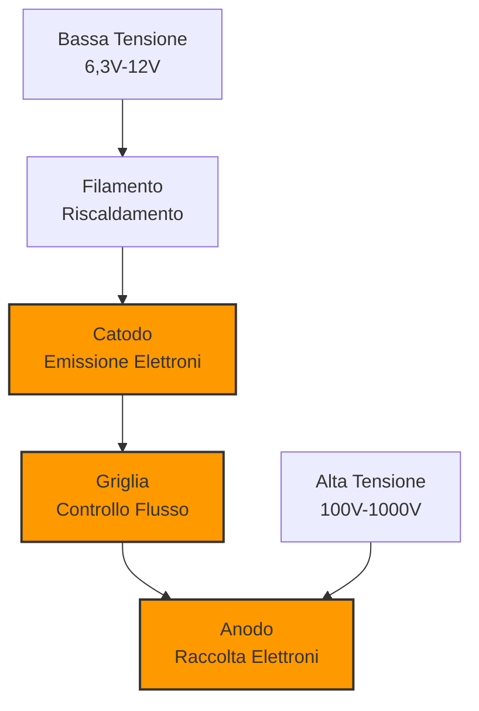
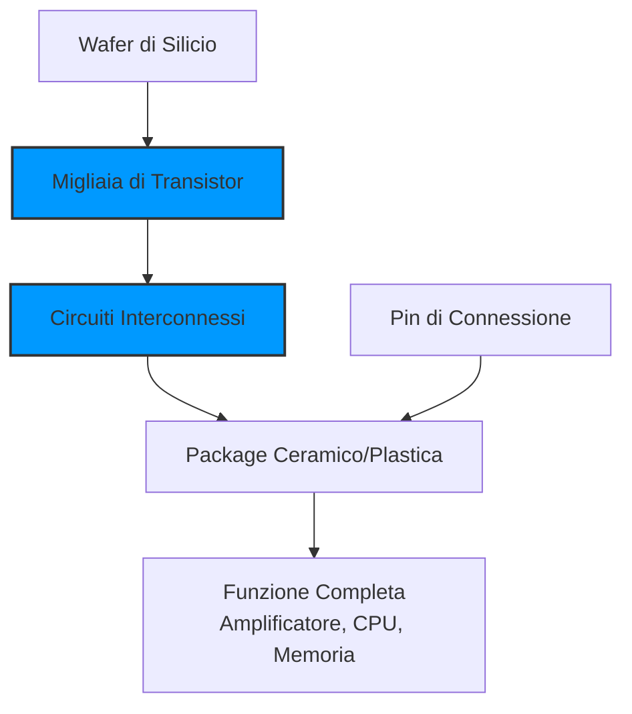

> [!WARNING]
> Questi sono **appunti personali** e possono contenere errori o imprecisioni.
> Non sostituiscono libri di testo o fonti ufficiali.
> Il materiale è soggetto a revisione continua grazie al contributo volontario della comunità.
> [Contribuisci su GitHub](https://github.com/IU6VYG/esame-radioamatori)

# 2.7 Valvole e Circuiti Integrati: Il Passato e il Futuro 🕰️

Benvenuti in un viaggio affascinante tra due tecnologie agli antipodi! Esploreremo le **valvole termoioniche**, i giganti caldi che hanno fatto la storia della radio, e i **circuiti integrati**, i microscopici chip che alimentano il mondo digitale di oggi. Scopriamo come il passato e il futuro si incontrino nell'elettronica!

## 💡 Valvole Termoioniche (Tubi a Vuoto)

Le valvole sono i precursori dei transistor, dominando l'elettronica per oltre 50 anni.

### Simbolo della Valvola

- **Principio**: Emissione termoionica di elettroni
- **Era**: 1920-1970 (ancora usate in applicazioni specifiche)

### Diagramma di una Valvola

## 🔧 Il Triodo: La Valvola Amplificatrice

Il **triodo** è la valvola più fondamentale, con tre elettrodi:

### Componenti Principali
1. **Catodo (K)**: Riscaldato da un filamento, emette elettroni per effetto termoionico
2. **Griglia (G)**: Rete metallica che controlla il flusso di elettroni
3. **Anodo/Placca (A)**: Elettrodo positivo che attira gli elettroni

### Funzionamento
- **Riscaldamento**: Il filamento riscalda il catodo (~800°C)
- **Emissione**: Il catodo caldo emette elettroni (nube di carica)
- **Controllo**: La griglia modula il flusso con piccole variazioni di tensione
- **Raccolta**: L'anodo positivo raccoglie gli elettroni

### Relazioni Fondamentali
- **Guadagno**: A_v = -μ × (R_L / (R_p + R_L))
- **μ (mu)**: Fattore di amplificazione (tipicamente 20-100)
- **R_p**: Resistenza interna di placca (10-100 kΩ)

## 📻 Altri Tipi di Valvole

### Tetrodo (4 elettrodi)
- **Aggiunta**: Griglia schermatrice
- **Vantaggio**: Riduce la capacità parassita
- **Uso**: Amplificatori RF ad alta frequenza

### Pentodo (5 elettrodi)
- **Aggiunta**: Griglia soppressore
- **Vantaggio**: Elimina l'emissione secondaria
- **Uso**: Amplificatori di potenza audio

### Valvole Specializzate
- **Beam Power Tetrode**: Alta potenza, bassa distorsione
- **Magnetron**: Generazione microonde (forni a microonde)
- **Klystron**: Amplificatori RF ad alta potenza
- **Cathode Ray Tube (CRT)**: Tubi catodici per display

### Tabella Comparativa Valvole
| Tipo | Elettrodi | Guadagno μ | Applicazione Principale |
|------|-----------|------------|-------------------------|
| Triodo | 3 | 20-100 | Audio, RF |
| Tetrodo | 4 | 100-500 | RF VHF/UHF |
| Pentodo | 5 | 150-1000 | Potenza audio |
| Beam Tetrode | 4 | 200-400 | Potenza audio |

## 💻 Circuiti Integrati (IC)

I **circuiti integrati** rappresentano la rivoluzione che ha reso possibile l'elettronica moderna.

- **Invenzione**: 1958 (Jack Kilby, Robert Noyce)
- **Principio**: Migliaia/milioni di componenti in un singolo chip di silicio

### Diagramma di un Circuito Integrato

## 🔬 Tipi di Circuiti Integrati

### 1. Circuiti Integrati Analogici
Elaborano segnali continui:

#### Amplificatore Operazionale (Op-Amp)
- **Configurazione**: Due ingressi (+/-), un'uscita
- **Equazione**: V_out = A × (V_+ - V_-)
- **Guadagno A**: Enorme (10⁴-10⁶ in open-loop)
- **Uso**: Amplificazione, filtraggio, confronto

#### Altri IC Analogici
- **Regolatori di tensione**: 78xx, LM317
- **Convertitori A/D e D/A**: ADC0804, DAC0832
- **Timer**: NE555
- **Filtro attivo**: SSM2044

### 2. Circuiti Integrati Digitali
Elaborano segnali discreti (0/1):

#### Logica Combinatoria
- **Porte logiche**: AND, OR, NOT, NAND, NOR, XOR
- **Famiglie**: TTL, CMOS, ECL
- **Esempi**: 7400 (NAND), 4001 (NOR)

#### Logica Sequenziale
- **Flip-Flop**: JK, D, T
- **Contatori**: 74LS193, CD4040
- **Registri**: 74LS164, CD4015

#### Microprocessori e Microcontrollori
- **CPU**: Intel 8086, ARM Cortex
- **MCU**: Arduino (ATmega328), PIC, STM32
- **DSP**: Processori segnali digitali

### 3. Circuiti Integrati Misti
Combinano analogico e digitale:

- **SoC (System-on-Chip)**: Raspberry Pi, smartphone
- **ASIC**: Circuiti integrati per applicazioni specifiche
- **FPGA**: Array logici programmabili

## ⚖️ Confronto: Valvole vs Circuiti Integrati

### Tabella Comparativa
| Caratteristica | Valvole | Circuiti Integrati |
|----------------|---------|-------------------|
| **Dimensioni** | Grandi (cm) | Microscopici (μm) |
| **Tensione** | Alte (100-1000V) | Basse (3,3-5V) |
| **Consumo** | Alto (W) | Bassissimo (mW-μW) |
| **Affidabilità** | Bassa (ore) | Altissima (decenni) |
| **Costo** | Alto | Bassissimo |
| **Velocità** | Lenta (MHz) | Rapidissima (GHz) |
| **Calore** | Molto | Poco |
| **Longevità** | Limitata | Quasi illimitata |

### Vantaggi delle Valvole (Ancora Usate)
- **Alta potenza**: Amplificatori RF lineari (>1kW)
- **Robustezza**: Tollerano sovraccarichi temporanei
- **Caratteristiche sonore**: "Warm sound" in audio hi-fi
- **Radiazione**: Tollerano ambienti con radiazioni

### Vantaggi dei Circuiti Integrati
- **Miniaturizzazione**: Miliardi di transistor in mm²
- **Basso consumo**: Ideale per dispositivi portatili
- **Affidabilità**: Tasso di guasto < 10⁻⁹/ora
- **Costo**: Produzione di massa a costo irrisorio

## 🎯 Applicazioni Moderne

### Valvole Oggi
- **Amplificatori RF**: Trasmettitori radioamatoriali
- **Audio Hi-Fi**: Amplificatori valvolari per "warm sound"
- **Strumentazione scientifica**: Rivelatori di particelle
- **Display speciali**: Oscilloscopi ad alta frequenza

### Circuiti Integrati Oggi
- **Smartphone**: SoC con miliardi di transistor
- **Computer**: CPU/GPU ad alte prestazioni
- **IoT**: Microcontrollori a bassissimo consumo
- **AI**: Acceleratori neurali dedicati

## 🧠 Quiz di Ripasso

Testa le tue conoscenze su valvole e circuiti integrati!

### Domanda 1: Qual è la funzione della griglia in un triodo?
- A) Emettere elettroni
- B) Controllare il flusso di elettroni
- C) Riscaldare la valvola

  
Risposta

  
<strong>B) Controllare il flusso di elettroni</strong>

  
Agisce come la base di un transistor, modulando la corrente con piccole variazioni di tensione.

### Domanda 2: I circuiti integrati sono fatti principalmente di...
- A) Rame
- B) Silicio
- C) Vetro

  
Risposta

  
<strong>B) Silicio</strong>

  
È il materiale semiconduttore base per tutti i chip.

### Domanda 3: Un amplificatore operazionale ha...
- A) Un ingresso e due uscite
- B) Due ingressi e un'uscita
- C) Tre ingressi

  
Risposta

  
<strong>B) Due ingressi e un'uscita</strong>

  
Ingresso invertente (-) e non invertente (+), con un'uscita.

### Domanda 4: Quale tecnologia richiede tensioni più elevate?
- A) Valvole termoioniche
- B) Circuiti integrati
- C) Entrambe le stesse

  
Risposta

  
<strong>A) Valvole termoioniche</strong>

  
Richiedono tensioni da 100V a 1000V contro 3,3-5V degli IC.

### Domanda 5: Cosa significa "SoC" in elettronica?
- A) System on Chip
- B) Silicon on Chip
- C) Socket on Chip

  
Risposta

  
<strong>A) System on Chip</strong>

  
Un sistema completo (CPU, memoria, I/O) in un singolo chip.

## Conclusione

Valvole e circuiti integrati rappresentano due ere dell'elettronica! Le valvole hanno aperto la strada con la loro potenza e robustezza, mentre i circuiti integrati hanno miniaturizzato e democratizzato la tecnologia. Entrambi continuano a avere il loro posto nell'elettronica moderna, dal trasmettitore radioamateuriale allo smartphone! 🕰️
