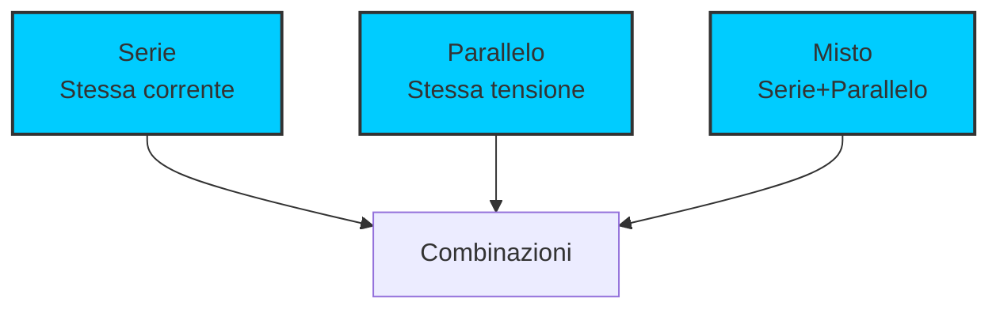
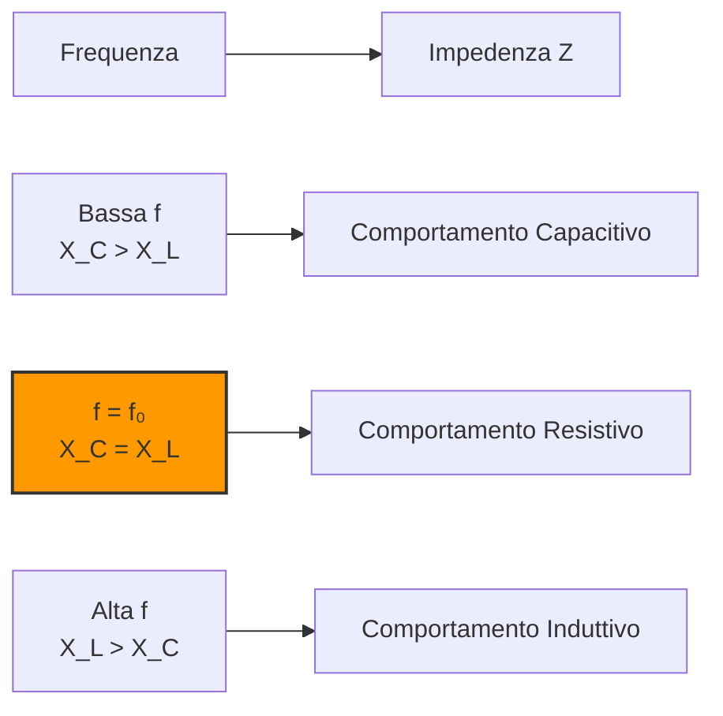

# 3.1 Combinazione dei Componenti: L'Arte di Assemblare Circuiti 🔧

Benvenuti nel mondo delle combinazioni di componenti! Immaginate i componenti elettronici come mattoni LEGO - da soli hanno funzioni limitate, ma combinati correttamente possono creare circuiti complessi e potenti. Scopriamo come unire resistori, condensatori, induttori e altri componenti per costruire circuiti funzionali!

## 🔧 Cos'è una Combinazione di Componenti?

Una **combinazione di componenti** è l'unione di più elementi elettrici per creare circuiti con caratteristiche specifiche. La disposizione e il tipo di connessione determinano il comportamento complessivo del circuito.

- **Serie**: Componenti collegati uno dopo l'altro
- **Parallelo**: Componenti collegati agli stessi punti
- **Misto**: Combinazione di serie e parallelo
- **Obiettivo**: Ottenere valori di impedenza, frequenza o risposta desiderati

### Diagramma dei Tipi di Connessione

## ⚡ Impedenza e Ammettenza

L'**impedenza (Z)** è la generalizzazione della resistenza per circuiti AC, che include effetti reattivi.

### Definizione di Impedenza
**Z = R + jX**

Dove:
- **R** = parte reale (resistenza)
- **X** = parte immaginaria (reattanza)
- **j** = unità immaginaria (√-1)

### Ammettenza (Y)
È l'inverso dell'impedenza: **Y = 1/Z = G + jB**

- **G** = conduttanza (parte reale)
- **B** = suscettanza (parte immaginaria)

## 🔗 Combinazioni di Resistori

### Serie
In serie, le resistenze si sommano:
**R_tot = R₁ + R₂ + R₃ + ...**

### Parallelo
In parallelo, le conduttanze si sommano:
**1/R_tot = 1/R₁ + 1/R₂ + 1/R₃ + ...**

Per due resistori: **R_tot = (R₁ × R₂)/(R₁ + R₂)**

### Circuito Partitore di Tensione

**V_out = V_in × (R₂/(R₁ + R₂))**

### Circuito con Trasformatore Accoppiato

## ⚡ Combinazioni di Condensatori

### Serie
In serie, le capacità si combinano come resistenze in parallelo:
**1/C_tot = 1/C₁ + 1/C₂ + 1/C₃ + ...**

### Parallelo
In parallelo, le capacità si sommano:
**C_tot = C₁ + C₂ + C₃ + ...**

### Circuito Serie RC

**Impedenza totale**: Z = R - j/(ωC)

## 🌀 Combinazioni di Induttori

### Serie
In serie, le induttanze si sommano:
**L_tot = L₁ + L₂ + L₃ + ...**

### Parallelo
In parallelo (senza accoppiamento magnetica):
**1/L_tot = 1/L₁ + 1/L₂ + 1/L₃ + ...**

### Circuito Serie RL

**Impedenza totale**: Z = R + jωL

## 🎛️ Circuiti RLC Completi

### Serie RLC

**Impedenza totale**: Z = R + j(ωL - 1/(ωC))

### RLC Parallelo

**Impedenza parallelo**: 1/Z = 1/R + 1/(jωL) + jωC

### Risonanza in Serie
Alla **frequenza di risonanza**:
**ω₀ = 1/√(LC)**  o  **f₀ = 1/(2π√(LC))**

A risonanza:
- **Impedenza minima**: Z = R
- **Corrente massima**
- **Fase zero**: tensione e corrente in fase

### Diagramma di Risonanza

## 🔌 Combinazioni con Trasformatori

### Trasformatori in Serie
I trasformatori possono essere collegati in serie per ottenere tensioni più elevate o rapporti di trasformazione diversi.

### Trasformatori in Parallelo
In parallelo, i trasformatori devono avere:
- Stesso rapporto di trasformazione
- Stessa polarità
- Simili caratteristiche di potenza

### Circuito con Accoppiamento Trasformatore

## 💡 Combinazioni con Diodi

### Raddrizzatore a Ponte

### Circuito di Protezione

### Ponte di Wheatstone

**Equilibrio**: R₁/R₂ = R₃/R₄ → V_out = 0

### Limitatore di Tensione
I diodi Zener possono essere combinati per creare livelli di tensione specifici:
- **Serie**: Somma delle tensioni Zener
- **Parallelo**: Tensione minore tra i diodi

## 📊 Fattore di Qualità Q

Il **fattore di merito Q** misura la "selettività" di un circuito risonante.

### Definizione
**Q = ω₀L/R = 1/(ω₀CR)**

### Significato
- **Q alto**: Circuito molto selettivo, banda stretta
- **Q basso**: Circuito poco selettivo, banda larga

### Larghezza di Banda
**BW = f₀/Q**

Dove BW è la larghezza di banda a -3dB.

## 🧪 Analisi Pratica dei Circuiti

### Metodo delle Impedenze
1. Sostituisci ogni componente con la sua impedenza
2. Combina le impedenze secondo le regole serie/parallelo
3. Calcola la risposta in frequenza

### Esempio: Filtro Passa-Basso RC
**Frequenza di taglio**: f_c = 1/(2πRC)

**Risposta in frequenza**:
- **f << f_c**: V_out ≈ V_in (passa)
- **f = f_c**: V_out = V_in/√2 (-3dB)
- **f >> f_c**: V_out ≈ 0 (blocca)

### Circuito Complesso di Impedenza

**Calcolo impedenza totale**: Combinazione serie/parallelo di R, L, C

## 🎯 Applicazioni Pratiche

### 1. Filtri Audio
- **Passa-basso**: Rimuove alte frequenze
- **Passa-alto**: Rimuove basse frequenze
- **Passa-banda**: Isola una banda di frequenze

### 2. Circuiti RF
- **Circuiti sintonizzati**: Seleziona frequenze specifiche
- **Matching di impedenza**: Ottimizza il trasferimento di potenza

### 3. Alimentatori
- **Filtraggio**: Riduce l'ondulazione
- **Stabilizzazione**: Mantiene tensione costante

## 🧠 Quiz di Ripasso

Testa le tue conoscenze sulle combinazioni di componenti!

### Domanda 1: Due resistori da 100Ω in parallelo danno...
- A) 200Ω
- B) 100Ω
- C) 50Ω

  
Risposta

  
<strong>C) 50Ω</strong>

  
In parallelo: R_tot = (100×100)/(100+100) = 50Ω

### Domanda 2: Due condensatori da 10μF in serie danno...
- A) 20μF
- B) 10μF
- C) 5μF

  
Risposta

  
<strong>C) 5μF</strong>

  
In serie: 1/C_tot = 1/10 + 1/10 = 2/10 → C_tot = 5μF

### Domanda 3: In un circuito RLC serie alla risonanza...
- A) L'impedenza è massima
- B) L'impedenza è minima
- C) La corrente è zero

  
Risposta

  
<strong>B) L'impedenza è minima</strong>

  
Alla risonanza X_L = X_C, quindi Z = R (valore minimo)

### Domanda 4: Un fattore di qualità Q alto significa...
- A) Banda larga
- B) Banda stretta
- C) Nessun effetto

  
Risposta

  
<strong>B) Banda stretta</strong>

  
Q alto = BW = f₀/Q piccola, quindi circuito selettivo

### Domanda 5: La frequenza di risonanza di un circuito LC con L=1mH e C=1μF è...
- A) ~159Hz
- B) ~1.59kHz
- C) ~15.9kHz

  
Risposta

  
<strong>B) ~1.59kHz</strong>

  
f₀ = 1/(2π√(0.001×0.000001)) ≈ 1592Hz

## Conclusione

Le combinazioni di componenti sono la base dell'elettronica! Capire come resistori, condensatori, induttori e altri componenti interagiscono permette di progettare circuiti con caratteristiche precise. Dai semplici partitori di tensione ai complessi filtri RF, ogni combinazione ha il suo scopo specifico. Ricorda sempre le regole di base e usa l'impedenza per analizzare i circuiti AC! 🔧

---
