> [!WARNING]
> Questi sono **appunti personali** e possono contenere errori o imprecisioni.
> Non sostituiscono libri di testo o fonti ufficiali.
> Il materiale è soggetto a revisione continua grazie al contributo volontario della comunità.
> [Contribuisci su GitHub](https://github.com/IU6VYG/esame-radioamatori)

# 3.2 Filtri: I Selettori di Frequenza 🎛️

Benvenuti nel mondo affascinante dei filtri! Immaginate un filtro come un "portiere musicale" che decide quali frequenze possono passare e quali devono essere bloccate. Scopriamo come questi circuiti essenziali permettono ai ricevitori radio di isolare le stazioni desiderate e agli amplificatori di pulire i segnali!

## 🎛️ Cos'è un Filtro?

Un **filtro** è un circuito progettato per selettivamente passare o bloccare segnali in determinate bande di frequenza, mentre attenua o rifiuta altre bande.

- **Funzione principale**: Selezionare o rifiutare frequenze specifiche
- **Tipi**: Passa-basso, passa-alto, passa-banda, stop-banda (notch)
- **Componenti**: Resistori, condensatori, induttori, cristalli
- **Applicazioni**: Radio, audio, RF, strumentazione

### Diagramma dei Tipi di Filtri

```mermaid
graph TD;
    PassaBasso["Passa-Basso<br>f < f_c"] --> Tipi["Tipi di Filtri"];
    PassaAlto["Passa-Alto<br>f > f_c"] --> Tipi;
    PassaBanda["Passa-Banda<br>f₁ < f < f₂"] --> Tipi;
    StopBanda["Stop-Banda<br>f₁ < f < f₂"] --> Tipi;
    classDef filtro fill:#0cf,stroke:#333,stroke-width:2px;
    class PassaBasso,PassaAlto,PassaBanda,StopBanda filtro;
```

## 📊 Risposta in Frequenza

La **risposta in frequenza** descrive come un filtro si comporta alle diverse frequenze.

### Parametri Chiave
- **Frequenza di taglio (f_c)**: Frequenza a cui l'attenuazione è -3dB
- **Banda passante**: Range di frequenze che passano con minima attenuazione
- **Banda di transizione**: Range tra banda passante e banda di arresto
- **Banda di arresto**: Range di frequenze fortemente attenuate

### Diagramma di Risposta

## 🔽 Filtro Passa-Basso (Low-Pass)

Lascia passare frequenze basse e blocca quelle alte.

### Circuito RC Passa-Basso

**Funzione di trasferimento**: H(jω) = 1/(1 + jωRC)

**Frequenza di taglio**: f_c = 1/(2πRC)

**Risposta**:
- **f << f_c**: |H| ≈ 1 (passa)
- **f = f_c**: |H| = 1/√2 (-3dB)
- **f >> f_c**: |H| ≈ 1/(jωRC) (attenua 20dB/decade)

### Diagramma di Bode Filtro Passa-Basso

*Risposta in frequenza (modulo e fase) del filtro RC passa-basso: attenuazione di -20dB/decade oltre fc.*

### Circuito LC Passa-Basso
Per prestazioni migliori, si usa una configurazione LC:
- **Attenuazione più ripida**: 40dB/decade
- **Q più alto**: Selettività maggiore
- **Uso**: Filtri RF, anti-aliasing

### Filtro LC di Secondo Ordine

## 🔼 Filtro Passa-Alto (High-Pass)

Lascia passare frequenze alte e blocca quelle basse.

### Circuito CR Passa-Alto

**Funzione di trasferimento**: H(jω) = jωRC/(1 + jωRC)

**Frequenza di taglio**: f_c = 1/(2πRC)

**Risposta**:
- **f << f_c**: |H| ≈ jωRC (attenua 20dB/decade)
- **f = f_c**: |H| = 1/√2 (-3dB)
- **f >> f_c**: |H| ≈ 1 (passa)

### Diagramma di Bode Filtro Passa-Alto

*Risposta in frequenza (modulo e fase) del filtro CR passa-alto: attenuazione di +20dB/decade sotto fc.*

### Applicazioni
- **Audio**: Rimuove ronzii a 50/60Hz
- **RF**: Blocca interferenze a bassa frequenza
- **Biomedica**: Rimuove artefatti da movimento

### Filtro Passa-Alto LC Secondo

## 🎚️ Filtro Passa-Banda (Band-Pass)

Lascia passare solo una banda di frequenze specifica.

### Circuito RLC Passa-Banda

**Frequenza di risonanza**: f₀ = 1/(2π√(LC))

**Larghezza di banda**: BW = f₀/Q

**Funzione di trasferimento**: H(jω) = jωL/R / (1 + jωL/R + (jω)²LC)

### Parametri del Filtro
- **Frequenza centrale**: f₀
- **Larghezza di banda**: BW = f₂ - f₁
- **Fattore di qualità**: Q = f₀/BW
- **Selettività**: Dipende da Q

### Diagramma di Bode Filtro Passa-Banda

*Risposta in frequenza del filtro RLC passa-banda: massimo a f₀, pendenza ±20dB/decade ai lati.*

### Schema Diagramma di Bode

## 🚫 Filtro Stop-Banda / Notch

Blocca una banda specifica di frequenze.

### Circuito Notch RLC
**Frequenza di risonanza**: f₀ = 1/(2π√(LC))

**Attenuazione massima**: A f₀, il segnale è quasi completamente bloccato

### Applicazioni
- **Eliminazione interferenze**: Rimuove 50/60Hz
- **Notch filtri**: Elimina frequenze specifiche
- **Audio**: Rimuove ronzii e fischi

## 🏗️ Topologie di Filtri

### Filtri a L (L-Section)
Configurazione a forma di L con un componente serie e uno parallelo.

### Filtri a T (T-Section)
Configurazione a forma di T con due componenti serie e uno parallelo.

### Filtri a π (Pi-Section)
Configurazione a forma di π con un componente serie e due paralleli.

### Confronto Topologie
| Topologia | Ordine | Componenti | Caratteristiche |
|-----------|--------|------------|-----------------|
| L | 1° | 2 | Semplice, economico |
| T | 2° | 3 | Buona selettività |
| π | 2° | 3 | Impedenza costante |

### Filtro a π

## 💎 Filtro a Cristallo di Quarzo

I cristalli di quarzo offrono la massima selettività grazie all'effetto piezoelettrico.

### Caratteristiche del Quarzo
- **Q altissimo**: 10⁴ - 10⁶
- **Stabilità termica**: Eccellente
- **Precisione frequenza**: ±0.001%
- **Costo**: Elevato

### Circuito Equivalente

**Parametri tipici**:
- **L_m**: Induttanza motore (Henri)
- **C_m**: Capacità motore (pF)
- **C_p**: Capacità paralassita (pF)
- **R_m**: Resistenza motore (Ω)

### Filtro a Cristallo Singolo

### Applicazioni
- **Oscillatori**: Riferimento di frequenza
- **Filtri IF**: Stadio intermedio ricevitori
- **Filtri RF**: Alta selettività

## 📐 Fattore di Qualità Q

Il **fattore di merito Q** misura la selettività del filtro.

### Definizione
**Q = f₀/BW = Energia immagazzinata / Energia dissipata per ciclo**

### Significato del Q
- **Q basso (<10)**: Banda larga, poco selettivo
- **Q medio (10-100)**: Banda media, moderatamente selettivo
- **Q alto (>100)**: Banda stretta, molto selettivo

### Q per Diverse Applicazioni
| Applicazione | Q Richiesto | Tipo di Filtro |
|--------------|-------------|----------------|
| Audio | 1-10 | RC, attivi |
| IF (455kHz) | 50-100 | Ceramici, quarzo |
| RF VHF | 100-500 | LC, quarzo |
| RF UHF | 500+ | Cavità, quarzo |

## 🔄 Filtri Attivi vs Passivi

### Filtri Passivi
- **Componenti**: R, L, C
- **Vantaggi**: Semplici, affidabili, no alimentazione
- **Svantaggi**: Inserzione perdite, Q limitato
- **Uso**: RF, potenza, ambienti difficili

### Filtri Attivi
- **Componenti**: Op-amp, transistor + R, C
- **Vantaggi**: Guadagno, Q alto, piccole dimensioni
- **Svantaggi**: Richiedono alimentazione, rumore, limiti potenza
- **Uso**: Audio, strumentazione, bassi costi

## 📊 Diagrammi di Bode

I diagrammi di Bode mostrano la risposta in frequenza dei filtri.

### Asse delle Frequenze
- **Scala logaritmica**: Decadi (10x, 100x, 1000x)
- **Range**: Da 1Hz a GHz per filtri RF

### Asse di Ampiezza
- **Scala logaritmica**: Decibel (dB)
- **Riferenza**: 0dB = guadagno unitario
- **Attenuazione**: -3dB, -20dB, -40dB, etc.

### Asse di Fase
- **Scala lineare**: Gradi o radianti
- **Range**: -180° a +180°
- **Importanza**: Stabilità dei circuiti

### Confronto Butterworth vs Chebyshev

Due delle topologie più comuni per filtri di ordine superiore sono:

- **Butterworth**: Risposta massimamente piatta in banda passante, transizione graduale
- **Chebyshev**: Ondulazione (ripple) in banda passante, ma transizione più ripida

*A parità di ordine, il filtro Chebyshev ha transizione più ripida ma con ripple; il Butterworth è piatto ma meno selettivo.*

## 🎯 Applicazioni Pratiche

### 1. Radioamatori
- **Preselettore**: Filtra interferenze fuori banda
- **Filtro IF**: Isola la frequenza intermedia (455kHz, 10.7MHz)
- **Filtro audio**: Rimuove rumore e interferenze

### 2. Audio
- **Equalizzatori**: Multiple bande passa-banda
- **Crossover**: Divide frequenze per altoparlanti
- **Noise gate**: Rimuove rumore di fondo

### Filtro Crossover Audio

### 3. Telecomunicazioni
- **Channel filter**: Isola canali adiacenti
- **Anti-aliasing**: Previene aliasing in ADC
- **Reconstruction**: Ricostruisce segnale da DAC

### Filtro Anti-Aliasing

## 🧠 Quiz di Ripasso

Testa le tue conoscenze sui filtri!

### Domanda 1: Un filtro passa-basso RC ha R=1kΩ e C=1nF. Qual è la sua frequenza di taglio?
- A) ~159Hz
- B) ~1.59kHz
- C) ~15.9kHz

  
Risposta

  
<strong>A) ~159Hz</strong>

  
f_c = 1/(2π×1000×1×10⁻⁹) ≈ 159Hz

### Domanda 2: Un filtro con Q=50 e f₀=1MHz ha quale larghezza di banda?
- A) 20kHz
- B) 50kHz
- C) 100kHz

  
Risposta

  
<strong>A) 20kHz</strong>

  
BW = f₀/Q = 1MHz/50 = 20kHz

### Domanda 3: Quale filtro lascia passare solo frequenze attorno a 10.7MHz?
- A) Passa-basso
- B) Passa-alto
- C) Passa-banda

  
Risposta

  
<strong>C) Passa-banda</strong>

  
È il filtro IF standard per ricevitori FM.

### Domanda 4: Un filtro passa-alto attenua di 20dB/decade sotto f_c. A f_c/10 l'attenuazione è...
- A) -10dB
- B) -20dB
- C) -40dB

  
Risposta

  
<strong>B) -20dB</strong>

  
Un'ottava sotto f_c = f_c/2, ma una decade sotto = f_c/10, quindi -20dB

### Domanda 5: Quale componente offre il Q più alto?
- A) Induttore
- B) Condensatore
- C) Cristallo di quarzo

  
Risposta

  
<strong>C) Cristallo di quarzo</strong>

  
Il quarzo ha Q fino a 10⁶, molto più alto di L (10-100) o C (100-1000).

## Conclusione

I filtri sono i "selettori di frequenza" essenziali in elettronica! Dal semplice filtro RC che rimuove il ronzio al complesso filtro a quarzo che isola una singola stazione radio, capire come funzionano i filtri è fondamentale per ogni radioamatore. Ricorda sempre: la scelta del filtro giusto dipende dalla frequenza, dalla selettività richiesta e dall'applicazione specifica! 🎛️

---
