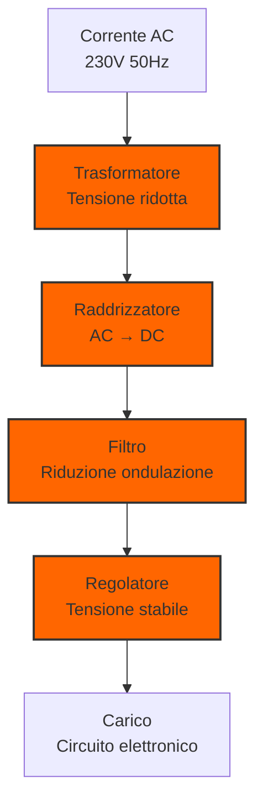

> [!WARNING]
> Questi sono **appunti personali** e possono contenere errori o imprecisioni.
> Non sostituiscono libri di testo o fonti ufficiali.
> Il materiale è soggetto a revisione continua grazie al contributo volontario della comunità.
> [Contribuisci su GitHub](https://github.com/IU6VYG/esame-radioamatori)

# 3.3 Alimentazione: Il Cuore Pulsante dei Circuiti ⚡

Benvenuti nel mondo delle alimentazioni! Immaginate un'alimentazione come il "cuore pulsante" che fornisce sangue (energia) pulita e costante a tutti i circuiti elettronici. Scopriamo come trasformare la corrente di rete in tensioni stabili e affidabili per i nostri dispositivi!

## ⚡ Cos'è un'Alimentazione?

Un'**alimentazione** (o power supply) è un circuito che converte la tensione elettrica da una forma all'altra, tipicamente da AC a DC, fornendo tensione stabile e regolata.

- **Funzione principale**: Convertire e stabilizzare la tensione
- **Input**: Corrente alternata (AC) dalla rete elettrica
- **Output**: Corrente continua (DC) stabile e pulita
- **Componenti chiave**: Trasformatore, raddrizzatore, filtro, regolatore

### Diagramma di un'Alimentazione

## 🔧 Raddrizzamento: Da AC a DC

Il **raddrizzamento** è il primo passo per convertire corrente alternata in continua.

### Raddrizzatore a Semionda
Usa un solo diodo per mantenere solo le semionde positive.

**Caratteristiche**:
- **Componenti**: 1 diodo
- **Efficienza**: ~40%
- **Frequenza ondulazione**: 50Hz
- **Uso**: Applicazioni semplici, basso costo

### Raddrizzatore a Onda Intera
Usa 4 diodi (ponte di Graetz) per raddrizzare entrambe le semionde.

**Caratteristiche**:
- **Componenti**: 4 diodi
- **Efficienza**: ~81%
- **Frequenza ondulazione**: 100Hz
- **Uso**: Alimentatori standard, caricabatterie

### Ponte Raddrizzatore

**Formule chiave**:
- **Tensione picco**: V_p = V_rms × √2
- **Tensione media (semionda)**: V_dc = V_p/π
- **Tensione media (onda intera)**: V_dc = 2V_p/π

### Alimentatore Lineare Completo

## 🔍 Filtraggio: Riduzione dell'Ondulazione

Il **filtraggio** riduce l'ondulazione residua dopo il raddrizzamento.

### Condensatore di Filtro
Un condensatore in parallelo con il carico immagazzina energia durante i picchi e la rilascia durante i minimi.

**Costante di tempo**: τ = R_L × C

**Fattore di ondulazione**: r = V_ripple/V_dc ≈ 1/(2πfRC)

### Circuito con Filtro

### Raddrizzatore a Semionda con Filtro

### Scelta del Condensatore
**C ≈ I_load/(f × V_ripple)**

Dove:
- **I_load**: Corrente di carico
- **f**: Frequenza dell'ondulazione (50Hz o 100Hz)
- **V_ripple**: Ondulazione massima accettabile

### Tipi di Filtri
| Tipo | Componenti | Caratteristiche | Uso |
|------|------------|-----------------|-----|
| **Capacitivo** | 1 condensatore | Semplice, economico | Generale |
| **Induttivo** | 1 induttore | Corrente elevata | Potenza |
| **LC** | L + C | Basso ripple | Alta qualità |
| **π** | C + L + C | Ripple molto basso | Professionale |

## 🎯 Stabilizzazione: Tensione Costante

La **stabilizzazione** mantiene la tensione costante nonostante variazioni di carico o input.

### Regolatori Lineari
Usano componenti attivi per mantenere la tensione costante.

#### Regolatore Serie
- **Componente di passaggio**: Transistor
- **Controllo**: Circuito di feedback
- **Efficienza**: 50-70%
- **Vantaggi**: Basso rumore, risposta rapida

#### Regolatore Shunt
- **Componente di passaggio**: Resistenza + Zener
- **Controllo**: Corrente di derivazione
- **Efficienza**: 30-50%
- **Vantaggi**: Protezione sovracorrente

### Regolatori Switching
Usano commutazione ad alta frequenza per maggiore efficienza.

#### Principio di Funzionamento
1. **Commutazione**: Transistor ON/OFF ad alta frequenza
2. **Accumulo**: Induttore immagazzina energia
3. **Filtraggio**: Condensatore livella l'uscita
4. **Controllo**: Feedback regola il duty cycle

**Efficienza**: 80-95%

### Circuito Stabilizzatore Zener

**V_out = V_zener** (se I_z > I_zk)

### Regolatore Lineare Serie

## 📊 Parametri delle Alimentazioni

### Tensione di Uscita
- **Regolazione di linea**: ΔV_out/ΔV_in
- **Regolazione di carico**: ΔV_out/ΔI_load
- **Ripple rejection**: Attenuazione dell'ondulazione

### Efficienza
**η = P_out/P_in × 100%**

| Tipo di Alimentazione | Efficienza | Costo | Complessità |
|----------------------|------------|-------|-------------|
| **Lineare** | 30-70% | Basso | Bassa |
| **Switching** | 80-95% | Alto | Alta |
| **Lineare + LDO** | 50-80% | Medio | Media |

### Fattore di Potenza
**PF = P_apparente/P_reale**

Importante per alimentazioni di potenza per evitare sovraccarichi della rete.

## 🛡️ Protezioni e Sicurezza

### Protezioni Essenziali
1. **Sovratensione**: Protegge da picchi di tensione
2. **Sovracorrente**: Limita la corrente massima
3. **Sovraccarico termico**: Protegge da surriscaldamento
4. **Cortocircuito**: Spegne l'alimentazione in caso di corto

### Dispositivi di Protezione
- **Fusibili**: Protezione sovracorrente
- **Varistori (VDR)**: Protezione sovratensione
- **PTC**: Protezione termica auto-resettabile
- **Optoaccoppiatori**: Isolamento galvanico

### Circuito di Protezione

### Limitatore di Corrente

## 🔌 Tipi di Alimentazioni

### Alimentatori Lineari
- **Principio**: Regolazione lineare della tensione
- **Vantaggi**: Basso rumore, risposta rapida, semplici
- **Svantaggi**: Bassa efficienza, calore elevato, dimensioni
- **Uso**: Audio, strumentazione, RF

### Alimentatori Switching
- **Principio**: Commutazione ad alta frequenza
- **Vantaggi**: Alta efficienza, compatte, leggere
- **Svantaggi**: Rumore EMI, complessità, costi
- **Uso**: Computer, caricabatterie, consumer electronics

### Alimentazioni LDO (Low Dropout)
- **Principio**: Regolazione lineare con bassa caduta di tensione
- **Vantaggi**: Basso rumore, stabilità, semplici
- **Svantaggi**: Efficienza limitata, calore
- **Uso**: Batterie, portatili, circuiti sensibili

## 📱 Applicazioni Pratiche

### 1. Alimentatore da Laboratorio
- **Tensione**: 0-30V regolabile
- **Corrente**: 0-5A limitabile
- **Protezioni**: Complete e professionali
- **Display**: Digitale preciso

### 2. Caricabatterie
- **Tipi**: Li-ion, NiMH, Pb
- **Controllo**: Carica a corrente costante, poi tensione costante
- **Sicurezza**: Protezione sovraccarica, temperatura

### Caricabatterie Li-ion

### Caricabatterie CC-CV

### 3. Alimentatori per Audio
- **Requisiti**: Basso rumore, stabilità
- **Tipi**: Lineari con regolazione precisa
- **Filtraggio**: Multi-stadio, basso ripple

### 4. Alimentatori per RF
- **Requisiti**: Bassissimo rumore, stabilità termica
- **Shielding**: Contenimento EMI
- **Regolazione**: Molto precisa

### Convertitore Buck (Step-Down)

### Convertitore Boost (Step-Up)

## 🧠 Quiz di Ripasso

Testa le tue conoscenze sulle alimentazioni!

### Domanda 1: Un raddrizzatore a ponte con V_in=12V AC fornisce circa...
- A) 12V DC
- B) 15V DC
- C) 17V DC

  
Risposta

  
<strong>C) 17V DC</strong>

  
V_dc = 2×V_p/π = 2×(12×√2)/π ≈ 10.8V (senza filtro), con filtro ≈ 17V

### Domanda 2: Un condensatore di filtro più grande...
- A) Aumenta l'ondulazione
- B) Riduce l'ondulazione
- C) Non cambia l'ondulazione

  
Risposta

  
<strong>B) Riduce l'ondulazione</strong>

  
Ripple ≈ 1/(2πfRC), quindi C più grande → ripple più piccolo

### Domanda 3: Quale tipo di alimentazione ha l'efficienza più alta?
- A) Lineare
- B) Switching
- C) LDO

  
Risposta

  
<strong>B) Switching</strong>

  
Efficienza 80-95% contro 30-70% dei lineari.

### Domanda 4: Un regolatore Zener da 5.6V con R_s=100Ω e I_load=20mA fornisce...
- A) 5.6V
- B) Meno di 5.6V
- C) Più di 5.6V

  
Risposta

  
<strong>B) Meno di 5.6V</strong>

  
Se I_load è troppo alta, lo Zener non regola più correttamente.

### Domanda 5: La frequenza di ripple in un raddrizzatore a onda intera è...
- A) 25Hz
- B) 50Hz
- C) 100Hz

  
Risposta

  
<strong>C) 100Hz</strong>

  
2× la frequenza di rete (50Hz × 2 = 100Hz).

## Conclusione

Le alimentazioni sono il cuore pulsante dell'elettronica! Dalla semplice conversione AC/DC ai complessi sistemi switching multi-tensione, capire come funzionano è essenziale per ogni progetto. Ricorda sempre: una buona alimentazione è la base per un circuito affidabile e performante. Scegli il tipo giusto basandoti su efficienza, rumore e costi! ⚡

---
