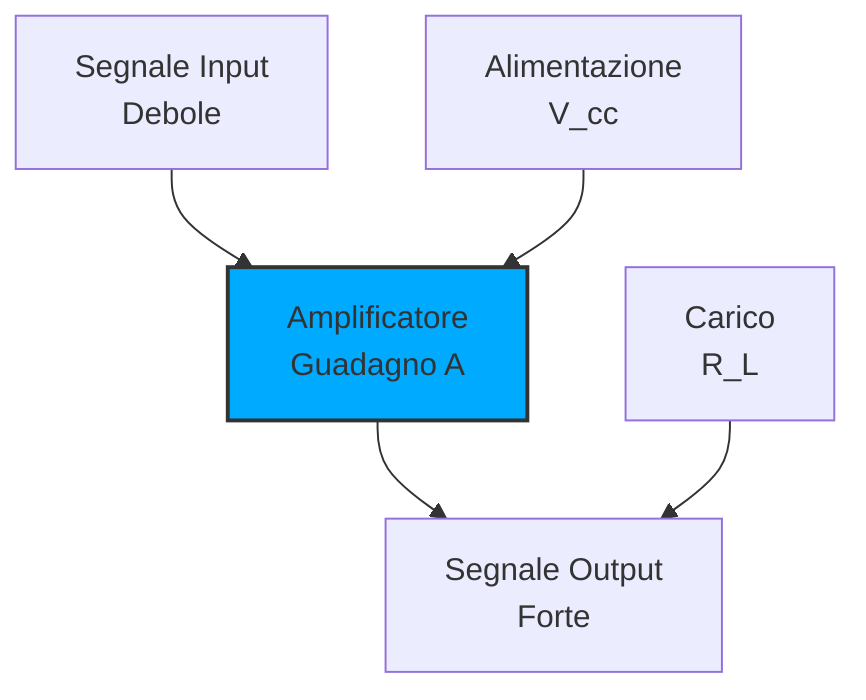
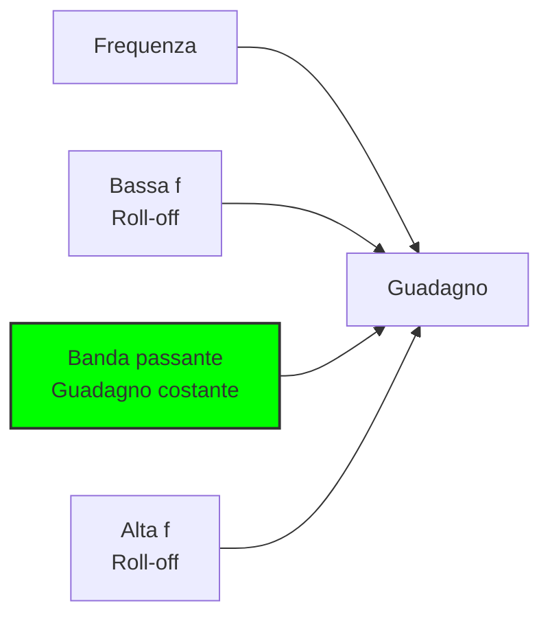

# 3.4 Amplificatori: I Potenziatori di Segnale 📶

Benvenuti nel mondo degli amplificatori! Immaginate un amplificatore come un "potenziatore di segnale" che prende un segnale debole e lo rende abbastanza forte da essere udito, trasmesso o elaborato. Scopriamo come questi circuiti essenziali permettono ai ricevitori radio di captare segnali deboli e ai trasmettitori di raggiungere il mondo!

## 📶 Cos'è un Amplificatore?

Un **amplificatore** è un circuito che aumenta l'ampiezza (potenza) di un segnale elettrico mantenendo la sua forma d'onda originale.

- **Funzione principale**: Aumentare la potenza del segnale
- **Input**: Segnale debole (μV, mV)
- **Output**: Segnale forte (V, W)
- **Componente chiave**: Transistor, valvole, op-amp

### Diagramma di un Amplificatore

## 📊 Fattore di Amplificazione

Il **guadagno (A)** misura quanto viene amplificato un segnale.

### Tipi di Guadagno
- **Guadagno di tensione**: A_v = V_out/V_in
- **Guadagno di corrente**: A_i = I_out/I_in
- **Guadagno di potenza**: A_p = P_out/P_in = A_v × A_i

### Guadagno in Decibel
**A_dB = 20 × log₁₀(A)** per tensione/corrente
**A_dB = 10 × log₁₀(A)** per potenza

### Tabella Guadagni Comuni
| Guadagno Lineare | Guadagno dB | Applicazione |
|------------------|-------------|--------------|
| 2 | +6dB | Preamplificatore |
| 10 | +20dB | Amplificatore audio |
| 100 | +40dB | RF a basso guadagno |
| 1000 | +60dB | Ricevitore sensibile |

## 📈 Caratteristica Ampiezza/Frequenza

La **risposta in frequenza** descrive come il guadagno varia con la frequenza.

### Banda Passante
Range di frequenze dove il guadagno è entro -3dB dal valore massimo.

**f_L**: Frequenza inferiore di taglio
**f_H**: Frequenza superiore di taglio
**BW**: Larghezza di banda = f_H - f_L

### Diagramma di Bode

### Roll-off
- **1° ordine**: -20dB/decade
- **2° ordine**: -40dB/decade
- **3° ordine**: -60dB/decade

## 🏆 Classi di Amplificatori

Le classi definiscono come il transistor è polarizzato e l'efficienza del circuito.

### Classe A
- **Polarizzazione**: Sempre in conduzione
- **Angolo di conduzione**: 360°
- **Efficienza**: 25-50%
- **Vantaggi**: Bassa distorsione, lineare
- **Svantaggi**: Basso rendimento, calore
- **Uso**: Audio hi-fi, RF a basso rumore

### Classe B
- **Polarizzazione**: Conduzione per metà ciclo
- **Angolo di conduzione**: 180°
- **Efficienza**: 50-78%
- **Vantaggi**: Alta efficienza
- **Svantaggi**: Distorsione di crossover
- **Uso**: Audio potenza, RF

### Classe AB
- **Polarizzazione**: Leggermente in conduzione
- **Angolo di conduzione**: >180° ma <360°
- **Efficienza**: 50-70%
- **Vantaggi**: Buon compromesso efficienza/linearità
- **Svantaggi**: Complessità maggiore
- **Uso**: Audio, RF generale

### Classe C
- **Polarizzazione**: Conduzione <180°
- **Angolo di conduzione**: <180°
- **Efficienza**: 70-85%
- **Vantaggi**: Altissima efficienza
- **Svantaggi**: Alta distorsione
- **Uso**: RF potenza, oscillatori

### Tabella Comparativa Classi
| Classe | Angolo | Efficienza | Linearità | Uso Principale |
|--------|--------|-------------|------------|-----------------|
| A | 360° | 25-50% | Eccellente | Audio hi-fi, RF |
| B | 180° | 50-78% | Scarsa | Audio potenza |
| AB | 180-360° | 50-70% | Buona | Audio generale |
| C | <180° | 70-85% | Pessima | RF potenza |

## 🎛️ Amplificatori a Bassa Frequenza (Audio)

Operano tipicamente da 20Hz a 20kHz.

### Amplificatore a Emettitore Comune

**Caratteristiche**:
- **Guadagno tensione**: A_v = -g_m × R_C
- **Guadagno corrente**: A_i ≈ β
- **Impedenza input**: Z_in ≈ r_π
- **Impedenza output**: Z_out ≈ R_C

### Amplificatore Operazionale
Circuito integrato versatile con guadagno altissimo.

**Configurazioni comuni**:
- **Invertente**: A_v = -R_f/R_in
- **Non invertente**: A_v = 1 + R_f/R_in
- **Seguiter**: A_v = 1

### Amplificatore con Op-Amp

## 📻 Amplificatori ad Alta Frequenza (RF)

Operano da kHz a GHz, con considerazioni speciali.

### Amplificatore a Base Comune
- **Guadagno tensione**: Alto
- **Guadagno corrente**: <1
- **Frequenza**: Alta (f_T)
- **Uso**: RF VHF/UHF

### Amplificatore RF

### Considerazioni RF
- **Impedenza**: 50Ω standard
- **Stabilità**: Evitare oscillazioni
- **Linearità**: Minimizzare intermodulazione
- **Rumore**: Basso figura di rumore

## 🎶 Armoniche e Distorsione

### Armoniche
Frequenze multiple della frequenza fondamentale.

- **2° armonica**: 2 × f_fondamentale
- **3° armonica**: 3 × f_fondamentale
- **n° armonica**: n × f_fondamentale

### Tipi di Distorsione
1. **Distorsione armonica**: Non linearità crea armoniche
2. **Distorsione di intermodulazione**: Interazione tra frequenze
3. **Distorsione di fase**: Sfasamento frequenza-dipendente

### THD (Total Harmonic Distortion)
**THD = √(V₂² + V₃² + ... + V_n²) / V₁**

Dove V₁ è la fondamentale e V_n le armoniche.

### Valori THD Accettabili
| Applicazione | THD Massimo |
|--------------|--------------|
| Audio hi-fi | <0.01% |
| Audio generale | <0.1% |
| RF | <1% |
| Strumentazione | <0.001% |

## 🔧 Configurazioni di Amplificatori

### 1. Single-Ended
Un solo dispositivo attivo, riferimento comune.

**Vantaggi**: Semplice, economico
**Svantaggi**: Efficienza limitata, distorsione simmetrica

### 2. Push-Pull
Due dispositivi attivi in opposizione di fase.

**Vantaggi**: Alta efficienza, bassa distorsione
**Svantaggi**: Complesso, richiede simmetria

### Amplificatore Push-Pull

### 3. Differenziale
Due ingressi, uscita differenziale.

**Vantaggi**: Basso rumore, alta CMRR
**Svantaggi**: Complessità, costo elevato

### Amplificatore Differenziale

## 📊 Parametri Caratteristici

### Figura di Rumore (Noise Figure)
**NF = 10 × log₁₀(SNR_in/SNR_out)**

- **Valori tipici**: 1-5dB per amplificatori RF
- **Importanza**: Critica in ricevitori sensibili

### P1dB (Compression Point)
Potenza a cui il guadagno scende di 1dB.

- **Tipico**: +10 a +30dBm per amplificatori RF
- **Importanza**: Definisce la potenza massima utilizzabile

### IP3 (Third Order Intercept Point)
Punto teorico dove distorsione del 3° ordine eguaglia il segnale fondamentale.

- **Tipico**: +20 a +40dBm per amplificatori lineari
- **Importanza**: Misura la linearità

## 🎯 Applicazioni Pratiche

### 1. Ricevitori Radio
- **RF front-end**: Bassissimo rumore, guadagno moderato
- **IF amplification**: Guadagno alto, buona linearità
- **Audio amplification**: Bassa distorsione, guadagno controllato

### 2. Trasmettitori Radio
- **Driver amplification**: Potenza media, buona linearità
- **Final amplification**: Alta potenza, efficienza importante
- **Harmonic filtering**: Rimozione armoniche indesiderate

### 3. Audio
- **Preamplifier**: Basso rumore, guadagno alto
- **Power amplifier**: Alta potenza, bassa distorsione
- **Headphone amplifier**: Bassa potenza, bassa impedenza output

## 🧠 Quiz di Ripasso

Testa le tue conoscenze sugli amplificatori!

### Domanda 1: Un amplificatore con guadagno di 100 ha quale guadagno in dB?
- A) 20dB
- B) 40dB
- C) 60dB

  
Risposta

  
<strong>B) 40dB</strong>

  
A_dB = 20 × log₁₀(100) = 20 × 2 = 40dB

### Domanda 2: Quale classe di amplificatore ha l'efficienza più alta?
- A) Classe A
- B) Classe B
- C) Classe C

  
Risposta

  
<strong>C) Classe C</strong>

  
Efficienza 70-85% contro 25-50% della classe A.

### Domanda 3: Un amplificatore audio con THD = 0.05% è...
- A) Eccellente
- B) Buono
- C) Scadente

  
Risposta

  
<strong>B) Buono</strong>

  
Eccellente <0.01%, buono <0.1%, quindi 0.05% è buono.

### Domanda 4: La banda passante è definita tra i punti a...
- A) -1dB
- B) -3dB
- C) -6dB

  
Risposta

  
<strong>B) -3dB</strong>

  
Standard industriale per definire la larghezza di banda.

### Domanda 5: Un amplificatore push-pull ha angolo di conduzione di...
- A) 360°
- B) 180°
- C) Dipende dalla classe

  
Risposta

  
<strong>C) Dipende dalla classe</strong>

  
Può essere Classe A (360°), B (180°), o AB (>180°).

## Conclusione

Gli amplificatori sono i potenziatori di segnale essenziali in elettronica! Dal ricevitore che capta un segnale da micro-watt all'altoparlante che produce centinaia di watt, capire come funzionano gli amplificatori è fondamentale per ogni radioamatore. Scegli la classe giusta basandoti su efficienza, linearità e applicazione specifica! 📶

---
