# 4.2 Schemi a Blocchi: L'Anatomia dei Ricevitori 📊

Benvenuti nell'analisi dettagliata degli schemi a blocchi dei ricevitori! Ogni tipo di modulazione richiede un approccio diverso per l'estrazione dell'informazione. Scopriamo come funzionano i ricevitori per CW (telegrafia), AM (modulazione di ampiezza) e SSB (banda laterale unica), i pilastri della comunicazione radioamatoriale!

## 📊 Cos'è uno Schema a Blocchi?

Uno **schema a blocchi** rappresenta graficamente le funzioni principali di un sistema elettronico, mostrando:
- **Flusso del segnale**: Come il segnale passa attraverso i vari stadi
- **Funzioni di ogni blocco**: Cosa fa ciascun componente
- **Connessioni**: Come i blocchi interagiscono
- **Parametri chiave**: Guadagno, frequenza, larghezza di banda

### Confronto Architetture Ricevitori


*Figura: Confronto tra le principali architetture di ricevitori radio con caratteristiche e applicazioni tipiche.*

### Simboli Comuni negli Schemi
```
📡 Antenna          🎛️ Filtro/Preselettore
📈 Amplificatore    🔄 Mixer/Oscillatore
🎯 Rivelatore        🔊 Audio/Output
📊 Misuratore        🔇 Silenziatore
```

## 📡 Ricevitore CW (A1A): Telegrafia Continua

Il **CW (Continuous Wave)** è la telegrafia Morse via radio, dove l'informazione è codificata nella presenza/assenza del segnale portante.

### Principio di Funzionamento CW
- **Segnale**: Portante ON/OFF (Morse)
- **Demodulazione**: Rivelazione di ampiezza semplice
- **Uscita**: Click sonori (ON) e silenzio (OFF)

### Schema a Blocchi CW Base

```mermaid
graph LR;
    Antenna["Antenna<br>📡"] --> Preselettore["Preselettore<br>🎛️"];
    Preselettore --> AmplificatoreRF["Amp RF<br>📈"];
    AmplificatoreRF --> Mixer["Mixer<br>🔄"];
    OscillatoreLO["Osc LO<br>🔄"] --> Mixer;
    Mixer --> FiltroIF["Filtro IF<br>🎛️"];
    FiltroIF --> AmplificatoreIF["Amp IF<br>📈"];
    AmplificatoreIF --> Rivelatore["Rivelatore<br>🎯"];
    Rivelatore --> AmplificatoreAF["Amp AF<br>🔊"];
    AmplificatoreAF --> Altoparlante["Altoparlante"];
    classDef cw fill:#ff6,stroke:#333,stroke-width:2px;
    class Rivelatore cw;
```




### Descrizione dei Blocchi CW

- **Antenna**: Cattura le onde radio e le converte in segnale elettrico.
- **Preselettore**: Filtro RF che attenua segnali fuori banda prima dell'amplificazione.
- **Amp RF**: Amplificatore a radiofrequenza che aumenta il segnale debole dall'antenna.
- **Mixer**: Mescola il segnale RF con l'oscillatore locale per produrre frequenza intermedia.
- **Osc LO**: Oscillatore locale che genera la frequenza di riferimento per la conversione.
- **Filtro IF**: Filtro a frequenza intermedia che seleziona il canale desiderato.
- **Amp IF**: Amplificatore IF che fornisce guadagno selettivo.
- **Rivelatore**: Demodulatore che estrae il segnale audio dal segnale modulato.
- **Amp AF**: Amplificatore audio che potenzia il segnale per l'altoparlante.
- **Altoparlante**: Converte il segnale elettrico in suono udibile.

### Caratteristiche del Ricevitore CW
- **Semplicità**: Pochi componenti necessari
- **Sensibilità**: Eccellente per segnali deboli
- **Selettività**: Dipende dal filtro IF
- **Banda**: Molto stretta (100-500 Hz tipica)

### Ricevitore CW Avanzato con BFO


### Descrizione dei Blocchi CW con BFO

- **Antenna**: Cattura segnali CW.
- **Preselettore**: Filtro iniziale RF.
- **Amp RF**: Preamplificatore RF.
- **Mixer**: Conversione a frequenza intermedia.
- **Osc LO**: Oscillatore locale per IF.
- **Filtro IF**: Selettore di canale IF.
- **Amp IF**: Amplificatore IF.
- **Mixer BFO**: Mescola IF con BFO per produrre audio.
- **Oscillatore BFO**: Genera tono a ±800Hz per demodulazione CW.
- **Filtro AF**: Filtro audio passa-banda.
- **Amp AF**: Amplificatore audio finale.
- **Speaker**: Uscita audio.

**BFO (Beat Frequency Oscillator)**: Oscilla a ±800Hz per produrre tono udibile

## 🔧 Ricevitore Supereterodina Dettagliato

Il ricevitore **supereterodina** è l'architettura più diffusa. Ecco uno schema dettagliato con frequenze tipiche:


*Figura: Schema dettagliato di un ricevitore supereterodina per HF con frequenze tipiche (RF=7MHz, IF=455kHz) e parametri di ogni stadio.*

### Mixer e Oscillatore Locale

I componenti chiave della conversione di frequenza sono il mixer e l'oscillatore locale:


*Figura: Dettaglio del mixer a diodi bilanciato e dell'oscillatore locale (VFO/PLL) con specifiche tecniche.*

## 📻 Ricevitore AM (A3E): Modulazione di Ampiezza

L'**AM (Amplitude Modulation)** modula l'ampiezza della portante con il segnale audio, creando bande laterali superiore e inferiore.

### Principio di Funzionamento AM
- **Segnale**: Portante + 2 bande laterali
- **Demodulazione**: Rivelazione di inviluppo
- **Uscita**: Segnale audio originale

### Schema a Blocchi AM Standard

```mermaid
graph LR;
    Antenna["Antenna<br>📡"] --> Preselettore["Preselettore<br>🎛️"];
    Preselettore --> AmplificatoreRF["Amp RF<br>📈"];
    AmplificatoreRF --> Mixer["Mixer<br>🔄"];
    OscillatoreLO["Osc LO<br>🔄"] --> Mixer;
    Mixer --> FiltroIF["Filtro IF<br>🎛️"];
    FiltroIF --> AmplificatoreIF["Amp IF<br>📈"];
    AmplificatoreIF --> Limitatore["Limitatore<br>📏"];
    Limitatore --> RivelatoreAM["Rivelatore AM<br>🎯"];
    RivelatoreAM --> FiltroAF["Filtro AF<br>🎛️"];
    FiltroAF --> AmplificatoreAF["Amp AF<br>🔊"];
    AmplificatoreAF --> AGC["AGC<br>📊"];
    AGC --> Uscita["Uscita Audio"];
    classDef am fill:#6f6,stroke:#333,stroke-width:2px;
    class RivelatoreAM,Limitatore am;
```




### Descrizione dei Blocchi AM

- **Antenna**: Riceve il segnale AM broadcast.
- **Preselettore**: Filtro che seleziona la banda AM (530-1600 kHz).
- **Amp RF**: Amplifica il segnale debole dall'antenna.
- **Mixer**: Converte il segnale RF in frequenza intermedia (455 kHz tipica).
- **Osc LO**: Oscillatore locale per la conversione di frequenza.
- **Filtro IF**: Filtro stretto che seleziona il canale AM.
- **Amp IF**: Amplifica il segnale IF con guadagno controllato.
- **Limitatore**: Limita l'ampiezza per ridurre rumore impulsivo.
- **Rivelatore AM**: Demodulatore che estrae l'inviluppo del segnale AM.
- **Filtro AF**: Filtro passa-basso per audio (20-5000 Hz).
- **Amp AF**: Amplificatore audio finale.
- **AGC**: Controllo automatico di guadagno per livelli audio costanti.
- **Uscita Audio**: Segnale pronto per altoparlante.

### Componenti Specializzati per AM

#### Limitatore
- **Funzione**: Mantiene costante l'ampiezza del segnale IF
- **Scopo**: Previene distorsioni AM in presenza di fading
- **Tipo**: Diodi o amplificatori operazionali

#### AGC (Automatic Gain Control)
- **Funzione**: Regola automaticamente il guadagno
- **Scopo**: Mantiene volume costante nonostante variazioni segnale
- **Implementazione**: Circuito di retroazione dal rivelatore

#### S-Meter
- **Funzione**: Misura livello segnale in ingresso
- **Scala**: S-units (1-9) + dB
- **Uso**: Valutare forza del segnale ricevuto

### Ricevitore AM con Squelch

```mermaid
graph LR;
    Antenna["Antenna"] --> Preselettore["Preselettore"];
    Preselettore --> AmpRF["Amp RF"];
    AmpRF --> Mixer["Mixer"];
    OscLO["Osc LO"] --> Mixer;
    Mixer --> FiltroIF["Filtro IF"];
    FiltroIF --> AmpIF["Amp IF"];
    AmpIF --> Limitatore["Limitatore"];
    Limitatore --> RivelatoreAM["Rivelatore AM"];
    RivelatoreAM --> FiltroAF["Filtro AF"];
    FiltroAF --> AmpAF["Amp AF"];
    AmpAF --> AGC["AGC"];
    AGC --> Squelch["Squelch<br>🔇"];
    Squelch --> Speaker["Speaker"];
    RivelatoreAM --> SMeter["S-Meter<br>📊"];
    classDef squelch fill:#f66,stroke:#333,stroke-width:2px;
    class Squelch squelch;
```


### Descrizione dei Blocchi FM

- **Antenna**: Riceve segnali FM VHF/UHF.
- **Preselettore**: Filtro che seleziona la banda FM.
- **Amp RF**: Preamplificatore per segnali deboli.
- **Mixer**: Conversione a frequenza intermedia (10.7 MHz tipica).
- **Osc LO**: Oscillatore locale per IF.
- **Filtro IF**: Filtro IF con limitatore integrato.
- **Amp IF**: Amplificatore IF limitato.
- **Rivelatore FM**: Discriminatore di frequenza per demodulazione FM.
- **Filtro AF**: De-enfasi per ridurre rumore alti.
- **Amp AF**: Amplificatore audio.
- **Squelch**: Circuito che silenzia rumore quando segnale debole.
- **S-Meter**: Indicatore livello segnale.

**Squelch**: Silenziatore che attiva l'audio solo quando il segnale supera una soglia

## 📞 Ricevitore SSB (J3E): Banda Laterale Unica

L'**SSB (Single Side Band)** trasmette solo una banda laterale, eliminando portante e l'altra banda laterale per efficienza spettrale.

### Principio di Funzionamento SSB
- **Segnale**: Una banda laterale + portante pilotata (se presente)
- **Demodulazione**: Prodotto con portante ricostruita
- **Uscita**: Segnale audio originale

### Schema a Blocchi SSB


### Descrizione dei Blocchi SSB

- **Antenna**: Cattura segnali SSB HF/VHF.
- **Preselettore**: Filtro banda larga per ridurre interferenze.
- **Amp RF**: Amplificatore RF per segnali deboli.
- **Mixer**: Conversione a frequenza intermedia.
- **Osc LO**: Oscillatore locale per IF.
- **Filtro IF**: Filtro IF passa-banda.
- **Amp IF**: Amplificatore IF.
- **Filtro SSB**: Filtro stretto per selezionare USB o LSB.
- **Mixer Prodotto**: Demodulatore che mescola con BFO.
- **BFO**: Beat Frequency Oscillator a ±1.5 kHz per ricostruire portante.
- **Filtro AF**: Filtro audio passa-banda (300-3000 Hz).
- **Amp AF**: Amplificatore audio finale.
- **Uscita Audio**: Segnale audio demodulato.

### Componenti Critici per SSB

#### Filtro SSB
- **Funzione**: Seleziona solo una banda laterale
- **Tipo**: Filtro cristallino o meccanico
- **Banda**: ±1.5 kHz attorno alla portante soppressa

#### BFO (Beat Frequency Oscillator)
- **Funzione**: Fornisce portante per demodulazione
- **Frequenza**: ±1.5 kHz (banda telefonica)
- **Precisione**: Critica per qualità audio

#### Mixer Prodotto
- **Funzione**: Moltiplica segnale SSB con BFO
- **Risultato**: Traslazione a frequenza audio
- **Tipo**: Diodi o transistor in configurazione bilanciata

### SSB con Carrier Re-insertion

```mermaid
graph LR;
    Antenna["Antenna"] --> Preselettore["Preselettore"];
    Preselettore --> AmpRF["Amp RF"];
    AmpRF --> Mixer["Mixer"];
    OscLO["Osc LO"] --> Mixer;
    Mixer --> FiltroIF["Filtro IF"];
    FiltroIF --> AmpIF["Amp IF"];
    AmpIF --> FiltroSSB["Filtro SSB"];
    FiltroSSB --> MixerProdotto["Mixer Prodotto"];
    OscBFO["BFO"] --> MixerProdotto;
    MixerProdotto --> CarrierInsert["Carrier<br>Re-insertion<br>📡"];
    CarrierInsert --> FiltroAF["Filtro AF"];
    FiltroAF --> AmpAF["Amp AF"];
    AmpAF --> Output["Output"];
    classDef carrier fill:#f90,stroke:#333,stroke-width:2px;
    class CarrierInsert carrier;
```


**Carrier Re-insertion**: Aggiunge una portante debole per migliorare la demodulazione

## 📊 Flusso del Segnale e Livelli dBm

Comprendere i livelli di segnale in ogni stadio è fondamentale per progettare e diagnosticare ricevitori:


*Figura: Livelli di segnale in dBm attraverso gli stadi di un ricevitore, da -93 dBm (S5) in antenna a -5 dBm in uscita.*

## 📱 Ricevitore SDR a Conversione Diretta

I ricevitori **SDR (Software Defined Radio)** rappresentano l'evoluzione moderna dell'architettura radio:


*Figura: Architettura di un ricevitore SDR con conversione I/Q e elaborazione digitale del segnale.*

## 📊 Confronto tra i Tre Tipi

| Aspetto | CW (A1A) | AM (A3E) | SSB (J3E) |
|---------|----------|----------|-----------|
| **Banda occupata** | ~100-500 Hz | 2×banda audio | Banda audio + 3kHz |
| **Potenza necessaria** | Molto bassa | Alta | Media |
| **Sensibilità** | Eccellente | Buona | Buona |
| **Qualità audio** | Solo tono | Buona | Eccellente |
| **Complessità RX** | Bassa | Media | Alta |
| **Uso radioamatori** | Contatti DX | Broadcast | Telefonia |

## 🎯 Considerazioni Pratiche per Radioamatori

### Scelta del Ricevitore
- **CW**: Ricevitori semplici, alta sensibilità
- **AM**: Per ascolto broadcast, richiede AGC
- **SSB**: Per comunicazioni, richiede BFO preciso

### Problemi Comuni
- **CW**: "Chirping" se BFO non stabile
- **AM**: Distorsione con segnali deboli
- **SSB**: Audio distorto se BFO fuori sintonia

### Ottimizzazioni
- **CW**: Filtri IF stretti (200Hz)
- **AM**: AGC veloce per fading
- **SSB**: BFO con quarzo per stabilità

## 🧠 Quiz di Ripasso

Testa le tue conoscenze sugli schemi a blocchi!

### Domanda 1: Nel ricevitore CW, il BFO serve per...
- A) Amplificare il segnale RF
- B) Produrre il tono udibile
- C) Filtrare l'IF
- D) Misurare il segnale

<details>
  <summary>Risposta</summary>
  <p><strong>B) Produrre il tono udibile</strong></p>
  <p>Il BFO batte con il segnale CW per produrre un tono audio udibile.</p>
</details>

### Domanda 2: L'AGC nel ricevitore AM serve per...
- A) Limitare l'ampiezza
- B) Mantenere volume costante
- C) Filtrare le interferenze
- D) Misurare la frequenza

<details>
  <summary>Risposta</summary>
  <p><strong>B) Mantenere volume costante</strong></p>
  <p>L'AGC regola il guadagno per compensare variazioni del segnale ricevuto.</p>
</details>

### Domanda 3: Nel SSB, il filtro SSB seleziona...
- A) La portante
- B) Una banda laterale
- C) Entrambe le bande laterali
- D) Il segnale audio

<details>
  <summary>Risposta</summary>
  <p><strong>B) Una banda laterale</strong></p>
  <p>Il filtro SSB seleziona solo una banda laterale per efficienza spettrale.</p>
</details>

### Domanda 4: Lo squelch serve per...
- A) Amplificare deboli segnali
- B) Eliminare rumore di fondo
- C) Misurare la potenza
- D) Stabilizzare la frequenza

<details>
  <summary>Risposta</summary>
  <p><strong>B) Eliminare rumore di fondo</strong></p>
  <p>Lo squelch silenziatore l'audio quando non c'è segnale utile.</p>
</details>

### Domanda 5: Il rivelatore AM estrae...
- A) La frequenza del segnale
- B) L'inviluppo del segnale
- C) La fase del segnale
- D) La banda laterale

<details>
  <summary>Risposta</summary>
  <p><strong>B) L'inviluppo del segnale</strong></p>
  <p>Il rivelatore AM segue l'ampiezza variabile del segnale modulato.</p>
</details>

## Conclusione

Gli schemi a blocchi rivelano l'anima dei ricevitori radio! Dal semplice CW al sofisticato SSB, ogni tipo di modulazione richiede un approccio specifico per estrarre l'informazione. Capire questi schemi è essenziale per progettare ricevitori efficienti e diagnosticare problemi. I radioamatori devono padroneggiare tutti e tre i tipi per comunicare efficacemente! 📡

---
