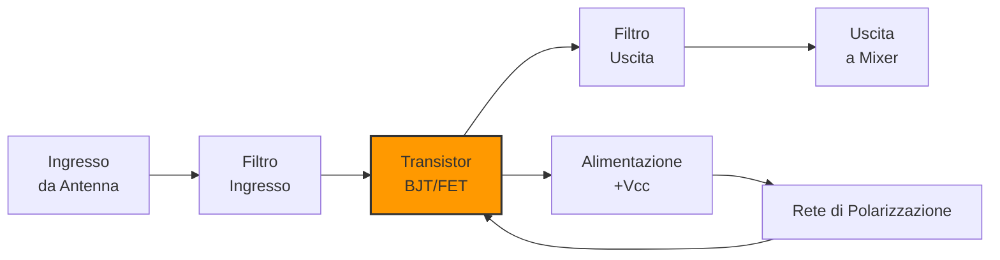
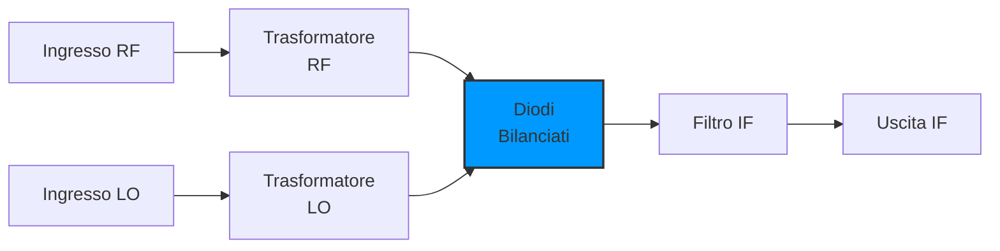
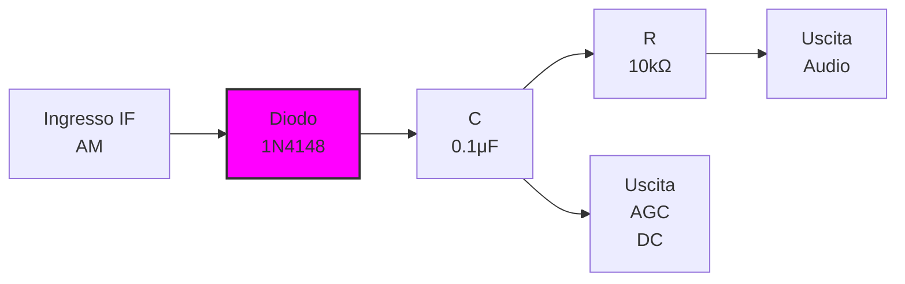

# 4.3 Descrizione degli Stadi Seguenti: Il Cuore del Ricevitore 🔍

Benvenuti nel tour dettagliato attraverso ogni componente di un ricevitore radio! Ogni stadio ha una funzione specifica e caratteristiche uniche. Scopriamo come l'antenna, gli amplificatori, i mixer, i filtri e i rivelatori lavorano insieme per trasformare onde elettromagnetiche in suoni udibili!

## 📡 L'Antenna: Il Primo Stadio

L'**antenna** è l'interfaccia tra l'etere e il ricevitore, catturando l'energia elettromagnetica e convertendola in segnale elettrico.

### Funzioni dell'Antenna
- **Cattura**: Raccoglie energia dalle onde radio
- **Impedenza**: Adatta l'impedenza libera spazio (377Ω) all'impedenza del ricevitore (50-75Ω)
- **Direzionalità**: Concentra la ricezione in direzioni specifiche
- **Polarizzazione**: Orienta il campo elettrico (lineare, circolare)

### Tipi di Antenna per Ricevitori
- **Dipolo**: Semplice, omnidirezionale
- **Yagi**: Direzionale, guadagno alto
- **Discone**: Banda larga, HF-UHF
- **Loop**: Compatte, MF-HF
- **Beverage**: Ricezione DX, LF-MF

### Parametri Critici
- **Guadagno**: dBi (decibel isotropic)
- **ROS (Rapporto Avanti-Retro)**: dB
- **Impedenza**: Ω
- **Banda**: MHz
- **VSWR**: Rapporto onda stazionaria (<2:1 ideale)

## 🎛️ Preselettore (RF Filter)

Il **preselettore** è un filtro passa-banda che seleziona la banda di frequenza desiderata prima dell'amplificazione.

### Funzioni
- **Selettività iniziale**: Elimina segnali fuori banda
- **Protezione**: Previene sovraccarico degli stadi successivi
- **Reiezione immagine**: Attenua la frequenza immagine
- **Adattamento impedenza**: Abbina antenna a ricevitore

### Tipi di Preselettore
- **LC**: Bobine e condensatori (economico)
- **Cristallino**: Quarzi per alta selettività
- **Ceramico**: Compatto, banda fissa
- **Varicap**: Sintonizzabile elettricamente

### Specifiche
- **Banda passante**: ±5-10% della frequenza centrale
- **Attenuazione**: >20dB fuori banda
- **Perdite inserzione**: <2dB
- **VSWR**: <1.5:1

## 📈 Amplificatore in Alta Frequenza (RF Amplifier)

L'**amplificatore RF** aumenta l'ampiezza del segnale ricevuto prima della conversione di frequenza.

### Funzioni
- **Guadagno**: 10-20dB tipicamente
- **Adattamento impedenza**: Tra antenna e mixer
- **Riduzione rumore**: Figura di rumore <3dB
- **Linearità**: Per evitare intermodulazione

### Tipi di Amplificatori RF
- **BJT (Bipolar Junction Transistor)**: Economico, banda larga
- **FET (Field Effect Transistor)**: Bassa figura di rumore
- **MMIC (Monolithic Microwave IC)**: VHF/UHF, integrato
- **Tubo a vuoto**: Alta potenza, bassa figura di rumore

### Parametri Critici
- **Figura di rumore (NF)**: Minore è meglio (<2dB ideale)
- **Punto di compressione 1dB**: +10dBm tipico
- **IP3 (Third Order Intercept)**: +20dBm minimo
- **Banda**: Copre la gamma desiderata

### Circuito Base RF Amp

## 🔄 Oscillatore Fisso e Variabile

Gli **oscillatori** generano i segnali di riferimento necessari per la conversione di frequenza.

### Oscillatore Fisso
- **Funzione**: Genera frequenza fissa per riferimento
- **Stabilità**: ±1ppm con compensazione temperatura
- **Tipo**: Oscillatore a quarzo (XO) o TCXO
- **Uso**: Riferimento per sintesi frequenza

### Oscillatore Variabile (VFO)
- **Funzione**: Genera f_LO variabile per sintonizzazione
- **Range**: Copre banda desiderata (es. 3.5-4.0MHz per 80m)
- **Stabilità**: ±100Hz tipica
- **Tipo**: LC con varicap o permalloy

### Oscillatore di Battimento (BFO)
- **Funzione**: Genera tono per demodulazione CW/SSB
- **Frequenza**: ±800Hz per CW, ±1.5kHz per SSB
- **Stabilità**: Quarzo per precisione
- **Uso**: Produzione tono udibile

### Parametri Comuni
- **Frequenza**: Stabile entro ±10ppm
- **Uscita**: -10dBm to +10dBm
- **Fase rumore**: < -100dBc/Hz a 1kHz offset
- **Spur**: < -60dBc

## 🔄 Miscelatore (Mixer)

Il **mixer** è il cuore della conversione di frequenza, combinando segnale RF con oscillatore locale.

### Principio di Funzionamento
**f_IF = |f_RF ± f_LO|**

### Tipi di Mixer
- **Diodi**: Bilanciato, alta dinamica
- **Transistor**: Gilbert cell, integrato
- **Doppio bilanciato**: Migliore reiezione LO/RF
- **Triplo bilanciato**: Eccellente isolamento

### Funzioni del Mixer
- **Conversione frequenza**: RF → IF
- **Isolamento**: Previene leakage LO → antenna
- **Linearità**: Evita prodotti intermodulazione
- **Guadagno conversione**: 0dB (passivo) o >0dB (attivo)

### Specifiche
- **Perdite conversione**: <7dB per mixer passivo
- **Isolamento LO-RF**: >30dB
- **IP3**: +15dBm minimo
- **Banda**: Copre gamma operativa

### Circuito Mixer a Diodi

## 📈 Amplificatore a Frequenza Intermedia (IF Amplifier)

L'**amplificatore IF** fornisce il guadagno principale e la selettività del ricevitore.

### Funzioni
- **Guadagno**: 40-80dB totale
- **Selettività**: Filtro passa-banda stretto
- **AGC**: Controllo guadagno automatico
- **Stabilità**: Temperatura e tempo

### Stadi IF
- **Pre-amplificatore**: Guadagno 20-30dB, bassa NF
- **Filtro**: Selettività principale
- **Post-amplificatore**: Guadagno rimanente
- **Limitatore**: Per AM (opzionale)

### Tipi di Filtri IF
- **LC**: Economico, banda regolabile
- **Cristallino**: Alta selettività, banda fissa
- **Meccanico**: Eccellente forma, costoso
- **Ceramico**: Compatto, economico

### Parametri IF
- **Frequenza**: 455kHz (AM), 10.7MHz (FM), 9MHz (SSB)
- **Banda**: 6kHz (AM), 200kHz (FM), 2.4kHz (SSB)
- **Guadagno**: 60dB tipico
- **Figura rumore**: <8dB

## 📏 Limitatore

Il **limitatore** mantiene costante l'ampiezza del segnale IF, essenziale per ricevitori AM.

### Funzioni
- **Ampiezza costante**: Indipendente da segnale ingresso
- **Prevenzione distorsione**: In fading profondo
- **Preparazione AGC**: Segnale stabile per controllo

### Tipi di Limitatore
- **Diodi**: Semplice, economico
- **Amplificatore operazionale**: Precisione
- **Circuito logaritmico**: Range dinamico ampio

### Specifiche
- **Range**: 60dB tipicamente
- **Distorsione**: <5%
- **Ritardo**: <10μs
- **Attenuazione**: 0-20dB regolabile

## 🎯 Rivelatore (Detector)

Il **rivelatore** estrae l'informazione dal segnale modulato, convertendo IF in audio.

### Tipi di Rivelatore

#### Rivelatore AM (Envelope Detector)
- **Funzione**: Estrae inviluppo del segnale AM
- **Componenti**: Diodo + RC
- **Uscita**: Segnale audio + DC (AGC)

#### Rivelatore Prodotto (Product Detector)
- **Funzione**: Per SSB/CW, moltiplica con BFO
- **Tipo**: Bilanciato per eliminare portante
- **Uscita**: Audio puro

#### Rivelatore FM (Discriminator)
- **Funzione**: Converte deviazione frequenza in ampiezza
- **Tipo**: Slope detector, ratio detector, PLL
- **Uscita**: Segnale audio FM

### Circuito Rivelatore AM Base

## 🎛️ Oscillatore di Battimento (BFO)

Il **BFO** genera la frequenza necessaria per la demodulazione CW e SSB.

### Funzioni
- **CW**: Produce tono udibile (800Hz)
- **SSB**: Ricostruisce portante soppressa
- **Precisione**: Frequenza stabile entro ±10Hz

### Implementazione
- **Quarzo**: Stabilità eccellente
- **LC**: Regolabile, meno stabile
- **Sintetizzatore**: Programmabile

### Controllo BFO
- **Pitch**: Regolazione tono CW
- **Zero beat**: Sintonia precisa
- **Sideband selection**: USB/LSB per SSB

## 💎 Calibratore a Quarzo (Crystal Calibrator)

Il **calibratore** fornisce marker di frequenza precisi per la sintonizzazione.

### Funzioni
- **Marker**: Segnali ogni 100kHz/1MHz
- **Precisione**: ±1ppm con quarzo
- **Uscita**: Livello udibile o visibile

### Implementazione
- **Oscillatore quarzo**: 1MHz, 100kHz
- **Divisori**: Generano armoniche
- **Mixer**: Inietta marker nel segnale IF

### Uso
- **Calibrazione VFO**: Verifica accuratezza frequenza
- **Identificazione segnale**: Marker aiutano identificazione
- **Test ricevitore**: Verifica funzionamento

## 🔊 Amplificatore di Bassa Frequenza (AF Amplifier)

L'**amplificatore AF** aumenta il segnale audio per azionare altoparlanti o cuffie.

### Funzioni
- **Guadagno**: 20-40dB
- **Banda**: 300-3000Hz (telefonia)
- **Potenza**: 0.5-5W tipica
- **Distorsione**: <5% THD

### Stadi AF
- **Pre-amplificatore**: Guadagno 20dB, equalizzazione
- **Potenza**: Driver finale per altoparlante
- **Controllo volume**: Attenuatore 0-60dB

### Tipi
- **Classe A**: Qualità audio, inefficiente
- **Classe AB**: Compromesso qualità/efficienza
- **Classe D**: Alta efficienza, digitale

## 📊 Controllo Automatico di Guadagno (AGC)

L'**AGC** mantiene costante il volume audio nonostante variazioni del segnale ricevuto.

### Funzioni
- **Controllo guadagno**: Regola automaticamente
- **Attacco**: Tempo risposta a segnale forte
- **Decay**: Tempo ritorno a guadagno normale
- **Range**: 60-80dB tipicamente

### Tipi AGC
- **Lento**: Per AM broadcast (500ms-2s)
- **Veloce**: Per CW/SSB (50-200ms)
- **Ritardato**: Attiva solo sopra soglia

### Implementazione
- **Rivelatore**: Estrae livello DC da IF/audio
- **Filtro**: Smussa variazioni rapide
- **Controllo**: Regola guadagno IF stages

## 📏 Misuratore di Livello di Segnale (S-Meter)

L'**S-meter** misura la forza del segnale ricevuto in unità S.

### Scala S
- **S1-S9**: Unità S (6dB per unità)
- **+10dB to +60dB**: Sopra S9
- **Relazione**: S9 = 50μV a 50Ω (-73dBm)

### Implementazione
- **Rettilineare**: Segue livello IF
- **Logaritmico**: Per range dinamico ampio
- **Calibrato**: Precisione ±1dB

### Uso Radioamatori
- **Valutazione segnale**: Forza relativa
- **Confronto antenne**: Misura efficacia
- **Report RST**: Parte del rapporto segnale

## 🔇 Silenziatore (Squelch)

Lo **squelch** elimina il rumore di fondo quando non c'è segnale utile.

### Funzioni
- **Soglia**: Livello minimo per audio
- **Attacco**: Tempo attivazione
- **Decay**: Tempo spegnimento
- **Tipo**: Porta, livello, tono

### Tipi Squelch
- **Noise squelch**: Basato su rumore
- **Signal squelch**: Basato su portante
- **Tone squelch**: CTCSS per canali privati

### Implementazione
- **Comparatore**: Confronta livello con soglia
- **Filtro**: Smussa rumore impulsivo
- **Relay/Audio gate**: Interruttore audio

## 🧠 Quiz di Ripasso

Testa le tue conoscenze sugli stadi del ricevitore!

### Domanda 1: L'amplificatore RF serve principalmente per...
- A) Convertire la frequenza
- B) Amplificare prima del mixer
- C) Demodulare il segnale
- D) Generare l'oscillatore locale

  
Risposta

  
<strong>B) Amplificare prima del mixer</strong>

  
L'RF amp aumenta il segnale debole dall'antenna prima della conversione.

### Domanda 2: Il mixer converte...
- A) Frequenza RF in IF
- B) IF in audio
- C) Audio in RF
- D) DC in AC

  
Risposta

  
<strong>A) Frequenza RF in IF</strong>

  
Il mixer combina RF e LO per produrre IF = |RF ± LO|.

### Domanda 3: L'AGC mantiene costante...
- A) La frequenza
- B) Il volume audio
- C) La potenza
- D) La banda passante

  
Risposta

  
<strong>B) Il volume audio</strong>

  
L'AGC regola il guadagno per compensare variazioni del segnale.

### Domanda 4: Lo squelch serve per...
- A) Misurare il segnale
- B) Eliminare il rumore
- C) Amplificare l'audio
- D) Stabilizzare la frequenza

  
Risposta

  
<strong>B) Eliminare il rumore</strong>

  
Lo squelch silenziatore l'audio quando il segnale è sotto soglia.

### Domanda 5: Il BFO è usato per...
- A) Sintonizzare la frequenza
- B) Demodulare CW e SSB
- C) Misurare il livello segnale
- D) Filtrare l'IF

  
Risposta

  
<strong>B) Demodulare CW e SSB</strong>

  
Il BFO fornisce la frequenza per produrre tono udibile in CW e SSB.

## Conclusione

Ogni stadio del ricevitore ha un ruolo cruciale nella catena di ricezione! Dal delicato segnale catturato dall'antenna fino al suono chiaro dall'altoparlante, ogni componente deve lavorare in armonia. Capire questi stadi permette ai radioamatori di diagnosticare problemi, ottimizzare prestazioni e persino costruire ricevitori personalizzati! 🔧

---
