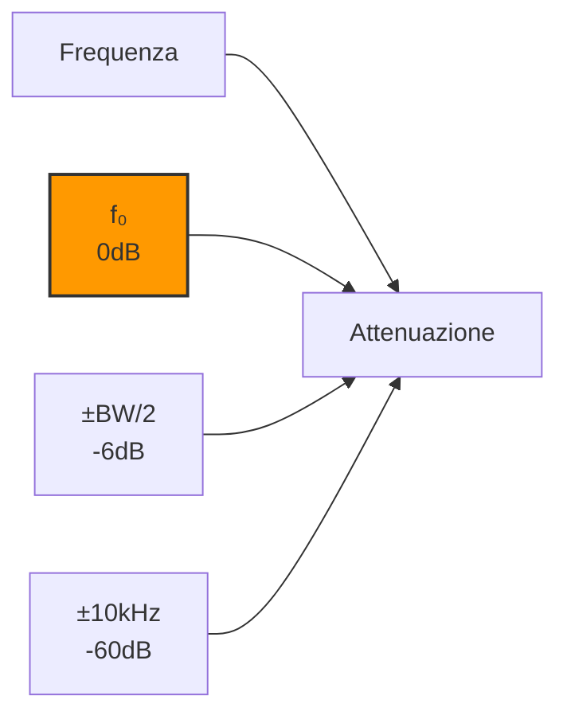

# 4.4 Caratteristiche dei Ricevitori: Le Specifiche Tecniche 📊

Benvenuti nel mondo delle specifiche tecniche dei ricevitori radio! Queste caratteristiche determinano le prestazioni reali di un ricevitore in condizioni operative. Scopriamo come selettività, sensibilità, stabilità e altre proprietà critiche influenzano la qualità della ricezione radioamatoriale!

## 🛡️ Protezione da Canale Adiacente

La **protezione da canale adiacente** misura la capacità di un ricevitore di ricevere un segnale debole accanto a uno forte.

### Definizione
**Rapporto segnale/interferenza necessaria per mantenere qualità accettabile**

### Misurazione
- **Segnale desiderato**: -80dBm
- **Interferente adiacente**: +20dBm (40dB più forte)
- **Distanza**: ±9kHz (canale adiacente AM)
- **Criterio**: SINAD = 12dB (AM), BER = 10⁻³ (digitale)

### Specifiche Tipiche
- **AM broadcast**: >40dB
- **FM broadcast**: >60dB
- **Ricevitori radioamatori**: >50dB
- **Ricevitori militari**: >80dB

### Fattori che Influenzano
- **Selettività IF**: Larghezza di banda del filtro
- **Linearità**: IP3 del mixer e amplificatori
- **AGC**: Velocità e range di controllo
- **Architettura**: Supereterodina singola vs doppia

## 🎯 Selettività (Selectivity)

La **selettività** è la capacità di separare segnali desiderati da quelli indesiderati vicini in frequenza.

### Definizione
**Attenuazione di segnali fuori banda rispetto al segnale desiderato**

### Tipi di Selettività

#### Selettività a 6dB (Banda Passante)
- **Definizione**: Larghezza di banda a -6dB dal picco
- **AM**: ±5kHz (10kHz totale)
- **SSB**: 2.1-2.7kHz
- **CW**: 200-500Hz

#### Selettività a 60dB (Reiezione Adiacente)
- **Definizione**: Attenuazione a ±10kHz dal centro
- **Buona**: >50dB
- **Eccellente**: >70dB

### Fattori che Influenzano la Selettività
- **Filtro IF**: Cristallino, meccanico, LC
- **Ordine filtro**: Più alto = pendenza più ripida
- **Q del filtro**: Maggiore Q = banda più stretta
- **Architettura**: Doppia conversione migliora

### Diagramma di Selettività

## 📡 Sensibilità (Sensitivity)

La **sensibilità** è il livello minimo di segnale che un ricevitore può ricevere con qualità accettabile.

### Definizione
**Livello di segnale in ingresso per SINAD = 12dB (AM) o 10dB S/N (SSB)**

### Valori Tipici
- **AM broadcast**: 1-5μV (50-70dBm)
- **FM broadcast**: 1-3μV (45-60dBm)
- **SSB radioamatori**: 0.1-0.5μV (100-115dBm)
- **CW radioamatori**: 0.05-0.2μV (110-120dBm)

### Fattori che Influenzano
- **Figura di rumore (NF)**: Minore NF = maggiore sensibilità
- **Guadagno**: Più guadagno = più sensibilità
- **Banda passante**: Banda stretta = migliore S/N
- **Temperatura**: Più bassa = meno rumore interno

### Calcolo Sensibilità Teorica
**Sensibilità (dBm) = -174dBm/Hz + NF(dB) + 10×log(BW) + S/N richiesti**

### Esempio
- BW = 3kHz SSB
- NF = 10dB
- S/N = 10dB
- Sensibilità = -174 + 10 + 10×log(3000) + 10 = -111dBm ≈ 0.3μV

## 🎛️ Stabilità (Stability)

La **stabilità** è la capacità di mantenere la frequenza di sintonizzazione costante nel tempo.

### Tipi di Stabilità

#### Stabilità a Breve Termine
- **Drift iniziale**: Primi minuti dopo accensione
- **Tipico**: ±100Hz per ora
- **Causa**: Riscaldamento componenti

#### Stabilità a Lungo Termine
- **Drift giornaliero**: ±50Hz al giorno
- **Drift stagionale**: ±200Hz all'anno
- **Causa**: Variazioni temperatura, invecchiamento

### Fattori che Influenzano
- **Oscillatore**: TCXO vs VFO semplice
- **Temperatura**: Coefficiente di temperatura
- **Alimentazione**: Stabilità tensione
- **Invecchiamento**: Quarzi e componenti

### Specifiche Radioamatori
- **HF**: ±100Hz per ora
- **VHF/UHF**: ±50Hz per ora
- **Con quarzo**: ±10Hz per ora

## 🔄 Frequenza Immagine (Image Frequency)

La **frequenza immagine** è un segnale indesiderato che produce la stessa frequenza IF del segnale desiderato.

### Come si Forma
**f_immagine = f_RF + 2×f_IF** (per conversione f_IF = f_RF - f_LO)

### Esempio Numerico
- f_RF desiderata = 1000kHz
- f_IF = 455kHz
- f_LO = 1000 - 455 = 545kHz
- f_immagine = 545 + 2×455 = 1455kHz

### Reiezione Immagine
**Attenuazione del segnale immagine rispetto al segnale desiderato**

### Valori Tipici
- **Supereterodina singola**: 20-40dB
- **Con preselettore**: 40-60dB
- **Supereterodina doppia**: >80dB

### Metodi di Miglioramento
- **Preselettore**: Filtro RF selettivo
- **Doppia conversione**: Due stadi di filtraggio
- **IF alta**: Maggiore separazione immagine
- **Filtro immagine**: Attenuatore specifico

## 🔀 Intermodulazione (Intermodulation)

L'**intermodulazione** genera prodotti spurii quando due o più segnali forti passano attraverso componenti non lineari.

### Tipi di Prodotti Intermodulazione

#### Prodotti di Secondo Ordine (IP2)
**f_IM = |f1 ± f2|**
- **Esempio**: 100MHz + 101MHz → 201MHz, 1MHz
- **Problema**: Prodotti in banda ricezione

#### Prodotti di Terzo Ordine (IP3)
**f_IM = |2f1 - f2|, |2f2 - f1|**
- **Esempio**: 100MHz + 101MHz → 199MHz, 201MHz
- **Più problematici**: Vicini ai segnali originali

### Punto di Intercetta (IP3)
**Livello teorico dove prodotti IM3 = segnali originali**

### Valori Tipici
- **Ricevitori economici**: IP3 = +10dBm
- **Ricevitori buoni**: IP3 = +20dBm
- **Ricevitori professionali**: IP3 = +30dBm

### Effetti dell'Intermodulazione
- **Falsi segnali**: Prodotti IM ricevuti come segnali reali
- **Blocco ricevitore**: Sovraccarico da segnali forti
- **Degradazione S/N**: Rumore aggiuntivo

## 📢 Transmodulazione (Cross-Modulation)

La **transmodulazione** trasferisce la modulazione da un segnale forte a uno debole attraverso non linearità.

### Meccanismo
1. **Segnale forte**: Modulato (AM)
2. **Segnale debole**: Portante pura
3. **Non linearità**: Mixer, amplificatore
4. **Risultato**: Segnale debole modulato come quello forte

### Esempio
- **Segnale forte**: 1000kHz AM modulato al 30%
- **Segnale debole**: 1005kHz CW
- **Risultato**: Segnale CW "modulato" al 30%

### Protezione dalla Transmodulazione
- **Linearità**: Componenti altamente lineari
- **AGC**: Controllo guadagno automatico
- **Filtri**: Preselettore selettivo
- **Architettura**: Doppia conversione

### Misurazione
- **Segnale debole**: -100dBm
- **Segnale forte**: +20dBm (80dB più forte)
- **Transmodulazione**: <5% tipicamente

## 📊 Tabella Comparativa Caratteristiche

| Caratteristica | Unità | Buono | Eccellente | Radioamatori HF |
|----------------|-------|-------|------------|-----------------|
| **Sensibilità AM** | μV | 5 | 2 | 1-2 |
| **Sensibilità SSB** | μV | 0.5 | 0.15 | 0.2-0.5 |
| **Selettività 60dB** | kHz | 8 | 4 | 2-6 |
| **Reiezione immagine** | dB | 40 | 60 | 50-70 |
| **IP3** | dBm | +15 | +25 | +20 |
| **Stabilità** | Hz/h | 100 | 20 | 50 |

## 🧪 Metodi di Misurazione

### Sensibilità
- **Generatore segnale**: Livello variabile
- **Modulatore**: Aggiunge modulazione nota
- **Analizzatore**: Misura SINAD/BER
- **Criterio**: SINAD = 12dB per AM

### Selettività
- **Due generatori**: Segnale + interferente
- **Attenuatore**: Regola livello interferente
- **Misura**: Livello per degradazione 3dB

### Intermodulazione
- **Due segnali forti**: f1, f2
- **Spettro analizzatore**: Cerca prodotti 2f1-f2
- **IP3**: Estrapolazione da misure reali

## 🎯 Considerazioni Pratiche per Radioamatori

### Scelta del Ricevitore
- **HF DX**: Priorità sensibilità e selettività
- **Contest**: Selettività eccellente
- **Portatile**: Buona sensibilità, basso consumo

### Ottimizzazioni
- **Antenna**: Migliora sensibilità effettiva
- **Preselettore**: Riduce intermodulazione
- **Filtro notch**: Elimina interferenti
- **AGC lento**: Per segnali deboli

### Problemi Comuni
- **Intermodulazione**: Da trasmettitori vicini
- **Transmodulazione**: In presenza di AM forte
- **Drift frequenza**: Senza riscaldamento adeguato
- **Immagine**: Su bande affollate

## 🧠 Quiz di Ripasso

Testa le tue conoscenze sulle caratteristiche dei ricevitori!

### Domanda 1: La selettività misura...
- A) La minima potenza ricevibile
- B) La capacità di separare segnali vicini
- C) La stabilità di frequenza
- D) La reiezione di segnali lontani

  
Risposta

  
<strong>B) La capacità di separare segnali vicini</strong>

  
La selettività è la capacità di ricevere un segnale senza interferenza da canali adiacenti.

### Domanda 2: La sensibilità è...
- A) L'attenuazione a 60dB
- B) Il livello minimo di segnale
- C) La stabilità di frequenza
- D) La reiezione immagine

  
Risposta

  
<strong>B) Il livello minimo di segnale</strong>

  
La sensibilità è il segnale più debole che può essere ricevuto con qualità accettabile.

### Domanda 3: L'intermodulazione è causata da...
- A) Segnali troppo deboli
- B) Non linearità nei componenti
- C) Instabilità di frequenza
- D) Rumore termico

  
Risposta

  
<strong>B) Non linearità nei componenti</strong>

  
L'intermodulazione genera prodotti spurii quando segnali passano attraverso componenti non lineari.

### Domanda 4: La frequenza immagine è...
- A) Il segnale desiderato
- B) Un interferente che produce stessa IF
- C) Il rumore del ricevitore
- D) La frequenza di risonanza

  
Risposta

  
<strong>B) Un interferente che produce stessa IF</strong>

  
L'immagine è un segnale che, mescolato con LO, produce la stessa frequenza IF del segnale desiderato.

### Domanda 5: La transmodulazione trasferisce...
- A) Energia da un segnale all'altro
- B) Modulazione da segnale forte a debole
- C) Frequenza da LO a RF
- D) Guadagno da IF a RF

  
Risposta

  
<strong>B) Modulazione da segnale forte a debole</strong>

  
La transmodulazione fa sì che un segnale debole assuma la modulazione di uno forte attraverso non linearità.

## Conclusione

Le caratteristiche tecniche definiscono le reali prestazioni di un ricevitore! Dalla sensibilità che permette di ricevere segnali deboli alla selettività che separa segnali vicini, ogni specifica conta nelle operazioni radioamatoriali. Comprendere questi parametri permette di scegliere il ricevitore giusto per ogni applicazione e di ottimizzare le prestazioni esistenti! 📊

---
