# 6.1 Tipi di Antenne: Gli Occhi e le Orecchie della Radio 📡👁️

Benvenuti nel mondo affascinante delle antenne! Le antenne sono i dispositivi che trasformano le onde radio in segnali elettrici e viceversa. Come occhi e orecchie della nostra stazione radio, catturano e irradiano le onde elettromagnetiche. Scopriamo insieme i principali tipi di antenne radioamatoriali, dalle semplici ai sofisticate, con i loro principi di funzionamento e applicazioni pratiche!

## 📏 Il Dipolo a Mezz'onda Alimentato al Centro

Il **dipolo a mezz'onda** è l'antenna più semplice e fondamentale in radioamatoriale.

### Principio di Funzionamento

- **Lunghezza**: λ/2 (mezz'onda)
- **Alimentazione**: Centro del dipolo
- **Impedenza**: Circa 73 ohm
- **Polarizzazione**: Orizzontale o verticale

### Costruzione Pratica

**Formula lunghezza**: L = 142.5 / f (MHz) metri

**Esempio**: Per 14.250 MHz (20m), L = 142.5 / 14.25 ≈ 10 metri

### Diagramma Dipolo a Mezz'onda

### Diagramma di Radiazione del Dipolo

Il dipolo a mezz'onda irradia con un pattern a "figura 8", con massima radiazione perpendicolare all'asse dell'antenna e nulli lungo l'asse stesso.

*Diagramma polare del dipolo: massima radiazione a 90° dall'antenna, nulli alle estremità.*

## 📏 Dipolo a Mezz'onda Alimentato all'Estremità

Questa variante alimenta il dipolo da un'estremità invece che dal centro.

### Caratteristiche

- **Alimentazione**: Estremità di un braccio
- **Impedenza**: Alta (migliaia di ohm)
- **Vantaggio**: Facilita l'accordatura
- **Svantaggio**: Richiede adattatore di impedenza

### Uso Pratico

Comune nelle antenne portatili dove l'accordatura è critica.

## 🔄 Dipolo Ripiegato

Il **dipolo ripiegato** è una variante del dipolo standard con migliorata larghezza di banda.

### Principio

- **Struttura**: Due conduttori paralleli ripiegati
- **Impedenza**: Circa 300 ohm
- **Larghezza di banda**: Maggiore del dipolo semplice
- **Guadagno**: Leggermente inferiore

### Diagramma Dipolo Ripiegato

```mermaid
graph TD;
    Alimentazione["Alimentazione<br>300Ω"] --> Conduttore1["Conduttore 1<br>λ/2"];
    Alimentazione --> Conduttore2["Conduttore 2<br>λ/2"];
    Conduttore1 --> Ripiegamento["Ripiegamento<br>Connessione"];
    Conduttore2 --> Ripiegamento;
    Ripiegamento --> Fine["Fine Antenna"];
    classDef ripiegato fill:#0f0,stroke:#333,stroke-width:2px;
    class Ripiegamento ripiegato;
```

## 📐 Antenna Verticale in Quarto d'Onda

L'**antenna verticale quarter-wave** è ideale per spazi limitati.

### Caratteristiche

- **Lunghezza**: λ/4
- **Impedenza**: 36-50 ohm
- **Sistema terra**: Richiede radial sottostanti
- **Polarizzazione**: Verticale
- **Diagramma**: Onnidirezionale orizzontale

### Formula Lunghezza
**L = 71.25 / f (MHz)** metri

**Esempio**: 3.75m per 14.250 MHz

### Diagramma Antenna Verticale

```mermaid
graph TD;
    Base["Base<br>Alimentazione<br>50Ω"] --> Verticale["Elemento Verticale<br>λ/4"];
    Verticale --> Punta["Punta"];
    Base --> Radial1["Radiale 1<br>λ/4"];
    Base --> Radial2["Radiale 2<br>λ/4"];
    Base --> Radial3["Radiale 3<br>λ/4"];
    Base --> Radial4["Radiale 4<br>λ/4"];
    classDef radiali fill:#0cf,stroke:#333,stroke-width:2px;
    class Radial1,Radial2,Radial3,Radial4 radiali;
```

### Diagramma di Radiazione Verticale

L'antenna verticale quarter-wave irradia in modo **omnidirezionale** sul piano orizzontale (azimutale), ideale per comunicazioni in tutte le direzioni.

*Pattern azimutale: radiazione uniforme a 360°.*

*Pattern di elevazione: massima radiazione a basso angolo, ottimale per DX.*

## 📡 Antenne con Riflettore e/o Direttore (Yagi)

Le **antenne Yagi** sono antenne direttive ad alto guadagno.

### Componenti

- **Elemento attivo**: Dipolo alimentato
- **Direttore**: Elemento più corto davanti
- **Riflettore**: Elemento più lungo dietro
- **Boom**: Struttura di supporto

### Caratteristiche

- **Guadagno**: 6-20 dBi
- **Larghezza fascio**: 30-60 gradi
- **Polarizzazione**: Lineare
- **Applicazioni**: DX, contest

### Diagramma Antenna Yagi

```mermaid
graph LR;
    Riflettore["Riflettore<br>Lungo<br>λ/4 + 5%"] --> Attivo["Elemento Attivo<br>Dipolo<br>λ/2"];
    Attivo --> Direttore1["Direttore 1<br>Corto<br>λ/4 - 5%"];
    Direttore1 --> Direttore2["Direttore 2<br>Corto"];
    Direttore1 --> Direttore3["Direttore 3<br>Corto"];
    Attivo --> Alimentazione["Alimentazione<br>50-75Ω"];
    classDef attivo fill:#f90,stroke:#333,stroke-width:2px;
    class Attivo attivo;
    classDef passivo fill:#0cf,stroke:#333,stroke-width:2px;
    class Riflettore,Direttore1,Direttore2,Direttore3 passivo;
```

### Diagramma di Radiazione Yagi

L'antenna Yagi presenta un pattern **direttivo** con un lobo principale pronunciato nella direzione dei direttori e un rapporto avanti-dietro (F/B) tipico di 15-20 dB.

*Pattern direttivo Yagi 3 elementi: lobo principale stretto, alta direttività.*

## 🥣 Antenne Paraboliche

Le **antenne paraboliche** sono usate per microonde e comunicazione satellitare.

### Principio

- **Paraboloide**: Riflettore parabolico
- **Feed**: Alimentatore al fuoco
- **Guadagno**: Molto alto (20-60 dBi)
- **Direttività**: Molto elevata

### Applicazioni Radioamatoriali

- **Comunicazione satellitare**: AMSAT
- **Microwave**: 23cm, 13cm, 6cm
- **EME**: Earth-Moon-Earth

### Diagramma Antenna Parabolica

## 🔄 Antenna Loop (Quadro Magnetico)

L'**antenna loop** è un'antenna compatta ideale per spazi ristretti e ricezione a basso rumore.

### Caratteristiche

- **Forma**: Circolare o quadrata
- **Dimensione**: Da piccola (1m) a full-size (λ)
- **Impedenza**: Variabile con dimensione
- **Polarizzazione**: Dipende dall'orientamento

### Tipi di Loop

| Tipo | Dimensione | Uso |
|------|------------|-----|
| Loop piccolo | < 0.1λ | Ricezione, direzione finding |
| Loop medio | 0.1-0.5λ | TX/RX compromesso |
| Full-size loop | ~λ | TX/RX efficiente |

### Diagramma di Radiazione Loop

Il loop irradia con pattern **bidirezionale** perpendicolare al piano dell'antenna, con nulli nel piano del loop stesso.

*Pattern bidirezionale: massimo perpendicolare al piano del loop, nulli laterali.*

## 🎯 Dipolo Accordato

Il **dipolo accordato** è un dipolo con possibilità di accordatura.

### Caratteristiche

- **Accordatura**: Condensatore variabile o bobina
- **Larghezza di banda**: Regolabile
- **Impedenza**: Variabile con l'accordatura
- **Uso**: Stazioni fisse con spazio limitato

### Vantaggi

- **Flessibilità**: Funziona su più bande
- **Semplicità**: Costruzione facile
- **Efficienza**: Buona quando accordato

## 🧠 Quiz di Ripasso

Testa le tue conoscenze sui tipi di antenne!

### Domanda 1: Qual è l'impedenza tipica di un dipolo a mezz'onda alimentato al centro?
- A) 50 ohm
- B) 73 ohm
- C) 300 ohm
- D) 600 ohm

  
Risposta

  
<strong>B) 73 ohm</strong>

  
Un dipolo a mezz'onda ha impedenza di circa 73 ohm nel punto di alimentazione centrale.

### Domanda 2: Cosa caratterizza un'antenna Yagi?
- A) Guadagno omnidirezionale
- B) Elementi passivi (direttore e riflettore)
- C) Forma circolare
- D) Alimentazione all'estremità

  
Risposta

  
<strong>B) Elementi passivi (direttore e riflettore)</strong>

  
L'antenna Yagi ha un elemento attivo (dipolo) più elementi passivi per direttività.

### Domanda 3: Quale antenna richiede necessariamente un sistema di terra?
- A) Dipolo orizzontale
- B) Antenna verticale quarter-wave
- C) Antenna Yagi
- D) Dipolo ripiegato

  
Risposta

  
<strong>B) Antenna verticale quarter-wave</strong>

  
L'antenna verticale quarter-wave richiede radial o contropesi per funzionare correttamente.

### Domanda 4: Qual è il vantaggio principale del dipolo ripiegato?
- A) Guadagno più alto
- B) Impedenza più bassa
- C) Larghezza di banda maggiore
- D) Lunghezza minore

  
Risposta

  
<strong>C) Larghezza di banda maggiore</strong>

  
Il dipolo ripiegato ha una banda passante più ampia rispetto al dipolo semplice.

### Domanda 5: Per quale applicazione sono tipicamente usate le antenne paraboliche in radioamatoriale?
- A) HF DX
- B) VHF/UHF locali
- C) Comunicazione satellitare
- D) Antenne portatili

  
Risposta

  
<strong>C) Comunicazione satellitare</strong>

  
Le antenne paraboliche sono usate per comunicazione satellitare e bande microwave.

## Conclusione

Le antenne sono il ponte tra il mondo elettronico e quello elettromagnetico. Dal semplice dipolo al sofisticato sistema Yagi, ogni tipo offre caratteristiche uniche per soddisfare diverse esigenze radioamatoriali. Scegliere l'antenna giusta significa ottimizzare le prestazioni della tua stazione! 📡👁️

---
<parameter name="filePath">06_Antenne_Linee_Trasmissioni/6.1_Tipi_di_antenne.md
