> [!WARNING]
> Questi sono **appunti personali** e possono contenere errori o imprecisioni.
> Non sostituiscono libri di testo o fonti ufficiali.
> Il materiale è soggetto a revisione continua grazie al contributo volontario della comunità.
> [Contribuisci su GitHub](https://github.com/IU6VYG/esame-radioamatori)

# 6.2 Caratteristiche delle Antenne: Come Misurare le Performance 📊📈

Benvenuti nell'analisi delle caratteristiche delle antenne! Oltre alla forma fisica, ogni antenna ha proprietà elettriche e radiative che determinano le sue prestazioni. Imparare a comprendere e misurare questi parametri è essenziale per ottimizzare la nostra stazione radioamatoriale. Scopriamo insieme i concetti chiave che rendono un'antenna efficiente o meno!

## ⚡ Distribuzione della Corrente e della Tensione

La distribuzione di corrente e tensione lungo un'antenna determina le sue caratteristiche radiative.

### Lungo un Dipolo a Mezz'onda

- **Centro**: Corrente massima, tensione minima
- **Estremità**: Corrente minima (zero), tensione massima
- **Fase**: Corrente e tensione sono sfasate di 90°

### Diagramma Distribuzione

```mermaid
graph LR;
    Centro["Centro Antenna<br>Corrente MAX<br>Tensione MIN"] --> Quarto1["λ/4"];
    Quarto1 --> Estremita["Estremità<br>Corrente MIN (0)<br>Tensione MAX"];
    Centro --> Quarto2["λ/4"];
    Quarto2 --> Estremita2["Estremità<br>Corrente MIN (0)<br>Tensione MAX"];
    classDef centro fill:#f90,stroke:#333,stroke-width:2px;
    class Centro centro;
    classDef estremita fill:#0cf,stroke:#333,stroke-width:2px;
    class Estremita,Estremita2 estremita;
```

### Importanza

Questa distribuzione crea il campo elettromagnetico che irradia l'energia.

## 🔌 Impedenza nel Punto di Alimentazione

L'**impedenza** è la resistenza apparente vista dal trasmettitore.

### Componenti dell'Impedenza

- **Resistenza di radiazione**: Converte energia in onde radio
- **Reattanza**: Parte immaginaria (capacitiva/induttiva)

### Valori Tipici

| Tipo Antenna | Impedenza |
|--------------|-----------|
| Dipolo λ/2 | 73 + j0 Ω |
| Dipolo ripiegato | 300 + j0 Ω |
| Verticale λ/4 | 36 + j0 Ω |
| Yagi | 50-75 Ω |

### Misura dell'Impedenza

Usando un **analizzatore di antenna** o calcolando con formule.

## ⚡ Impedenza Capacitiva o Induttiva

Quando un'antenna non è accordata alla frequenza di lavoro, presenta reattanza.

### Antenna "Corta" (più corta di λ/2)

- **Reattanza**: Capacitiva (negativa)
- **Comportamento**: Come un condensatore
- **Sintomi**: SWR alto, potenza riflessa

### Antenna "Lunga" (più lunga di λ/2)

- **Reattanza**: Induttiva (positiva)
- **Comportamento**: Come una bobina
- **Sintomi**: SWR alto, potenza riflessa

### Diagramma Reattanza

## 📡 Polarizzazione

La **polarizzazione** descrive l'orientamento del campo elettrico dell'onda.

### Tipi di Polarizzazione

- **Lineare verticale**: Campo elettrico verticale
- **Lineare orizzontale**: Campo elettrico orizzontale
- **Circolare**: Campo elettrico ruota (destra/sinistra)
- **Ellittica**: Combinazione dei due

### Importanza

- **Compatibilità**: TX e RX devono avere stessa polarizzazione
- **Propagazione**: Diversi comportamenti atmosferici
- **Applicazioni**: Satellite richiede circolare

### Esempio Pratico

Antenna verticale → polarizzazione verticale (buona per onde di suolo)
Antenna orizzontale → polarizzazione orizzontale (buona per E-sporadiche)

## 📈 Guadagno d'Antenna

Il **guadagno** misura quanto l'antenna concentra l'energia in una direzione.

### Definizione

**Guadagno = Potenza irradiata massima / Potenza irradiata da antenna isotropica**

### Unità

- **dBi**: Riferito ad antenna isotropica
- **dBd**: Riferito a dipolo (dBd = dBi - 2.15)

### Valori Tipici

| Tipo Antenna | Guadagno |
|--------------|----------|
| Dipolo λ/2 | 2.15 dBi (0 dBd) |
| Yagi 3 elementi | 7-8 dBi |
| Yagi 5 elementi | 9-10 dBi |
| Paraboloide 2m | 25-30 dBi |

### Confronto Visuale Guadagni

*Confronto del guadagno (dBi) tra i principali tipi di antenne radioamatoriali.*

### Formula Guadagno

**G = 10 log₁₀(P_max / P_isotropica)**

## ⚡ Potenza Equivalente Irradiata (E.R.P.)

L'**E.R.P.** è la potenza apparente irradiata da un'antenna.

### Calcolo

**E.R.P. = Potenza di ingresso × Guadagno dell'antenna**

### Esempio

Trasmettitore 100W + antenna 6 dBi guadagno:
E.R.P. = 100W × 4 = 400W (6 dBi = 4 volte)

### Importanza

L'E.R.P. determina la copertura effettiva del segnale.

## 📊 Rapporto Avanti-Dietro

Il **front-to-back ratio** misura la direttività di un'antenna.

### Definizione

**F/B = Potenza avanti / Potenza dietro (dB)**

### Valori Tipici

- **Dipolo**: 0 dB (omnidirezionale)
- **Yagi 3 elementi**: 15-20 dB
- **Yagi 5 elementi**: 20-25 dB
- **Beam**: 25-35 dB

### Importanza

Alto F/B significa meno interferenze ai vicini e migliore DX.

## 📐 Diagrammi d'Irradiazione

I **diagrammi di radiazione** mostrano come l'antenna irradia l'energia.

### Piani di Misura

- **Piano orizzontale**: Direttività azimuth (360°)
- **Piano verticale**: Angolo elevazione (0-90°)

### Tipi di Diagramma

- **Polare**: Mostra intensità vs angolo
- **Cartesiano**: 3D per visione completa
- **Azimuth**: Solo piano orizzontale

### Diagramma Esempio: Dipolo Orizzontale

```mermaid
graph TD;
    Antenna["Dipolo Orizzontale<br>λ/2"] --> Massima["Massima Irradiazione<br>90° dall'antenna"];
    Antenna --> Minima["Minima Irradiazione<br>0° (lungo antenna)"];
    Massima --> Campo["Campo Elettrico<br>Verticale"];
    Minima --> Nullo["Nullo di Radiazione"];
    classDef massima fill:#0f0,stroke:#333,stroke-width:2px;
    class Massima massima;
    classDef minima fill:#f00,stroke:#333,stroke-width:2px;
    class Minima minima;
```

### Esempi Pratici di Diagrammi di Radiazione

| Antenna | Pattern | Caratteristica |
|---------|---------|----------------|
|  | Figura 8 | Bidirezionale |
|  | Direttivo | Alta direttività |
|  | Circolare | Omnidirezionale |

### Lettura dei Diagrammi

- **Lobi principali**: Direzioni di massima radiazione
- **Lobi secondari**: Radiazioni parassite
- **Angolo di fascio**: Larghezza del lobo principale

## 🧠 Quiz di Ripasso

Testa le tue conoscenze sulle caratteristiche delle antenne!

### Domanda 1: Dove si trova la corrente massima lungo un dipolo a mezz'onda?
- A) Alle estremità
- B) Al centro
- C) A λ/4 dai capi
- D) Ovunque uguale

  
Risposta

  
<strong>B) Al centro</strong>

  
In un dipolo a mezz'onda, la corrente è massima al centro e minima (zero) alle estremità.

### Domanda 2: Qual è l'impedenza tipica di un dipolo a mezz'onda?
- A) 50 ohm
- B) 73 ohm
- C) 300 ohm
- D) 600 ohm

  
Risposta

  
<strong>B) 73 ohm</strong>

  
Un dipolo a mezz'onda ha impedenza di radiazione di circa 73 ohm.

### Domanda 3: Cosa indica una reattanza capacitiva in un'antenna?
- A) Antenna troppo lunga
- B) Antenna troppo corta
- C) Antenna accordata
- D) Antenna con perdite

  
Risposta

  
<strong>B) Antenna troppo corta</strong>

  
Un'antenna più corta della lunghezza di risonanza presenta reattanza capacitiva.

### Domanda 4: Quale unità misura il guadagno d'antenna?
- A) Watt
- B) Volt
- C) dBi
- D) Ohm

  
Risposta

  
<strong>C) dBi</strong>

  
Il guadagno si misura in dBi (decibel rispetto ad antenna isotropica).

### Domanda 5: Cosa misura il rapporto avanti-dietro (F/B)?
- A) Guadagno totale
- B) Direttività frontale vs posteriore
- C) Impedenza
- D) Polarizzazione

  
Risposta

  
<strong>B) Direttività frontale vs posteriore</strong>

  
Il F/B misura quanto l'antenna irradia più avanti che dietro, in dB.

## Conclusione

Comprendere le caratteristiche delle antenne significa poter scegliere e ottimizzare il sistema di radiazione perfetto per le proprie esigenze. Dai diagrammi di radiazione al calcolo del guadagno, ogni parametro contribuisce alle prestazioni complessive della stazione. Una buona antenna è la base di ogni comunicazione di successo! 📊📈
