> [!WARNING]
> Questi sono **appunti personali** e possono contenere errori o imprecisioni.
> Non sostituiscono libri di testo o fonti ufficiali.
> Il materiale è soggetto a revisione continua grazie al contributo volontario della comunità.
> [Contribuisci su GitHub](https://github.com/IU6VYG/esame-radioamatori)

# 7. Propagazione: Il Viaggio delle Onde Radio 📡

Benvenuti nel affascinante mondo della propagazione delle onde radio! Immaginate le vostre trasmissioni radioamatoriali come messaggeri invisibili che viaggiano attraverso l'atmosfera terrestre. La **propagazione** determina quanto lontano possono arrivare i vostri segnali, influenzando la qualità delle comunicazioni. Scopriamo insieme i meccanismi che governano questo viaggio elettromagnetico!

## 🌍 L'Ambiente di Propagazione

Le onde radio si propagano attraverso diversi strati dell'atmosfera e dello spazio. I principali meccanismi sono:

- **Propagazione di superficie (onda di suolo)**: Le onde seguono la curvatura terrestre
- **Propagazione ionosferica (onda spaziale)**: Riflessione negli strati ionizzati dell'atmosfera
- **Propagazione troposferica**: Diffusione e riflessione nella troposfera
- **Propagazione via satellite**: Utilizzo di ripetitori orbitali

### Diagramma dei Meccanismi di Propagazione

```mermaid
graph TD;
    Trasmissione["Trasmissione<br>📻"] --> OndaSuolo["Onda di Suolo<br>🌍"];
    Trasmissione --> OndaSpaziale["Onda Spaziale<br>☀️"];
    Trasmissione --> Troposfera["Troposfera<br>🌤️"];
    Trasmissione --> Satellite["Satellite<br>🛰️"];
    OndaSuolo --> Ricezione["Ricezione<br>📡"];
    OndaSpaziale --> Ricezione;
    Troposfera --> Ricezione;
    Satellite --> Ricezione;
```

## ☀️ L'Ionosfera: Il Grande Riflettore

L'**ionosfera** è la regione dell'atmosfera superiore (da 60 a 1000 km) dove i raggi ultravioletti del sole ionizzano le molecole d'aria, creando strati conduttivi.

### Gli Strati Ionosferici

| Strato | Altezza (km) | Caratteristiche | Utilizzo Radioamatori |
|--------|-------------|----------------|----------------------|
| **D** | 60-90 | Bassa ionizzazione, assorbe onde corte | Interferenza diurna |
| **E** | 90-150 | Ionizzazione regolare, riflessioni sporadiche | VHF sporadiche |
| **F1** | 150-250 | Ionizzazione diurna, si fonde con F2 | HF regolare |
| **F2** | 250-400 | Massima ionizzazione, riflessioni lontane | HF DX |

### Visualizzazione Strati Ionosferici

*Sezione dell'atmosfera con gli strati ionosferici D, E, F1, F2 e relative altitudini e caratteristiche.*

## 🔄 Frequenza Critica e MUF

La **frequenza critica (fc)** è la frequenza massima che uno strato ionosferico può riflettere verticalmente.

**Formula**: fc = 9 × √N (MHz), dove N è la densità elettronica massima (elettroni/m³)

La **Massima Frequenza Utilizzabile (MUF)** è la frequenza massima per comunicazioni su una certa distanza.

**MUF ≈ fc / cos(θ)**, dove θ è l'angolo di incidenza

### Esempio Pratico
- Strato F2 con fc = 10 MHz
- Per comunicazione a 2000 km: θ ≈ 30°, MUF ≈ 10 / 0.866 ≈ 11.5 MHz
- Radioamatore può usare fino a 11.5 MHz per quella tratta

### Diagramma Angolo Critico e MUF

*Relazione tra angolo di incidenza, frequenza critica e MUF. Frequenze sopra la MUF attraversano l'ionosfera.*

### Variazione Giornaliera della MUF

*La MUF varia significativamente durante le 24 ore, con massimo nel pomeriggio e minimo prima dell'alba.*

## 🌞 Influenza del Sole sulla Ionosfera

Il sole è il motore della ionosfera! La sua attività influenza drasticamente la propagazione.

### Ciclo Solare
- **Massimo solare**: Ionosfera densa, ottime condizioni DX HF
- **Minimo solare**: Ionosfera debole, difficoltà HF, migliore VHF/UHF

### Attività Geomagnetiche
- **Tempeste solari**: Aurore polari, assorbimento HF
- **Buchi coronali**: Flussi di particelle, disturbi ionosferici

### Diagramma Ciclo Solare

```mermaid
graph LR;
    Sole["Attività Solare<br>☀️"] -->|Alta| IonosferaDensa["Ionosfera Densa<br>Buon DX HF"];
    Sole -->|Bassa| IonosferaDebole["Ionosfera Debole<br>HF difficili"];
    IonosferaDensa --> CondizioniBuone["Condizioni Ottime<br>DX mondiale"];
    IonosferaDebole --> VHF["Migliori VHF/UHF<br>Comunicazioni locali"];
```

## 🌊 Onda di Suolo vs Onda Spaziale

### Onda di Suolo
- **Propagazione**: Segue la curvatura terrestre
- **Frequenze**: LF/MF (AM broadcast), HF basse
- **Distanza**: Fino a 100-200 km tipicamente
- **Vantaggi**: Affidabile, non dipende dal sole
- **Svantaggi**: Attenuazione con la distanza (1/d²)

### Onda Spaziale
- **Propagazione**: Riflessione ionosferica
- **Frequenze**: HF (3-30 MHz) principalmente
- **Distanza**: Migliaia di km con salti multipli
- **Vantaggi**: DX mondiale
- **Svantaggi**: Dipendente dalle condizioni ionosferiche

### Angolo di Irradiazione
L'**angolo di irradiazione** determina se il segnale va verso l'onda di suolo o spaziale.

- **Angolo basso**: Preferenzialmente onda di suolo
- **Angolo alto**: Onda spaziale

### Visualizzazione Zona di Skip

*La zona di skip è l'area dove il segnale non arriva: troppo lontana per l'onda di terra, troppo vicina per l'onda spaziale.*

### Propagazione Multi-Hop per DX Mondiale

*Comunicazioni DX intercontinentali: il segnale rimbalza più volte tra ionosfera e terra.*

## 📉 Affievolimenti (Fading)

Il **fading** è la variazione di ampiezza del segnale ricevuto.

### Tipi di Fading

1. **Fading selettivo di frequenza**: Diversa attenuazione per frequenze diverse
2. **Fading di polarizzazione**: Cambiamento di polarizzazione durante la propagazione
3. **Fading ionosferico**: Variazioni rapide dovute alla ionosfera
4. **Fading troposferico**: Variazioni lente dovute alla troposfera

### Cause Principali
- **Interferenza tra percorsi multipli**: Segnali che arrivano per vie diverse
- **Variazioni ionosferiche**: Cambiamenti nella densità elettronica
- **Condizioni atmosferiche**: Umidità, temperatura

### Esempio Numerico
Un segnale HF può avere fading di 20-30 dB in pochi secondi durante una tempesta ionosferica.

## 🌤️ Propagazione Troposferica

La **troposfera** (0-12 km) permette propagazione VHF/UHF oltre l'orizzonte ottico.

### Meccanismi
- **Diffusione**: Scattering da irregolarità atmosferiche
- **Riflessione**: Da strati di inversione termica
- **Ducting**: Guida d'onda in duct atmosferici

### Condizioni Favorevoli
- **Inversione di temperatura**: Aria più calda sopra quella più fredda
- **Alta umidità**: Aumenta la diffusione
- **Condizioni stabili**: Poco vento

### Esempio Pratico
Durante un'inversione termica, segnali 144 MHz possono raggiungere 200-500 km oltre l'orizzonte.

## 📏 Orizzonte Radioelettrico

L'**orizzonte radioelettrico** è più lontano dell'orizzonte ottico grazie alla rifrazione atmosferica.

### Formula dell'Orizzonte
**Distanza = 4.1 × √h** (km), dove h è l'altezza in metri

### Influenza dell'Altezza delle Antenne

| Altezza Antenna (m) | Orizzonte Ottico (km) | Orizzonte Radio (km) | Guadagno Distanza |
|---------------------|----------------------|---------------------|------------------|
| 10 | 11.3 | 12.6 | 11% |
| 50 | 25.2 | 28.1 | 11% |
| 100 | 35.7 | 39.8 | 11% |

### Diagramma Orizzonte

## ❄️ Fenomeni Speciali

### Riflessione Sporadica E (Es)
- **Cause**: Nuvole di ionizzazione temporanee nello strato E
- **Frequenze**: 25-50 MHz tipicamente
- **Durata**: Minuti/ore
- **Applicazioni**: DX VHF inaspettati

### Riflessione Aurorale
- **Cause**: Particelle cariche dai buchi coronali
- **Frequenze**: HF/VHF
- **Caratteristiche**: Segnali distorti, fading rapido
- **Zone**: Alte latitudini

### Diagramma Fenomeni Speciali

## 🧠 Quiz di Ripasso

Testa le tue conoscenze sulla propagazione delle onde radio!

### Domanda 1: Qual è lo strato ionosferico più alto e importante per il DX HF?
- A) Strato D
- B) Strato E
- C) Strato F2
- D) Strato F1

  
Risposta

  
<strong>C) Strato F2</strong>

  
Lo strato F2 (250-400 km) permette le comunicazioni a lunga distanza grazie alla sua alta ionizzazione.

### Domanda 2: La MUF (Massima Frequenza Utilizzabile) dipende da...
- A) La potenza del trasmettitore
- B) La distanza e l'angolo di irradiazione
- C) Il tipo di antenna
- D) La modulazione utilizzata

  
Risposta

  
<strong>B) La distanza e l'angolo di irradiazione</strong>

  
MUF = fc / cos(θ), dove θ è l'angolo di incidenza che dipende dalla distanza.

### Domanda 3: L'onda di suolo è particolarmente utile per...
- A) Comunicazioni satellitari
- B) DX mondiale HF
- C) Contatti locali LF/MF
- D) Propagazione troposferica

  
Risposta

  
<strong>C) Contatti locali LF/MF</strong>

  
L'onda di suolo segue la superficie terrestre ed è affidabile per distanze medio-corte.

### Domanda 4: Durante il massimo solare, le condizioni HF sono generalmente...
- A) Peggiori
- B) Migliori
- C) Invariate
- D) Solo locali

  
Risposta

  
<strong>B) Migliori</strong>

  
L'alta attività solare ionizza di più l'atmosfera, permettendo DX HF eccellenti.

### Domanda 5: L'orizzonte radioelettrico è più lontano di quello ottico grazie a...
- A) La rifrazione atmosferica
- B) L'altezza delle antenne
- C) La potenza del segnale
- D) La frequenza utilizzata

  
Risposta

  
<strong>A) La rifrazione atmosferica</strong>

  
I raggi radio vengono curvati dalla rifrazione atmosferica, estendendo la portata oltre l'orizzonte ottico.

## Conclusione

La propagazione è l'arte di prevedere e sfruttare i comportamenti delle onde radio nell'ambiente terrestre. Dai riflessi ionosferici per DX mondiali alle guide troposferiche per contatti locali, ogni meccanismo offre opportunità uniche ai radioamatori. Studiate le condizioni, monitorate i segnali, e scoprirete un mondo di possibilità di comunicazione! 📡

---
<parameter name="filePath">07_Propagazione/7_Propagazione.md
