# 9.1 Disturbi degli Apparecchi Elettronici: Quando le Onde si Scontrano 📡⚡

Benvenuti nel mondo dei disturbi elettronici! In un ambiente saturo di segnali radio, i disturbi sono inevitabili. Dal blocco totale dei ricevitori all'intermodulazione subdola, i disturbi possono rendere inutilizzabile qualsiasi apparecchiatura elettronica. Scopriamo insieme i principali tipi di disturbi, i loro meccanismi e come riconoscerli per poterli combattere efficacemente!

## 🚫 Bloccaggio

Il bloccaggio è il disturbo più grave e immediato.

### Descrizione

Il **bloccaggio** si verifica quando un segnale forte sovraccarica l'ingresso del ricevitore, impedendogli di funzionare correttamente.

### Sintomi

- **Ricevitore muto**: Nessun segnale ricevuto
- **Distorsione**: Audio incomprensibile
- **AGC bloccato**: Guadagno automatico saturato

### Meccanismo

Il segnale interferente è così potente da:
1. Sovraccaricare l'amplificatore RF
2. Comprimere l'AGC
3. Desensibilizzare il ricevitore

### Diagramma Bloccaggio

### Esempio Pratico

Stazione locale 100W a 1km: segnale +40 dBm all'antenna del vicino. Se il ricevitore ha IP3 di +10 dBm, bloccaggio garantito.

## 📢 Disturbi con il Segnale Desiderato

I disturbi possono mescolarsi al segnale utile in vari modi.

### Interferenza Co-Canale

Due segnali sulla stessa frequenza si sovrappongono.

### Interferenza Adiacente

Segnali su frequenze vicine causano splatter.

### Desensibilizzazione

Riduzione della sensibilità del ricevitore.

### Sintomi Comuni

- **Rumore aumentato**: SNR degradato
- **Distorsione**: Segnale "sporco"
- **Fading**: Variazioni di intensità

## 🔄 Intermodulazione

L'intermodulazione crea prodotti spurii indesiderati.

### Principio

Quando due o più segnali passano attraverso un elemento non lineare, si generano prodotti a frequenze somme e differenze.

### Prodotti di Intermodulazione

**Ordine 2**: f1 ± f2
**Ordine 3**: 2f1 ± f2, 2f2 ± f1
**Ordine 5**: 3f1 ± 2f2, etc.

### Esempio Numerico

Segnali a 100 MHz e 101 MHz:
- IM2: 201 MHz, 1 MHz
- IM3: 200 MHz, 2 MHz, 301 MHz, 99 MHz

### Diagramma Intermodulazione

```mermaid
graph TD;
    Segnale1["Segnale 1<br>100 MHz"] --> ElementoNonLineare["Elemento Non Lineare<br>Amplificatore Saturato"];
    Segnale2["Segnale 2<br>101 MHz"] --> ElementoNonLineare;
    ElementoNonLineare --> ProdottoIM3["Prodotto IM3<br>99 MHz<br>2×100 - 101"];
    ElementoNonLineare --> ProdottoIM2["Prodotto IM2<br>1 MHz<br>101 - 100"];
    ElementoNonLineare --> AltriProdotti["Altri Prodotti<br>201 MHz, 200 MHz..."];
    classDef spurio fill:#f90,stroke:#333,stroke-width:2px;
    class ProdottoIM3,ProdottoIM2,AltriProdotti spurio;
```

### Tipi di Intermodulazione

- **Passiva**: Da diodi, contatti ossidati
- **Attiva**: Da amplificatori in saturazione
- **Cross-modulation**: Modulazione di un segnale sull'altro

## 🔊 Rivelazione nei Circuiti Audio

I disturbi possono manifestarsi anche nell'audio.

### Rivelazione Diretta

Segnale RF demodulato direttamente nell'audio.

### Rivelazione Indiretta

- **IF breakthrough**: Frequenza intermedia rivelata
- **Image response**: Frequenza immagine ricevuta
- **Spur response**: Prodotti spurii rivelati

### Sintomi Audio

- **Sibilo**: Segnale CW rivelato
- **Rumore**: Interferenza broadband
- **Click**: Impulsi brevi
- **Tonale**: Segnale modulato

### Esempio Pratico

Ricevitore 14 MHz con IF 10.7 MHz. Un segnale a 24.7 MHz (14 + 10.7) può essere rivelato come rumore nell'audio.

## 📊 Classificazione dei Disturbi

### Per Origine

- **Interni**: Dal proprio apparato
- **Esterni**: Da altre sorgenti
- **Atmosferici**: Naturali (fulmini, sole)
- **Man-made**: Artificiali (elettronica, motori)

### Per Carattere

- **Continui**: Costanti nel tempo
- **Impulsivi**: Brevi e sporadici
- **Modulati**: Con modulazione
- **Broadband**: Ampia banda

### Per Effetto

- **Bloccanti**: Impediscono funzionamento
- **Degradanti**: Riducano qualità
- **Mascheranti**: Coprono segnale utile

## 🔍 Identificazione dei Disturbi

### Metodi di Analisi

1. **Ascolto**: Carattere del disturbo
2. **Misura frequenza**: Usare contatore
3. **Direzionalità**: Usare antenna direttiva
4. **Spettro**: Analizzatore di spettro

### Strumenti Utili

- **Ricevitore scanner**: Identificare frequenze
- **Antenna a loop**: Localizzare sorgenti
- **Campo strength meter**: Misurare intensità
- **Direzionale**: Trovare direzione

## 🧠 Quiz di Ripasso

Testa le tue conoscenze sui disturbi degli apparecchi elettronici!

### Domanda 1: Cosa causa il bloccaggio di un ricevitore?
- A) Segnale debole
- B) Segnale troppo forte che sovraccarica l'ingresso
- C) Batteria scarica
- D) Antenna scollegata

  
Risposta

  
<strong>B) Segnale troppo forte che sovraccarica l'ingresso</strong>

  
Il bloccaggio avviene quando un segnale interferente è così potente da saturare l'amplificatore RF e comprimere l'AGC.

### Domanda 2: Qual è un prodotto di intermodulazione di ordine 3 tra 100 MHz e 101 MHz?
- A) 201 MHz
- B) 1 MHz
- C) 99 MHz
- D) 301 MHz

  
Risposta

  
<strong>C) 99 MHz</strong>

  
Prodotto IM3: 2×100 - 101 = 99 MHz.

### Domanda 3: Cosa significa "desensibilizzazione"?
- A) Aumento della sensibilità
- B) Riduzione della sensibilità del ricevitore
- C) Miglioramento del rapporto segnale-rumore
- D) Aumento della selettività

  
Risposta

  
<strong>B) Riduzione della sensibilità del ricevitore</strong>

  
La desensibilizzazione riduce la capacità del ricevitore di ricevere segnali deboli a causa di segnali forti vicini.

### Domanda 4: Quale tipo di disturbo si manifesta come rumore impulsivo?
- A) Intermodulazione
- B) Bloccaggio
- C) Interferenza atmosferica
- D) Cross-modulation

  
Risposta

  
<strong>C) Interferenza atmosferica</strong>

  
I fulmini e le scariche statiche producono rumore impulsivo broadband.

### Domanda 5: Come si chiama il fenomeno per cui un segnale RF appare nell'audio senza essere sulla frequenza desiderata?
- A) Bloccaggio
- B) Intermodulazione
- C) Rivelazione indesiderata
- D) Desensibilizzazione

  
Risposta

  
<strong>C) Rivelazione indesiderata</strong>

  
La rivelazione indesiderata avviene quando segnali fuori banda vengono demodulati nei circuiti audio.

## Conclusione

I disturbi elettronici sono il nemico invisibile del radioamatore. Dal devastante bloccaggio alla subdola intermodulazione, riconoscere e comprendere questi fenomeni è il primo passo per combatterli. Conoscere i disturbi significa poterli evitare o eliminare! 📡⚡

---
<parameter name="filePath">09_Disturbi_Protezione/9.1_Disturbi_degli_apparecchi_elettronici.md
